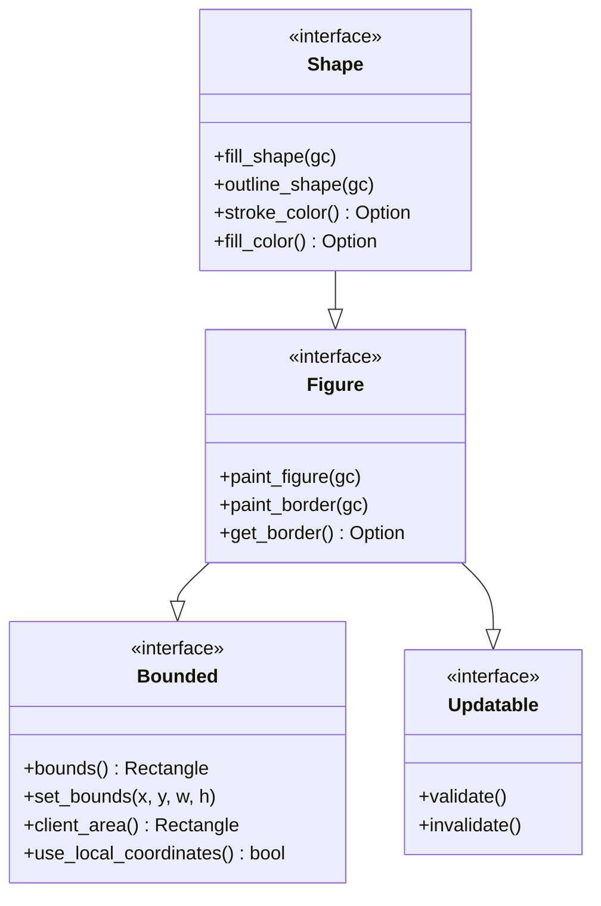
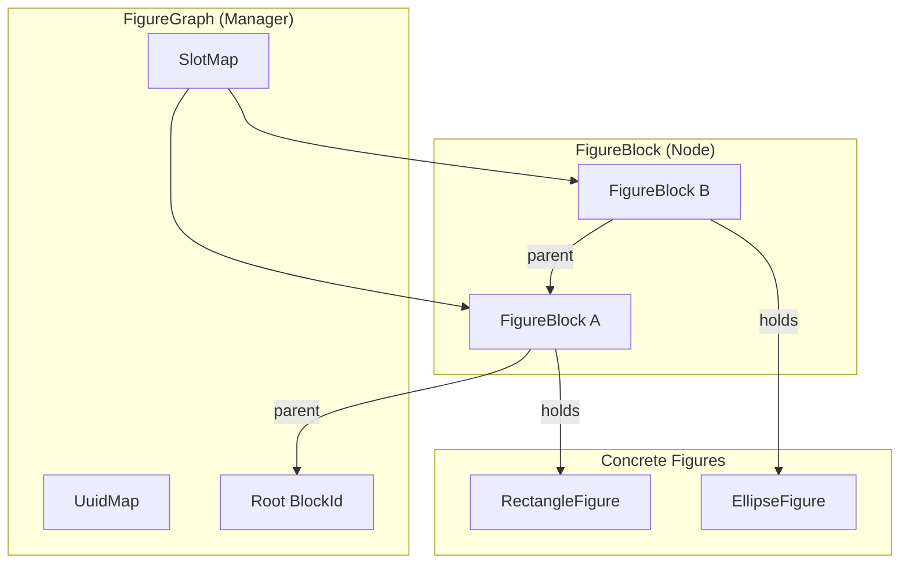
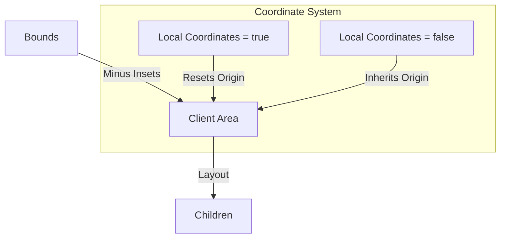
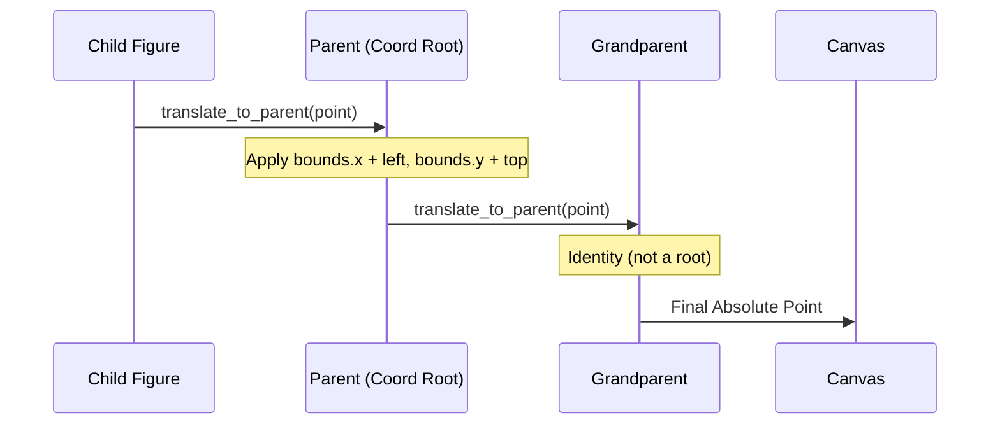
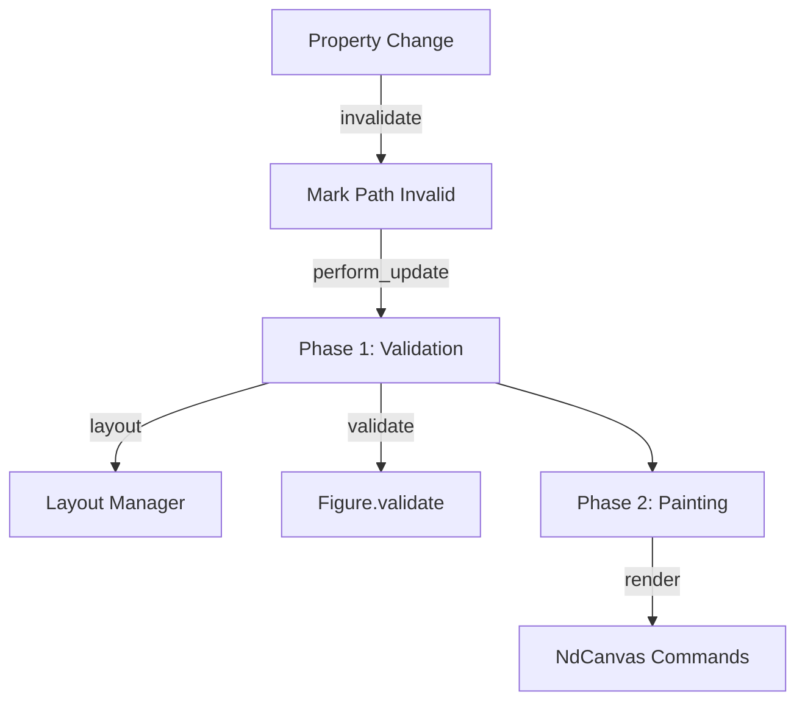
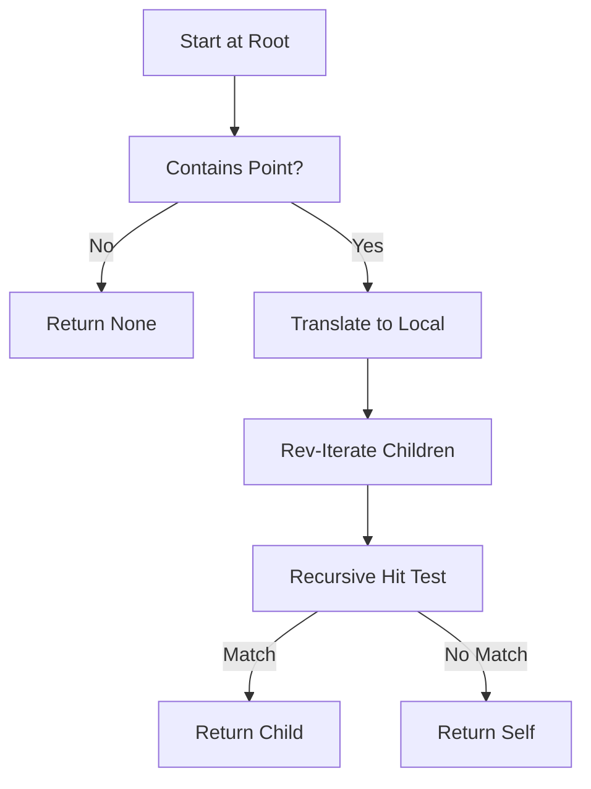

# Figure 场景图体系

## 目录
1. [模块概览](#模块概览)
2. [核心 Trait 体系 (IFigure)](#核心-trait-体系-ifigure)
3. [场景图架构 (FigureBlock & FigureGraph)](#场景图架构-figureblock--figuregraph)
4. [盒子模型与坐标系统](#盒子模型与坐标系统)
5. [树形结构管理与生命周期](#树形结构管理与生命周期)
6. [命中测试与交互逻辑](#命中测试与交互逻辑)
7. [内置图形组件](#内置图形组件)
8. [自定义 Figure 示例](#自定义-figure-示例)
9. [文件参考](#文件参考)

## 模块概览

`Figure` 场景图体系是 Novadraw 引擎的核心，负责管理图形的层级结构、几何属性、渲染行为以及交互逻辑。该系统深度参考了 **Eclipse Draw2D** 的设计模式，采用了高度解耦的 Trait 体系和基于 SlotMap 的高效树形管理机制。

**核心指标：**
- **文件总数**：8 个核心实现文件 (`novadraw-scene/src/figure/`)，以及丰富的文档支持。
- **子模块分布**：
    - `figure/mod.rs`: 定义核心 Trait 接口（`Bounded`, `Updatable`, `Figure`, `Shape`）。
    - `figure/rectangle.rs`, `ellipse.rs` 等: 具体图形组件的实现。
    - `scene/mod.rs`: 场景图容器 `FigureGraph` 与节点 `FigureBlock` 的实现（逻辑上属于场景图体系）。
- **覆盖范围**：本章节将全面解析 Figure 的 Trait 层级、树形管理算法、盒子模型、坐标变换协议以及内置图形的实现原理。

## 核心 Trait 体系 (IFigure)

Novadraw 的 Figure 并不是一个单一的类，而是一组分层的 Trait，这种设计确保了高度的灵活性和可扩展性。

### Trait 层级结构

下图展示了 Figure 相关 Trait 的继承关系。这种分层设计将几何计算、生命周期管理和渲染逻辑进行了清晰的隔离。



**Diagram sources**:
- [novadraw-scene/src/figure/mod.rs:L64-L416](novadraw-scene/src/figure/mod.rs#L64-L416)

### 关键 Trait 定义

1.  **`Bounded`**: 定义了图形的几何边界。
    - `bounds()`: 返回相对于最近坐标根的绝对矩形。
    - `use_local_coordinates()`: 决定该节点是否作为子树的坐标原点。
2.  **`Updatable`**: 负责图形的验证逻辑。
    - `validate()`: 在布局完成后调用，用于预计算几何属性（如多边形的顶点列表）。
3.  **`Figure`**: 核心渲染接口，定义了渲染的模板方法。
    - 渲染流程遵循：`paint_figure` (自身) -> `paint_children` (子节点) -> `paint_border` (边框)。
4.  **`Shape`**: 针对矢量图形的特化接口，提供描边（Stroke）和填充（Fill）的通用属性。

**代码示例 1：Figure Trait 的基础定义**

```rust
pub trait Figure: Bounded + Updatable + Send + Sync {
    /// 绘制自身（背景）
    fn paint_figure(&self, _gc: &mut NdCanvas) {}

    /// 绘制边框
    fn paint_border(&self, gc: &mut NdCanvas) {
        if let Some(border) = self.get_border() {
            border.paint(self.bounds(), gc);
        }
    }
    
    // 事件处理钩子...
}
```

**Section sources**:
- [novadraw-scene/src/figure/mod.rs](novadraw-scene/src/figure/mod.rs)

## 场景图架构 (FigureBlock & FigureGraph)

Novadraw 采用“数据与接口分离”的策略。`Figure` Trait 仅定义行为，而 `FigureBlock` 存储树形结构和运行时状态，`FigureGraph` 则作为整个森林的管理器。

### 核心组件关系

`FigureGraph` 使用 `SlotMap` 管理 `FigureBlock`，每个 Block 持有一个具体的 `Figure` 实现。



**Diagram sources**:
- [novadraw-scene/src/scene/mod.rs:L75-L192](novadraw-scene/src/scene/mod.rs#L75-L192)

### FigureBlock 的职责

`FigureBlock` 是场景图中的基本单元，它承载了以下职责：
- **树形结构**：维护 `parent` 和 `children` 的 `BlockId` 引用。
- **状态管理**：存储 `is_visible`, `is_selected`, `is_valid` 等运行时标志。
- **属性缓存**：缓存 `preferred_size`, `minimum_size` 等布局相关属性。
- **渲染代理**：在渲染阶段，调用其持有的 `Box<dyn Figure>` 的渲染方法。

**代码示例 2：FigureBlock 结构定义**

```rust
pub struct FigureBlock {
    pub(crate) id: BlockId,
    pub(crate) children: Vec<BlockId>,
    pub(crate) parent: Option<BlockId>,
    pub(crate) figure: Box<dyn super::Figure>,
    pub(crate) is_visible: bool,
    pub(crate) is_valid: bool,
    // ... 其他状态
}
```

**Section sources**:
- [novadraw-scene/src/scene/mod.rs](novadraw-scene/src/scene/mod.rs)

## 盒子模型与坐标系统

Novadraw 的盒子模型和坐标转换协议是其最复杂也最强大的部分。它支持嵌套的局部坐标系，使得复杂的滚动、缩放和容器布局成为可能。

### 盒子模型 (Box Model)

每个 Figure 都有一个 `bounds`，定义了其占据的矩形区域。通过 `insets`（内边距），可以进一步划分出 `client_area`（客户区域），子节点通常布局在客户区域内。



**Diagram sources**:
- [novadraw-scene/src/figure/mod.rs:L117-L134](novadraw-scene/src/figure/mod.rs#L117-L134)

### 坐标转换协议

Novadraw 区分了“绝对坐标”和“相对坐标”。
- **绝对坐标**：相对于最近的“坐标根”（`use_local_coordinates() == true` 的祖先）的偏移。
- **坐标传播**：当父节点移动时，如果子节点不使用本地坐标，其 `bounds` 会同步更新（由 `prim_translate` 负责）。

**坐标转换流程：**

当需要将一个点从局部坐标转换到画布绝对坐标时，系统会沿父链向上追溯，并在遇到坐标根时应用偏移变换。



**Diagram sources**:
- [novadraw-scene/src/scene/mod.rs:L1282-L1352](novadraw-scene/src/scene/mod.rs#L1282-L1352)

**代码示例 3：坐标转换实现**

```rust
pub fn translate_to_parent<T: Translatable>(&self, block_id: BlockId, t: &mut T) {
    if let Some(block) = self.blocks.get(block_id) {
        if block.figure.use_local_coordinates() {
            let bounds = block.figure.bounds();
            let (top, left, _, _) = block.figure.insets();
            t.translate(bounds.x + left, bounds.y + top);
        }
    }
}
```

**Section sources**:
- [novadraw-scene/src/figure/mod.rs](novadraw-scene/src/figure/mod.rs)
- [novadraw-scene/src/scene/mod.rs](novadraw-scene/src/scene/mod.rs)
- [doc/02-figure/figure_bounds.md](doc/02-figure/figure_bounds.md)

## 树形结构管理与生命周期

`FigureGraph` 提供了丰富的 API 用于操作场景树，并管理图形的完整生命周期。

### 树操作与 Z-order

- **添加节点**：`add_child_to` (批量构建) vs `add_child` (交互式添加，触发重绘)。
- **Z-order**：渲染时按 `children` 列表顺序正序遍历（先添加的在底层）；命中测试时逆序遍历（后添加的优先命中）。
- **迭代遍历**：为了防止深度嵌套导致的栈溢出，Novadraw 在渲染和坐标传播中广泛使用了基于显式栈的迭代算法。

**代码示例 4：交互式添加子节点**

```rust
pub fn add_child(
    &mut self,
    update_manager: &mut dyn UpdateManager,
    parent_id: BlockId,
    figure: Box<dyn super::Figure>,
) -> BlockId {
    let bounds = figure.bounds();
    let child_id = self.new_block_with_parent(figure, parent_id);

    self.mark_invalid(update_manager, parent_id);
    update_manager.add_dirty_region(child_id, bounds);
    self.mark_invalid(update_manager, child_id);

    child_id
}
```

### 生命周期与验证

场景图采用两阶段更新机制：
1.  **验证阶段 (Validation Phase)**：当属性变化时，标记路径为 `invalid`。在渲染前，执行 `revalidate` 递归计算布局，并调用 `Figure::validate()`。
2.  **渲染阶段 (Paint Phase)**：根据脏区域（Dirty Region）进行裁剪渲染。



**Diagram sources**:
- [novadraw-scene/src/scene/mod.rs:L617-L684](novadraw-scene/src/scene/mod.rs#L617-L684)

**代码示例 5：位置平移的迭代实现**

```rust
pub fn prim_translate(&mut self, block_id: BlockId, dx: f64, dy: f64) {
    let mut stack = vec![block_id];
    while let Some(id) = stack.pop() {
        // 更新当前节点 bounds...
        // 如果不是坐标根，将子节点入栈继续平移
        if !use_local_coordinates {
            for child_id in children {
                stack.push(child_id);
            }
        }
    }
}
```

**Section sources**:
- [novadraw-scene/src/scene/mod.rs](novadraw-scene/src/scene/mod.rs)
- [doc/02-figure/figure_tree_operations.md](doc/02-figure/figure_tree_operations.md)

## 命中测试与交互逻辑

命中测试是交互系统的基石。Novadraw 通过深度优先的逆序遍历来寻找“最上层”的图形。

### 命中测试算法

命中测试必须考虑坐标系统的切换。每进入一个坐标根，点击点都需要转换到该根的局部坐标系中。



**Diagram sources**:
- [novadraw-scene/src/scene/mod.rs:L1372-L1400](novadraw-scene/src/scene/mod.rs#L1372-L1400)

**代码示例 6：命中测试核心逻辑**

```rust
fn hit_test_from(&self, block_id: BlockId, point: (f64, f64), path: &mut Vec<BlockId>) -> Option<(BlockId, Vec<BlockId>)> {
    let block = self.blocks.get(block_id)?;
    if !block.is_visible || !block.figure.contains_point(point.0, point.1) {
        return None;
    }

    path.push(block_id);
    let mut child_point = point;
    self.translate_from_parent(block_id, &mut child_point);

    for &child_id in block.children.iter().rev() { // 逆序遍历确保 Z-order 正确
        if let Some(hit) = self.hit_test_from(child_id, child_point, path) {
            return Some(hit);
        }
    }
    Some((block_id, path.clone()))
}
```

**Section sources**:
- [novadraw-scene/src/scene/mod.rs](novadraw-scene/src/scene/mod.rs)

## 内置图形组件

Novadraw 提供了一系列基础图形组件，它们都实现了 `Shape` Trait。

| 组件名 | 实现类 | 特性 |
| :--- | :--- | :--- |
| **矩形** | `RectangleFigure` | 基础盒子，支持描边缩进（Inset）。 |
| **椭圆** | `EllipseFigure` | 基于 Bounds 的外接圆/椭圆。 |
| **多边形** | `PolygonFigure` | 支持任意顶点列表，在 `validate` 阶段预计算缩放后的顶点。 |
| **折线** | `PolylineFigure` | 类似多边形，但不闭合。 |
| **圆角矩形** | `RoundedRectangleFigure` | 支持自定义圆角半径。 |
| **三角形** | `TriangleFigure` | 支持指定朝向（上、下、左、右）。 |

### 矩形实现原理

`RectangleFigure` 的 `outline_shape` 实现了一个关键细节：**描边向内缩进**。这是为了确保当描边宽度较大时，图形的视觉边界仍然严格落在 `bounds` 之内，符合所见即所得的编辑原则。

**代码示例 7：矩形描边缩进逻辑**

```rust
fn outline_shape(&self, gc: &mut NdCanvas) {
    if let Some(color) = self.stroke_color {
        let line_inset = (1.0_f64).max(self.stroke_width) / 2.0;
        let x = self.bounds.x + line_inset;
        let y = self.bounds.y + line_inset;
        let width = self.bounds.width - line_inset * 2.0;
        let height = self.bounds.height - line_inset * 2.0;
        gc.stroke_rect(x, y, width.max(0.0), height.max(0.0), color, self.stroke_width, ...);
    }
}
```

**Section sources**:
- [novadraw-scene/src/figure/rectangle.rs](novadraw-scene/src/figure/rectangle.rs)
- [novadraw-scene/src/figure/polygon.rs](novadraw-scene/src/figure/polygon.rs)

## 自定义 Figure 示例

开发者可以通过实现 `Bounded` 和 `Shape` 来创建自定义图形。由于存在 Blanket Impl，实现 `Shape` 会自动获得 `Figure` 的实现。

**代码示例 8：实现一个简单的十字架图形**

```rust
pub struct CrossFigure {
    pub bounds: Rectangle,
    pub color: Color,
}

impl Bounded for CrossFigure {
    fn bounds(&self) -> Rectangle { self.bounds }
    fn set_bounds(&mut self, x: f64, y: f64, w: f64, h: f64) {
        self.bounds = Rectangle::new(x, y, w, h);
    }
    fn name(&self) -> &'static str { "CrossFigure" }
}

impl Updatable for CrossFigure {
    fn validate(&mut self) {} // 无需预计算
}

impl Shape for CrossFigure {
    fn fill_shape(&self, gc: &mut NdCanvas) {
        let b = self.bounds;
        // 绘制水平线
        gc.fill_rect(b.x, b.y + b.height / 2.0 - 1.0, b.width, 2.0, self.color);
        // 绘制垂直线
        gc.fill_rect(b.x + b.width / 2.0 - 1.0, b.y, 2.0, b.height, self.color);
    }
    fn outline_shape(&self, _gc: &mut NdCanvas) {}
    // ... 实现其他 Shape 方法
}
```

## 文件参考

本章节涉及的核心源文件如下：

- **核心接口**:
    - `novadraw-scene/src/figure/mod.rs`: Trait 定义与 Blanket Impl。
- **场景图管理**:
    - `novadraw-scene/src/scene/mod.rs`: `FigureGraph` 与 `FigureBlock` 实现。
    - `novadraw-scene/src/scene/render_recursive.rs`: 递归渲染器。
    - `novadraw-scene/src/scene/render_iterative.rs`: 迭代渲染器。
- **内置图形**:
    - `novadraw-scene/src/figure/rectangle.rs`
    - `novadraw-scene/src/figure/ellipse.rs`
    - `novadraw-scene/src/figure/polygon.rs`
    - `novadraw-scene/src/figure/polyline.rs`
    - `novadraw-scene/src/figure/triangle.rs`
- **设计文档**:
    - `doc/02-figure/figure_core_concepts.md`: 核心设计理念。
    - `doc/02-figure/figure_bounds.md`: 边界与坐标系统详述。
    - `doc/02-figure/ifigure_interface.md`: 接口设计指南。
