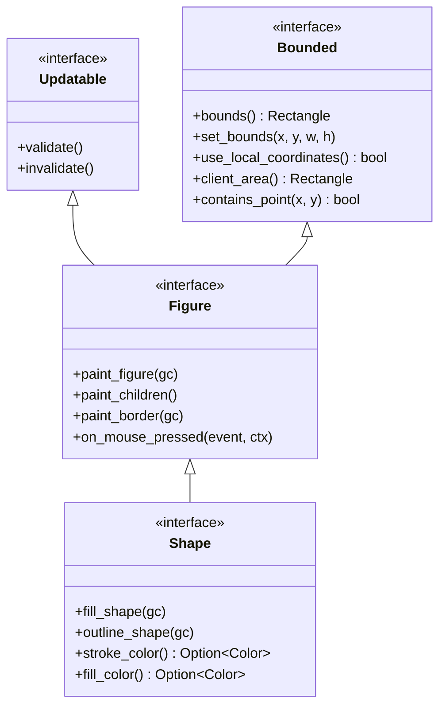
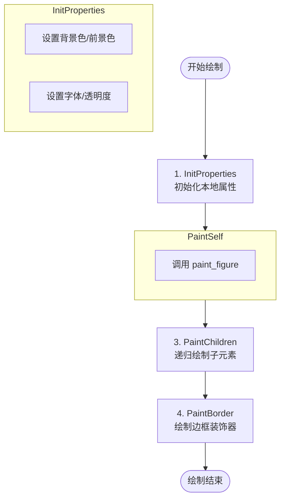
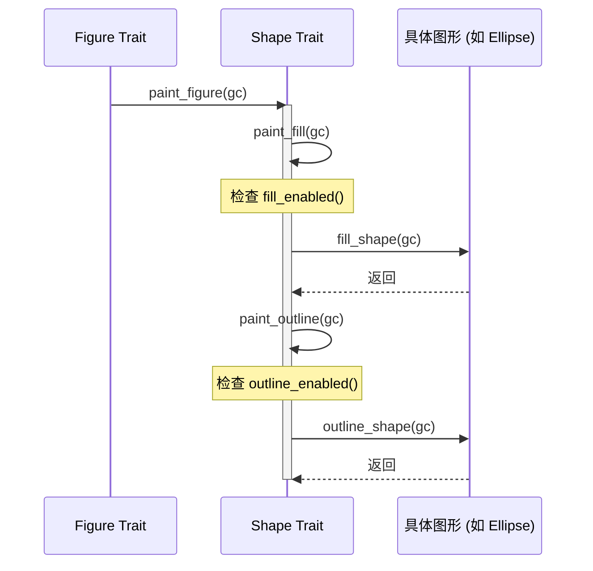
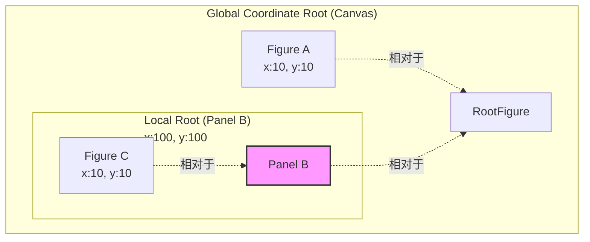
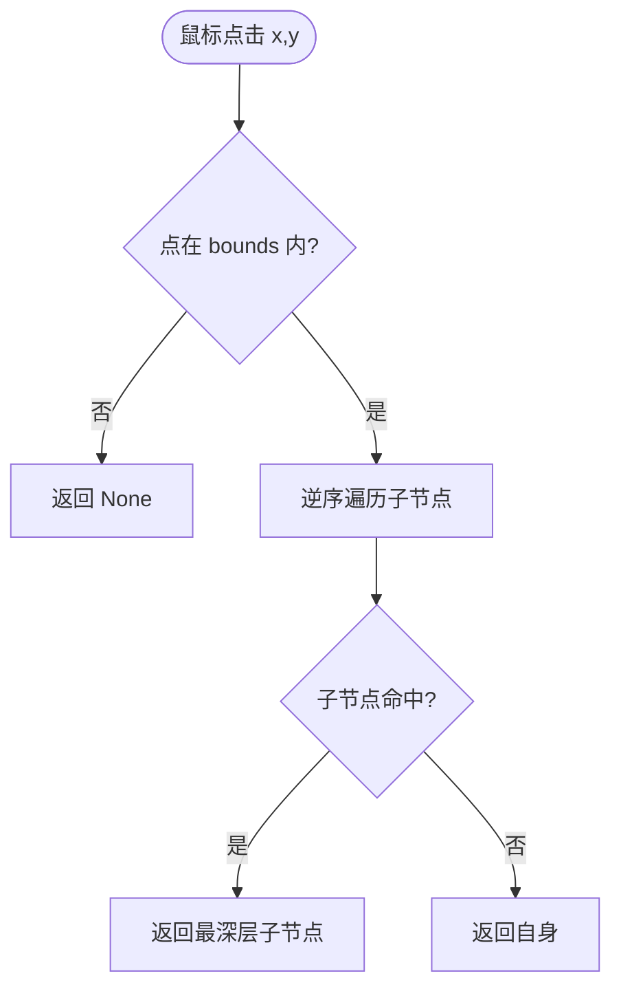

# Figure 核心接口与抽象

## 目录
1. [模块概览](#模块概览)
2. [引言](#引言)
3. [核心 Trait 层级](#核心-trait-层级)
   - [Bounded Trait: 几何边界与坐标契约](#bounded-trait-几何边界与坐标契约)
   - [Updatable Trait: 生命周期与验证机制](#updatable-trait-生命周期与验证机制)
   - [Figure Trait: 核心渲染接口](#figure-trait-核心渲染接口)
   - [Shape Trait: 描边与填充抽象](#shape-trait-描边与填充抽象)
4. [渲染生命周期与模板模式](#渲染生命周期与模板模式)
   - [四阶段渲染流程详解](#四阶段渲染流程详解)
   - [Shape 的细分绘制流](#shape-的细分绘制流)
5. [坐标系统与边界契约](#坐标系统与边界契约)
   - [坐标根 (Coordinate Root) 机制](#坐标根-coordinate-root-机制)
   - [Client Area 与 Insets](#client-area-与-insets)
6. [命中测试 (Hit Testing) 逻辑](#命中测试-hit-testing-逻辑)
7. [Blanket Implementation 机制](#blanket-implementation-机制)
8. [自定义 Figure 实现指南](#自定义-figure-实现指南)
9. [核心组件总结](#核心组件总结)
10. [文件参考](#文件参考)

## 模块概览

`novadraw-scene/src/figure/` 模块是 Novadraw 引擎的核心，负责定义所有可渲染图形的抽象接口与基础实现。该模块的设计深受 Eclipse Draw2D 的启发，采用了高度解耦的 Trait 层级结构。

**模块统计数据**：
- **核心文件数**：8 个 Rust 源文件。
- **子目录**：无。
- **覆盖范围**：本页面覆盖了 `mod.rs` 中的核心抽象定义，以及 `root.rs` 和 `rectangle.rs` 中的典型实现。

**主要子模块**：
- `mod.rs`: 定义核心 Trait 体系（`Bounded`, `Figure`, `Shape` 等）。
- `root.rs`: 实现内部使用的 `RootFigure`。
- `rectangle.rs`, `ellipse.rs`, `polygon.rs` 等: 具体图形的实现。

## 引言

在 Novadraw 引擎中，`Figure` 是构建复杂图形界面的最小原子单元。它不仅仅是一个简单的“绘图指令”，而是一个集成了几何属性、生命周期管理、渲染流程控制以及事件响应能力的综合体。

为了应对高性能渲染和高度可扩展性的需求，Novadraw 将 `Figure` 的能力拆分为多个正交的 Trait。这种设计模式允许开发者根据需求灵活组合能力。例如，一个纯逻辑的容器可能只需要实现 `Bounded`，而一个复杂的矢量图形则需要实现 `Shape`。

`Figure` 体系的核心设计哲学是**“接口定义行为，Block 管理状态”**。Figure Trait 本身是无状态的（Stateless），它定义了如何根据给定的属性进行绘制。这种设计使得渲染逻辑与场景树的状态管理完全解耦，极大地提升了系统的可维护性和测试性。

## 核心 Trait 层级

Novadraw 的 Figure 体系建立在四个关键 Trait 之上，它们形成了清晰的继承链。这种层级结构确保了能力的逐级增强。



上图展示了从基础几何属性到高级渲染属性的演进过程。`Bounded` 提供空间定位能力，`Updatable` 提供生命周期钩子，`Figure` 整合渲染流程，而 `Shape` 则为矢量图形提供标准化的描边和填充抽象。

### Bounded Trait: 几何边界与坐标契约

`Bounded` 是最基础的 Trait，它定义了图形在二维空间中的物理存在。

- **核心方法**：`bounds()` 返回图形的外接矩形（AABB）。
- **坐标契约**：这是 Novadraw 最核心的设计之一。`bounds()` 返回的是**相对于最近坐标根的绝对值**。这意味着当父链移动时，如果不是坐标根，偏移会自动传播。这种设计避免了在每一层都进行复杂的矩阵运算。
- **本地坐标**：`use_local_coordinates()` 决定该图形是否开启独立的坐标系。如果返回 `true`，该图形成为子树的“坐标根”，其所有后代节点的 `bounds` 将相对于该图形定位。

**代码片段：Bounded 定义**
```rust
pub trait Bounded: Send + Sync {
    /// 获取图形边界（相对于最近坐标根）
    fn bounds(&self) -> Rectangle;
    
    /// 设置图形边界
    fn set_bounds(&mut self, x: f64, y: f64, width: f64, height: f64);
    
    /// 检查点是否在图形边界内
    fn contains_point(&self, x: f64, y: f64) -> bool {
        let b = self.bounds();
        x >= b.x && x <= b.x + b.width && y >= b.y && y <= b.y + b.height
    }

    /// 是否使用本地坐标
    fn use_local_coordinates(&self) -> bool { false }
}
```
**Section sources**: [novadraw-scene/src/figure/mod.rs:L64-L160](novadraw-scene/src/figure/mod.rs#L64-L160)

### Updatable Trait: 生命周期与验证机制

`Updatable` 负责图形的验证生命周期。在图形界面系统中，布局计算和几何属性计算往往是性能瓶颈。

- **validate()**：这是生命周期中的关键钩子。它在布局计算完成后、渲染开始前被调用。复杂的图形（如 `Triangle` 或 `Polygon`）可以在此时根据最新的 `bounds` 预计算顶点坐标或路径缓存，从而将 `paint` 阶段的计算量降至最低。
- **invalidate()**：当图形的属性（如尺寸）发生变化时调用，用于标记该图形及其父链需要重新进行布局或验证。

**Section sources**: [novadraw-scene/src/figure/mod.rs:L175-L193](novadraw-scene/src/figure/mod.rs#L175-L193)

### Figure Trait: 核心渲染接口

`Figure` 继承了 `Bounded` 和 `Updatable`，是渲染流程的调度中心。它定义了渲染的模板方法，将复杂的绘制过程拆分为多个标准阶段。

除了渲染，`Figure` 还定义了事件处理的钩子函数，如 `on_mouse_pressed` 等。这使得每个图形都能参与到交互流程中。

**Section sources**: [novadraw-scene/src/figure/mod.rs:L217-L288](novadraw-scene/src/figure/mod.rs#L217-L288)

### Shape Trait: 描边与填充抽象

`Shape` 进一步扩展了 `Figure`，专门用于具有描边（Stroke）和填充（Fill）属性的封闭图形。它引入了类似 SVG 的属性模型。

- **属性方法**：`stroke_color()`, `stroke_width()`, `fill_color()`, `line_cap()`, `line_join()` 等。
- **抽象绘制方法**：`fill_shape()` 和 `outline_shape()`。具体图形（如 `Ellipse`）只需实现这两个方法即可完成绘制，无需关心复杂的渲染阶段调度。

**Section sources**: [novadraw-scene/src/figure/mod.rs:L308-L416](novadraw-scene/src/figure/mod.rs#L308-L416)

## 渲染生命周期与模板模式

Novadraw 采用了经典的**模板方法模式**来管理渲染流程。这种设计允许基类（Trait 的默认实现）定义算法骨架，而具体图形通过覆盖特定钩子方法来实现差异化行为。

### 四阶段渲染流程详解

当渲染引擎调用一个 Figure 的 `paint` 时，会严格遵循以下四个阶段：



该流程确保了视觉上的正确叠放顺序：
1. **背景/自身**：最先绘制，位于最底层。
2. **子元素**：在中层绘制，会遮挡父元素的背景。
3. **边框/装饰器**：最后绘制，确保边框（如选中高亮、焦点框）始终显示在最上层，不被内容遮挡。

### Shape 的细分绘制流

对于实现 `Shape` Trait 的图形，`paint_figure` 阶段会被进一步细分为“填充”和“描边”两个子阶段：



这种细分使得开发者可以专注于几何形状的定义。例如，在 `fill_shape` 中只需调用 `gc.fill_ellipse`，而在 `outline_shape` 中只需调用 `gc.stroke_ellipse`。通用的逻辑（如检查颜色是否为空、透明度应用等）都封装在 `Shape` Trait 的默认实现中。

**Diagram sources**:
- [novadraw-scene/src/figure/mod.rs:L380-L403](novadraw-scene/src/figure/mod.rs#L380-L403)

## 坐标系统与边界契约

理解 Figure 的坐标系统是开发自定义图形的关键。Novadraw 支持嵌套的本地坐标系，这类似于 CSS 的 `position: relative` 机制。

### 坐标根 (Coordinate Root) 机制

- **默认模式 (`use_local_coordinates = false`)**：图形与其父节点共享同一个坐标空间。父节点的平移操作会递归地作用于所有子节点。
- **本地模式 (`use_local_coordinates = true`)**：图形创建一个新的坐标域。该图形的左上角（加上内边距）成为子树的 `(0, 0)` 点。



在上面的架构中，`Figure C` 的逻辑坐标是 `(10, 10)`，但其在全局画布上的物理位置是 `(110, 110)`。这种机制极大地简化了复杂 UI 容器（如滚动面板、缩放图层）的实现，因为子元素无需关心外部的变换。

### Client Area 与 Insets

`client_area()` 定义了子元素可以被放置的有效区域。它自动处理了 `insets`（内边距）的影响：
- 如果 `use_local_coordinates` 为 `true`，`client_area` 的原点重置为 `(0, 0)`。
- 否则，`client_area` 的原点为 `bounds.x + left_inset, bounds.y + top_inset`。

**Section sources**: [novadraw-scene/src/figure/mod.rs:L111-L134](novadraw-scene/src/figure/mod.rs#L111-L134)

## 命中测试 (Hit Testing) 逻辑

命中测试是交互系统的核心。Novadraw 的命中测试遵循“从上到下、从深到浅”的原则。



1. **Bounds 过滤**：首先检查坐标点是否在当前 Figure 的 `bounds` 内。
2. **逆序遍历**：按照 Z-order 的逆序（从最上层到最下层）遍历子节点。
3. **坐标转换**：在进入子节点检测前，会将坐标转换到子节点的坐标域中。
4. **递归向下**：如果子节点命中，则继续向其子树递归，直到找到最深层的叶子节点。

## Blanket Implementation 机制

Novadraw 利用 Rust 的 **Blanket Implementation** 特性，实现了从 `Shape` 到 `Figure` 的自动行为注入。

在 `mod.rs` 中，所有实现了 `Shape` 的类型都会自动获得 `Figure` 的实现：

```rust
impl<T: Shape> Figure for T
where
    T: Bounded,
{
    fn paint_figure(&self, gc: &mut NdCanvas) {
        // 自动调用 Shape 提供的细分绘制流
        Shape::paint_figure(self, gc);
    }
    
    fn get_border(&self) -> Option<&dyn Border> {
        Shape::get_border(self)
    }
    // ... 转发交互和事件处理
}
```

这种设计的优势在于：
- **极简实现**：开发者只需关注 `Shape` 的几何定义。
- **一致性**：所有形状都遵循相同的渲染阶段和事件派发逻辑。
- **解耦**：`Figure` 接口保持纯净，不包含具体的描边/填充细节。

**Section sources**: [novadraw-scene/src/figure/mod.rs:L438-L483](novadraw-scene/src/figure/mod.rs#L438-L483)

## 自定义 Figure 实现指南

要实现一个自定义的图形（例如一个带颜色的矩形），请遵循以下标准流程：

1. **定义数据结构**：
   ```rust
   pub struct MyRect {
       pub bounds: Rectangle,
       pub fill_color: Color,
   }
   ```

2. **实现 Bounded**：
   ```rust
   impl Bounded for MyRect {
       fn bounds(&self) -> Rectangle { self.bounds }
       fn set_bounds(&mut self, x: f64, y: f64, w: f64, h: f64) {
           self.bounds = Rectangle::new(x, y, w, h);
       }
       fn name(&self) -> &'static str { "MyRect" }
   }
   ```

3. **实现 Shape**：
   ```rust
   impl Shape for MyRect {
       fn fill_color(&self) -> Option<Color> { Some(self.fill_color) }
       fn fill_shape(&self, gc: &mut NdCanvas) {
           gc.fill_rect(self.bounds.x, self.bounds.y, self.bounds.width, self.bounds.height, self.fill_color);
       }
       // 描边、线帽等可以保留默认实现或按需覆盖
       fn outline_shape(&self, _gc: &mut NdCanvas) {}
       fn stroke_color(&self) -> Option<Color> { None }
       fn stroke_width(&self) -> f64 { 0.0 }
       fn line_cap(&self) -> LineCap { LineCap::default() }
       fn line_join(&self) -> LineJoin { LineJoin::default() }
   }
   ```

由于 Blanket Impl 的存在，你不需要显式实现 `Figure`。该 `MyRect` 已经具备了完整的渲染和交互能力。

**Section sources**: [novadraw-scene/src/figure/rectangle.rs:L114-L220](novadraw-scene/src/figure/rectangle.rs#L114-L220)

## 核心组件总结

| 组件 | 职责 | 关键方法 |
| :--- | :--- | :--- |
| **Bounded** | 几何属性管理与坐标系统定义 | `bounds()`, `client_area()`, `use_local_coordinates()` |
| **Updatable** | 生命周期验证与更新通知 | `validate()`, `invalidate()` |
| **Figure** | 渲染调度中心与交互接口 | `paint_figure()`, `paint_border()`, `on_mouse_pressed()` |
| **Shape** | 矢量图形的高级抽象（填充/描边） | `fill_shape()`, `outline_shape()`, `stroke_color()` |
| **RootFigure** | 场景树的内部根节点 | 实现为一个透明的、不响应事件的容器 |

## 文件参考

本章节内容基于以下核心文件分析得出：

- `novadraw-scene/src/figure/mod.rs`: Trait 体系定义与渲染流程核心逻辑。
- `novadraw-scene/src/figure/root.rs`: 根节点实现参考。
- `novadraw-scene/src/figure/rectangle.rs`: 标准图形实现示例。
- `doc/02-figure/ifigure_interface.md`: 接口设计文档。
- `doc/02-figure/figure_core_concepts.md`: 核心概念全景图。
