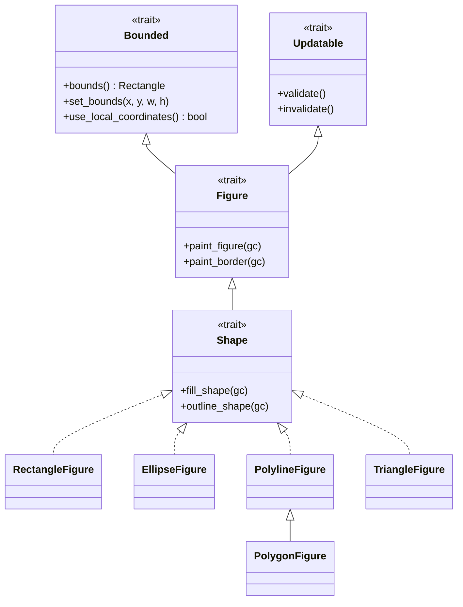
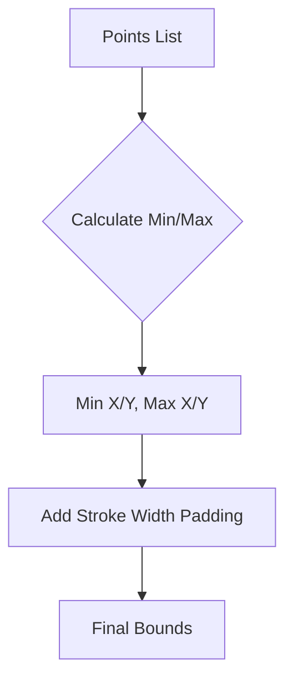
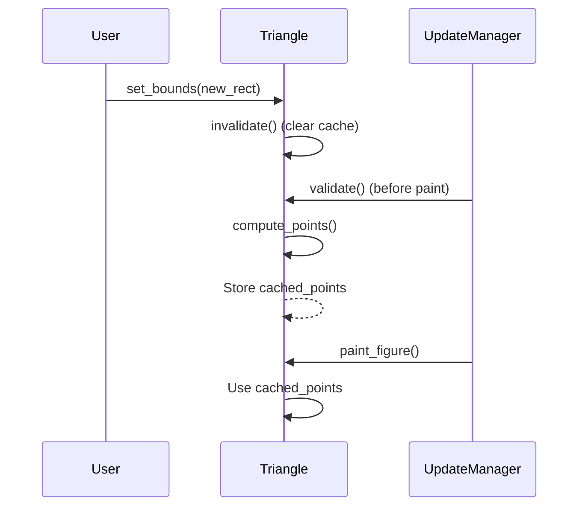
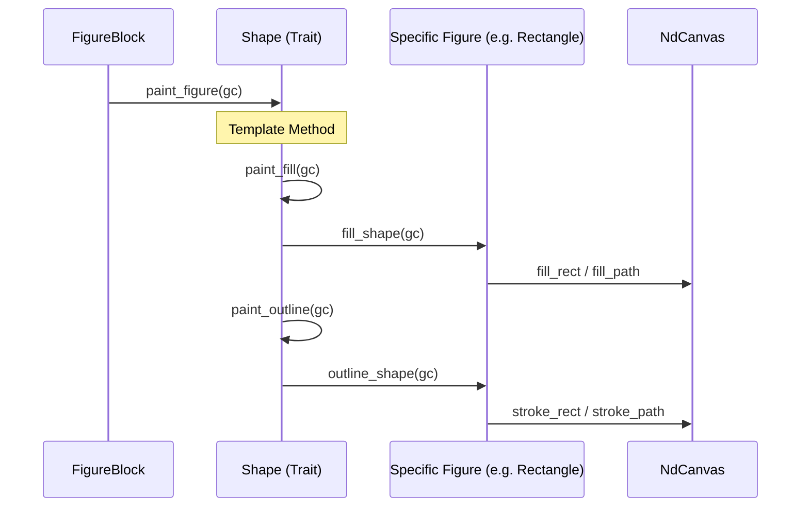

# 内置图形组件库

## 目录
1. [模块概览](#模块概览)
2. [核心架构与继承体系](#核心架构与继承体系)
3. [基础几何图形组件](#基础几何图形组件)
   - [矩形 (RectangleFigure)](#矩形-rectanglefigure)
   - [椭圆与圆 (EllipseFigure)](#椭圆与圆-ellipsefigure)
   - [圆角矩形 (RoundedRectangleFigure)](#圆角矩形-roundedrectanglefigure)
4. [路径与点集图形](#路径与点集图形)
   - [折线 (PolylineFigure)](#折线-polylinefigure)
   - [多边形 (PolygonFigure)](#多边形-polygonfigure)
5. [动态计算图形：三角形 (TriangleFigure)](#动态计算图形三角形-trianglefigure)
6. [内部辅助图形：根图形 (RootFigure)](#内部辅助图形根图形-rootfigure)
7. [核心实现模式分析](#核心实现模式分析)
8. [文件参考](#文件参考)

## 模块概览

Novadraw 的内置图形组件库位于 `novadraw-scene/src/figure/` 目录下，提供了一系列标准化的 2D 图形实现。这些组件遵循 Eclipse Draw2D 的设计哲学，采用“属性驱动几何”的模式，即通过修改图形的属性（如 `bounds`、`points` 等）来自动驱动渲染输出。

该模块共包含 **8** 个核心 Rust 文件：
- `mod.rs`: 模块定义与公开接口导出。
- `rectangle.rs`: 基础矩形实现。
- `ellipse.rs`: 椭圆与圆形实现。
- `polyline.rs`: 基于点集的折线实现。
- `polygon.rs`: 基于点集的闭合多边形实现。
- `triangle.rs`: 支持四个方向的等腰三角形，包含复杂的顶点缓存逻辑。
- `rounded_rectangle.rs`: 带圆角的矩形实现。
- `root.rs`: 内部使用的透明根容器图形。

本页面将深入探讨这些图形的内部实现逻辑、渲染方式以及它们如何通过 `Shape` 接口与渲染引擎交互。

## 核心架构与继承体系

Novadraw 的图形系统通过一系列 Trait 定义了清晰的层次结构。每个内置图形都必须实现这些 Trait 以接入场景图的生命周期。

下面的类图展示了核心 Trait 之间的继承关系以及具体图形的实现位置：



该架构确保了所有图形都具备统一的边界管理（`Bounded`）、验证逻辑（`Updatable`）和渲染流程（`Figure`/`Shape`）。

**核心逻辑说明**：
- **Bounded**: 定义了图形在空间中的位置和大小。`bounds` 是所有图形的核心属性。
- **Updatable**: 提供了延迟计算的钩子。例如，三角形在 `bounds` 变化后，并不会立即重算顶点，而是标记为 `invalid`，在 `validate` 阶段统一重算。
- **Shape**: 专门为具有填充和描边属性的图形设计，将渲染过程分解为 `fill_shape`（填充）和 `outline_shape`（描边）两个阶段。

**Diagram sources**: 
- [mod.rs:L64-L416](novadraw-scene/src/figure/mod.rs#L64-L416)

## 基础几何图形组件

基础几何图形是最常用的组件，它们的几何形状直接由 `bounds`（矩形边界）决定。

### 矩形 (RectangleFigure)

`RectangleFigure` 是最基础的图形，直接映射到渲染引擎的矩形绘制命令。

- **几何定义**: 完全填充 `bounds` 区域。
- **描边逻辑**: 为了保证描边不超出 `bounds`，`RectangleFigure` 在 `outline_shape` 中实现了一个向内缩进（Inset）的逻辑。

```rust
// novadraw-scene/src/figure/rectangle.rs
fn outline_shape(&self, gc: &mut NdCanvas) {
    if let Some(color) = self.stroke_color {
        // 描边向内缩（inset），使描边完全在 bounds 内部
        let line_inset = (1.0_f64).max(self.stroke_width) / 2.0;

        let x = self.bounds.x + line_inset;
        let y = self.bounds.y + line_inset;
        let width = self.bounds.width - line_inset * 2.0;
        let height = self.bounds.height - line_inset * 2.0;

        gc.stroke_rect(x, y, width.max(0.0), height.max(0.0), color, self.stroke_width, ...);
    }
}
```

### 椭圆与圆 (EllipseFigure)

`EllipseFigure` 渲染一个外切于 `bounds` 的椭圆。如果 `bounds` 是正方形，则渲染为圆。

- **渲染细节**: 通过计算 `bounds` 的中心点 `(cx, cy)` 和半径 `(rx, ry)` 来调用渲染器的 `ellipse` 命令。
- **描边处理**: 同样遵循向内缩进原则，确保椭圆边缘不超出指定的边界框。

### 圆角矩形 (RoundedRectangleFigure)

`RoundedRectangleFigure` 在矩形的基础上增加了 `corner_radius` 属性。

- **实现方式**: 内部使用 `Path` API。通过 `move_to`、`line_to` 和 `quadratic_curve_to`（二次贝塞尔曲线）手动构建圆角路径。
- **退化处理**: 当 `corner_radius` 为 0 时，它会自动退化为使用高效的 `fill_rect` / `stroke_rect` 命令，以优化性能。

**Section sources**:
- [rectangle.rs](novadraw-scene/src/figure/rectangle.rs)
- [ellipse.rs](novadraw-scene/src/figure/ellipse.rs)
- [rounded_rectangle.rs](novadraw-scene/src/figure/rounded_rectangle.rs)

## 路径与点集图形

对于非规则形状，Novadraw 提供了基于点列表的图形组件。

### 折线 (PolylineFigure)

`PolylineFigure` 存储一个 `Vec<Vec2>` 的点列表。

- **边界计算**: 折线的 `bounds` 不是由用户直接设置的，而是根据点集动态计算的 AABB（轴对齐包围盒），并额外扩展了半个线宽的距离以包含描边。
- **坐标变换**: 当调用 `set_bounds` 调整折线大小时，它会计算缩放比例并重新映射所有点的位置。



此流程确保了折线的包围盒能够准确反映其在屏幕上的渲染占用区域。

### 多边形 (PolygonFigure)

`PolygonFigure` 继承并扩展了 `PolylineFigure` 的逻辑。

- **核心区别**: 多边形是闭合的，并且支持填充（`fill_color`）。
- **渲染逻辑**: 在 `fill_shape` 和 `outline_shape` 中，它会显式调用 `gc.close_path()` 确保路径首尾相连。

**Section sources**:
- [polyline.rs](novadraw-scene/src/figure/polyline.rs)
- [polygon.rs](novadraw-scene/src/figure/polygon.rs)

## 动态计算图形：三角形 (TriangleFigure)

`TriangleFigure` 是库中最复杂的组件之一，它实现了一个可以指向四个方向（北、南、东、西）的等腰三角形。

### 顶点计算与缓存机制

为了优化性能，三角形采用了延迟验证机制。顶点坐标不会在每次属性修改时立即计算，而是缓存起来。



**关键设计点**：
1. **invalidate**: 当 `bounds` 的宽度或高度改变，或者 `direction` 改变时，调用 `invalidate()` 清除 `cached_points`。
2. **validate**: 在渲染之前的验证阶段，如果发现缓存为空，则根据当前的 `bounds` 和 `direction` 计算新的三个顶点。
3. **prim_translate**: 这是一个性能优化点。如果图形仅仅是平移（x/y 变化，但 width/height 不变），`TriangleFigure` 会直接平移缓存的顶点，而不需要重新运行复杂的三角计算逻辑。

**Section sources**:
- [triangle.rs](novadraw-scene/src/figure/triangle.rs)

## 内部辅助图形：根图形 (RootFigure)

`RootFigure` 是一个特殊的组件，主要用于 `FigureGraph` 的内部逻辑。

- **用途**: 作为整个图形树的根节点。
- **特性**: 
    - **完全透明**: 它实现了 `Shape` 接口，但 `fill_enabled` 和 `outline_enabled` 始终返回 `false`。
    - **坐标锚点**: 它为所有子节点提供初始的全局坐标参考。
    - **简单性**: 不包含任何颜色或样式属性，仅维护一个 `bounds` 用于裁剪和命中测试。

**Section sources**:
- [root.rs](novadraw-scene/src/figure/root.rs)

## 核心实现模式分析

所有内置图形在实现 `Shape` trait 时都遵循一套标准的渲染模式。

下面的序列图展示了从 `FigureBlock` 触发渲染到具体图形执行绘制的过程：



**实现细节要点**：
1. **模板方法**: `Shape` trait 提供了 `paint_figure` 的默认实现，它规定了先填充后描边的顺序。
2. **状态保护**: 渲染器在调用 `paint_figure` 前会自动处理坐标变换和裁剪，因此具体图形在 `fill_shape` 中通常只需要关心本地坐标。
3. **描边缩进**: 为了符合 UI 设计中“边框不占据额外空间”的习惯，大多数图形（Rectangle, Ellipse, RoundedRectangle）都会在描边时将坐标向内偏移 `stroke_width / 2`。

**Diagram sources**: 
- [mod.rs:L380-L416](novadraw-scene/src/figure/mod.rs#L380-L416)

## 文件参考

以下是本模块涉及的核心源文件：

- [novadraw-scene/src/figure/mod.rs](novadraw-scene/src/figure/mod.rs): 定义了 `Bounded`、`Figure` 和 `Shape` 等核心 Trait。
- [novadraw-scene/src/figure/rectangle.rs](novadraw-scene/src/figure/rectangle.rs): 矩形图形实现。
- [novadraw-scene/src/figure/ellipse.rs](novadraw-scene/src/figure/ellipse.rs): 椭圆图形实现。
- [novadraw-scene/src/figure/polyline.rs](novadraw-scene/src/figure/polyline.rs): 折线图形实现。
- [novadraw-scene/src/figure/polygon.rs](novadraw-scene/src/figure/polygon.rs): 多边形图形实现。
- [novadraw-scene/src/figure/triangle.rs](novadraw-scene/src/figure/triangle.rs): 三角形及其顶点缓存逻辑。
- [novadraw-scene/src/figure/rounded_rectangle.rs](novadraw-scene/src/figure/rounded_rectangle.rs): 圆角矩形实现。
- [novadraw-scene/src/figure/root.rs](novadraw-scene/src/figure/root.rs): 内部根图形实现。
