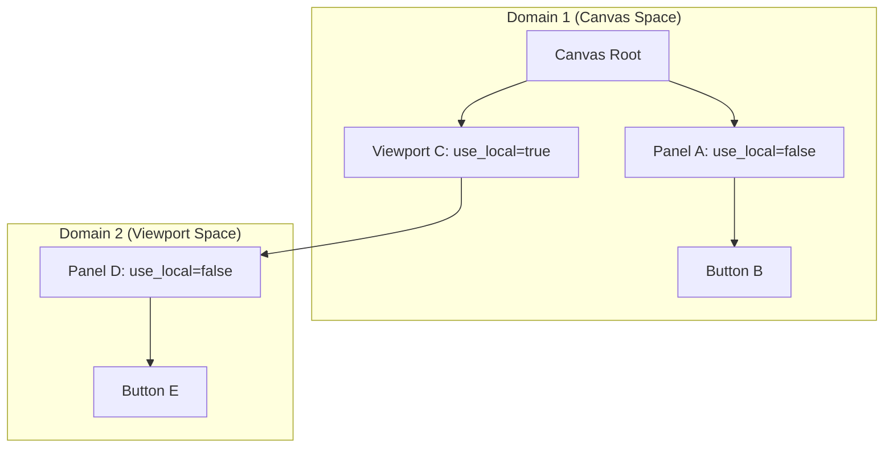
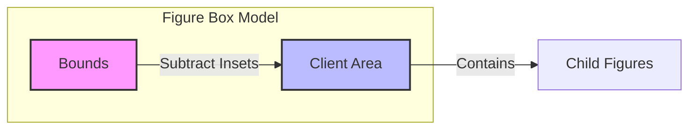
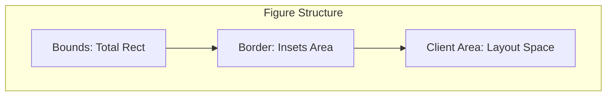
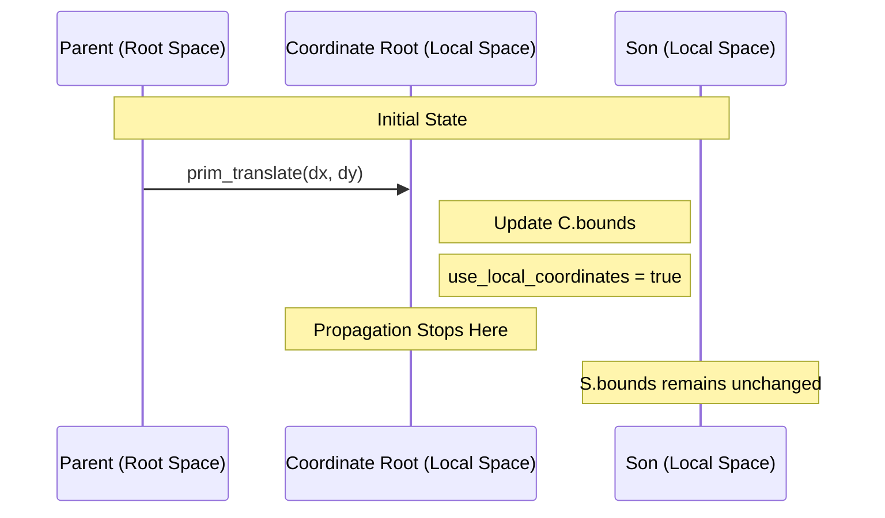
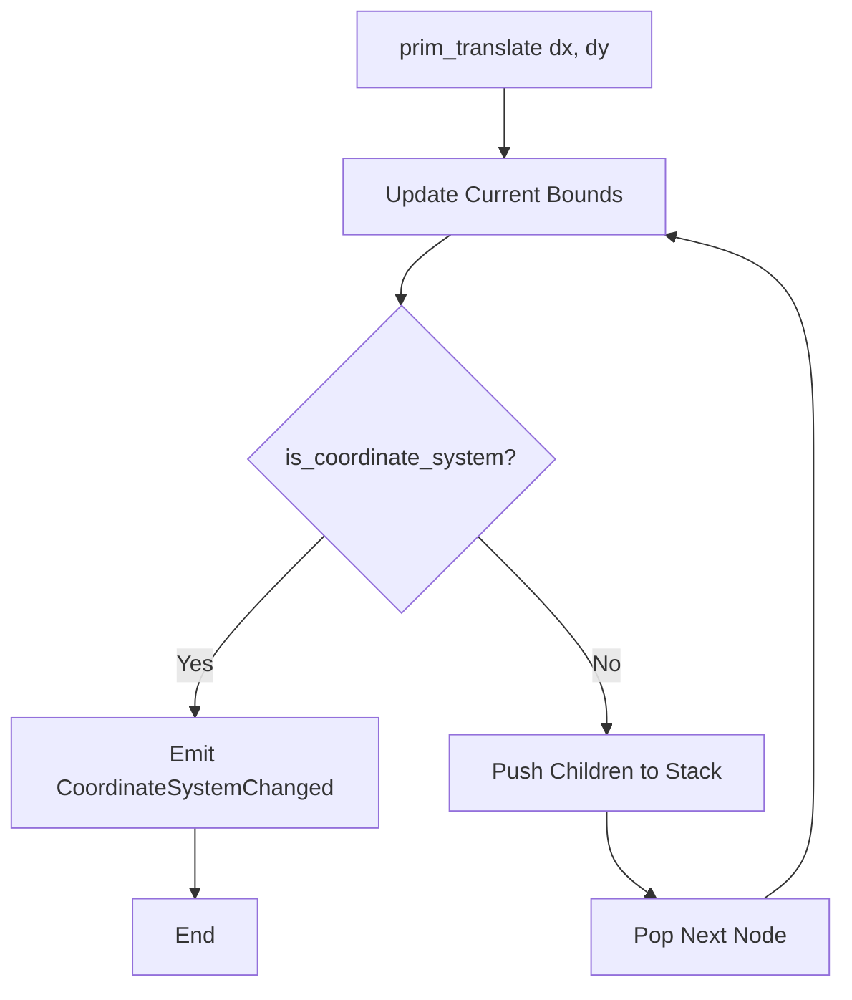
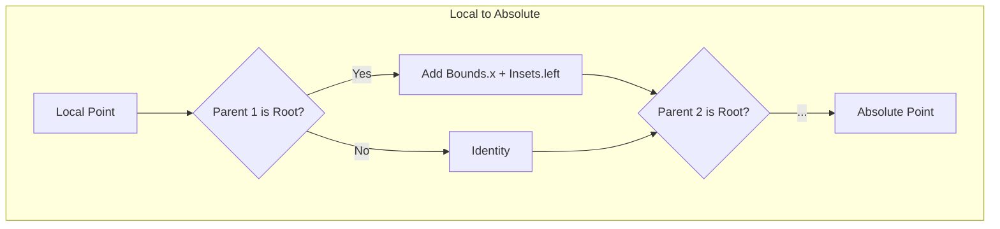
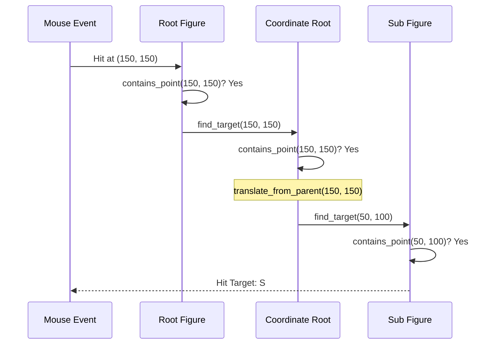

# 坐标系统与盒子模型

## 目录
1. [模块概览](#模块概览)
2. [核心概念：坐标契约](#核心概念坐标契约)
3. [盒子模型 (Box Model)](#盒子模型-box-model)
4. [局部坐标系 (Local Coordinate System)](#局部坐标系-local-coordinate-system)
5. [坐标传播机制](#坐标传播机制)
6. [坐标转换协议](#坐标转换协议)
7. [在渲染与命中测试中的应用](#在渲染与命中测试中的应用)
8. [代码示例与实践](#代码示例与实践)
9. [文件参考](#文件参考)

## 模块概览

Novadraw 的坐标系统与盒子模型是整个图形引擎的几何基石。它借鉴了 Eclipse Draw2D 的经典设计，通过“绝对坐标存储”与“局部坐标切换”的组合，在保持树形结构灵活性的同时，极大地简化了渲染和布局的计算复杂度。

在 `novadraw-scene` 模块中，坐标逻辑主要分布在以下子模块中：
- `figure`: 定义了 `Bounded` trait，提供了 `bounds`、`insets` 和 `client_area` 的标准契约。
- `scene`: 实现了 `FigureGraph`，负责在树形结构中传播坐标偏移（`prim_translate`）以及提供跨节点的坐标转换方法。
- `border`: 决定了 `Insets` 的大小，从而影响盒子模型的内部布局空间。

本模块涉及约 34 个源文件，其中核心逻辑集中在 `novadraw-scene/src/figure/mod.rs` 和 `novadraw-scene/src/scene/mod.rs`。本文将深入探讨这些核心逻辑的实现原理。

## 核心概念：坐标契约

Novadraw 采用了一种独特的坐标存储契约：**Figure 的 `bounds` 存储的是相对于其“最近坐标根”的绝对坐标**。

### 什么是坐标根 (Coordinate Root)？
在 Novadraw 的视图树中，并非每个节点都拥有独立的坐标系。默认情况下，子节点与父节点共享同一个坐标域。只有当一个节点的 `use_local_coordinates()` 返回 `true` 时，它才会成为一个“坐标根”。

### 绝对坐标 vs 相对坐标
- **绝对坐标（相对于根）**：即使父节点移动，子节点的 `bounds` 也会同步更新，以保持其在当前坐标域中的绝对位置不变。这种设计的优势在于，在渲染和命中测试时，大部分节点可以直接使用其 `bounds` 进行计算，而无需逐层累加变换矩阵。
- **相对坐标（相对于父节点）**：只有当父节点是坐标根时，子节点的 `bounds` 才表现为相对于父节点的偏移。

下图展示了坐标根如何划分不同的坐标域：



在上面的架构中，`Root`、`A`、`B`、`C` 都处于同一个坐标域（画布空间）。当 `A` 移动时，`B` 的 `bounds` 会同步更新。而 `D` 和 `E` 处于 `Viewport C` 开启的新坐标域中。当 `C` 移动时，`D` 和 `E` 的 `bounds` 不需要改变，因为它们相对于 `C` 的位置没变。

**核心逻辑参考**:
- [figure/mod.rs:L51-L63](novadraw-scene/src/figure/mod.rs#L51-L63)

## 盒子模型 (Box Model)

Novadraw 的盒子模型定义了图形在视觉上的结构层次。与 CSS 盒模型类似，它包含边界、内边距和客户区域，但实现上更为精简。

### 核心组成部分
1.  **Bounds (边界)**：图形占用的完整矩形区域 `(x, y, width, height)`。它是所有几何计算的基准。
2.  **Insets (内边距)**：由边框（Border）或其他装饰定义的预留空间 `(top, left, bottom, right)`。
3.  **Client Area (客户区域)**：子元素可以进行布局和绘制的实际可用区域。

### 几何关系
盒子模型的几何关系可以用以下公式表示：
`ClientArea = Bounds - Insets`

当 `use_local_coordinates` 为 `true` 时，`ClientArea` 的原点会重置为 `(0, 0)`，因为当前 Figure 已经成为了子树的坐标原点。



盒子模型的层级结构如下图所示：



在渲染过程中，`paint_figure` 负责绘制 `Bounds` 区域（通常是背景和形状），而 `paint_children` 则被限制在 `ClientArea` 内部。这种分离确保了子元素不会超出父元素的装饰边界。

**核心代码实现**:
```rust
// novadraw-scene/src/figure/mod.rs
fn client_area(&self) -> Rectangle {
    let b = self.bounds();
    let (top, left, bottom, right) = self.insets();
    let width = b.width - left - right;
    let height = b.height - top - bottom;
    if self.use_local_coordinates() {
        // 作为坐标根，原点重置为 (0, 0)
        Rectangle::new(0.0, 0.0, width, height)
    } else {
        // 共享坐标系，原点为偏移后的绝对位置
        Rectangle::new(b.x + left, b.y + top, width, height)
    }
}
```

**Section sources**:
- [figure/mod.rs:L117-L134](novadraw-scene/src/figure/mod.rs#L117-L134)

## 局部坐标系 (Local Coordinate System)

`use_local_coordinates()` 是 Novadraw 坐标系统的核心开关。它决定了一个 Figure 是否为其子树提供独立的坐标空间。

### 行为差异
| 特性 | `false` (默认) | `true` (坐标根) |
| :--- | :--- | :--- |
| **坐标域** | 继承父节点的坐标域 | 开启全新的局部坐标域 |
| **位置传播** | `prim_translate` 会递归平移子节点 | `prim_translate` 在此截断，不传播给子节点 |
| **渲染变换** | 无需变换 | 渲染子节点前执行 `translate(x+left, y+top)` |
| **典型应用** | 普通形状、简单容器 | 滚动视口 (Viewport)、缩放层 (ScalableLayer) |

### 坐标根的传播截断
当一个节点开启了局部坐标系，它就成为了一个“隔离层”。父节点的移动只会改变这个隔离层本身的位置，而隔离层内部的子节点相对于隔离层原点的位置保持不变。



这种机制极大地优化了复杂场景下的性能。例如，在一个拥有成千上万个元素的滚动列表中，滚动操作只需要平移列表容器（坐标根）的 `bounds`，而不需要更新每一个子元素的 `bounds`。

**Section sources**:
- [figure/mod.rs:L103-L113](novadraw-scene/src/figure/mod.rs#L103-L113)
- [scene/mod.rs:L1207-L1221](novadraw-scene/src/scene/mod.rs#L1207-L1221)

## 坐标传播机制

为了维持“相对于最近根的绝对坐标”这一契约，Novadraw 实现了 `prim_translate` 机制。

### `prim_translate` 算法
当调用 `set_bounds` 改变一个节点的位置时，引擎会计算位移量 `(dx, dy)`，并触发 `prim_translate`：

1.  更新当前节点的 `bounds.x` 和 `bounds.y`。
2.  检查 `use_local_coordinates()`。
3.  如果为 `false`，将位移量 `(dx, dy)` 递归应用到所有子节点。
4.  如果为 `true`，停止传播。

为了避免深度树结构导致的栈溢出，Novadraw 在 `FigureGraph` 中使用了**显式栈迭代**来实现这一过程。



这种递归传播确保了在同一个坐标域内，所有节点的位置信息是同步的。这使得 `contains_point` 等操作可以极其高效，因为它只需要检查点是否在 `bounds` 矩形内，而不需要考虑复杂的父节点偏移。

**代码实现细节**:
```rust
// novadraw-scene/src/scene/mod.rs
pub fn prim_translate(&mut self, block_id: BlockId, dx: f64, dy: f64) {
    let mut stack = vec![block_id];
    while let Some(id) = stack.pop() {
        // ... 更新 bounds ...
        if block.figure.use_local_coordinates() {
            // 坐标根：发送通知并停止传播
            self.emit_figure_event(FigureEvent::CoordinateSystemChanged { ... });
            continue;
        }
        // 默认模式：继续传播给子节点
        for child_id in children {
            stack.push(child_id);
        }
    }
}
```

**Section sources**:
- [scene/mod.rs:L1167-L1222](novadraw-scene/src/scene/mod.rs#L1167-L1222)

## 坐标转换协议

由于存在多个坐标域，跨节点的坐标转换变得至关重要。Novadraw 提供了完整的转换协议。

### 核心方法
- `translate_to_absolute_mut`: 将局部坐标转换为画布绝对坐标。它会沿着父链向上追溯，每遇到一个坐标根，就累加一次偏移。
- `translate_to_relative`: 将画布绝对坐标转换为特定节点的局部坐标。
- `translate_from_parent` / `translate_to_parent`: 在父子坐标域之间进行单层转换。

### 转换逻辑
转换逻辑严格遵循坐标根的定义。只有在 `use_local_coordinates` 为 `true` 的节点上，才会执行实际的坐标平移。



这种按需转换的机制保证了在没有坐标根嵌套的情况下，转换操作几乎是零开销的。

**Section sources**:
- [scene/mod.rs:L1282-L1353](novadraw-scene/src/scene/mod.rs#L1282-L1353)

## 在渲染与命中测试中的应用

坐标系统在渲染（Rendering）和命中测试（Hit Testing）中起着决定性作用。

### 渲染流程中的坐标切换
在渲染树时，渲染器需要根据节点的坐标属性实时调整画布的变换矩阵（Transformation Matrix）。

1.  **绘制自身**：使用当前坐标系，直接利用 `bounds` 绘图。
2.  **切换到子空间**：
    - 如果父节点是坐标根，调用 `gc.translate(bounds.x + left, bounds.y + top)` 并设置 `clip_rect`。
    - 这样子节点就可以在 `(0, 0)` 开始的局部空间中安全绘制。
3.  **递归绘制子节点**。

### 命中测试中的坐标切换
命中测试是一个从根向下的递归过程，它需要将输入的鼠标坐标不断“降维”到子空间中。



通过这种方式，无论嵌套多深，每个 Figure 只需要关心自己所在坐标域内的坐标，极大地降低了逻辑耦合。

**Section sources**:
- [scene/render_recursive.rs:L130-L157](novadraw-scene/src/scene/render_recursive.rs#L130-L157)
- [scene/mod.rs:L1372-L1400](novadraw-scene/src/scene/mod.rs#L1372-L1400)

## 代码示例与实践

### 1. 实现一个自定义坐标根
如果你需要创建一个支持滚动的容器，你需要让它成为坐标根。

```rust
impl Bounded for MyScrollContainer {
    fn bounds(&self) -> Rectangle { self.bounds }
    
    // 关键：开启局部坐标系
    fn use_local_coordinates(&self) -> bool { true }
    
    fn insets(&self) -> (f64, f64, f64, f64) {
        // 预留边框空间
        (2.0, 2.0, 2.0, 2.0)
    }
}
```

### 2. 手动进行坐标转换
在处理拖拽等交互逻辑时，经常需要将鼠标的绝对坐标转换为节点的局部坐标。

```rust
fn on_mouse_move(&self, event: &MouseEvent, scene: &FigureGraph) {
    let mut local_point = (event.x, event.y);
    // 将画布坐标转换为相对于当前节点的局部坐标
    scene.translate_to_relative(self.id, &mut local_point);
    
    println!("Local position: {:?}", local_point);
}
```

## 文件参考

以下是本章节涉及的核心源文件：

- `novadraw-scene/src/figure/mod.rs`: 核心 `Bounded` 契约与盒子模型定义。
- `novadraw-scene/src/scene/mod.rs`: 场景图管理、坐标传播 `prim_translate` 及转换协议实现。
- `novadraw-scene/src/scene/render_recursive.rs`: 递归渲染中的坐标切换逻辑。
- `novadraw-scene/src/scene/render_iterative.rs`: 迭代渲染中的坐标任务调度。
- `novadraw-scene/src/border/mod.rs`: 边框与 `Insets` 的定义。
- `novadraw-geometry/src/lib.rs`: `Rectangle` 和 `Translatable` 基础几何类型。

**Section sources**:
- [figure/mod.rs](novadraw-scene/src/figure/mod.rs)
- [scene/mod.rs](novadraw-scene/src/scene/mod.rs)
- [scene/render_recursive.rs](novadraw-scene/src/scene/render_recursive.rs)
- [scene/render_iterative.rs](novadraw-scene/src/scene/render_iterative.rs)
