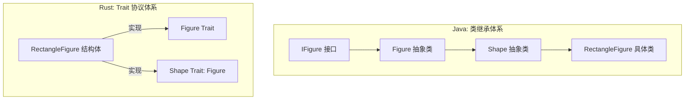
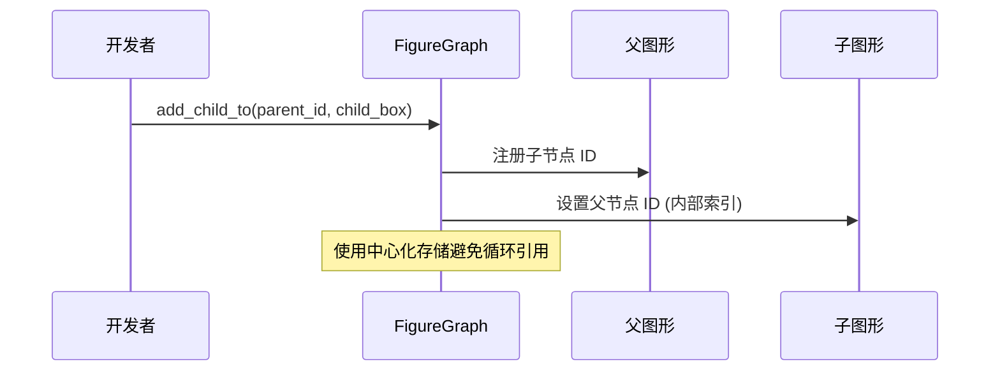
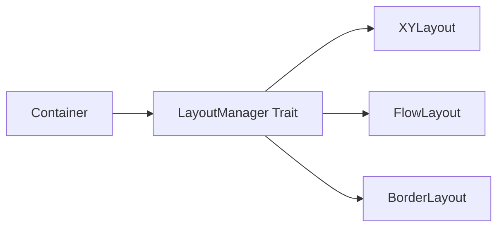
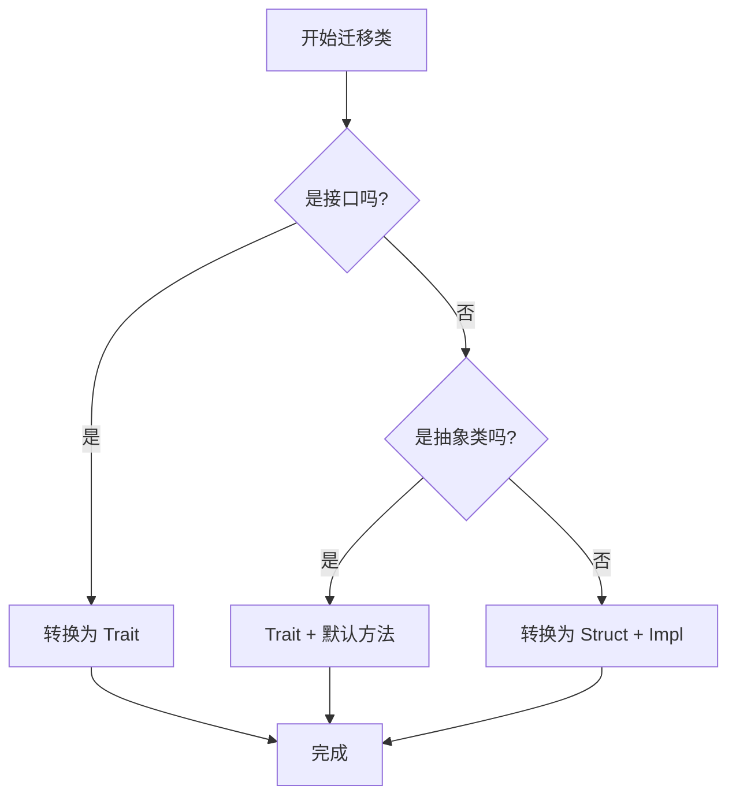

# Java 到 Rust 迁移指南

## 目录
1. [模块概述](#模块概述)
2. [引言](#引言)
3. [核心概念对齐](#核心概念对齐)
4. [架构范式转换](#架构范式转换)
5. [模式转换指南](#模式转换指南)
6. [代码对比实战](#代码对比实战)
7. [迁移建议与最佳实践](#迁移建议与最佳实践)
8. [核心组件](#核心组件)
9. [文件引用](#文件引用)

## 模块概述

本迁移指南旨在帮助具有 Eclipse Draw2D 或 GEF (Graphical Editing Framework) 背景的 Java 开发者平滑过渡到 Novadraw 的 Rust 实现。通过对比 Java 的类继承体系与 Rust 的 Trait 协议系统，开发者可以快速理解 Novadraw 的设计哲学并开始编写高性能的图形应用。

**范围与规模**：
- **文档资源**：位于 `doc/05-java-rust/`，共 2 个核心迁移文档，详细对比了面向对象与 Rust 特性的映射。
- **示例代码**：位于 `examples/g2/`，包含 6 个典型的 Java Draw2D 示例，作为迁移的参照物。
- **覆盖深度**：
    - **核心映射**：深入讲解 `IFigure`、`LayoutManager` 等核心接口在 Rust 中的对等实现。
    - **架构转换**：重点分析从“重量级类继承”到“轻量级 Trait 组合”的转变。
    - **代码对比**：通过 `HelloWorld` 和 `ShapeDemo` 等实例进行逐行对比。

本指南将重点覆盖 `novadraw-scene` 模块中的图形定义、布局管理和更新机制，这些是与 Draw2D 对应最紧密的部分。

## 引言

在 Java 世界中，Eclipse Draw2D 长期以来一直是构建复杂图形界面的标准框架，其基于类继承的架构（如 `IFigure` -> `Figure` -> `Shape`）为开发者提供了极大的灵活性。然而，随着 WebAssembly 和高性能图形渲染的需求增长，Rust 凭借其内存安全和零开销抽象成为了新的选择。

Novadraw 的设计深度借鉴了 Draw2D 的核心公理，但在实现上完全拥抱了 Rust 的所有权模型和 Trait 系统。迁移不仅仅是语法的转换，更是思维方式的转变：从“对象是什么（继承）”转向“对象能做什么（协议）”。

> 💡 **关键术语提示**：
> - **Figure**: 在 Java 中是类，在 Rust 中是 Trait。
> - **LayoutManager**: 两者概念一致，但 Rust 版本更强调约束（Constraint）的解耦。
> - **UpdateManager**: Java 中负责重绘请求，Rust 中通过 `DeferredUpdate` 系统实现类似的延迟修复逻辑。

## 核心概念对齐

理解迁移的第一步是将熟悉的 Java 术语映射到 Rust 的对等概念中。下表展示了 Draw2D 与 Novadraw 之间的概念对齐。

| Draw2D (Java) | Novadraw (Rust) | 说明 |
| :--- | :--- | :--- |
| `IFigure` | `Figure` (Trait) | 核心图形协议，定义了绘图和几何属性。 |
| `Figure` (Abstract Class) | `Figure` + 默认实现 | Rust 通过 Trait 的默认方法提供基础功能。 |
| `Shape` (Abstract Class) | `Shape` (Trait) | 扩展了 `Figure`，增加了填充和描边协议。 |
| `RectangleFigure` | `RectangleFigure` (Struct) | 具体图形实现。 |
| `LayoutManager` | `LayoutManager` (Trait) | 负责计算子图形位置的组件。 |
| `UpdateManager` | `DeferredUpdate` / `RepairManager` | 负责管理图形树的更新和重绘。 |
| `Graphics` | `RenderContext` / `Graphics` | 抽象绘图 API。 |
| `Point` / `Rectangle` | `Vec2` / `Rect` | 基础几何类型。 |

### 概念层次结构对比

在 Java 中，我们习惯于垂直的类继承树；而在 Rust 中，我们构建的是水平的 Trait 组合网。



在 Java 体系中，`RectangleFigure` 自动获得了 `Figure` 的所有字段和方法。而在 Rust 中，`RectangleFigure` 结构体必须显式实现 `Figure` 和 `Shape` Trait，或者利用 Rust 的 `Blanket Implementation`（覆盖实现）来自动为所有实现 `Shape` 的类型提供 `Figure` 的默认行为。

**核心概念源码参考**:
- [java_to_rust_migration.md](doc/05-java-rust/java_to_rust_migration.md)
- [figure/mod.rs](novadraw-scene/src/figure/mod.rs)

## 架构范式转换

迁移过程中最大的挑战在于从面向对象（OO）的封装和继承转向 Rust 的所有权和组合模式。

### 1. 从继承到组合

Java 开发者习惯于在基类中定义字段（如 `bounds`），子类自动获得。Rust 的结构体不支持字段继承。

**Java 模式**:
```java
public abstract class Figure {
    protected Rectangle bounds = new Rectangle();
    public void setBounds(Rectangle r) { this.bounds = r; }
}
```

**Rust 模式**:
在 Rust 中，我们将数据存储在具体的结构体中，并通过 Trait 定义访问这些数据的行为。

```rust
pub struct RectangleFigure {
    bounds: Rect,
    // 其他特定字段
}

impl Figure for RectangleFigure {
    fn bounds(&self) -> Rect { self.bounds }
    fn set_bounds(&mut self, rect: Rect) { self.bounds = rect; }
}
```

### 2. 树结构与所有权

在 Java 中，图形树通过父子引用（通常是双向的）轻松维护。在 Rust 中，双向引用会触发借用检查器的警报。Novadraw 采用了类似“场景图”的模式，通过 `FigureId` 或 `Box<dyn Figure>` 来管理生命周期。



这种设计模仿了 Draw2D 的 `UpdateManager` 机制，即所有的更新请求最终汇总到一个中心点进行处理，而不是在图形对象内部自行消化。

**架构转换源码参考**:
- [java_to_rust_oo.md](doc/05-java-rust/java_to_rust_oo.md)
- [scene/mod.rs](novadraw-scene/src/scene/mod.rs)

## 模式转换指南

Draw2D 中常用的设计模式在 Rust 中有特定的实现路径。

### 1. 模板方法模式 (Template Method)

在 Draw2D 中，`Shape.paint()` 是一个模板方法，它调用抽象的 `fillShape()` 和 `outlineShape()`。

**Java 实现**:
```java
public void paint(Graphics g) {
    fillShape(g);
    outlineShape(g);
}
protected abstract void fillShape(Graphics g);
```

**Rust 实现**:
利用 Trait 的默认实现。

```rust
pub trait Shape: Figure {
    fn fill_shape(&self, g: &mut dyn Graphics);
    fn outline_shape(&self, g: &mut dyn Graphics);
}

// 为所有 Shape 自动实现 Figure 的 paint 方法
impl<T: Shape> Figure for T {
    fn paint(&self, g: &mut dyn Graphics) {
        self.fill_shape(g);
        self.outline_shape(g);
    }
}
```

### 2. 策略模式 (Strategy - Layout)

布局管理器是典型的策略模式。在 Rust 中，我们使用 `Arc<dyn LayoutManager>` 来确保布局策略可以在多个容器间安全共享（如果需要）。



Novadraw 的布局流程如下：
1. 图形调用 `revalidate()`。
2. `FigureGraph` 标记该路径为失效。
3. 在渲染前，`LayoutManager` 被触发，根据约束（Constraints）重新计算子节点的 `bounds`。

**模式转换源码参考**:
- [layout/mod.rs](novadraw-scene/src/layout/mod.rs)
- [update/mod.rs](novadraw-scene/src/update/mod.rs)

## 代码对比实战

通过对比 `HelloWorld` 示例，我们可以直观地看到两者在初始化和场景构建上的差异。

### Java: HelloWorld.java
Java 版本依赖于 SWT 容器和同步的事件循环。

```java
public class HelloWorld {
    public static void main(String[] args) {
        FigureCanvas canvas = new FigureCanvas(shell);
        canvas.setContents(new Label("Hello World"));
        // ... 事件循环
    }
}
```

### Rust: Shape App
Rust 版本通常使用声明式或流式 API 来构建初始场景，并由应用框架管理事件循环。

```rust
fn create_scene() -> novadraw::FigureGraph {
    let mut scene = novadraw::FigureGraph::new();
    let container = novadraw::RectangleFigure::new(0.0, 0.0, 800.0, 600.0);
    let container_id = scene.set_contents(Box::new(container));

    let rect = novadraw::RectangleFigure::new_with_color(
        50.0, 50.0, 150.0, 100.0,
        novadraw::Color::rgba(0.8, 0.2, 0.2, 1.0),
    );
    scene.add_child_to(container_id, Box::new(rect));
    scene
}
```

**代码对比分析**：
1. **容器管理**：Java 使用 `FigureCanvas` 作为桥接；Rust 使用 `FigureGraph` 作为核心场景容器。
2. **对象创建**：Java 使用 `new` 关键字并在堆上分配；Rust 显式使用 `Box::new()` 进行动态分发，或者在已知类型时使用静态分发。
3. **颜色表示**：Java 使用 `Color` 常量；Rust 提供更灵活的 `rgba` 或 `hex` 构造器。

**代码对比源码参考**:
- [HelloWorld.java](examples/g2/src/main/java/org/example/draw2d/HelloWorld.java)
- [shape-app/src/main.rs](apps/shape-app/src/main.rs)

## 迁移建议与最佳实践

对于正在进行迁移的团队，建议遵循以下步骤：

1. **解耦数据与行为**：不要试图在 Rust 结构体中模拟复杂的类层次。先定义纯数据结构体，再通过 Trait 添加行为。
2. **利用 Blanket Impls**：如果你发现多个图形有相同的 `paint` 逻辑，编写一个覆盖实现（Blanket Implementation）而不是重复代码。
3. **优先使用静态分发**：在函数参数中，优先使用 `fn draw<T: Figure>(f: &T)` 而不是 `&dyn Figure`。这不仅能提高性能，还能让编译器进行更多优化。
4. **处理失效逻辑**：在 Java 中，你可能习惯于直接调用 `repaint()`。在 Novadraw 中，请确保通过 `scene.revalidate(id)` 触发延迟更新流，这能显著减少不必要的重绘。



## 核心组件

在迁移过程中，你会频繁接触到以下核心组件：

- **`Figure`**: 基础协议，定义了所有图形必须具备的能力。
- **`FigureGraph`**: 场景管理器，负责维护图形树和处理更新。
- **`LayoutManager`**: 布局策略接口。
- **`RenderContext`**: 绘图上下文，类似于 Java 的 `Graphics`。

**核心组件源码参考**:
- [novadraw-scene/src/lib.rs](novadraw-scene/src/lib.rs)
- [novadraw-render/src/context.rs](novadraw-render/src/context.rs)

## 文件引用

以下是本指南涉及的关键文件，建议开发者深入阅读：

- **迁移理论**:
    - [doc/05-java-rust/java_to_rust_migration.md](doc/05-java-rust/java_to_rust_migration.md)
    - [doc/05-java-rust/java_to_rust_oo.md](doc/05-java-rust/java_to_rust_oo.md)
- **Java 示例**:
    - [examples/g2/src/main/java/org/example/draw2d/HelloWorld.java](examples/g2/src/main/java/org/example/draw2d/HelloWorld.java)
    - [examples/g2/src/main/java/org/example/draw2d/TriangleShapeDemo.java](examples/g2/src/main/java/org/example/draw2d/TriangleShapeDemo.java)
- **Rust 实现参考**:
    - [apps/shape-app/src/main.rs](apps/shape-app/src/main.rs)
    - [apps/layout-app/src/main.rs](apps/layout-app/src/main.rs)
    - [novadraw-scene/src/figure/mod.rs](novadraw-scene/src/figure/mod.rs)
    - [novadraw-scene/src/layout/mod.rs](novadraw-scene/src/layout/mod.rs)
