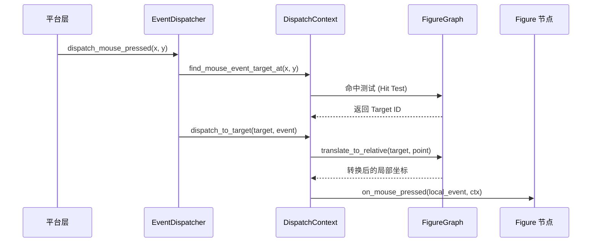
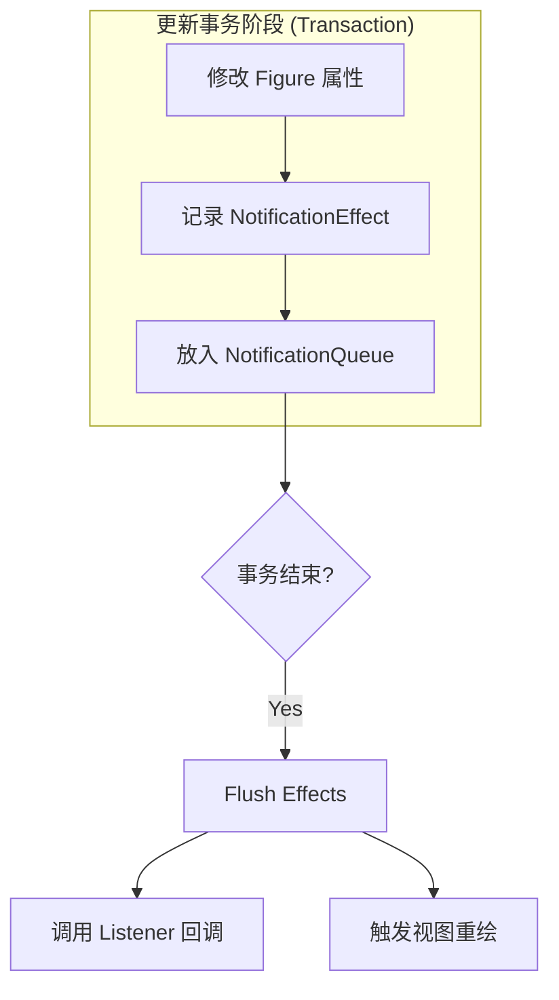
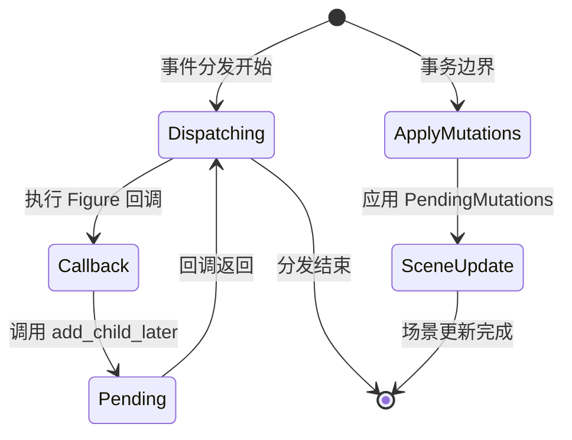
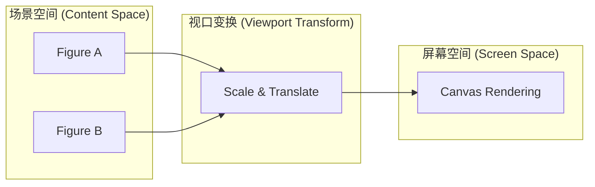

# 响应式设计与事件系统

## 目录
1. [模块概览](#模块概览)
2. [引言：交互驱动的场景更新](#引言交互驱动的场景更新)
3. [事件分发模型：从平台输入到 Figure 回调](#事件分发模型从平台输入到-figure-回调)
   - [事件类型与生命周期](#事件类型与生命周期)
   - [坐标转换与命中测试](#坐标转换与命中测试)
4. [响应式设计：借鉴 Zed 的通知机制](#响应式设计借鉴-zed-的通知机制)
   - [状态失效与语义事件的分离](#状态失效与语义事件的分离)
   - [Effect Queue：副作用的延迟结算](#effect-queue副作用的延迟结算)
   - [与传统观察者模式的对比](#与传统观察者模式对比)
5. [交互上下文：SceneContext 与状态管理](#交互上下文scenecontext-与状态管理)
   - [NovadrawContext：Figure 的外部接口](#novadrawcontextfigure-的外部接口)
   - [结构变更的延迟应用](#结构变更的延迟应用)
6. [视口与变换：Viewport 的缩放与平移](#视口与变换viewport-的缩放与平移)
   - [Viewport 坐标域变换](#viewport-坐标域变换)
   - [平移与缩放算法](#平移与缩放算法)
7. [核心组件参考](#核心组件参考)
8. [关键源文件](#关键源文件)

## 模块概览

本章节涵盖了 Novadraw 引擎中负责用户交互、响应式更新和视口管理的核心模块。通过对 `novadraw-scene` 下多个子模块的探索，我们确定了以下范围：

- **总文件数**：约 8 个核心源文件。
- **涵盖子模块**：
  - `event`：定义事件模型与分发逻辑。
  - `context`：提供 Figure 交互所需的上下文环境。
  - `viewport`：处理视口变换、缩放与平移。
  - `update`：包含响应式通知队列与监听器机制。
- **重点覆盖**：事件路由、响应式通知分层、坐标域转换协议。

## 引言：交互驱动的场景更新

在图形引擎中，用户交互（如鼠标点击、拖拽）是驱动场景状态变化的主要诱因。Novadraw 的设计目标是建立一套既能高效响应用户输入，又能保证场景状态一致性的机制。

传统的图形框架往往在事件回调中直接修改场景树。然而，这种做法在 Rust 的所有权模型下会面临巨大的挑战：回调函数往往持有对场景的借用，而修改操作又需要可变借用，这极易导致重入冲突或借用检查失败。为了解决这一问题，Novadraw 引入了**响应式设计**与**延迟更新**的思想，借鉴了 Zed 编辑器的通知机制，将“状态修改”与“副作用传播”解耦。

本章将详细探讨事件是如何从底层平台输入流转到具体的 Figure 节点，以及 Figure 如何通过受控的上下文（Context）请求变更，并最终通过响应式系统触发视图刷新。

## 事件分发模型：从平台输入到 Figure 回调

Novadraw 的事件系统负责将原始的平台输入（如屏幕坐标上的鼠标点击）转换为具有语义的 Figure 事件（如某个矩形被按下）。

### 事件类型与生命周期

引擎目前主要支持鼠标事件。`MouseEvent` 结构体封装了事件的类型（按下、释放、移动、进入、离开）、坐标以及按键状态。

```rust
#[derive(Debug, Clone, Copy, PartialEq)]
pub struct MouseEvent {
    pub kind: MouseEventKind,
    pub x: f64,
    pub y: f64,
    pub button: MouseButton,
    entry_point: Point,
}
```

每个事件都保留了一个 `entry_point`，代表事件进入引擎时的原始坐标。这对于手势分析或调试非常有用，因为它可以追溯事件的源头，而不受后续坐标变换的影响。

### 坐标转换与命中测试

事件分发的核心挑战在于坐标域的转换。用户点击的是屏幕坐标，而 Figure 的逻辑通常基于其自身的局部坐标。

下图展示了事件从产生到被 Figure 接收的流转过程：



在上述流程中，`EventDispatcher` 负责编排分发策略。它首先通过 `DispatchContext` 进行命中测试，找到最上层的目标节点。在调用 Figure 的回调之前，`SceneDispatchContext` 会利用 `FigureGraph` 的坐标转换能力，将事件点从全局坐标转换为该 Figure 的局部坐标。这种设计确保了 Figure 的开发者只需关心自己的坐标域，极大地简化了业务逻辑。

此外，`BasicEventDispatcher` 还处理了复杂的“进入/离开”（Entered/Exited）逻辑。当鼠标从一个 Figure 移动到另一个 Figure 时，它会对比前后的 Target，自动生成 `Exited` 事件发送给旧目标，并发送 `Entered` 事件给新目标。

**Section sources**:
- [novadraw-scene/src/event/mod.rs](novadraw-scene/src/event/mod.rs)
- [novadraw-scene/src/context/mod.rs](novadraw-scene/src/context/mod.rs)

## 响应式设计：借鉴 Zed 的通知机制

Novadraw 的响应式更新机制深受 Zed 编辑器的启发。它并没有采用传统的观察者模式（即一旦状态改变就立即同步调用所有监听者），而是采用了一种基于“通知（Notify）”和“事件（Emit）”的异步分发模型。

### 状态失效与语义事件的分离

在 `novadraw-scene/src/update/listener.rs` 中，通知被明确划分为三个层次：

1.  **Notify**：无负载的状态失效通知。它仅表达“这个对象变了”，不解释原因。这通常用于触发视图的重新渲染或派生状态的更新。
2.  **EmitFigure**：具有明确类型的领域事件（如 `FigureMoved`）。它携带了旧边界和新边界等业务信息，用于业务层面的协作。
3.  **EmitUpdate**：引擎生命周期事件（如 `Validating`、`Painting`），用于监控引擎的内部状态。

### Effect Queue：副作用的延迟结算

为了避免重入问题，所有的通知都不会立即执行。相反，它们被推入一个 `NotificationQueue`（Effect Queue）。



这种“先记录，后结算”的模式确保了在整个更新周期内，场景状态是稳定的。监听者在收到通知时，场景已经完成了所有的状态变更，从而避免了“在回调中读取到中间态数据”的风险。

### 与传统观察者模式的对比

| 特性 | 传统观察者模式 | Novadraw (Zed 风格) |
| :--- | :--- | :--- |
| **执行时机** | 同步、立即执行 | 延迟、在事务边界统一执行 |
| **重入风险** | 极高，容易导致死锁或借用冲突 | 低，通过 Effect Queue 规避 |
| **语义区分** | 通常混杂在一起 | 严格区分 Notify (失效) 与 Emit (语义) |
| **生命周期** | 需要手动解绑，易内存泄漏 | 结合 Rust Drop 协议，支持自动清理 |

通过这种设计，Novadraw 解决了图形引擎中常见的“更新风暴”问题——即一个属性的变化触发多个监听者，监听者又反过来修改其他属性，最终导致无限循环或性能剧降。

**Section sources**:
- [novadraw-scene/src/update/listener.rs](novadraw-scene/src/update/listener.rs)
- [doc/01-architecture/zed_reactive_design.md](doc/01-architecture/zed_reactive_design.md)

## 交互上下文：SceneContext 与状态管理

当 Figure 的事件回调被触发时，它需要一种方式来反向操作引擎（例如：请求重绘、修改层级结构）。这就是 `NovadrawContext` 的作用。

### NovadrawContext：Figure 的外部接口

`NovadrawContext` 是一个 Trait，定义了 Figure 可以调用的受控 API。它隔离了 Figure 与引擎核心数据结构（如 `FigureGraph`、`UpdateManager`）的直接接触。

```rust
pub trait NovadrawContext {
    fn target_id(&self) -> BlockId;
    fn repaint(&mut self, rect: Option<Rectangle>);
    fn invalidate(&mut self);
    fn set_selected(&mut self, block_id: Option<BlockId>);
    // ... 结构变更方法
}
```

通过 `SceneNovadrawContext` 的实现，我们可以看到它实际上是在向 `UpdateManager` 注册脏区域，或者向 `PendingMutations` 提交变更请求。

### 结构变更的延迟应用

最为关键的是结构变更（如 `add_child_later`）。在 Rust 中，你不能在遍历树的过程中修改树的结构。因此，Novadraw 将所有的结构变更请求放入 `PendingMutations` 队列中。



这种分阶段执行的策略保证了内存安全性，同时也使得引擎能够对多个并发的变更请求进行合并或优化处理。

**Section sources**:
- [novadraw-scene/src/context/mod.rs](novadraw-scene/src/context/mod.rs)
- [novadraw-scene/src/mutation/mod.rs](novadraw-scene/src/mutation/mod.rs)

## 视口与变换：Viewport 的缩放与平移

`Viewport` 模块负责管理用户看到的“窗口”与实际场景“内容”之间的映射关系。它类似于一个摄像机，决定了场景的哪一部分被渲染到屏幕上。

### Viewport 坐标域变换

`Viewport` 维护了两个核心参数：`origin`（原点）和 `zoom`（缩放比例）。它提供了双向的坐标转换函数：

- **viewport_to_content**：将屏幕/视口坐标转换为场景内容坐标。常用于将鼠标点击位置映射到场景中。
- **content_to_viewport**：将场景坐标转换为屏幕坐标。常用于渲染阶段确定物体在屏幕上的位置。

其变换逻辑遵循公式：`viewport = (content - origin) * zoom`。

### 平移与缩放算法

平移（Pan）和以特定点为中心的缩放（Zoom at center）是视口交互中最常见的操作。

```rust
pub fn zoom_at(&mut self, factor: f64, center: DVec2) {
    let content_center_before = self.viewport_to_content(center);
    self.zoom *= factor;
    let content_center_after = self.viewport_to_content(center);
    let offset = content_center_before - content_center_after;
    self.origin += offset;
}
```

在 `zoom_at` 的实现中，为了保证缩放中心点在屏幕上的位置不变，算法首先计算缩放前后中心点在内容空间中的位移，并将其补偿到 `origin` 上。这种处理方式提供了极其平滑的交互体验，符合现代图形软件的操作直觉。

下图展示了 Viewport 在整个渲染管线中的位置：



**Section sources**:
- [novadraw-scene/src/viewport.rs](novadraw-scene/src/viewport.rs)

## 核心组件参考

| 组件名称 | 职责描述 | 关键方法 |
| :--- | :--- | :--- |
| `BasicEventDispatcher` | 编排鼠标事件的分发，处理 Entered/Exited 状态切换。 | `dispatch_mouse_pressed`, `refresh_mouse_target` |
| `SceneDispatchContext` | 桥接事件系统与场景图，负责命中测试与坐标转换。 | `find_mouse_event_target_at`, `dispatch_to_target` |
| `SceneNovadrawContext` | 为 Figure 提供受控的交互接口，记录重绘请求与结构变更。 | `repaint`, `invalidate`, `add_child_later` |
| `NotificationQueue` | 响应式通知的缓冲区，实现副作用的延迟结算。 | `notify`, `emit_figure`, `drain` |
| `Viewport` | 管理视口状态，提供内容坐标与视口坐标的互转。 | `zoom_at`, `pan`, `viewport_to_content` |

## 关键源文件

以下是本章节涉及的核心源代码文件，建议在深入研究实现细节时参考：

- `novadraw-scene/src/event/mod.rs`：事件定义与基础分发逻辑。
- `novadraw-scene/src/context/mod.rs`：交互上下文与分发上下文的实现。
- `novadraw-scene/src/update/listener.rs`：响应式通知模型与监听器接口。
- `novadraw-scene/src/viewport.rs`：视口变换与交互算法。
- `doc/01-architecture/zed_reactive_design.md`：响应式设计的架构设计文档。
