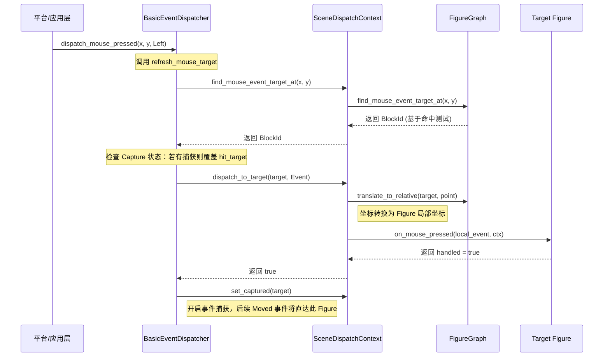
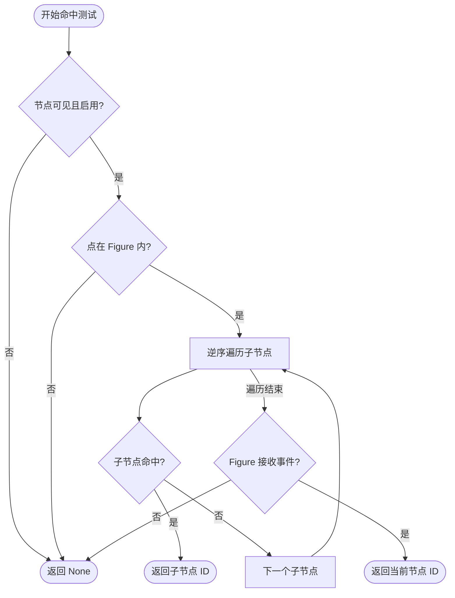
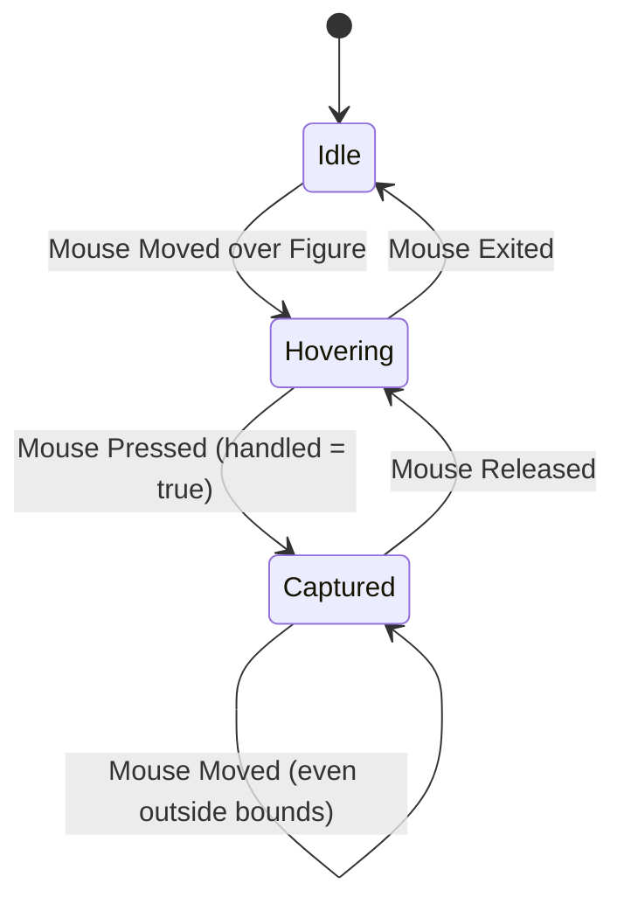

# 事件分发系统

## 目录
1. [模块概览](#模块概览)
2. [简介](#简介)
3. [核心组件](#核心组件)
   - [事件模型 (MouseEvent)](#事件模型-mouseevent)
   - [分发协议与上下文 (Traits)](#分发协议与上下文-traits)
4. [事件生命周期](#事件生命周期)
5. [目标解析与命中测试 (Hit Testing)](#目标解析与命中测试-hit-testing)
6. [坐标转换机制](#坐标转换机制)
   - [入口点与目标点](#入口点与目标点)
   - [自动转换流程](#自动转换流程)
7. [交互状态管理](#交互状态管理)
   - [悬停状态 (Hover) 的切换逻辑](#悬停状态-hover-的切换逻辑)
   - [事件捕获 (Capture) 与拖拽连续性](#事件捕获-capture-与拖拽连续性)
   - [焦点管理 (Focus)](#焦点管理-focus)
8. [设计考量与性能优化](#设计考量与性能优化)
9. [自定义事件分发器示例](#自定义事件分发器示例)
10. [代码参考](#代码参考)

## 模块概览

Novadraw 的事件分发系统主要由 `novadraw-scene` 项目中的 `event` 模块负责。该模块通过一套抽象的分发协议，将底层的平台输入（如 winit 或浏览器产生的原始鼠标坐标、按键状态）转化为场景图中 `Figure` 级别的语义事件。

- **总文件数**：核心实现集中在 `novadraw-scene/src/event/mod.rs`（约 200 行），但其运行深度依赖于 `context` 模块的上下文实现和 `scene` 模块的图形树检索功能。
- **覆盖范围**：
  - `event/mod.rs`：定义了 `MouseEvent`、`EventDispatcher` 接口以及标准实现 `BasicEventDispatcher`。
  - `context/mod.rs`：提供了 `SceneDispatchContext`，这是连接分发器与场景图的桥梁，负责具体的坐标转换与 Figure 回调触发。
  - `scene/mod.rs`：提供了 `FigureGraph` 的命中测试（Hit Testing）核心算法。

本章节将深入探讨事件从产生到被 Figure 消费的完整生命周期，揭示 Novadraw 如何处理复杂的交互逻辑。

## 简介

在高性能图形引擎中，事件分发系统不仅是简单的消息传递，更是交互逻辑的“指挥官”。Novadraw 的设计借鉴了 Eclipse Draw2D 的经典模式，旨在解决以下核心痛点：

1. **平台无关性**：无论输入源是桌面端的 winit 还是 Web 端的 Canvas 事件，引擎层都使用统一的 `MouseEvent` 模型。
2. **场景树感知**：在成千上万个嵌套 Figure 中，如何快速且准确地定位用户点击的目标。
3. **坐标域自动同步**：Figure 开发者不应关心全局坐标。引擎必须确保投递给 Figure 的坐标已经过平移变换，使其相对于 Figure 的局部原点。
4. **交互状态的一致性**：自动处理进入（Entered）、离开（Exited）以及按下后的捕获（Capture）状态，确保 UI 反馈（如 Hover 高亮）的连贯性。

## 核心组件

### 事件模型 (MouseEvent)

`MouseEvent` 是交互信息的载体。与简单的坐标点不同，它采用了“双坐标”设计：

```rust
#[derive(Debug, Clone, Copy, PartialEq)]
pub struct MouseEvent {
    pub kind: MouseEventKind,
    /// 鼠标点在当前 target/source Figure 坐标域中的 x 值。
    pub x: f64,
    /// 鼠标点在当前 target/source Figure 坐标域中的 y 值。
    pub y: f64,
    pub button: MouseButton,
    entry_point: Point, // 原始输入点（只读）
}
```

- **`x/y`**：这是 Figure 回调中最常用的字段。引擎在分发过程中会不断更新这两个值，使其始终对齐当前 Target Figure 的局部坐标系。
- **`entry_point`**：保留了事件进入引擎时的初始坐标。这对于实现全局手势（如跨组件的连线拖拽）或录制回放功能至关重要，因为它提供了一个稳定的参考基准。

### 分发协议与上下文 (Traits)

系统的灵活性源于对职责的清晰划分：

1. **`EventDispatcher` (协议定义者)**：
   它是一个 `Send + Sync` 的 Trait，定义了 `receive`（仅更新目标）和 `dispatch_mouse_xxx`（分发具体动作）的方法。它负责决定“什么时候该刷新目标”以及“什么时候该分发事件”。

2. **`DispatchContext` (环境提供者)**：
   分发器本身不持有场景图引用，而是通过 `DispatchContext` 访问场景。上下文提供了命中测试（Hit Testing）、状态读写（Hover/Capture）以及最终的 `dispatch_to_target` 操作。

这种设计允许开发者在不修改场景图核心逻辑的情况下，通过替换 `EventDispatcher` 来实现不同的交互策略（例如增加事件拦截或多点触控支持）。

**Section sources**:
- [novadraw-scene/src/event/mod.rs](novadraw-scene/src/event/mod.rs)

## 事件生命周期

当用户在屏幕上点击时，一个 `MouseEventKind::Pressed` 事件便开启了它的旅程。



**生命周期详解**：
1. **输入阶段**：应用层捕获平台原始事件，调用 `EventDispatcher`。
2. **目标确定阶段**：`BasicEventDispatcher` 首先调用 `refresh_mouse_target`。这一步非常关键，它会对比上一次的 `mouse_target`，如果发生变化，会先触发旧目标的 `Exited` 事件和新目标的 `Entered` 事件。
3. **分发阶段**：如果当前存在 `captured` 节点（通常是正在拖拽的节点），则忽略命中测试结果，强制投递给捕获节点。
4. **转换与回调**：`SceneDispatchContext` 执行坐标平移，然后调用 Figure 对应的 Trait 方法（如 `on_mouse_pressed`）。
5. **后续处理**：如果 Figure 返回 `true` 表示处理了按下事件，分发器会自动为其设置 `Capture` 状态。

**Diagram sources**:
- [novadraw-scene/src/event/mod.rs:L168-L185](novadraw-scene/src/event/mod.rs#L168-L185)
- [novadraw-scene/src/context/mod.rs:L161-L203](novadraw-scene/src/context/mod.rs#L161-L203)

## 目标解析与命中测试 (Hit Testing)

命中测试决定了“谁是当前鼠标下的 Figure”。`FigureGraph` 采用了一种**逆序深度优先搜索 (Reverse DFS)** 算法。



**算法深度解析**：
- **视觉一致性**：子节点在 `children` 向量中是按添加顺序排列的，通常后添加的节点会覆盖在先添加的节点之上。因此，命中测试必须**逆序遍历**，以确保最上层的 Figure 优先获得交互机会。
- **递归坐标平移**：在递归进入子节点之前，算法会调用 `translate_from_parent`。这意味着子节点只需要根据自己的 `bounds` 进行简单的点包含判定，无需关心复杂的嵌套层级。
- **语义过滤**：并非所有在鼠标下的 Figure 都能接收事件。如果一个 Figure 的 `wants_mouse_events()` 返回 `false`（例如一个仅用于装饰的背景图层），它将被跳过，事件会继续向下探测或交给父节点。

**Diagram sources**:
- [novadraw-scene/src/scene/mod.rs:L1402-L1426](novadraw-scene/src/scene/mod.rs#L1402-L1426)

## 坐标转换机制

坐标转换是 Novadraw 保证 Figure 开发体验的核心技术。

### 入口点与目标点

当一个事件在场景中传递时，它携带的坐标信息经历了从“全局”到“局部”的蜕变：
- **Entry Point**：原始输入，如 `(100, 100)`。
- **Target Point**：如果目标 Figure 位于 `(50, 50)`，则投递给它的坐标将变为 `(50, 50)`。

### 自动转换流程

在 `SceneDispatchContext::dispatch_to_target` 中，引擎执行以下逻辑：
1. 获取目标 Figure 所在的 Block。
2. 调用 `scene.translate_to_relative(target_id, &mut point)`。该方法会递归向上查找坐标根（Coordinate Root），计算出累积的平移量。
3. 使用 `with_target_point` 创建一个新的事件实例发送给回调。

这种机制彻底消除了 Figure 开发者手动计算偏移量的痛苦，使得 Figure 的代码更加纯粹和易于测试。

## 交互状态管理

### 悬停状态 (Hover) 的切换逻辑

`BasicEventDispatcher` 的 `refresh_mouse_target` 方法是状态管理的核心。

```rust
fn refresh_mouse_target(&mut self, ctx: &mut dyn DispatchContext, x: f64, y: f64) {
    let hit_target = ctx.find_mouse_event_target_at(x, y);
    let captured = ctx.captured();
    let next_target = captured.or(hit_target);
    let previous_target = ctx.mouse_target();

    if previous_target == next_target { return; }

    // 1. 处理离开旧目标
    if let Some(prev) = previous_target {
        ctx.set_hovered(prev, false);
        ctx.dispatch_to_target(Some(prev), &exited_event);
    }

    // 2. 更新状态并处理进入新目标
    ctx.set_mouse_target(next_target);
    if let Some(next) = next_target {
        ctx.set_hovered(next, true);
        ctx.dispatch_to_target(Some(next), &entered_event);
    }
}
```

这段逻辑确保了 `is_hovered` 标志位始终准确，并且 `Entered`/`Exited` 事件总是成对出现。

### 事件捕获 (Capture) 与拖拽连续性

Capture 机制是实现平滑拖拽的关键。



在 `Captured` 状态下，所有的鼠标移动都会直接发送给捕获它的 Figure。这解释了为什么在 Novadraw 中，当你拖拽一个方块时，即使鼠标移速过快超出了方块边界，方块依然能跟随鼠标移动，直到你松开按键。

### 焦点管理 (Focus)

虽然当前实现以鼠标事件为主，但 `DispatchContext` 已经预留了 `focus_owner` 的管理接口。当点击一个 Figure 时，分发器可以调用 `set_focus_owner`，从而让该 Figure 开始接收后续的键盘事件（KeyEvents）。

**Section sources**:
- [novadraw-scene/src/event/mod.rs:L109-L208](novadraw-scene/src/event/mod.rs#L109-L208)

## 设计考量与性能优化

1. **惰性刷新**：`refresh_mouse_target` 仅在坐标发生变化或事件触发时调用，避免了每帧无效的命中测试计算。
2. **空间局部性**：命中测试优先检查 `contains_point`。对于复杂的几何图形，可以先进行快速的 AABB（轴对齐包围盒）检查，再进行精确的形状判定。
3. **不可变性**：`MouseEvent` 在分发过程中通过 `clone` 或 `copy` 传递，避免了复杂的借用检查问题，同时也方便了异步处理或录制。

## 自定义事件分发器示例

如果默认的 `BasicEventDispatcher` 无法满足需求（例如需要实现多选框的拖拽选择），开发者可以自定义分发器：

```rust
pub struct MultiSelectDispatcher {
    selection_box_start: Option<Point>,
}

impl EventDispatcher for MultiSelectDispatcher {
    fn dispatch_mouse_pressed(&mut self, ctx: &mut dyn DispatchContext, x: f64, y: f64, button: MouseButton) {
        let hit = ctx.find_mouse_event_target_at(x, y);
        if hit.is_none() {
            // 点击空白处，记录起始点开启框选
            self.selection_box_start = Some(Point::new(x, y));
        } else {
            // 正常分发给 Basic 逻辑
            BasicEventDispatcher.dispatch_mouse_pressed(ctx, x, y, button);
        }
    }
    
    // ... 实现其他方法来绘制选框并计算包含的 Figure
}
```

## 代码参考

- [novadraw-scene/src/event/mod.rs](novadraw-scene/src/event/mod.rs): 事件分发核心协议与 `BasicEventDispatcher` 实现。
- [novadraw-scene/src/context/mod.rs](novadraw-scene/src/context/mod.rs): `SceneDispatchContext` 实现，处理坐标转换。
- [novadraw-scene/src/scene/mod.rs](novadraw-scene/src/scene/mod.rs): `FigureGraph` 中的命中测试与树遍历逻辑。
- [novadraw-scene/src/lib.rs](novadraw-scene/src/lib.rs): 导出相关的公共类型。
