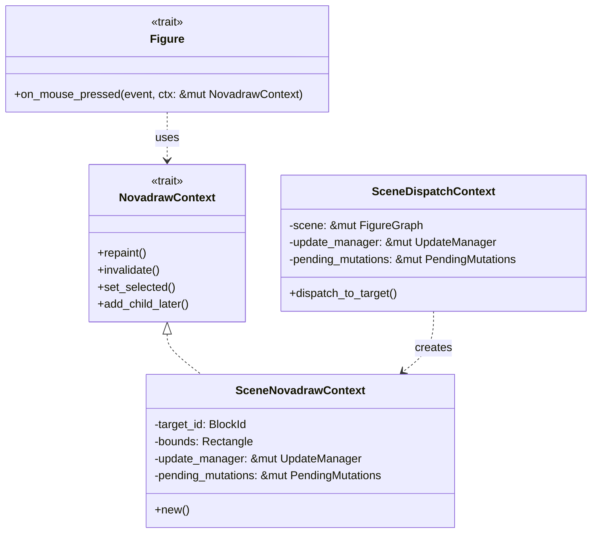
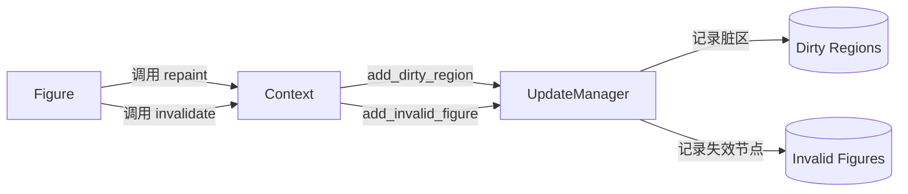
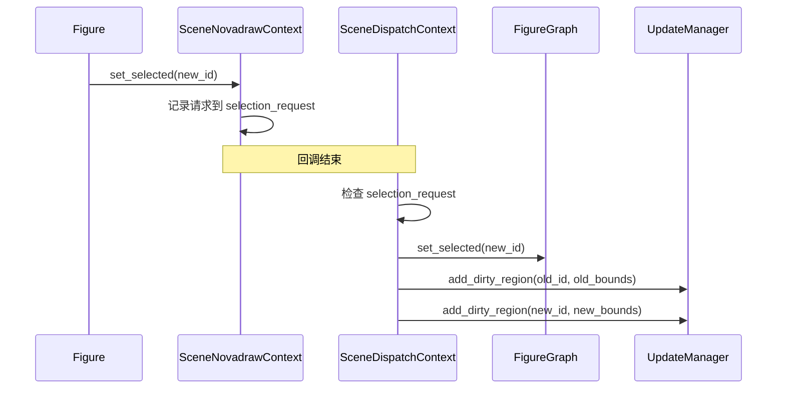
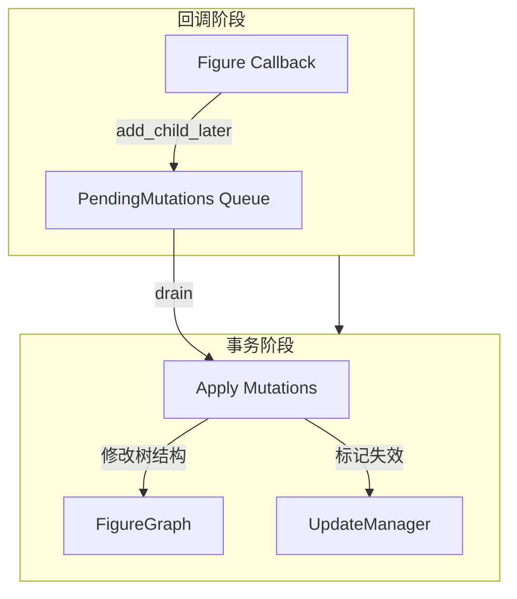
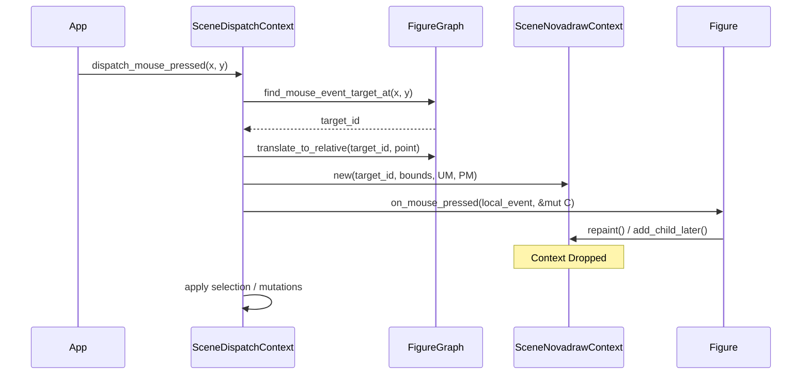

# 交互上下文与状态管理

## 目录
1. [模块概览](#模块概览)
2. [核心组件](#核心组件)
3. [受控写操作](#受控写操作)
4. [选择管理](#选择管理)
5. [延迟结构变更](#延迟结构变更)
6. [上下文隔离与分发流程](#上下文隔离与分发流程)
7. [代码示例](#代码示例)
8. [文件引用](#文件引用)

## 模块概览

在 Novadraw 引擎中，`Figure`（图形对象）是交互的核心主体。然而，为了保证场景图（Scene Graph）的一致性和渲染流程的稳定性，`Figure` 并不被允许直接修改场景图的结构或直接操作底层的渲染管理器。相反，所有的交互请求都必须通过一个受控的接口——`NovadrawContext` 来完成。

本模块主要负责定义和实现这一受控接口，并协调事件分发、状态更新与结构变更之间的时序关系。通过引入“两阶段变更”模式（回调阶段记录意图 -> 事务阶段应用变更），Novadraw 确保了在复杂的交互过程中，系统状态始终处于可预测的受控状态。

**模块规模评估**：
- **总文件数**：约 34 个源文件。
- **核心子模块**：
  - `context/`：定义 `NovadrawContext` 及其运行时实现 `SceneNovadrawContext`。
  - `update/`：管理脏区域和布局失效的 `UpdateManager`。
  - `mutation/`：处理延迟结构变更的 `PendingMutations`。
  - `scene/`：场景图的核心实现，负责应用变更。

本页面将深入探讨 `NovadrawContext` 的设计哲学、内部实现以及它如何与 `UpdateManager` 和 `PendingMutations` 协同工作。

## 核心组件

交互上下文系统的核心由三个关键部分组成：一个 Trait 和两个具体的结构体。它们共同定义了 Figure 与引擎之间的通信边界。

### NovadrawContext (Trait)

`NovadrawContext` 是 Figure 在其事件回调（如 `on_mouse_pressed`）中唯一能接触到的外部对象。它定义了一组受限的操作集合，防止 Figure 越权访问场景图的全局状态。

```rust
pub trait NovadrawContext {
    fn target_id(&self) -> BlockId;
    fn repaint(&mut self, rect: Option<Rectangle>);
    fn invalidate(&mut self);
    fn set_selected(&mut self, block_id: Option<BlockId>);
    fn add_child_later(&mut self, parent: BlockId, figure: Box<dyn Figure>);
    fn remove_child_later(&mut self, parent: BlockId, child: BlockId);
    fn reparent_later(&mut self, child: BlockId, new_parent: BlockId);
}
```

### SceneNovadrawContext (运行时实现)

`SceneNovadrawContext` 是 `NovadrawContext` 的具体实现。它是一个轻量级的、生命周期短暂的结构体，仅在事件分发的瞬间存在。它封装了当前操作目标的 `BlockId`、边界信息以及对全局管理器的可变引用。

### SceneDispatchContext (分发上下文)

`SceneDispatchContext` 负责协调整个事件分发过程。它持有场景图、更新管理器和延迟变更队列，并在分发过程中根据需要创建 `SceneNovadrawContext`。

下图展示了这些组件之间的持有与交互关系：



该架构确保了 Figure 只能看到它被允许看到的部分。例如，Figure 无法通过 `NovadrawContext` 访问其兄弟节点或父节点，除非它已知晓其 `BlockId`。

**Section sources**:
- [novadraw-scene/src/context/mod.rs](novadraw-scene/src/context/mod.rs)

## 受控写操作

Figure 对场景的修改主要分为两类：视觉更新（重绘）和布局更新（失效）。

### 重绘请求 (Repaint)

当 Figure 的内部状态发生变化（例如颜色改变）但几何尺寸未变时，它需要请求重绘。`repaint` 方法允许 Figure 指定一个脏区域。

```rust
fn repaint(&mut self, rect: Option<Rectangle>) {
    self.update_manager
        .add_dirty_region(self.target_id, rect.unwrap_or(self.bounds));
}
```

如果未指定 `rect`，则默认重绘整个 Figure 的边界。该请求被提交给 `UpdateManager`，后者会在事务阶段合并所有脏区域并触发渲染。

### 布局失效 (Invalidate)

当 Figure 的尺寸或布局参数发生变化时，它需要标记自己为“失效”。这会触发重新布局流程。

```rust
fn invalidate(&mut self) {
    self.update_manager.add_invalid_figure(self.target_id);
}
```

`invalidate` 操作不会立即重新计算布局，而是将 `BlockId` 加入 `UpdateManager` 的失效队列中。

下图展示了写操作的流向：



这种机制通过将写操作“异步化”到事务阶段，避免了在同一个回调中多次修改导致的重复计算和渲染。

**Section sources**:
- [novadraw-scene/src/context/mod.rs:L68-L75](novadraw-scene/src/context/mod.rs#L68-L75)
- [novadraw-scene/src/update/mod.rs](novadraw-scene/src/update/mod.rs)

## 选择管理

选择状态（Selection）是场景中一种特殊的全局状态。虽然 `FigureGraph` 持有当前选中的节点，但 Figure 可以通过 `NovadrawContext` 请求更改选择。

### set_selected 机制

`SceneNovadrawContext` 并不直接修改 `FigureGraph` 的选择状态，而是通过一个 `selection_request` 指针记录下 Figure 的意图。

```rust
fn set_selected(&mut self, block_id: Option<BlockId>) {
    *self.selection_request = Some(block_id);
}
```

### 事务性应用

真正的选择切换发生在 `SceneDispatchContext::dispatch_to_target` 返回之后。引擎会对比新旧选择，并自动为受影响的节点申请重绘：

1.  **获取旧选择**：记录当前选中的节点及其边界。
2.  **应用新选择**：更新 `FigureGraph` 中的选中状态。
3.  **触发重绘**：将旧选中节点和新选中节点的区域都加入 `UpdateManager` 的脏区域中。

这种处理方式确保了选择状态的切换总是伴随着正确的视觉反馈，且 Figure 无需手动管理选择高亮的重绘逻辑。



**Section sources**:
- [novadraw-scene/src/context/mod.rs:L205-L218](novadraw-scene/src/context/mod.rs#L205-L218)

## 延迟结构变更

在 Novadraw 中，最严格的限制之一是：**禁止在事件回调中直接修改场景图结构**。这是为了防止在遍历树结构（如事件分发或 hit-test）时修改树，导致迭代器失效或逻辑混乱。

### 为什么需要延迟？

如果在 `on_mouse_pressed` 回调中直接调用 `add_child`，可能会导致以下问题：
- 正在进行的事件冒泡/捕获路径被破坏。
- 正在遍历的子节点列表发生改变，导致部分节点被跳过或重复处理。
- 破坏了 Rust 的借用检查规则（通常事件分发持有场景的只读或受限可变引用）。

### PendingMutations 队列

为了解决这个问题，Novadraw 引入了 `PendingMutations`。Figure 可以调用 `add_child_later` 等方法，这些方法会将变更意图封装成 `PendingMutation` 对象并存入队列。

```rust
pub(crate) enum PendingMutationKind {
    AddChildFigure { parent: BlockId, figure: Box<dyn Figure> },
    RemoveChild { parent: BlockId, child: BlockId },
    Reparent { child: BlockId, new_parent: BlockId },
}
```

### 两阶段变更流程

变更的生命周期如下：
1.  **生产阶段**：Figure 在回调中通过 `NovadrawContext` 提交变更请求。
2.  **存储阶段**：请求被保存在 `PendingMutations` 队列中。
3.  **应用阶段**：在顶层事件分发循环结束后，引擎调用 `apply_pending_mutations`。此时，引擎拥有对 `FigureGraph` 的独占可变访问权，可以安全地执行挂树、解挂等操作。



**Section sources**:
- [novadraw-scene/src/mutation/mod.rs](novadraw-scene/src/mutation/mod.rs)
- [novadraw-scene/src/context/mod.rs:L81-L91](novadraw-scene/src/context/mod.rs#L81-L91)

## 上下文隔离与分发流程

`SceneDispatchContext` 是连接外部输入与内部 Figure 回调的桥梁。它不仅负责路由事件，还负责维护上下文的隔离性。

### 坐标域转换

在将事件传递给 Figure 之前，`SceneDispatchContext` 会负责坐标域的转换。它将相对于场景根节点的全局坐标转换为相对于目标 Figure 的局部坐标。

```rust
let mut point = Point::new(mouse_event.x, mouse_event.y);
self.scene.translate_to_relative(target_id, &mut point);
let local_event = mouse_event.with_target_point(point.x(), point.y());
```

这种转换对 Figure 是透明的，Figure 在编写逻辑时只需关心自己的坐标系。

### 上下文的生命周期

每次分发到一个目标节点时，都会创建一个新的 `SceneNovadrawContext` 实例。这个实例在回调结束后立即销毁，确保了状态不会在不同的分发任务之间泄露。



通过这种设计，引擎实现了高度的封装：Figure 只需要实现 `Figure` trait，而无需关心复杂的坐标转换、脏区域合并或结构变更的时序问题。

**Section sources**:
- [novadraw-scene/src/context/mod.rs:L161-L221](novadraw-scene/src/context/mod.rs#L161-L221)

## 代码示例

以下示例展示了一个自定义 Figure 如何在鼠标按下时请求重绘，并延迟添加一个子节点。

```rust
impl Shape for MyInteractiveFigure {
    fn on_mouse_pressed(&self, event: &MouseEvent, ctx: &mut dyn NovadrawContext) -> bool {
        // 1. 请求重绘自身
        ctx.repaint(None);

        // 2. 选中自己
        ctx.select_target();

        // 3. 延迟添加一个子节点（例如：点击处生成一个装饰点）
        let decoration = Box::new(RectangleFigure::new(
            event.x - 5.0, 
            event.y - 5.0, 
            10.0, 
            10.0
        ));
        ctx.add_child_later(ctx.target_id(), decoration);

        true // 表示事件已处理
    }
}
```

在这个例子中：
- `ctx.repaint(None)` 立即将当前节点的边界加入脏区域。
- `ctx.select_target()` 记录了一个选择请求，将在回调结束后处理。
- `ctx.add_child_later(...)` 将新节点的创建请求推入队列，避免了在事件处理中直接修改树。

这种模式鼓励开发者编写“声明式”的交互逻辑：我想要重绘、我想要选中、我想要添加节点，而具体的执行时机由引擎统一调度。

**Section sources**:
- [novadraw-scene/src/context/mod.rs:L290-L297](novadraw-scene/src/context/mod.rs#L290-L297)

## 文件引用

以下是本模块涉及的核心源文件：

- [novadraw-scene/src/context/mod.rs](novadraw-scene/src/context/mod.rs)：定义 `NovadrawContext`、`SceneNovadrawContext` 和 `SceneDispatchContext`。
- [novadraw-scene/src/mutation/mod.rs](novadraw-scene/src/mutation/mod.rs)：定义 `PendingMutation` 及其队列管理。
- [novadraw-scene/src/update/mod.rs](novadraw-scene/src/update/mod.rs)：定义 `UpdateManager` 接口及更新流程。
- [novadraw-scene/src/scene/mod.rs](novadraw-scene/src/scene/mod.rs)：实现 `FigureGraph` 及其对变更的应用。
- [novadraw-scene/src/figure/mod.rs](novadraw-scene/src/figure/mod.rs)：定义 `Figure` trait 及其交互回调接口。
