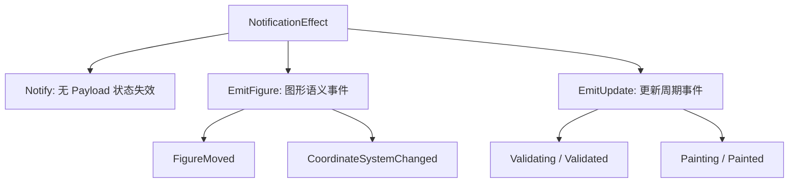
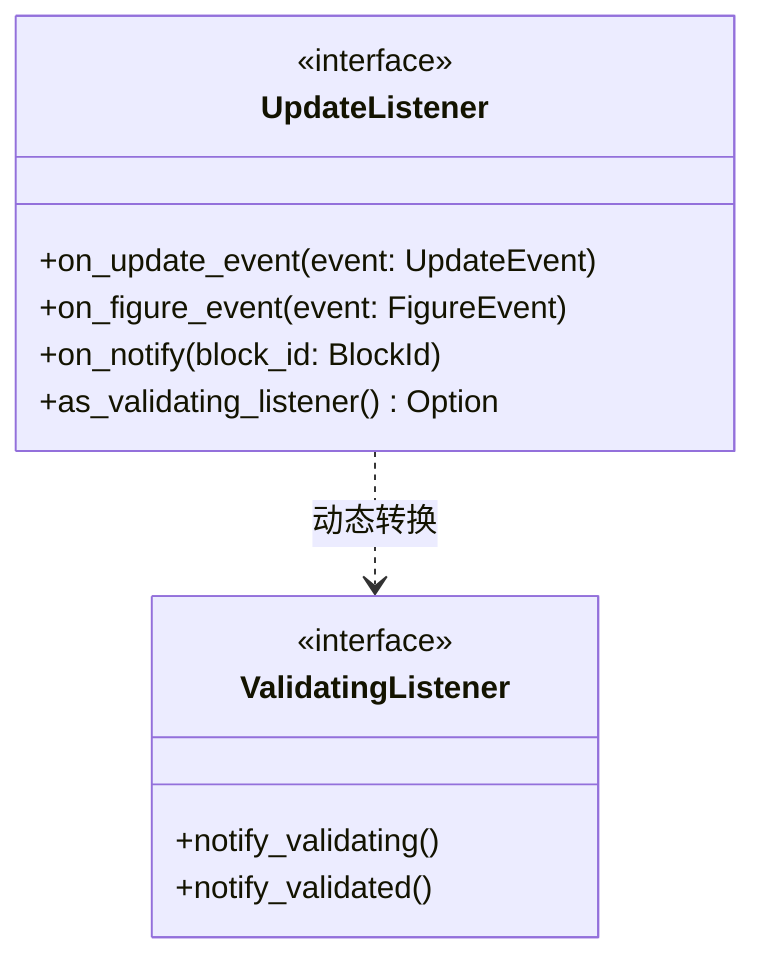
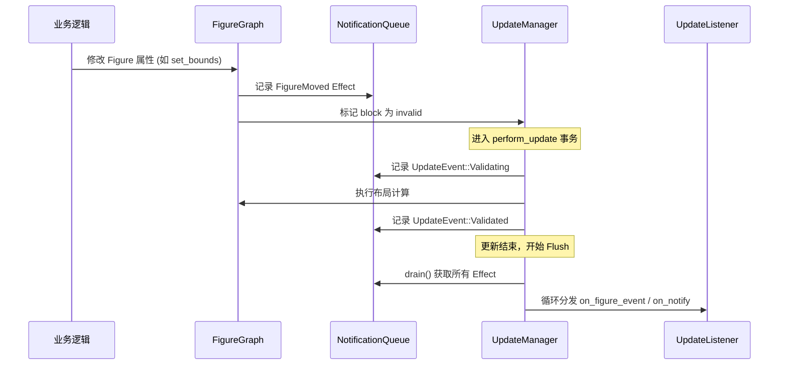
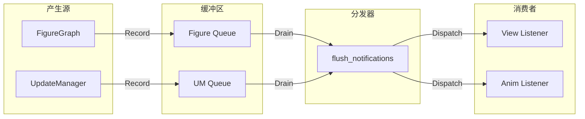
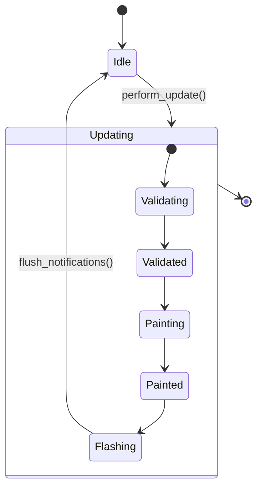

# 响应式通知与 Effect 队列

## 目录
1. [模块概览](#模块概览)
2. [引言](#引言)
3. [核心组件](#核心组件)
   - [NotificationEffect：通知语义分层](#notificationeffect通知语义分层)
   - [NotificationQueue：效应缓冲队列](#notificationqueue效应缓冲队列)
   - [UpdateListener：监听器协议](#updatelistener监听器协议)
4. [架构设计与数据流](#架构设计与数据流)
   - [多协议分层设计](#多协议分层设计)
   - [响应式更新流程](#响应式更新流程)
   - [事件捕获与分发流](#事件捕获与分发流)
5. [事务边界与延迟刷新](#事务边界与延迟刷新)
   - [为什么需要延迟刷新？](#为什么需要延迟刷新)
   - [Flush 机制实现](#flush-机制实现)
   - [更新事务状态机](#更新事务状态机)
6. [关键算法与逻辑](#关键算法与逻辑)
   - [语义事件的触发逻辑](#语义事件的触发逻辑)
   - [验证监听器协议](#验证监听器协议)
7. [与传统模式的对比](#与传统模式的对比)
8. [文件引用](#文件引用)

## 模块概览

本模块实现了 Novadraw 的响应式通知机制，该机制深度借鉴了 Zed 编辑器的设计哲学，旨在解决复杂图形引擎中状态变化通知的重入（Reentrancy）和一致性问题。

- **文件总数**：核心实现分布在 2 个关键文件中，另有 1 份架构设计文档作为理论支撑。
- **子模块分布**：
  - `update/listener.rs`：定义了所有的通知类型、队列结构和监听器接口。
  - `update/deferred.rs`：实现了 `SceneUpdateManager`，负责协调更新事务和通知的最终分发。
  - `doc/01-architecture/zed_reactive_design.md`：详细阐述了借鉴 Zed 设计的初衷与核心原则。
- **覆盖范围**：本章节将深入探讨 `NotificationEffect` 的语义分层、`NotificationQueue` 的缓冲机制以及 `UpdateManager` 如何在事务边界执行 `flush`。

## 引言

在传统的图形引擎设计中，观察者模式（Observer Pattern）通常是同步触发的：当一个对象的状态发生变化时，它会立即遍历并调用所有注册的监听器。然而，在 Rust 这种强调所有权和安全性的语言中，这种“立即回调”模式会引发严重的重入问题——监听器可能会在回调中尝试修改正在被通知的对象，从而导致借用检查器错误或逻辑死锁。

Novadraw 引入了**响应式通知与 Effect 队列**机制，其核心思想是：**状态修改阶段只记录副作用（Effect），在更新事务结束的稳定边界统一执行通知（Flush）**。这种设计不仅解决了重入难题，还通过语义分层区分了“状态失效”和“业务事件”，极大地提升了系统的稳定性。

## 核心组件

### NotificationEffect：通知语义分层

`NotificationEffect` 是通知系统的最小语义单元。它采用了类似 Zed 的分层策略，将通知分为三种类型：

1.  **Notify**：无 payload 的状态失效通知。用于表达“某个对象变了”，通常触发视图刷新或派生状态的重新计算。
2.  **EmitFigure**：携带 `FigureEvent` 的图形语义事件，如 `FigureMoved`（位置变化）或 `CoordinateSystemChanged`（坐标系变化）。
3.  **EmitUpdate**：携带 `UpdateEvent` 的全局更新周期事件，如 `Validating`（验证开始）或 `Painted`（重绘完成）。

下图展示了 `NotificationEffect` 的结构及其包含的具体事件类型。这种分层确保了通知系统既能处理底层的状态失效，也能承载高层的业务语义。



`NotificationEffect` 作为一个统一的枚举，允许我们将各种性质截然不同的变更请求压入同一个 `NotificationQueue` 中。`Notify` 变体仅包含一个 `BlockId`，用于指示哪个节点发生了变化，而不提供具体的变化细节，这迫使观察者主动拉取最新状态，从而保证了数据的一致性。而 `Emit` 变体则提供了丰富的上下文信息，方便业务层进行增量处理。

### NotificationQueue：效应缓冲队列

`NotificationQueue` 是一个简单的 FIFO 队列，用于在更新事务期间暂存 `NotificationEffect`。它并不直接处理通知，而是作为 `FigureGraph` 和 `UpdateManager` 的一个属性，收集所有的变更记录。

```rust
pub struct NotificationQueue {
    effects: Vec<NotificationEffect>,
}

impl NotificationQueue {
    pub fn notify(&mut self, block_id: BlockId) {
        self.effects.push(NotificationEffect::Notify { block_id });
    }
    
    pub fn drain(&mut self) -> Vec<NotificationEffect> {
        self.effects.drain(..).collect()
    }
}
```

### UpdateListener：监听器协议

`UpdateListener` 定义了外部观察者如何接收这些通知。与传统的单一回调不同，它为不同层级的事件提供了专门的接口。

下图展示了监听器协议的类结构及其与特化监听器的关系。



`UpdateListener` 采用了组合而非继承的设计模式。虽然它提供了处理所有通知类型的默认方法，但通过 `as_validating_listener` 钩子，它允许特定的实现者声明自己对布局验证阶段的特殊兴趣。这种设计既保持了接口的通用性，又为高性能的特化处理留下了空间。

**Section sources**:
- [novadraw-scene/src/update/listener.rs](novadraw-scene/src/update/listener.rs)

## 架构设计与数据流

### 多协议分层设计

Novadraw 的响应式机制由四个核心协议组合而成：
1.  **状态持有者**：`FigureBlock` 统一管理状态。
2.  **Notify 协议**：负责“状态失效”的传播，不关心业务语义。
3.  **Emit 协议**：负责“领域事件”的分发，具有明确的类型。
4.  **Effect Flush 协议**：将上述所有副作用延迟到事务结束后统一执行。

### 响应式更新流程

下图展示了从状态变更到监听器接收通知的完整生命周期。理解这一流程对于掌握 Novadraw 的事务性更新至关重要。



该流程确保了在 `User` 修改状态时，`Listener` 不会立即被触发。所有的布局计算和状态一致性维护都在通知发出之前完成，从而保证了监听器在回调中看到的是一个“稳定”的场景。这种“先计算、后通知”的策略是解决图形引擎中复杂依赖关系的关键。

### 事件捕获与分发流

数据流从产生源（Figure 或 UpdateManager）流向最终的消费端（Listener）。



在这个流向图中，`FigureGraph` 产生的事件（如几何位置变动）和 `UpdateManager` 产生的事件（如渲染阶段切换）被分别暂存在各自的队列中。在事务结束时，`flush_notifications` 函数充当了汇聚点的角色，它将所有零散的 Effect 收集起来，并按照统一的顺序分发给所有订阅者。这种集中式分发机制极大地简化了调试过程，因为开发者可以在 `dispatch_effects` 处设置断点，观察系统在每一帧产生的所有变化。

**Diagram sources**:
- [novadraw-scene/src/update/deferred.rs:L234-L258](novadraw-scene/src/update/deferred.rs#L234-L258)
- [novadraw-scene/src/scene/mod.rs:L2054-L2121](novadraw-scene/src/scene/mod.rs#L2054-L2121)

## 事务边界与延迟刷新

### 为什么需要延迟刷新？

在图形引擎中，同步广播通知会导致以下问题：
-   **重入风险**：观察者在回调中再次修改状态，导致无限递归或借用冲突。
-   **状态不一致**：一个实体还没更新完（如父节点移动了但子节点坐标还没重新计算），其他实体就开始读取它的状态。
-   **性能浪费**：频繁的状态微调会导致大量的冗余刷新请求。

通过引入 `NotificationQueue`，Novadraw 实现了“副作用延迟结算”。这相当于为更新操作建立了一个事务边界，只有当事务提交（即 `perform_update` 结束）时，副作用才会被应用。

### Flush 机制实现

`SceneUpdateManager` 负责在 `perform_update` 的最后阶段执行 `flush_notifications`。它会同时排空 `UpdateManager` 自身和 `FigureGraph` 中的 Effect 队列，并按顺序分发给所有监听器。

```rust
pub fn flush_notifications(&mut self, graph: &mut crate::scene::FigureGraph) {
    // 1. 获取 UM 产生的事件（如 Validating, Painted）
    let um_effects = self.notification_effects.drain();
    self.dispatch_effects(&um_effects);

    // 2. 获取 Graph 产生的事件（如 FigureMoved）
    let graph_effects = graph.drain_notification_effects();
    self.dispatch_effects(&graph_effects);
}
```

这种“双队列合并”的设计允许 `FigureGraph` 专注于图形逻辑的事件捕获，而 `UpdateManager` 专注于生命周期事件的捕获，最后在事务终点汇合。

### 更新事务状态机

延迟刷新机制的稳定性建立在严格的事务状态管理之上。下图展示了 `UpdateManager` 在处理更新时的状态转换过程。



在 `Updating` 复合状态下，系统会经历验证和重绘两个主阶段。每个阶段的开始和结束都会产生相应的 `UpdateEvent`。最关键的是 `Flashing` 状态，它发生在所有图形和布局计算完全稳定之后。只有进入了这个状态，系统才会开始清空 Effect 队列并触发监听器。如果监听器在回调中触发了新的更新请求，这些请求会被记录为下一轮事务的输入，而不会干扰当前的 Flush 过程。

**Section sources**:
- [novadraw-scene/src/update/deferred.rs](novadraw-scene/src/update/deferred.rs)

## 关键算法与逻辑

### 语义事件的触发逻辑

在 `FigureGraph` 中，语义事件的触发通常与底层的状态修改函数绑定。例如，在执行 `prim_translate`（原始平移）时，系统会自动判断变化的性质：

-   如果只是普通的 Figure 移动，记录 `FigureMoved`。
-   如果该 Figure 是坐标系统的根节点，则记录 `CoordinateSystemChanged`。

这种区分对于高性能渲染至关重要，因为 `CoordinateSystemChanged` 意味着其下所有子节点的绝对坐标都发生了漂移，而 `FigureMoved` 可能只是局部的几何变化。

### 验证监听器协议

除了通用的 `UpdateListener`，系统还提供了 `ValidatingListener` 特化接口。它专门用于监听布局（Validation）阶段的开始和结束。

```rust
pub trait ValidatingListener: Send + Sync {
    fn notify_validating(&self);
    fn notify_validated(&self);
}
```

通过 `as_validating_listener` 动态转换机制，`UpdateManager` 可以识别并专门通知那些对布局过程感兴趣的监听器，这在实现复杂的动画协调或性能监控时非常有用。

**Section sources**:
- [novadraw-scene/src/update/listener.rs](novadraw-scene/src/update/listener.rs)
- [novadraw-scene/src/scene/mod.rs](novadraw-scene/src/scene/mod.rs)

## 与传统模式的对比

下表对比了 Novadraw 的响应式设计与传统 Java Observer（如 Eclipse Draw2D）的区别：

| 特性 | 传统 Java Observer (Draw2D) | Novadraw 响应式设计 (Zed 风格) |
| :--- | :--- | :--- |
| **触发时机** | 同步立即触发 (`fireXxx`) | 事务边界延迟刷新 (`flush`) |
| **重入处理** | 容易引发 StackOverflow 或不一致 | 通过队列天然规避重入 |
| **语义分层** | 混合了状态变化与业务事件 | 严格区分 `Notify` 与 `Emit` |
| **生命周期** | 需要手动管理解除绑定 | 推荐使用 `Subscription` (计划中) |
| **所有权模型** | 依赖共享可变引用 | 兼容 Rust 的单一所有权和借用规则 |

> 💡 **核心价值**：Novadraw 的设计核心不在于“如何让回调跑起来”，而在于“如何把副作用控制在受控的上下文中执行”。

## 文件引用

以下是本章节涉及的核心源代码文件：

- `novadraw-scene/src/update/listener.rs`：通知模型与监听器 trait 定义。
- `novadraw-scene/src/update/deferred.rs`：更新事务管理与 Flush 逻辑实现。
- `novadraw-scene/src/scene/mod.rs`：`FigureGraph` 中的事件捕获逻辑。
- `doc/01-architecture/zed_reactive_design.md`：响应式设计的理论基础与 Zed 对标分析。
