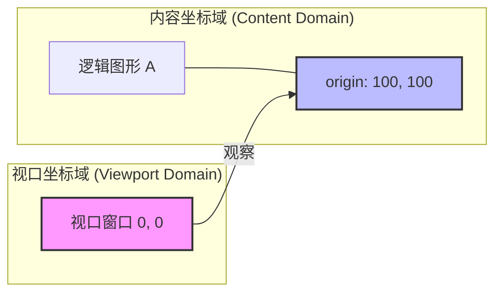
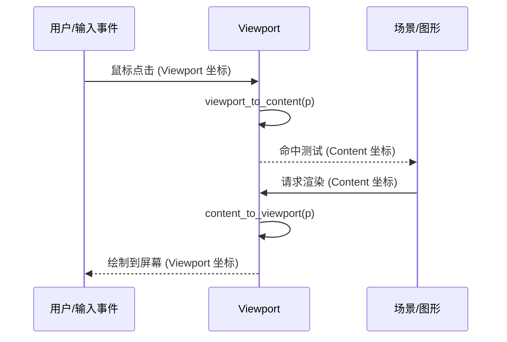
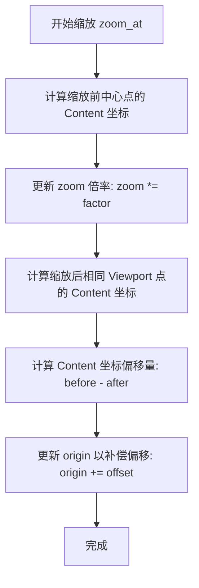
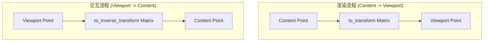
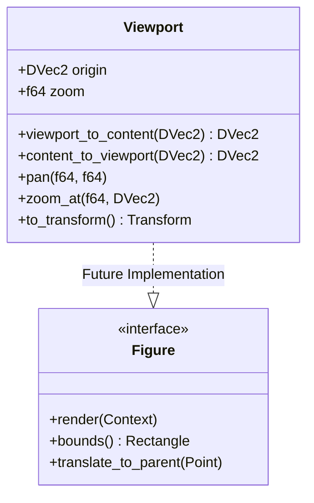

# 视口管理与坐标变换

## 目录
1. [模块概览](#模块概览)
2. [核心概念](#核心概念)
   - [视口状态 (Viewport State)](#视口状态-viewport-state)
   - [坐标域定义与映射关系](#坐标域定义与映射关系)
3. [坐标转换协议](#坐标转换协议)
   - [从视口进入内容 (Viewport to Content)](#从视口进入内容-viewport-to-content)
   - [从内容回到视口 (Content to Viewport)](#从内容回到视口-content-to-viewport)
   - [父链协议集成](#父链协议集成)
4. [交互逻辑实现](#交互逻辑实现)
   - [平移 (Pan) 的矢量补偿](#平移-pan-的矢量补偿)
   - [以点缩放 (Zoom at Point) 的数学推导](#以点缩放-zoom-at-point-of-math-derivation)
   - [自适应缩放 (Zoom to Fit) 的边界计算](#自适应缩放-zoom-to-fit-的边界计算)
5. [矩阵集成与渲染管线](#矩阵集成与渲染管线)
   - [变换矩阵的合成顺序](#变换矩阵的合成顺序)
   - [逆变换与命中测试](#逆变换与命中测试)
6. [性能与精度考量](#性能与精度考量)
7. [未来演进：视口作为 Figure 节点](#未来演进视口作为-figure-节点)
8. [关键源码参考](#关键源码参考)

## 模块概览

在 Novadraw 引擎中，视口管理（Viewport Management）是连接逻辑场景与物理屏幕的关键桥梁。它不仅负责管理画布的可见区域，还定义了内容坐标系（Content Domain）与视口坐标系（Viewport Domain）之间的映射规则。

本模块主要由 `novadraw-scene/src/viewport.rs` 承载，该文件定义了核心的 `Viewport` 结构体及其相关的变换算法。在整个 `novadraw-scene` 项目（共 34 个文件）中，`Viewport` 作为一个独立的基础设施组件存在，为渲染器（Renderer）和事件分发系统（Event Dispatcher）提供一致的坐标转换服务。

下表展示了视口管理模块在项目中的位置及规模：

| 维度 | 统计信息 |
| :--- | :--- |
| **总文件数** | 34 个 (位于 `novadraw-scene/src`) |
| **核心文件** | `viewport.rs` |
| **主要子模块** | `figure/`, `scene/`, `layout/` (与之交互) |
| **覆盖深度** | 标准（涵盖状态管理、坐标转换、交互数学原理） |

`Viewport` 的设计目标是解耦“画布内容”与“观察窗口”。无论画布上的图形如何排布，`Viewport` 都能通过简单的 `origin` 和 `zoom` 参数，快速计算出任何点在屏幕上的位置，或者反过来，将用户的鼠标点击位置映射到画布的逻辑坐标上。这种设计允许开发者在不修改图形本身坐标的情况下，实现缩放、滚动和漫游等复杂的交互功能。

## 核心概念

### 视口状态 (Viewport State)

`Viewport` 结构体非常精简，它通过两个核心属性来描述当前观察者的状态，这种简约的设计确保了状态同步的高效性：

1.  **`origin` (原点)**：类型为 `DVec2`。它表示视口左上角（0, 0）在内容坐标域中所对应的逻辑坐标。当 `origin` 增加时，视口实际上在向内容的右下方移动，而内容在视觉上则向左上方移动。
2.  **`zoom` (缩放倍率)**：类型为 `f64`。它表示内容在视口中的放大比例。`1.0` 表示原始大小，`2.0` 表示放大两倍。使用双精度浮点数是为了在极高缩放倍率下依然保持坐标定位的精确度。

```rust
pub struct Viewport {
    pub origin: DVec2,
    pub zoom: f64,
}
```

### 坐标域定义与映射关系

为了清晰地描述转换过程，我们需要明确两个坐标域及其层级关系：

-   **内容坐标域 (Content Domain)**：这是图形（Figure）赖以生存的逻辑空间。在这里，坐标通常是无限的，图形的位置和大小由其业务逻辑决定。
-   **视口坐标域 (Viewport Domain)**：通常对应于父容器、Canvas 元素或屏幕的坐标系。视口的左上角在自身坐标系中始终是 (0, 0)。

下图展示了这两个坐标域之间的物理映射关系：



**图表说明**：视口的 `origin` 就像是一台摄像机在无限大的画布上移动。当 `origin` 为 `(100, 100)` 时，意味着画布上 `(100, 100)` 位置的点正好出现在视口的左上角。这种抽象使得我们可以将复杂的平移逻辑简化为对一个二维向量的操作。

**Diagram sources**:
- [viewport.rs:L13-L22](novadraw-scene/src/viewport.rs#L13-L22)

## 坐标转换协议

`Viewport` 提供了一套对称的转换方法，用于在两个坐标域之间同步点的位置。这套协议是渲染管线和事件处理系统的核心。

### 从视口进入内容 (Viewport to Content)

当用户点击屏幕或移动鼠标时，输入事件携带的是视口坐标。我们需要将其转换为内容坐标，以便进行命中测试（Hit Testing）。其数学公式为：
$$P_{content} = \frac{P_{viewport}}{zoom} + origin$$

在代码实现中，`viewport_to_content` 函数执行了这一计算。它首先通过除以缩放倍率来消除缩放影响，然后加上 `origin` 偏移量。

### 从内容回到视口 (Content to Viewport)

在渲染阶段，我们需要将逻辑图形的坐标转换为屏幕上的像素位置。其数学公式为：
$$P_{viewport} = (P_{content} - origin) \times zoom$$

这意味着：首先计算内容点相对于视口原点的相对位移，然后通过缩放倍率将其映射到视口空间。

### 父链协议集成

为了支持未来可能的嵌套视口架构，`Viewport` 实现了 `translate_to_parent` 和 `translate_from_parent` 方法。这两个方法直接修改传入的 `DVec2` 引用，符合场景图中节点间坐标传递的标准协议。



**图表说明**：该序列图展示了 `Viewport` 在交互和渲染流程中的双向转换角色。它充当了用户输入（视口空间）与场景逻辑（内容空间）之间的翻译官。这种双向转换的准确性直接决定了交互的响应性。

**Section sources**:
- [viewport.rs:L45-L67](novadraw-scene/src/viewport.rs#L45-L67)

## 交互逻辑实现

### 平移 (Pan) 的矢量补偿

平移操作通过 `pan(dx, dy)` 方法实现。这里的 `dx` 和 `dy` 是视口坐标系下的位移向量（例如鼠标移动了 10 像素）。

由于 `origin` 是在内容坐标系下定义的，因此平移时必须考虑当前的 `zoom`：
`self.origin -= DVec2::new(dx, dy) / self.zoom;`

> **深度分析**：为什么使用减法？这是一个常见的视觉直觉陷阱。当我们将视口（摄像机）向右移动时，我们实际上是在观察画布更右侧的内容，因此 `origin`（视口左上角对应的画布坐标）应该增加。然而，在交互层，用户通常习惯于“拖拽画布”，即鼠标向右移动时，画布内容也向右移动，这意味着视口实际上在向左移动。因此，`pan` 的符号取决于你是定义“摄像机移动”还是“画布拖拽”。Novadraw 的实现选择了符合“画布拖拽”直觉的逻辑。

### 以点缩放 (Zoom at Point) 的数学推导

这是视口管理中最具挑战性的部分。当用户滚动滚轮进行缩放时，通常希望鼠标指针所指向的点在视觉上保持固定。

**数学推导过程**：
假设缩放中心在视口中的坐标为 $P_{v}$，缩放前对应的画布坐标为 $P_{c1}$，缩放后对应的画布坐标为 $P_{c2}$。
根据转换公式：
$P_{c1} = \frac{P_{v}}{z_{old}} + O_{old}$
$P_{c2} = \frac{P_{v}}{z_{new}} + O_{new}$

为了保持视觉不动，我们要求缩放后的 $P_{v}$ 依然映射到缩放前的同一个画布点 $P_{c1}$。即令 $P_{c2} = P_{c1}$：
$\frac{P_{v}}{z_{new}} + O_{new} = \frac{P_{v}}{z_{old}} + O_{old}$
解出新的原点 $O_{new}$：
$O_{new} = O_{old} + (\frac{P_{v}}{z_{old}} - \frac{P_{v}}{z_{new}})$

这正是代码中 `origin += content_center_before - content_center_after` 的数学来源。



**图表说明**：`zoom_at` 的实现过程是一个典型的“状态补偿”逻辑。通过计算缩放导致的坐标漂移并将其补偿回 `origin`，从而实现了“以某点为中心”的视觉效果。这种算法广泛应用于地图软件和设计工具中。

### 自适应缩放 (Zoom to Fit) 的边界计算

`zoom_to_fit` 用于将特定的矩形区域（通常是整个场景的边界）完整地展示在视口中，并保留一定的边距（Padding）。

**核心步骤**：
1.  **比例计算**：分别计算宽度和高度所需的缩放比。
    `scale_x = (viewport_width - padding * 2.0) / rect.width`
    `scale_y = (viewport_height - padding * 2.0) / rect.height`
2.  **取极值**：取 `scale_x` 和 `scale_y` 的最小值。这样可以保证矩形在两个维度上都能完整显示，不会超出视口。
3.  **原点对齐**：计算新的 `origin`，使得矩形的左上角加上边距后，正好对齐到视口的左上角。

**Section sources**:
- [viewport.rs:L69-L98](novadraw-scene/src/viewport.rs#L69-L98)

## 矩阵集成与渲染管线

虽然 `Viewport` 提供了便捷的函数进行点转换，但在高性能渲染（如使用 WebGL 或硬件加速的 Canvas）时，逐点转换效率太低。通常需要将这些变换封装进一个仿射变换矩阵（Affine Transform Matrix），一次性交给 GPU。

### 变换矩阵的合成顺序

`to_transform` 方法生成一个从内容空间到视口空间的变换矩阵。

根据公式 $P_{viewport} = (P_{content} - origin) \times zoom$，变换顺序应该是：
1.  **平移 (T)**：应用向量 `(-origin.x, -origin.y)`。
2.  **缩放 (S)**：应用缩放因子 `zoom`。

在 Novadraw 的 `Transform` 实现中，矩阵乘法 `A * B` 的语义是“先应用 B，再应用 A”。因此，为了实现“先平移后缩放”，代码必须写成 `scale * translate`：

```rust
pub fn to_transform(&self) -> Transform {
    let scale = Transform::from_scale(self.zoom, self.zoom);
    let translate = Transform::from_translation(-self.origin.x, -self.origin.y);
    scale * translate // S * T = 先平移，后缩放
}
```

### 逆变换与命中测试

`to_inverse_transform` 生成从视口空间回到内容空间的矩阵。这在处理复杂的图形拾取逻辑时非常有用，尤其是当场景中存在嵌套变换时，通过矩阵求逆可以统一处理所有层级的坐标映射。



**图表说明**：该图展示了矩阵在不同流程中的应用。渲染引擎直接使用 `to_transform` 矩阵设置 GPU 的变换常量，而交互系统则使用逆矩阵来解析鼠标事件。这种对称性保证了“所见即所得”的交互体验。

**Section sources**:
- [viewport.rs:L120-L140](novadraw-scene/src/viewport.rs#L120-L140)
- [novadraw-geometry/src/transform.rs](novadraw-geometry/src/transform.rs)

## 性能与精度考量

在视口管理中，性能和精度是两个需要平衡的维度：

1.  **双精度浮点数**：`Viewport` 使用 `f64` 和 `DVec2`。这是因为在 CAD 或大型图纸应用中，用户可能会放大到 10000% 以上。如果使用单精度浮点数（`f32`），在远离原点的位置会出现明显的视觉抖动（精度丢失）。
2.  **矩阵缓存**：虽然 `to_transform` 计算很快，但在高频渲染循环中，建议缓存生成的 `Transform` 矩阵，只有当 `origin` 或 `zoom` 发生变化时才重新计算。
3.  **原子性更新**：在 `zoom_at` 等操作中，`origin` 和 `zoom` 的更新必须是原子性的，否则在多线程环境或异步渲染中可能会出现画面闪烁。

## 未来演进：视口作为 Figure 节点

目前的 `Viewport` 是一个独立的管理类。然而，在复杂的场景图中，我们可能需要嵌套视口（例如：一个大画布中包含几个可以独立缩放的小窗口，类似于设计软件中的“画板”或“蒙版”）。

根据源码中的 TODO 注释，未来的 `Viewport` 可能会演进为 `Figure` 树中的一个标准节点：

1.  **节点化**：`Viewport` 将实现 `Figure` trait，拥有自己的边界（Bounds）和生命周期。
2.  **父链集成**：它将通过 `translate_to_parent` 和 `translate_from_parent` 协议无缝加入父链。这意味着一个 `Viewport` 可以作为另一个 `Viewport` 的子节点，实现多级缩放嵌套。
3.  **局部坐标域**：每个视口将管理其子树的局部坐标域。这种分治策略将简化大规模场景的管理，提高局部更新的效率。



**图表说明**：类图展示了 `Viewport` 的当前结构以及未来作为 `Figure` 接口实现者的演进方向。这种设计将极大增强场景图的灵活性，使得“视口”不再是一个全局唯一的概念，而是一个可以随处使用的空间变换容器。

## 关键源码参考

以下是本模块涉及的核心源文件，建议在深入研究时参考：

-   `novadraw-scene/src/viewport.rs`：视口管理的核心实现，包含缩放、平移和矩阵生成算法。
-   `novadraw-geometry/src/transform.rs`：仿射变换矩阵的底层定义，基于 `kurbo::Affine`。
-   `novadraw-geometry/src/rect.rs`：矩形定义，提供 `width`、`height` 等属性，用于 `zoom_to_fit` 计算。
-   `novadraw-scene/src/lib.rs`：场景库的导出文件，定义了 `Viewport` 的公共访问接口。

**Section sources**:
- [viewport.rs](novadraw-scene/src/viewport.rs)
- [novadraw-geometry/src/transform.rs](novadraw-geometry/src/transform.rs)
- [novadraw-geometry/src/rect.rs](novadraw-geometry/src/rect.rs)
- [novadraw-scene/src/lib.rs](novadraw-scene/src/lib.rs)
