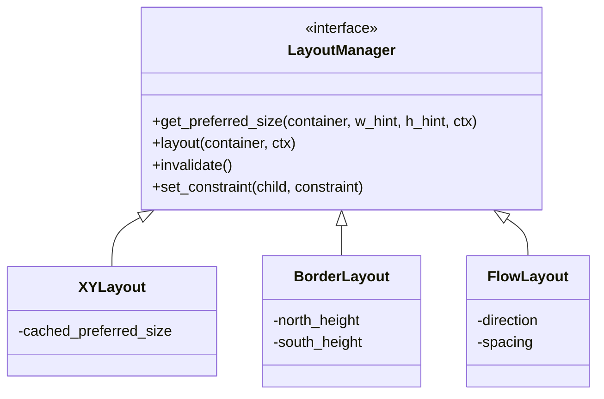
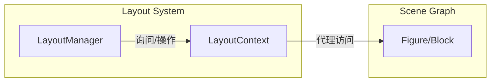
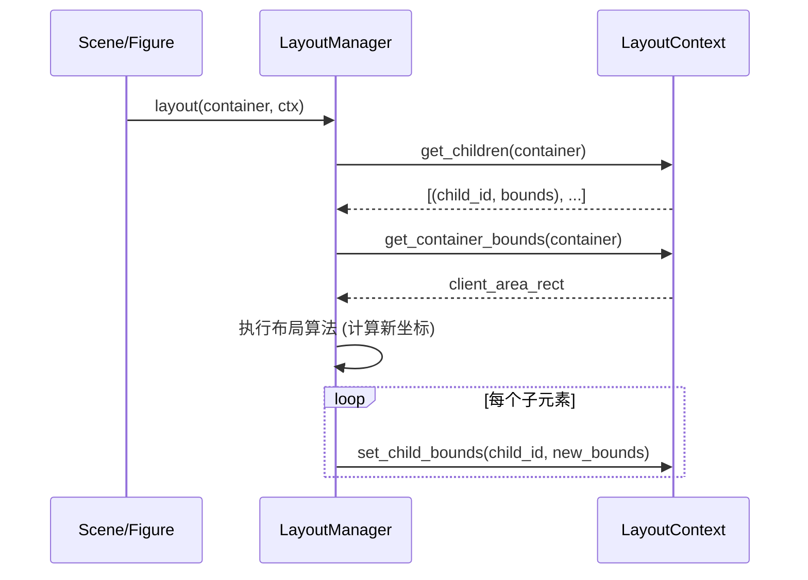
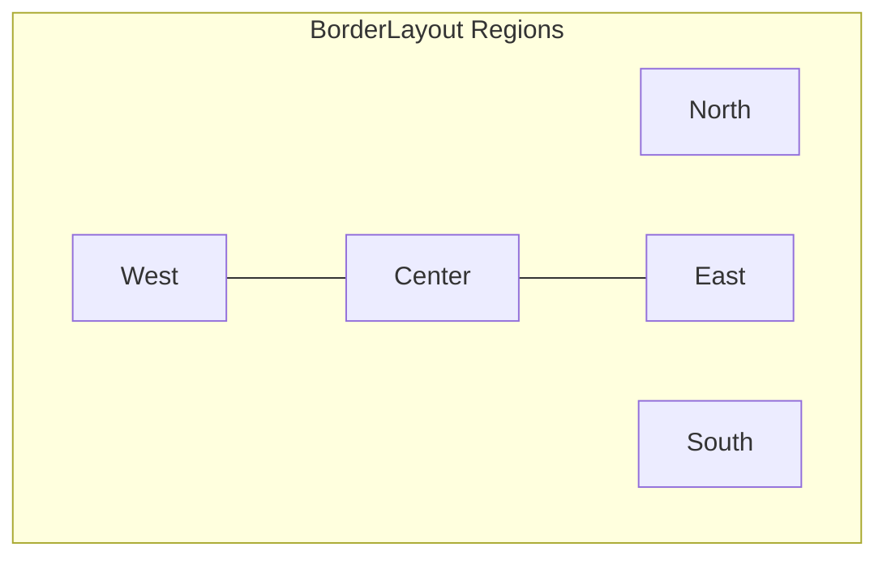
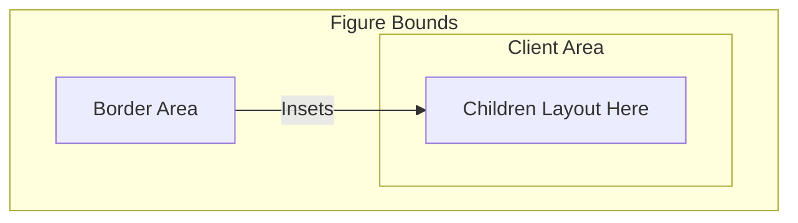

# 布局引擎与边框系统

## 目录
1. [模块概览](#模块概览)
2. [布局引擎核心协议](#布局引擎核心协议)
   - [LayoutManager：布局决策者](#layoutmanager布局决策者)
   - [LayoutContext：布局上下文](#layoutcontext布局上下文)
3. [布局计算流程](#布局计算流程)
   - [验证阶段 (Validation)](#验证阶段-validation)
   - [布局阶段 (Layout)](#布局阶段-layout)
4. [常用布局器详解](#常用布局器详解)
   - [XYLayout：坐标定位](#xylayout坐标定位)
   - [BorderLayout：边界布局](#borderlayout边界布局)
   - [FlowLayout：流式排列](#flowlayout流式排列)
   - [FillLayout：填充布局](#filllayout填充布局)
5. [边框系统与装饰](#边框系统与装饰)
   - [Border 接口](#border-接口)
   - [内边距 (Insets) 与客户区 (Client Area)](#内边距-insets-与客户区-client-area)
   - [内置边框类型](#内置边框类型)
6. [布局约束：控制子 Figure](#布局约束控制子-figure)
7. [核心组件代码示例](#核心组件代码示例)
8. [文件引用](#文件引用)

## 模块概览

Novadraw 的布局引擎与边框系统负责自动化处理图形（Figure）的排列、定位以及装饰性边框的绘制。该系统深度参考了 Eclipse Draw2D 的架构设计，采用解耦的策略将“如何排列子元素”的逻辑从 `Figure` 类中抽离到专门的 `LayoutManager` 中。

**模块规模统计**：
- **总文件数**：9 个 Rust 源文件。
- **子模块**：
  - `layout/` (5 个文件)：包含布局协议定义及常用布局器实现（XY, Border, Flow, Fill）。
  - `border/` (4 个文件)：包含边框协议定义及常用边框实现（Line, Margin, Rectangle）。

本章节将深入探讨布局计算的触发机制、各种布局策略的实现细节，以及边框系统如何通过内边距（Insets）影响布局结果。

**Section sources**:
- [novadraw-scene/src/layout/mod.rs](novadraw-scene/src/layout/mod.rs)
- [novadraw-scene/src/border/mod.rs](novadraw-scene/src/border/mod.rs)

## 布局引擎核心协议

布局引擎的核心在于 `LayoutManager` 和 `LayoutContext` 两个 trait 的协作。这种设计确保了布局算法与具体的场景图（Scene Graph）实现解耦。

### LayoutManager：布局决策者

`LayoutManager` 是所有布局器的基类协议。它定义了布局器必须具备的能力：计算首选尺寸、执行实际布局以及管理布局约束。



上面的类图展示了 `LayoutManager` 接口及其主要实现类。`LayoutManager` 并不直接持有子元素，而是通过 `LayoutContext` 与容器进行交互。这种多态设计允许开发者为任何容器动态更换布局策略。

### LayoutContext：布局上下文

`LayoutContext` 是布局器观察世界的“眼睛”和操作世界的“手”。它提供了查询容器子元素、获取约束、以及设置子元素最终位置（Bounds）的接口。



`LayoutContext` 的存在使得布局算法可以在不依赖具体 `Figure` 结构的情况下运行，甚至可以在测试环境中通过 Mock 实现来验证布局逻辑。

**Section sources**:
- [novadraw-scene/src/layout/mod.rs:L21-L40](novadraw-scene/src/layout/mod.rs#L21-L40)
- [novadraw-scene/src/layout/mod.rs:L46-L94](novadraw-scene/src/layout/mod.rs#L46-L94)

## 布局计算流程

Novadraw 的布局计算不是实时发生的，而是遵循“失效-验证”的异步流程。这能有效避免在单帧内进行重复的昂贵计算。

### 验证阶段 (Validation)

当子图形被添加、移除，或者其布局约束（Constraint）发生变化时，容器的布局状态会被标记为“失效”（Invalid）。

1. 调用 `invalidate()`：清空当前布局器的所有缓存（如首选尺寸缓存）。
2. 向上冒泡：父容器通常也会被标记为失效，因为子元素的变化可能影响父元素的首选尺寸。

### 布局阶段 (Layout)

实际的布局计算通常发生在渲染前的验证环节。



在 `layout` 方法执行期间，布局器会遍历所有子元素，根据自身算法逻辑计算出每个子元素应该占据的矩形区域，并通过 `set_child_bounds` 将结果应用回场景图中。

**Section sources**:
- [novadraw-scene/src/layout/mod.rs:L88-L93](novadraw-scene/src/layout/mod.rs#L88-L93)
- [novadraw-scene/src/layout/xy_layout.rs:L137-L170](novadraw-scene/src/layout/xy_layout.rs#L137-L170)

## 常用布局器详解

Novadraw 提供了四种核心布局器，涵盖了从绝对定位到复杂自动排列的各种需求。

### XYLayout：坐标定位

`XYLayout` 是最简单的布局器，它完全尊重子元素的约束（Rectangle）。子元素的约束定义了其相对于容器客户区（Client Area）的 X、Y 坐标以及宽度和高度。

- **逻辑**：将子元素的约束平移容器的起始坐标。
- **适用场景**：图形编辑器、自由拖拽界面。
- **配置参数**：无特定全局参数，依赖子元素的 `XYConstraint`。

### BorderLayout：边界布局

`BorderLayout` 将容器划分为五个区域：`North` (北), `South` (南), `East` (东), `West` (西) 和 `Center` (中)。



- **逻辑**：
  - `North` 和 `South` 占据顶部和底部，宽度填满。
  - `West` 和 `East` 占据左右两侧，高度为剩余中间高度。
  - `Center` 占据剩余的所有中心空间。
- **参数配置**：可设置四个边缘区域的默认宽度/高度。

### FlowLayout：流式排列

`FlowLayout` 模仿文本流，将子元素按顺序排列，当一行（或一列）排满时自动换行。

- **方向**：支持 `Horizontal`（水平）和 `Vertical`（垂直）。
- **间距**：支持设置元素间距（Spacing）和行间距（Row Spacing）。
- **对齐**：支持主轴和侧轴的对齐方式（如居中、靠左等）。

### FillLayout：填充布局

`FillLayout` 是最极端的布局器，它通常只处理第一个子元素，使其完全填满容器的客户区。

- **逻辑**：`ctx.set_child_bounds(first_child, container_bounds)`。
- **适用场景**：容器内只有一个核心内容（如滚动面板的内容区）。

**Section sources**:
- [novadraw-scene/src/layout/xy_layout.rs](novadraw-scene/src/layout/xy_layout.rs)
- [novadraw-scene/src/layout/border_layout.rs](novadraw-scene/src/layout/border_layout.rs)
- [novadraw-scene/src/layout/flow_layout.rs](novadraw-scene/src/layout/flow_layout.rs)

## 边框系统与装饰

边框（Border）不仅是视觉上的装饰，它还直接参与布局计算，通过提供内边距（Insets）来定义容器的“客户区”。

### Border 接口

任何实现 `Border` trait 的结构体都可以作为图形的边框。

```rust
pub trait Border: Send + Sync {
    /// 获取边框内边距 (top, left, bottom, right)
    fn get_insets(&self) -> (f64, f64, f64, f64);

    /// 在给定范围内绘制边框
    fn paint(&self, figure_bounds: Rectangle, gc: &mut NdCanvas);
}
```

### 内边距 (Insets) 与客户区 (Client Area)

这是布局引擎与边框系统交汇的核心点。容器的 `Client Area` 是指扣除边框占据的空间后，子元素可以自由活动的区域。



当布局器调用 `ctx.get_container_bounds(container)` 时，返回的实际上是该容器的 `Client Area`。这意味着布局算法不需要关心边框的存在，它只需要在给定的矩形内进行计算即可。

### 内置边框类型

1. **LineBorder**：绘制指定颜色、宽度和样式的矩形线框。
2. **MarginBorder**：不可见边框，仅用于提供内边距，相当于 CSS 中的 `padding`。
3. **RectangleBorder**：支持圆角的矩形边框。

**Section sources**:
- [novadraw-scene/src/border/mod.rs](novadraw-scene/src/border/mod.rs)
- [novadraw-scene/src/border/line_border.rs](novadraw-scene/src/border/line_border.rs)

## 布局约束：控制子 Figure

布局约束（Constraint）是子图形与布局器之间的“契约”。不同类型的布局器期望不同类型的约束对象。

| 布局器类型 | 期望的约束类型 | 语义 |
| :--- | :--- | :--- |
| **XYLayout** | `Rectangle` | 相对于客户区的绝对坐标 (x, y, w, h) |
| **BorderLayout** | `BorderRegion` (或特定矩形标识) | 指定放置在哪个区域 (North/South/...) |
| **FlowLayout** | 无 (None) | 仅依赖添加顺序 |

> 💡 **提示**：在 Novadraw 中，约束通常存储在场景图的元数据中。当布局器执行时，它会通过 `LayoutContext::get_constraint(child_id)` 获取这些信息并解释它们。

**Section sources**:
- [novadraw-scene/doc/02-figure/layout-constraints.md](novadraw-scene/doc/02-figure/layout-constraints.md)

## 核心组件代码示例

以下是 `XYLayout` 中 `layout` 方法的简化实现，展示了如何利用上下文和约束进行计算：

```rust
impl LayoutManager for XYLayout {
    fn layout(&self, container: BlockId, ctx: &mut dyn LayoutContext) {
        let children = ctx.get_children(container);
        
        // 获取容器的 client area 起始坐标
        let container_bounds = ctx.get_container_bounds(container);
        let offset_x = container_bounds.x;
        let offset_y = container_bounds.y;

        for (child_id, _) in children {
            // 获取相对于 client area 的约束
            if let Some(constraint) = ctx.get_constraint(child_id) {
                // 将约束转换为相对于容器 bounds 的绝对坐标
                let new_bounds = Rectangle::new(
                    constraint.x + offset_x,
                    constraint.y + offset_y,
                    constraint.width,
                    constraint.height,
                );
                // 应用新位置
                ctx.set_child_bounds(child_id, new_bounds);
            }
        }
    }
}
```

这段代码清晰地展示了“平移”逻辑：布局器将子元素定义的“局部坐标”转换为场景图中的“容器内坐标”。

## 文件引用

以下是本章节涉及的关键源代码文件：

- [novadraw-scene/src/layout/mod.rs](novadraw-scene/src/layout/mod.rs)：布局引擎核心协议定义。
- [novadraw-scene/src/layout/xy_layout.rs](novadraw-scene/src/layout/xy_layout.rs)：XY 布局器实现。
- [novadraw-scene/src/layout/border_layout.rs](novadraw-scene/src/layout/border_layout.rs)：边界布局器实现。
- [novadraw-scene/src/layout/flow_layout.rs](novadraw-scene/src/layout/flow_layout.rs)：流式布局器实现。
- [novadraw-scene/src/layout/fill_layout.rs](novadraw-scene/src/layout/fill_layout.rs)：填充布局器实现。
- [novadraw-scene/src/border/mod.rs](novadraw-scene/src/border/mod.rs) ：边框系统核心协议及构建器。
- [novadraw-scene/src/border/line_border.rs](novadraw-scene/src/border/line_border.rs)：线条边框实现。
- [novadraw-scene/src/border/margin_border.rs](novadraw-scene/src/border/margin_border.rs)：边距边框实现。
- [novadraw-scene/doc/02-figure/layout-constraints.md](novadraw-scene/doc/02-figure/layout-constraints.md)：布局约束的设计文档。
