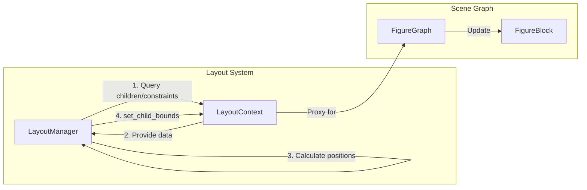
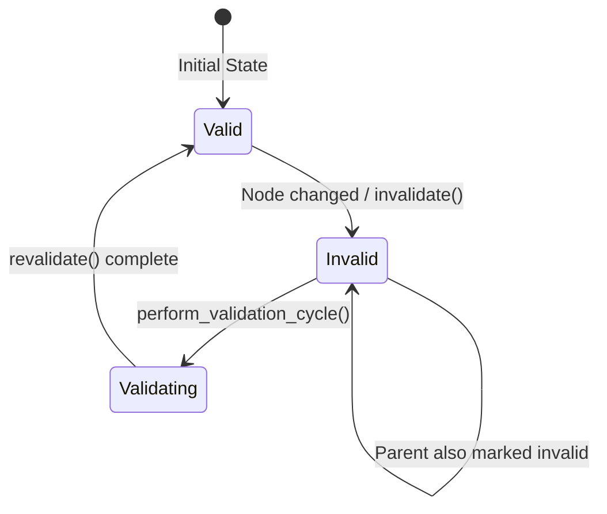
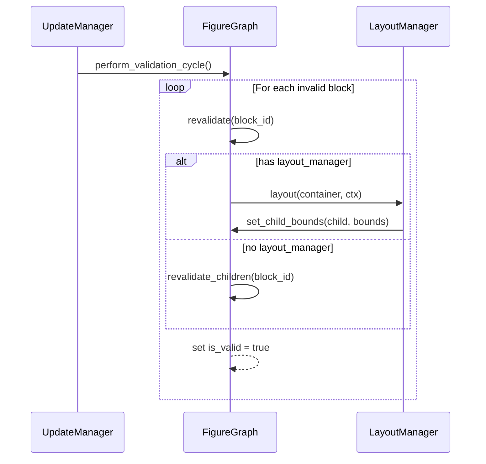
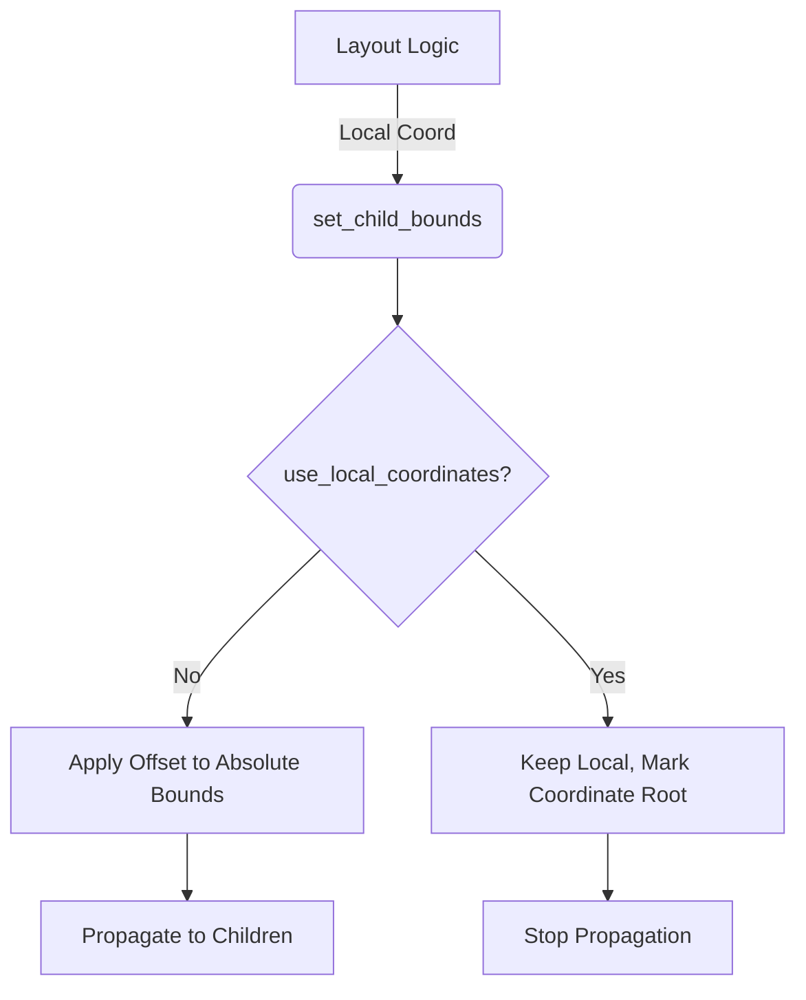

# 布局协议与验证流程

## 目录
1. [模块概览](#模块概览)
2. [引言](#引言)
3. [布局协议核心接口](#布局协议核心接口)
   - [LayoutManager Trait](#layoutmanager-trait)
   - [LayoutContext Trait](#layoutcontext-trait)
4. [布局验证生命周期](#布局验证生命周期)
   - [失效机制 (Invalidation)](#失效机制-invalidation)
   - [验证流程 (Validation)](#验证流程-validation)
5. [尺寸计算逻辑](#尺寸计算逻辑)
   - [首选尺寸与约束](#首选尺寸与约束)
   - [Hint 机制的作用](#hint-机制的作用)
6. [坐标域隔离与转换](#坐标域隔离与转换)
   - [LayoutContext 的边界保护](#layoutcontext-的边界保护)
   - [坐标系统切换逻辑](#坐标系统切换逻辑)
7. [内置布局器实现](#内置布局器实现)
   - [BorderLayout](#borderlayout)
   - [FlowLayout](#flowlayout)
   - [XYLayout 与 FillLayout](#xylayout-与-filllayout)
8. [核心组件](#核心组件)
9. [文件参考](#文件参考)

## 模块概览

Novadraw 的布局模块位于 `novadraw-scene/src/layout/` 目录下，负责处理图形节点（Figure）的自动定位和尺寸调整。该模块的设计深受 Eclipse Draw2D 的启发，采用了高度解耦的协议化设计。

**模块统计信息**：
- **总文件数**：5 个核心 Rust 文件。
- **子模块/实现**：
    - `mod.rs`: 定义核心协议（`LayoutManager`, `LayoutContext`）。
    - `border_layout.rs`: 北、南、东、西、中五区域布局实现。
    - `flow_layout.rs`: 流式自动换行布局实现。
    - `xy_layout.rs`: 基于绝对坐标的布局实现。
    - `fill_layout.rs`: 撑满容器的布局实现。

本页面将深入探讨这些核心协议的设计意图，并详细分析布局验证的生命周期管理。

## 引言

在复杂的图形应用中，手动管理成千上万个图形的位置是非常低效且易错的。Novadraw 通过引入 **布局协议 (Layout Protocol)**，将“如何排列子节点”的逻辑从图形节点（`FigureBlock`）中剥离出来，交给专门的布局管理器（`LayoutManager`）处理。

这种设计的核心优势在于：
1. **关注点分离**：图形节点只需声明自己的内容和约束，而无需关心复杂的排列计算。
2. **可插拔性**：开发者可以为任何容器节点动态更换布局器，而无需修改节点自身的代码。
3. **性能优化**：通过失效/验证（Invalidate/Validate）机制，确保只有受影响的部分才会重新计算布局，避免了每一帧都进行全量计算。

## 布局协议核心接口

布局协议由两个核心 Trait 组成：`LayoutManager` 和 `LayoutContext`。它们之间的协作构成了一个典型的“策略模式”应用。

### LayoutManager Trait

`LayoutManager` 是布局算法的实现者。它定义了布局器必须具备的行为，包括计算尺寸和执行实际的坐标分配。

```rust
pub trait LayoutManager: Send + Sync {
    /// 计算并设置容器内所有子元素的位置和大小
    fn layout(&self, container: BlockId, ctx: &mut dyn LayoutContext);

    /// 获取容器的首选大小
    fn get_preferred_size(
        &self,
        container: BlockId,
        w_hint: f64,
        h_hint: f64,
        ctx: &dyn LayoutContext,
    ) -> (f64, f64);

    /// 使布局器的缓存失效
    fn invalidate(&mut self);
    
    // ... 其他约束管理方法
}
```

布局器通常是无状态的（或仅持有缓存），它通过 `LayoutContext` 与具体的场景图进行交互。

### LayoutContext Trait

`LayoutContext` 是布局器与场景图（`FigureGraph`）之间的**隔离层**。它限制了布局器能看到的信息范围，确保布局器只能操作其职责范围内的子节点。

| 方法 | 说明 |
|------|------|
| `get_children` | 返回容器的所有直接子节点及其当前边界。 |
| `get_constraint` | 获取子节点关联的布局约束（如 BorderLayout 的方位）。 |
| `get_preferred_size` | 获取子节点自身计算出的理想尺寸。 |
| `set_child_bounds` | **核心写入接口**，由布局器调用以设置子节点在父节点坐标空间内的位置。 |
| `get_container_bounds` | 获取容器的客户区（Client Area）矩形。 |

通过这种隔离，布局器不需要知道 `FigureGraph` 的内部实现，甚至不需要知道它是在处理内存中的对象还是远程的图形数据。

下图展示了 `LayoutManager` 与 `LayoutContext` 之间的交互关系：



在上述流程中，`LayoutManager` 充当决策者，而 `LayoutContext` 充当执行代理。这种设计确保了布局算法的纯粹性，使其不依赖于具体的 UI 框架实现。

**Section sources**:
- [novadraw-scene/src/layout/mod.rs](novadraw-scene/src/layout/mod.rs)

## 布局验证生命周期

Novadraw 采用**延迟更新 (Deferred Update)** 策略。这意味着当节点发生变化时，布局不会立即重新计算，而是先进入“失效”状态，等待下一帧更新周期时统一验证。

### 失效机制 (Invalidation)

当以下情况发生时，布局会失效：
- 添加或删除子节点。
- 修改节点的尺寸（Bounds）。
- 显式调用 `invalidate()`。
- 修改节点的布局约束（Constraint）。

失效是一个**向上传播**的过程。当一个子节点失效时，它的父节点也必须被标记为失效，因为子节点的尺寸变化可能会影响父节点的整体布局。



状态转换的核心在于 `FigureBlock` 的 `is_valid` 标志位。一旦某个节点的 `is_valid` 变为 `false`，它及其所有祖先节点都会形成一条“失效路径”。

### 验证流程 (Validation)

验证流程由 `UpdateManager` 触发，通常发生在渲染之前的 `perform_update` 阶段。



整个验证流程是递归进行的。`FigureGraph` 会确保在验证父节点之前，先完成必要的子节点状态检查。如果父节点持有 `LayoutManager`，则执行具体的布局算法；否则，仅简单地递归验证子节点。

**Section sources**:
- [novadraw-scene/src/scene/mod.rs:L637-L684](novadraw-scene/src/scene/mod.rs#L637-L684)

## 尺寸计算逻辑

布局计算的第一步通常是确定“需要多少空间”。这涉及到 `get_preferred_size` 和 `get_minimum_size` 的计算。

### 首选尺寸与约束

每个 `FigureBlock` 都可以通过 `preferred_size` 属性显式声明自己的理想大小。如果未显式声明，则默认使用其 `figure.bounds()` 的宽高。

布局管理器在计算容器的首选大小时，会遍历所有子节点，并根据布局策略（如 FlowLayout 的行排列或 BorderLayout 的区域叠加）累加这些尺寸。

### Hint 机制的作用

`get_preferred_size` 接收两个参数：`w_hint` 和 `h_hint`。
- **作用**：向布局器提供“建议的约束”。例如，在 `FlowLayout` 中，如果给定了一个 `w_hint`（最大宽度），布局器会计算在此宽度限制下，自动换行后所需的总高度。
- **特殊值**：`-1.0` 表示无限制。

这种 Hint 机制允许布局器进行“试算”，从而实现响应式布局的效果。

**Section sources**:
- [novadraw-scene/src/layout/mod.rs:L66-L72](novadraw-scene/src/layout/mod.rs#L66-L72)
- [novadraw-scene/src/scene/mod.rs:L129-L136](novadraw-scene/src/scene/mod.rs#L129-L136)

## 坐标域隔离与转换

布局系统面临的一个挑战是：如何确保布局器设置的坐标是正确的？Novadraw 通过严格的坐标域隔离来解决这个问题。

### LayoutContext 的边界保护

`LayoutContext` 提供的 `get_container_bounds` 返回的是容器的 **Client Area**（客户区）。客户区是容器内部可供子节点放置的实际空间，已经扣除了边框（Border）和内边距（Insets）。

当布局器调用 `set_child_bounds` 时，它使用的坐标系是**相对于父节点客户区左上角**的偏移。

### 坐标系统切换逻辑

在 `FigureGraph` 内部，坐标转换逻辑如下：



如果父节点设置了 `use_local_coordinates() = true`，它就成为了一个**坐标根**。这意味着它的子节点拥有独立的坐标空间。布局器在设置子节点位置时，只需关注这个局部空间，而无需担心全局坐标的偏移。

这种隔离确保了布局算法的简洁性：布局器永远只需要处理（0, 0）到（Width, Height）之间的相对空间。

**Section sources**:
- [novadraw-scene/src/scene/mod.rs:L1302-L1353](novadraw-scene/src/scene/mod.rs#L1302-L1353)

## 内置布局器实现

Novadraw 提供了几种常用的布局器，涵盖了大部分 UI 排版需求。

### BorderLayout

`BorderLayout` 将容器划分为五个区域：`North`, `South`, `East`, `West`, `Center`。

- **逻辑**：首先分配南北区域（全宽，指定高度），然后分配东西区域（剩余高度，指定宽度），最后将剩余的所有空间分配给中间的 `Center` 区域。
- **约束使用**：通过 `Rectangle` 约束的宽高正负号来标识区域（例如 `height < 0` 为北区）。

### FlowLayout

`FlowLayout` 类似于 HTML 中的流式布局。

- **逻辑**：按顺序排列子节点，当当前行/列空间不足时，自动换行/换列。
- **配置项**：支持 `Horizontal`（水平）和 `Vertical`（垂直）两个方向，以及自定义的 `spacing`（元素间距）和 `row_spacing`（行间距）。

### XYLayout 与 FillLayout

- **XYLayout**：最简单的布局器，它直接尊重子节点的约束坐标，不做任何自动调整。适用于自由拖拽的画布场景。
- **FillLayout**：将容器的所有空间平均分配给所有子节点（通常用于只有一个子节点的情况，使其撑满父容器）。

**Section sources**:
- [novadraw-scene/src/layout/border_layout.rs](novadraw-scene/src/layout/border_layout.rs)
- [novadraw-scene/src/layout/flow_layout.rs](novadraw-scene/src/layout/flow_layout.rs)

## 核心组件

以下是布局协议涉及的核心组件定义。

```rust
/// 布局管理器定义
pub trait LayoutManager: Send + Sync {
    /// 执行布局的核心逻辑
    fn layout(&self, container: BlockId, ctx: &mut dyn LayoutContext);

    /// 获取首选大小，支持 Hint 建议
    fn get_preferred_size(
        &self,
        container: BlockId,
        w_hint: f64,
        h_hint: f64,
        ctx: &dyn LayoutContext,
    ) -> (f64, f64);

    /// 使缓存失效
    fn invalidate(&mut self);
}

/// 布局上下文定义
pub trait LayoutContext: Send + Sync {
    /// 获取子元素列表 (ID, Bounds)
    fn get_children(&self, parent_id: BlockId) -> Vec<(BlockId, Rectangle)>;

    /// 获取子元素的布局约束
    fn get_constraint(&self, child_id: BlockId) -> Option<Rectangle>;

    /// 设置子元素的边界
    fn set_child_bounds(&mut self, child_id: BlockId, bounds: Rectangle);

    /// 获取容器的客户区矩形
    fn get_container_bounds(&self, container_id: BlockId) -> Rectangle;
}
```

在 `FigureGraph` 中，这些接口的实现确保了布局逻辑能够高效地访问场景图数据，同时保持了良好的封装性。

## 文件参考

本页面内容基于以下源代码文件：

- [novadraw-scene/src/layout/mod.rs](novadraw-scene/src/layout/mod.rs): 核心 Trait 定义。
- [novadraw-scene/src/layout/border_layout.rs](novadraw-scene/src/layout/border_layout.rs): BorderLayout 实现。
- [novadraw-scene/src/layout/flow_layout.rs](novadraw-scene/src/layout/flow_layout.rs): FlowLayout 实现。
- [novadraw-scene/src/scene/mod.rs](novadraw-scene/src/scene/mod.rs): 场景图中的验证与坐标转换逻辑实现。
