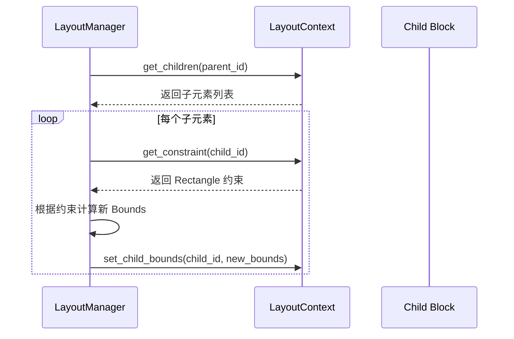
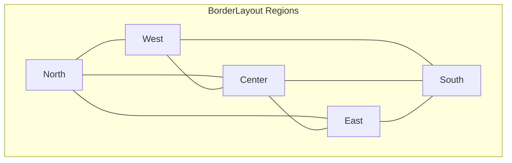
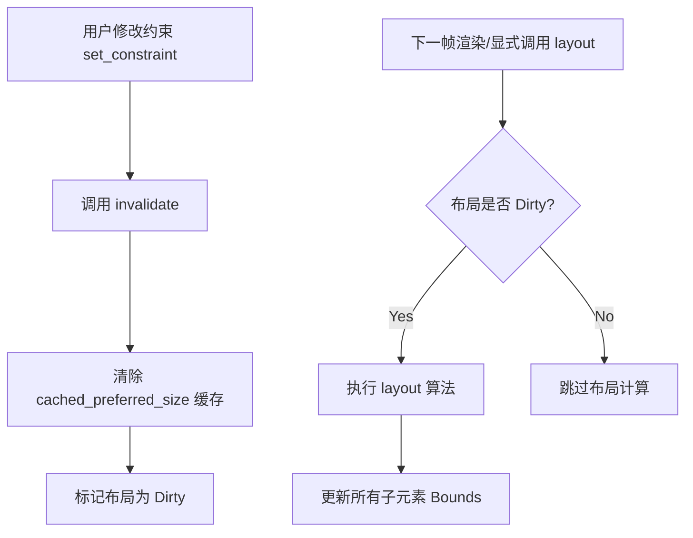

# 布局约束与盒模型

## 目录
1. [模块概览](#模块概览)
2. [引言](#引言)
3. [盒模型解析](#盒模型解析)
4. [布局约束机制](#布局约束机制)
5. [核心组件与接口](#核心组件与接口)
6. [约束类型映射](#约束类型映射)
7. [动态约束更新与重新布局](#动态约束更新与重新布局)
8. [文件参考](#文件参考)

## 模块概览

Novadraw 的布局模块位于 `novadraw-scene/src/layout`，其设计深受 Eclipse Draw2D 的启发。该模块提供了一套灵活的机制，用于管理图形元素（Figure/Block）的几何排列。

**统计信息**：
- **总文件数**：5 个核心源文件
- **子模块**：
    - `border_layout.rs`: 实现经典的方位布局（北、南、东、西、中）。
    - `xy_layout.rs`: 实现基于绝对坐标的自由布局。
    - `flow_layout.rs`: 实现流式布局（类似 CSS Flexbox）。
    - `fill_layout.rs`: 实现充满父容器的简单布局。
    - `mod.rs`: 定义核心 Trait 和公共接口。

本章将重点介绍 `LayoutManager` 如何通过“约束（Constraints）”与“盒模型（Box Model）”协同工作，实现精确的 UI 排版。

## 引言

在图形界面系统中，布局管理器的核心任务是：**根据父容器的大小和子元素的需求，计算出每个子元素的最终边界（Bounds）**。为了实现这一目标，Novadraw 引入了两个核心概念：

1.  **盒模型 (Box Model)**：定义了一个元素内部的物理结构，明确了边框（Border）、内边距（Insets）与内容区域（Client Area）之间的数学关系。
2.  **布局约束 (Constraints)**：作为子元素与布局管理器之间的“协议”。子元素通过约束告诉布局器：“我想放在北边”或“我想放在坐标 (10, 10)”。

这种设计将“定位逻辑”从图形元素中剥离，交由专门的布局器处理，从而实现了高度的灵活性和可扩展性。

## 盒模型解析

Novadraw 的盒模型（Box Model）是所有几何计算的基础。它规定了元素如何占用空间以及如何为子元素预留空间。

### 核心层次结构

盒模型由外向内分为以下几个层次：

1.  **Bounds (边界)**：元素在父坐标系中占用的完整矩形区域。它包含了背景填充、边框和内容。
2.  **Insets (内边距/边框占用空间)**：由 `Border` 声明占用的空间。例如，一个 2px 的线框会产生全边 2px 的 Insets。
3.  **Client Area (客户区域)**：子元素可以被放置和显示的实际区域。

其数学关系非常简单：`Client Area = Bounds - Insets`。

下图展示了盒模型的详细层次图：

```mermaid
graph TD
    subgraph "Figure Bounds (边界)"
        subgraph "Insets (由 Border 产生)"
            subgraph "Client Area (客户区域)"
                Content[子元素布局与绘制区域]
            end
        end
    end
    
    style "Figure Bounds (边界)" fill:#f9f,stroke:#333,stroke-width:2px
    style "Insets (由 Border 产生)" fill:#fff,stroke:#333,stroke-dasharray: 5 5
    style "Client Area (客户区域)" fill:#bbf,stroke:#333,stroke-width:2px
```

该图清晰地展示了 `Client Area` 是如何被嵌套在 `Bounds` 内部的。`Insets` 像一个垫片，将外部边界与内部内容隔离开来。在布局计算时，布局管理器通常只关心 `Client Area` 的大小，因为这是它真正可以分配给子元素的“领土”。

**Diagram sources**: 
- [figure_box_model.md:L11-L30](doc/02-figure/figure_box_model.md#L11-L30)

## 布局约束机制

布局约束是子元素向布局管理器传递定位意图的媒介。在 Novadraw 中，`LayoutManager` 并不直接存储这些约束，而是通过 `LayoutContext` 接口从场景图中查询。

### 约束传递流程

当需要进行布局时，`LayoutManager` 会遍历子元素，并为每个子元素请求其关联的约束对象。



这个流程展示了约束是如何在布局过程中发挥作用的。`LayoutManager` 作为一个纯粹的算法提供者，通过 `LayoutContext` 获取输入（子元素、约束、容器大小），并输出结果（设置子元素的新边界）。这种解耦设计使得相同的布局算法可以运行在不同的上下文环境中（如测试 Mock 或真实场景图）。

**Diagram sources**: 
- [mod.rs:L46-L89](novadraw-scene/src/layout/mod.rs#L46-L89)
- [layout-constraints.md:L7-L29](doc/02-figure/layout-constraints.md#L7-L29)

## 核心组件与接口

### LayoutManager Trait

这是所有布局器的基类。它定义了如何设置约束以及如何执行布局。

```rust
pub trait LayoutManager: Send + Sync {
    /// 设置布局约束
    fn set_constraint(&mut self, child_id: BlockId, constraint: Rectangle);

    /// 执行布局逻辑
    fn layout(&self, container: BlockId, ctx: &mut dyn LayoutContext);
    
    /// 使缓存失效，触发重新计算
    fn invalidate(&mut self);
}
```

### LayoutContext Trait

布局上下文提供了布局器所需的外部信息。它充当了布局器与场景图（Scene Graph）之间的桥梁。

```rust
pub trait LayoutContext: Send + Sync {
    /// 获取容器 client area 在子节点坐标域中的矩形
    fn get_container_bounds(&self, container_id: BlockId) -> Rectangle;

    /// 获取子元素的布局约束
    fn get_constraint(&self, child_id: BlockId) -> Option<Rectangle>;

    /// 设置子元素的最终边界
    fn set_child_bounds(&mut self, child_id: BlockId, bounds: Rectangle);
}
```

## 约束类型映射

尽管在 Rust 实现中，为了接口的统一性，约束的类型被固定为 `Rectangle`，但不同的布局器会以不同的方式解读这个 `Rectangle`。

### 1. XYLayout (绝对定位)
在 `XYLayout` 中，`Rectangle` 的含义最为直观：
- `x`, `y`: 子元素相对于父容器 `Client Area` 左上角的偏移。
- `width`, `height`: 子元素的固定尺寸。如果为 `-1.0`，则表示使用子元素的“首选尺寸（Preferred Size）”。

### 2. BorderLayout (方位定位)
`BorderLayout` 使用 `Rectangle` 的字段作为枚举值的载体，这是一种巧妙的复用：
- `height < 0.0`: 代表 **North (北)** 区域。
- `height > 0.0`: 代表 **South (南)** 区域。
- `width < 0.0`: 代表 **West (西)** 区域。
- `width > 0.0`: 代表 **East (东)** 区域。
- `width == 0.0 && height == 0.0`: 代表 **Center (中)** 区域。

下图展示了 `BorderLayout` 的区域划分：



在 `BorderLayout` 中，`North` 和 `South` 占据整个宽度，高度由约束或默认值决定；`West` 和 `East` 占据剩余高度，宽度由约束决定；`Center` 则自动填充剩下的所有空间。

**Diagram sources**: 
- [border_layout.rs:L11-L45](novadraw-scene/src/layout/border_layout.rs#L11-L45)
- [layout-constraints.md:L120-L132](doc/02-figure/layout-constraints.md#L120-L132)

## 动态约束更新与重新布局

当用户修改一个子元素的约束（例如拖拽改变位置）时，系统必须能够高效地更新布局。

### 失效机制 (Invalidation)

Novadraw 采用了“标记-刷新”机制。当 `set_constraint` 被调用时，布局器会调用 `invalidate()` 方法。



这种机制保证了在同一帧内多次修改约束只会触发一次实际的布局计算，极大地提高了性能。

**Section sources**:
- [mod.rs](novadraw-scene/src/layout/mod.rs)
- [xy_layout.rs](novadraw-scene/src/layout/xy_layout.rs)
- [border_layout.rs](novadraw-scene/src/layout/border_layout.rs)

## 文件参考

本章节涉及的核心文件如下：

- `novadraw-scene/src/layout/mod.rs`: 布局模块入口，定义核心 Trait。
- `novadraw-scene/src/layout/xy_layout.rs`: XY 布局实现及 `XYConstraint` 逻辑。
- `novadraw-scene/src/layout/border_layout.rs`: Border 布局实现及区域解析逻辑。
- `doc/02-figure/layout-constraints.md`: 布局约束的设计文档。
- `doc/02-figure/figure_box_model.md`: 盒模型的设计文档。
