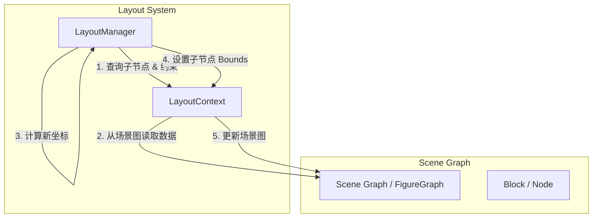
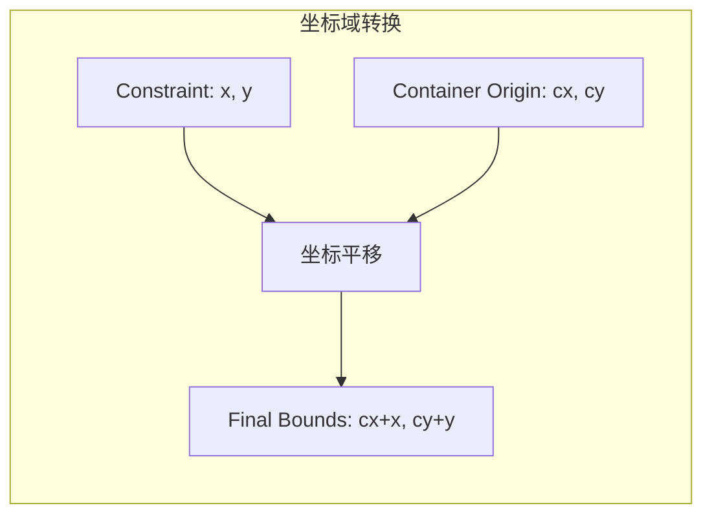
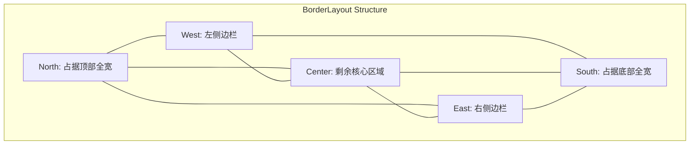
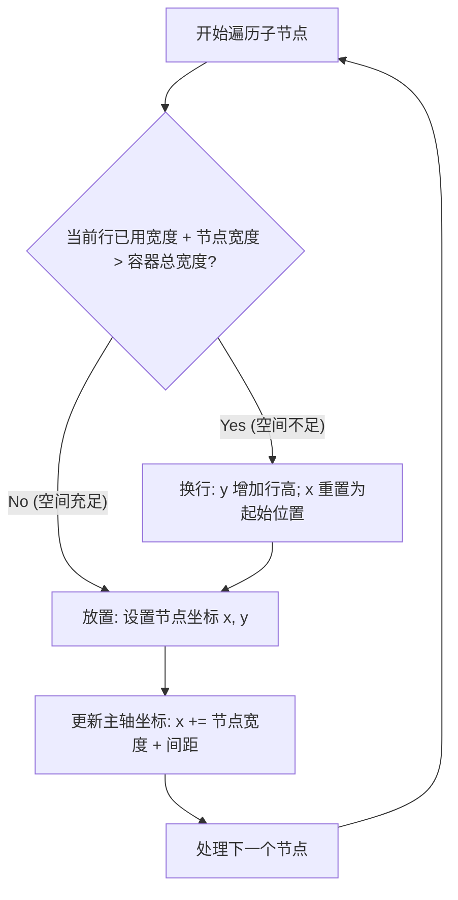
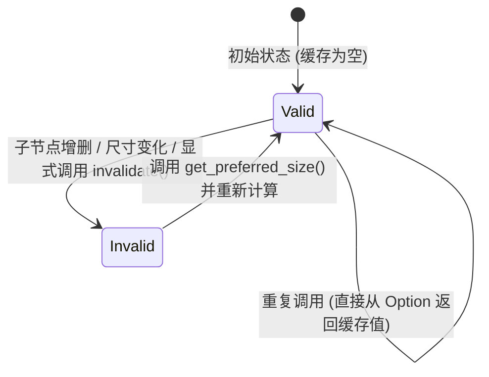

# 常用布局器实现

## 目录
1. [模块概览](#模块概览)
2. [核心接口设计](#核心接口设计)
3. [XYLayout：自由约束布局](#xylayout自由约束布局)
4. [BorderLayout：五区域布局](#borderlayout五区域布局)
5. [FlowLayout：流式自动换行布局](#flowlayout流式自动换行布局)
6. [FillLayout：填充布局](#filllayout填充布局)
7. [尺寸计算与缓存机制](#尺寸计算与缓存机制)
8. [集成与扩展建议](#集成与扩展建议)
9. [文件引用](#文件引用)

## 模块概览

`novadraw-scene/src/layout/` 模块是 Novadraw 引擎中负责组件位置计算的核心部分。在图形界面系统中，布局管理器（Layout Manager）的作用是自动处理组件的几何排列，从而将开发者从繁琐的坐标计算中解放出来。本模块的设计深度参考了 Eclipse Draw2D 的布局管理机制，采用了解耦的布局管理器模式，使得开发者可以灵活地为不同的容器配置不同的排列算法。

本模块共包含 5 个源文件，涵盖了从基础接口定义到四种常用标准布局算法的实现：

- **文件总数**：5 个 Rust 源文件。
- **子模块/实现**：
    - `mod.rs`：定义核心 Trait `LayoutManager` 和 `LayoutContext`，是整个布局系统的基石。
    - `xy_layout.rs`：实现基于坐标约束的自由布局，适用于画布等场景。
    - `border_layout.rs`：实现典型的五区域（东西南北中）布局，常用于主窗口架构。
    - `flow_layout.rs`：实现支持自动换行的流式布局，类似于 HTML 的行内元素排列。
    - `fill_layout.rs`：实现简单的单元素填充布局，确保子节点占满全部空间。

在 Novadraw 的场景图中，每个容器节点（Block）都可以关联一个 `LayoutManager`。当容器的大小发生变化或其子节点请求重新布局时，引擎会调用布局管理器的 `layout` 方法。该方法会根据预设的算法逻辑，结合子节点的约束信息，重新计算并设置所有子节点的边界（Bounds）。这种自动化的过程保证了界面在不同分辨率和窗口尺寸下都能保持良好的视觉效果。

**Section sources**:
- [mod.rs](novadraw-scene/src/layout/mod.rs)
- [xy_layout.rs](novadraw-scene/src/layout/xy_layout.rs)
- [border_layout.rs](novadraw-scene/src/layout/border_layout.rs)
- [flow_layout.rs](novadraw-scene/src/layout/flow_layout.rs)
- [fill_layout.rs](novadraw-scene/src/layout/fill_layout.rs)

## 核心接口设计

Novadraw 的布局系统建立在两个核心 Trait 之上：`LayoutManager` 定义了“如何排列”，而 `LayoutContext` 定义了“排列什么”。这种设计实现了算法逻辑与底层场景图数据结构的完全解耦，使得布局算法可以独立于具体的 UI 组件进行开发和测试。

### LayoutManager Trait

`LayoutManager` 是所有布局器的基类接口。它不仅负责执行核心的布局算法，还负责管理布局约束（Constraints）以及计算容器的首选尺寸。布局约束是传递给布局器的额外信息，例如在 `BorderLayout` 中，约束决定了子节点应该放在哪个方位。

```rust
pub trait LayoutManager: Send + Sync {
    /// 执行布局逻辑，计算并设置子元素的位置
    fn layout(&self, container: BlockId, ctx: &mut dyn LayoutContext);

    /// 计算容器在给定建议尺寸下的首选大小
    fn get_preferred_size(
        &self,
        container: BlockId,
        w_hint: f64,
        h_hint: f64,
        ctx: &dyn LayoutContext,
    ) -> (f64, f64);

    /// 使当前的布局缓存失效（如子节点增删或尺寸变化时调用）
    fn invalidate(&mut self);

    // ... 其他约束管理方法
}
```

### LayoutContext Trait

`LayoutContext` 充当了布局器与外部世界（通常是场景图引擎）之间的桥梁。布局器通过该接口查询子节点列表、获取每个子节点的约束，并最终回写计算出的坐标。这种抽象层允许我们在不修改布局算法的情况下，将其应用于不同的场景图实现或 Mock 环境。



上述图示展示了布局过程中的典型交互流程。`LayoutManager` 并不直接持有场景图的引用，而是通过 `LayoutContext` 提供的抽象方法进行操作。在执行 `layout` 时，`LayoutManager` 会遍历 `ctx.get_children()` 返回的子节点，并根据 `ctx.get_constraint()` 获取的约束信息（如 `XYLayout` 的坐标或 `BorderLayout` 的区域标识）进行几何计算，最后通过 `ctx.set_child_bounds()` 将结果应用到子节点上。这种模式极大地增强了系统的灵活性，使得布局过程可以被精细地控制和拦截。

**Section sources**:
- [mod.rs:L21-L94](novadraw-scene/src/layout/mod.rs#L21-L94)

## XYLayout：自由约束布局

`XYLayout` 是最基础且最灵活的布局器。它允许开发者通过 `XYConstraint`（本质上是一个矩形区域）来显式指定每个子节点的位置和大小。这在需要精确控制元素位置的场景（如绘图软件的画布）中非常有用。

### 核心逻辑与坐标转换

`XYLayout` 的核心任务是将每个子节点的约束坐标（通常是相对于容器 Client Area 的局部坐标）转换为相对于容器 Bounds 的坐标。由于容器本身可能在场景图中具有偏移，因此必须进行坐标平移。

```rust
fn layout(&self, container: BlockId, ctx: &mut dyn LayoutContext) {
    let children = ctx.get_children(container);
    let container_bounds = ctx.get_container_bounds(container);
    
    // 容器的起始坐标作为偏移量
    let offset_x = container_bounds.x;
    let offset_y = container_bounds.y;

    for (child_id, _) in children {
        if let Some(constraint) = ctx.get_constraint(child_id) {
            // 将相对于 client area 的约束坐标转换为相对于场景图的绝对坐标
            let new_bounds = Rectangle::new(
                constraint.x + offset_x,
                constraint.y + offset_y,
                constraint.width,
                constraint.height,
            );
            ctx.set_child_bounds(child_id, new_bounds);
        }
    }
}
```

### 坐标域转换流程

理解 `XYLayout` 的关键在于理解其坐标偏移处理。由于容器可能具有边框（Insets）或内衬，子节点的约束通常是相对于容器内部可用区域（Client Area）的。



在 `XYLayout` 中，如果约束中的 `width` 或 `height` 设置为 `-1`，通常意味着该节点应保持其“首选尺寸”（Preferred Size）。虽然当前的简化实现直接应用了约束中的尺寸，但在更复杂的实现中，布局器会先询问子节点的首选大小，然后再进行位置分配。这种机制保证了即使在自由布局下，组件也能维持其最小可读尺寸。

**适用场景**：
- **画布编辑器**：用户可以自由拖拽和调整元素大小，位置完全由用户输入决定。
- **静态面板**：元素位置固定，不随容器缩放自动调整，适用于简单的信息展示。

**Section sources**:
- [xy_layout.rs:L96-L170](novadraw-scene/src/layout/xy_layout.rs#L96-L170)

## BorderLayout：五区域布局

`BorderLayout` 将容器划分为五个预定义的区域：`North`（北）、`South`（南）、`East`（东）、`West`（西）和 `Center`（中）。这是构建典型 GUI 界面（如带有工具栏、状态栏和侧边栏的编辑器）的标准选择。

### 区域划分与优先级

`BorderLayout` 的排列遵循特定的优先级和空间分配规则：
1. **南北区域（North/South）**：占据容器的顶部和底部，横跨整个容器宽度。它们的高度通常由组件的首选高度或布局器的默认设置决定。
2. **东西区域（East/West）**：占据容器的左右两侧。它们的高度是除去南北区域后剩余的高度。
3. **中间区域（Center）**：占据所有剩余的中心空间。如果有多个组件被指定到 Center 区域，通常只有最后一个会生效，或者它们会重叠。



### 算法实现细节

在 `layout` 方法中，`BorderLayout` 首先计算出各边框区域的尺寸。为了防止侧边栏过大挤占中心区域导致界面崩溃，实现中加入了比例限制（如 `min(ch * 0.3)`）。

```rust
// 计算中心区域的起始位置和可用空间
let center_x = cx + west_w;
let center_y = cy + north_h;
let center_w = cw - west_w - east_w;
let center_h = ch - north_h - south_h;

// 针对不同区域应用不同的几何计算
match region {
    BorderRegion::North => (cx, cy, cw, h),
    BorderRegion::South => (cx, cy + ch - h, cw, h),
    BorderRegion::East  => (cx + cw - w, center_y, w, center_h),
    BorderRegion::West  => (cx, center_y, w, center_h),
    BorderRegion::Center => (center_x, center_y, center_w, center_h),
}
```

值得注意的是，`BorderLayout` 采用了两遍遍历机制以确保稳健性：
- **显式约束处理**：首先处理那些通过约束明确指定了所属区域（如 `x=0, y=-1` 代表 North）的子节点。
- **隐式分配**：将没有约束的子节点自动填充到尚未被占用的区域中，这为动态添加组件提供了便利。

**Section sources**:
- [border_layout.rs:L162-L280](novadraw-scene/src/layout/border_layout.rs#L162-L280)

## FlowLayout：流式自动换行布局

`FlowLayout` 类似于 HTML 中的流式布局或 CSS 的 Flexbox。它按顺序排列子节点，当当前行（或列）空间不足以容纳下一个元素时，会自动跳转到下一行（或下一列）继续排列。

### 布局方向与间距控制

`FlowLayout` 提供了极高的灵活性，支持两种主轴方向：
- `Horizontal`（水平）：从左到右排列，这是最常用的模式，类似于文本排版。
- `Vertical`（垂直）：从上到下排列，类似于垂直菜单。

此外，它还提供了 `spacing`（同轴元素间距）和 `row_spacing`（行与行之间的间距）的配置，允许开发者精细调节界面的呼吸感。

### 换行算法决策流程

流式布局的核心在于实时监控剩余空间并决定是否“折行”。以下是水平流式布局的决策逻辑：



在 `layout_horizontal` 实现中，布局器会维护一个 `row_height` 变量，动态记录当前行中最高元素的高度。当发生换行时，`y` 坐标会增加这个高度加上行间距，从而确保不同高度的元素在换行后不会发生视觉重叠。这种算法虽然简单，但能处理绝大多数动态列表和工具栏的排列需求。

```rust
for (child_id, child_bounds) in children {
    let child_w = child_bounds.width;
    let child_h = child_bounds.height;

    // 检查是否需要换行
    if x + child_w > cx + cw && x > cx {
        y += row_height + self.row_spacing;
        x = cx;
        row_height = 0.0;
    }

    // 设置位置并更新主轴坐标
    ctx.set_child_bounds(*child_id, Rectangle::new(x, y, child_w, child_h));
    x += child_w + self.spacing;
    row_height = row_height.max(child_h);
}
```

**Section sources**:
- [flow_layout.rs:L114-L182](novadraw-scene/src/layout/flow_layout.rs#L114-L182)

## FillLayout：填充布局

`FillLayout` 是所有布局器中最简单、最专注的一个。它的逻辑非常单一：将容器的第一个子节点拉伸至填满整个容器的 Client Area。

### 设计初衷与典型用途

`FillLayout` 通常用于那些只需要显示单一核心内容且希望内容随容器自动缩放的场景。它的存在简化了许多容器嵌套的配置工作。典型应用包括：
- **视口（Viewport）**：在滚动面板内部，视口通常需要填满整个可见区域。
- **单组件对话框**：例如一个只包含一个大文本域的编辑器窗口。
- **背景层**：在多层嵌套中，用于确保背景装饰元素始终覆盖整个容器。

### 实现分析

尽管逻辑简单，但 `FillLayout` 严格遵循了 `LayoutManager` 协议。它通过 `ctx.get_container_bounds(container)` 获取容器的可用空间，并直接将其作为第一个子节点的 Bounds。对于除第一个之外的其他子节点，`FillLayout` 会选择忽略它们，让它们保持原有的位置。这种“首位优先”的策略在处理复杂的 UI 装饰时非常有效。

```rust
fn layout(&self, container: BlockId, ctx: &mut dyn LayoutContext) {
    let children = ctx.get_children(container);
    if let Some((first_child_id, _)) = children.first() {
        let bounds = ctx.get_container_bounds(container);
        ctx.set_child_bounds(*first_child_id, bounds);
    }
}
```

**Section sources**:
- [fill_layout.rs:L73-L92](novadraw-scene/src/layout/fill_layout.rs#L73-L92)

## 尺寸计算与缓存机制

布局系统不仅负责“放哪里”，还负责回答“要多大”。`LayoutManager` 提供的 `get_preferred_size` 方法是实现 UI 自适应的关键。它允许父容器根据子节点的需求来动态调整自己的大小。

### 尺寸协商递归流程

当一个容器询问其首选尺寸时，通常会触发一个自底向上的递归过程：

1. **发起请求**：父容器调用其布局管理器的 `get_preferred_size`。
2. **子节点咨询**：布局管理器遍历所有子节点，通过 `LayoutContext::get_preferred_size` 询问每个子节点的理想尺寸。
3. **算法汇总**：布局管理器根据自身的排列算法（如 `FlowLayout` 的宽度累加或 `BorderLayout` 的区域叠加）汇总这些尺寸。
4. **结果返回**：返回最终建议的宽高，父容器据此调整自己的 Bounds。

### 缓存与失效机制

由于尺寸计算可能涉及大量的几何运算和深层递归，频繁调用会导致性能下降。因此，所有标准布局器都内置了缓存机制。



在代码实现中，这通过 `cached_preferred_size: Option<(f64, f64)>` 字段体现。每当布局环境发生变化（如子节点约束改变）时，引擎必须确保调用 `invalidate()` 来清空旧的缓存数据。这种“惰性计算”策略极大地优化了复杂界面的重绘性能。

```rust
fn invalidate(&mut self) {
    self.cached_preferred_size = None;
}
```

**Section sources**:
- [mod.rs:L62-L83](novadraw-scene/src/layout/mod.rs#L62-L83)
- [xy_layout.rs:L111-L124](novadraw-scene/src/layout/xy_layout.rs#L111-L124)

## 集成与扩展建议

在实际开发中，选择合适的布局器并正确配置是构建高质量 UI 的关键。以下是一些基于 Novadraw 布局系统的集成建议：

### 布局器选择指南

| 布局器 | 推荐场景 | 优势 | 局限 |
| :--- | :--- | :--- | :--- |
| **XYLayout** | 自由绘图、位置固定的面板 | 绝对控制 | 缺乏自适应能力 |
| **BorderLayout** | 应用程序主框架、复杂对话框 | 结构清晰，区域分明 | 只能处理五个固定区域 |
| **FlowLayout** | 工具栏、标签列表、按钮组 | 自动换行，响应式强 | 难以对齐不同行的元素 |
| **FillLayout** | 单一内容容器、视口 | 极其简单高效 | 仅支持单一子节点填充 |

### 性能优化建议

1. **减少嵌套深度**：虽然布局系统支持无限嵌套，但每一层嵌套都会增加一次递归计算。尽量使用 `BorderLayout` 等功能强大的布局器来减少不必要的中间容器。
2. **合理利用 Invalidate**：只有在真正影响布局的属性（如尺寸、约束）变化时才调用 `invalidate()`。频繁的失效会导致界面闪烁和 CPU 占用过高。
3. **自定义布局器**：如果现有的布局器无法满足需求（例如需要复杂的网格对齐），可以通过实现 `LayoutManager` Trait 来创建自定义布局算法。

## 文件引用

以下是本模块涉及的核心源文件，建议在深入研究具体算法实现或进行功能扩展时参考：

- [novadraw-scene/src/layout/mod.rs](novadraw-scene/src/layout/mod.rs)：定义了 `LayoutManager` 和 `LayoutContext` 核心 Trait。
- [novadraw-scene/src/layout/xy_layout.rs](novadraw-scene/src/layout/xy_layout.rs)：XY 自由布局的具体实现。
- [novadraw-scene/src/layout/border_layout.rs](novadraw-scene/src/layout/border_layout.rs)：五区域边框布局的具体实现。
- [novadraw-scene/src/layout/flow_layout.rs](novadraw-scene/src/layout/flow_layout.rs)：流式自动换行布局的具体实现。
- [novadraw-scene/src/layout/fill_layout.rs](novadraw-scene/src/layout/fill_layout.rs)：单元素填充布局的具体实现。
