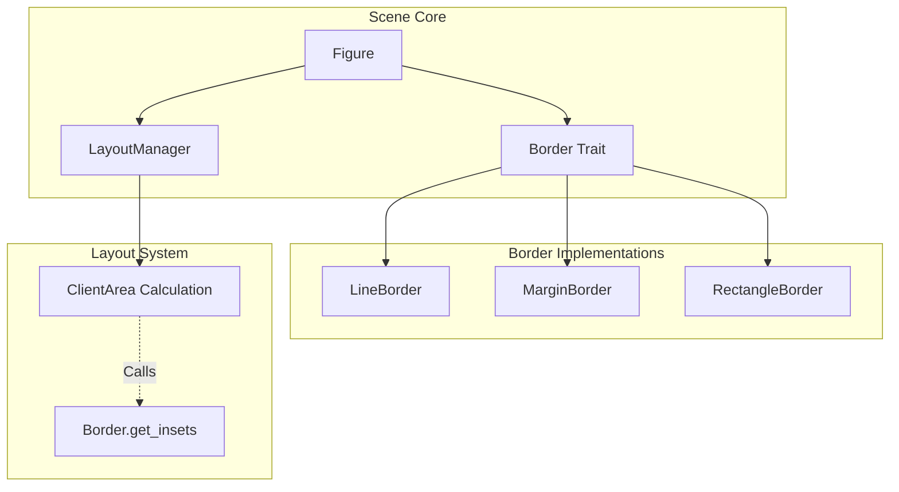
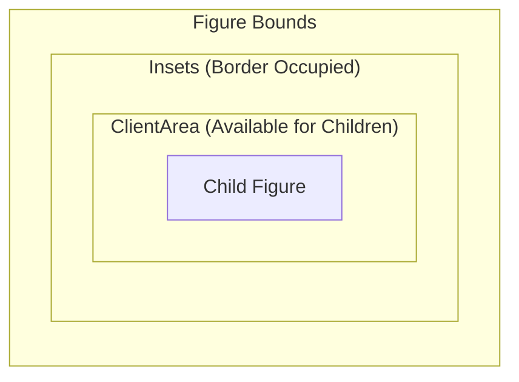
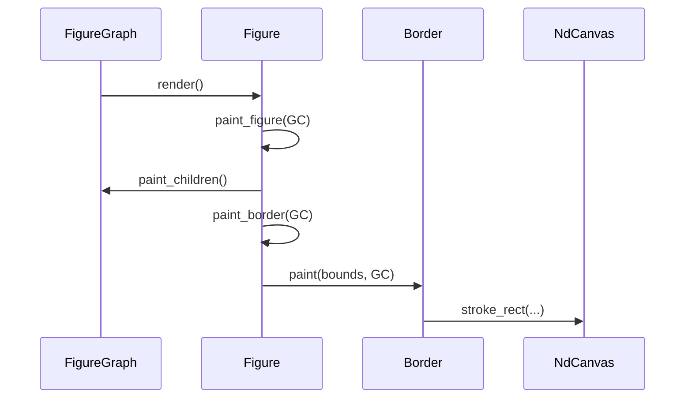

# 边框装饰系统

## 目录
1. [模块概览](#模块概览)
2. [引言](#引言)
3. [核心接口：Border Trait](#核心接口border-trait)
4. [内边距与 ClientArea](#内边距与-clientarea)
5. [内置边框实现](#内置边框实现)
   - [LineBorder：线条边框](#lineborder线条边框)
   - [MarginBorder：边距边框](#marginborder边距边框)
   - [RectangleBorder：矩形边框](#rectangleborder矩形边框)
6. [边框构建器：BorderBuilder](#边框构建器borderbuilder)
7. [在 Figure 中集成](#在-figure-中集成)
8. [文件参考](#文件参考)

## 模块概览

边框装饰系统（Border Decoration System）位于 `novadraw-scene/src/border/` 目录下，是 NovaDraw 场景图的重要组成部分。该模块负责为图形（Figure）提供视觉上的边框装饰，并定义边框对图形可用区域（ClientArea）的影响。

**模块统计：**
- **总文件数**：4 个 Rust 源文件。
- **核心组件**：
  - `Border` Trait：定义了所有边框必须遵循的接口。
  - `LineBorder`：实现基础的线条边框绘制。
  - `MarginBorder`：实现仅提供内边距而不进行绘制的“空白”边框。
  - `RectangleBorder`：支持圆角样式的矩形边框。
  - `BorderBuilder`：提供流式 API 用于快速构建边框实例。

该模块的设计深受 Eclipse Draw2D 的启发，采用装饰器模式将边框逻辑从图形自身的绘制逻辑中解耦。

## 引言

在 NovaDraw 的 UI 框架中，`Figure` 是最基础的渲染单元。为了增强图形的表现力并支持复杂的布局需求，系统引入了 `Border` 机制。

边框在系统中扮演双重角色：
1. **视觉装饰**：在图形的边界（Bounds）内绘制线条、圆角矩形或特定的图案。
2. **布局约束**：通过 `Insets`（内边距）告知布局管理器图形内部有多少空间是被边框占用的。这直接决定了子元素可以放置的“客户区域”（ClientArea）。

下图展示了边框系统与其他核心组件的交互关系：



如上图所示，`Figure` 持有一个可选的 `Border` 引用。在渲染阶段，`Figure` 会委托 `Border` 绘制装饰；在布局阶段，`LayoutManager` 会根据 `Border` 提供的 `Insets` 来计算子元素的可用空间。

## 核心接口：Border Trait

`Border` Trait 是边框系统的核心契约。任何想要作为边框使用的类型都必须实现此接口。

```rust
pub trait Border: Send + Sync {
    /// 获取边框内边距 (top, left, bottom, right)
    fn get_insets(&self) -> (f64, f64, f64, f64);

    /// 绘制边框
    /// figure_bounds: 图形的外部边界
    /// gc: 渲染画布上下文
    fn paint(&self, figure_bounds: Rectangle, gc: &mut NdCanvas);

    /// 获取边框颜色
    fn get_color(&self) -> Color;

    /// 获取边框宽度
    fn get_width(&self) -> f64;
}
```

**关键方法解析：**
- `get_insets()`：返回一个四元组，分别代表上、左、下、右四个方向的占用空间。通常，线条边框的 `insets` 等于其线宽，而 `MarginBorder` 则可以提供任意大小的空白边距。
- `paint()`：这是边框渲染的入口。它接收图形的完整边界 `figure_bounds`，并在此范围内执行绘制命令。

**Section sources**:
- [mod.rs](novadraw-scene/src/border/mod.rs)

## 内边距与 ClientArea

理解边框系统对布局的影响，关键在于理解 `Insets` 如何缩减 `ClientArea`。

`ClientArea` 是图形内部真正可供子元素排列的区域。它的计算公式如下：
`ClientArea = Bounds - Insets`

下图直观地展示了这一盒模型关系：



在代码实现中，`Bounded` Trait 提供了 `client_area()` 方法来处理这一逻辑：

```rust
fn client_area(&self) -> Rectangle {
    let b = self.bounds();
    let (top, left, bottom, right) = self.insets(); // 获取边框提供的 Insets
    let width = b.width - left - right;
    let height = b.height - top - bottom;
    
    if self.use_local_coordinates() {
        Rectangle::new(0.0, 0.0, width, height)
    } else {
        Rectangle::new(b.x + left, b.y + top, width, height)
    }
}
```

当一个图形被赋予边框后，它应该覆盖 `insets()` 方法，返回 `border.get_insets()` 的结果。这样，无论是 `XYLayout` 还是 `FillLayout`，都能正确地将子元素约束在边框内部，避免视觉上的重叠。

## 内置边框实现

### LineBorder：线条边框

`LineBorder` 是最常用的边框类型，用于在图形边缘绘制简单的矩形线条。它支持不同的线宽和颜色。

**核心逻辑**：
在 `paint` 方法中，`LineBorder` 会根据线宽进行“内缩”计算，以确保线宽的一半落在边界内，一半落在边界外（或者完全落在边界内，取决于具体实现）。

```rust
fn paint(&self, figure_bounds: Rectangle, gc: &mut NdCanvas) {
    let half_width = self.width / 2.0;
    // 根据内边距和线宽计算实际绘制位置
    let x = figure_bounds.x + self.insets.1 + half_width;
    let y = figure_bounds.y + self.insets.0 + half_width;
    let width = figure_bounds.width - self.insets.1 - self.insets.3 - self.width;
    let height = figure_bounds.height - self.insets.0 - self.insets.2 - self.width;

    if width <= 0.0 || height <= 0.0 { return; }

    gc.stroke_rect(x, y, width, height, self.color, self.width, ...);
}
```

### MarginBorder：边距边框

`MarginBorder` 是一种特殊的边框，它的 `paint` 方法是空实现。它的唯一作用是提供 `Insets`。

这在以下场景非常有用：
- 需要在图形与其子元素之间留出空白间距（Padding）。
- 逻辑上需要内边距，但视觉上不需要线条。

### RectangleBorder：矩形边框

`RectangleBorder` 扩展了 `LineBorder` 的功能，增加了对 `corner_radius`（圆角半径）的支持。

虽然在当前版本中，`RectangleBorder` 的实现可能暂时回退到普通矩形绘制（等待渲染引擎完善 `stroke_rounded_rect`），但其接口已经预留了圆角属性，允许开发者定义视觉上更柔和的 UI 元素。

**边框样式（BorderStyle）**：
系统通过 `BorderStyle` 枚举支持多种线条风格：
- `Solid`：实线
- `Dash`：虚线
- `Dot`：点线
- `DashDot`：点划线

**Section sources**:
- [line_border.rs](novadraw-scene/src/border/line_border.rs)
- [margin_border.rs](novadraw-scene/src/border/margin_border.rs)
- [rectangle_border.rs](novadraw-scene/src/border/rectangle_border.rs)

## 边框构建器：BorderBuilder

为了简化边框的创建过程，模块提供了一个流式构建器 `BorderBuilder`。

使用示例：
```rust
let border = BorderBuilder::new(Color::BLACK, 2.0)
    .with_style(BorderStyle::Dash)
    .with_insets(5.0, 5.0, 5.0, 5.0)
    .build_rectangle(); // 或者 build_line()
```

这种模式避免了构造函数参数过多的问题，使得代码更加清晰易读。

## 在 Figure 中集成

图形与边框的集成遵循特定的渲染顺序。在 `FigureGraph` 执行渲染时，会按照以下步骤进行：

1. **绘制自身** (`paint_figure`)：绘制背景、形状填充等。
2. **绘制客户区域** (`paint_client_area`)：递归绘制所有子元素。
3. **绘制边框** (`paint_border`)：最后绘制边框，确保边框遮盖在内容之上（如果需要）。



如上图所示，边框的绘制发生在子元素绘制之后。这种 Z 序排列确保了边框始终可见，不会被内部内容遮挡。

## 文件参考

以下是边框装饰系统涉及的核心源文件：

- `novadraw-scene/src/border/mod.rs`: 定义 `Border` Trait, `BorderStyle` 枚举和 `BorderBuilder`。
- `novadraw-scene/src/border/line_border.rs`: `LineBorder` 的具体实现。
- `novadraw-scene/src/border/margin_border.rs`: `MarginBorder` 的具体实现。
- `novadraw-scene/src/border/rectangle_border.rs`: `RectangleBorder` 的具体实现。
- `novadraw-scene/src/figure/mod.rs`: 定义了 `Bounded::client_area` 和 `Figure::paint_border` 等集成逻辑。
- `novadraw-scene/src/figure/rectangle.rs`: 展示了 `RectangleFigure` 如何持有并使用 `Border`。

**Section sources**:
- [mod.rs](novadraw-scene/src/border/mod.rs)
- [figure/mod.rs](novadraw-scene/src/figure/mod.rs)
