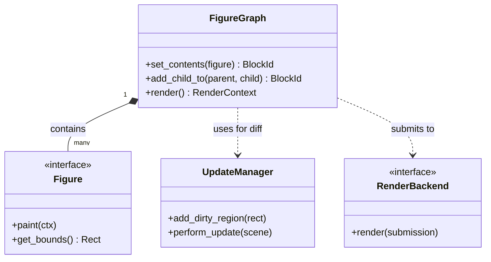
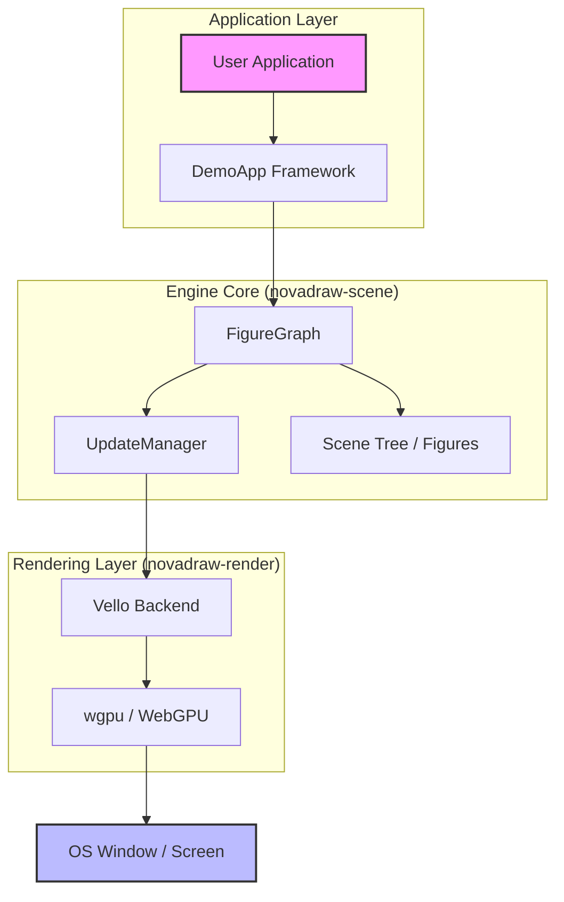

# 快速上手指南

## 目录
1. [模块概览](#模块概览)
2. [简介](#简介)
3. [环境配置](#环境配置)
   - [Rust 工具链](#rust-工具链)
   - [WebGPU 驱动要求](#webgpu-驱动要求)
   - [系统库依赖](#系统库依赖)
4. [运行示例程序](#运行示例程序)
   - [启动演示 App](#启动演示-app)
   - [通用操作快捷键](#通用操作快捷键)
5. [编写第一个 Figure 应用](#编写第一个-figure-应用)
   - [基础代码结构](#基础代码结构)
   - [核心概念解析](#核心概念解析)
6. [核心组件](#核心组件)
7. [架构概览](#架构概览)
8. [常见问题与错误排查](#常见问题与错误排查)
9. [文件引用](#文件引用)

## 模块概览

Novadraw 是一个基于 Rust 和 WebGPU 的高性能图形引擎工具包。在本次快速上手指南中，我们将涵盖从环境搭建到运行第一个图形应用的全过程。

**项目规模统计**：
- **总文件数**：发现约 72 个 Rust 源码文件。
- **子模块列表**：
  - `novadraw-core`: 核心数据类型（颜色、基础 trait 等）。
  - `novadraw-math`: 数学运算库（矩阵、向量）。
  - `novadraw-geometry`: 几何计算（矩形、变换）。
  - `novadraw-render`: 渲染后端抽象（支持 Vello/WebGPU）。
  - `novadraw-scene`: 场景图、Figure 树、更新管理器（核心逻辑）。
  - `novadraw-apps`: 共享的演示应用框架。
  - `apps/`: 各种功能验证应用程序集（如 `shape-app`, `editor`）。

在本指南中，我们将重点深入探讨 `apps/` 和 `novadraw-apps` 模块，帮助开发者快速理解如何使用 Novadraw 构建应用。其他底层模块（如 `math`, `geometry`）将作为支撑组件简要提及。

## 简介

Novadraw 旨在为开发者提供一个类似于 Eclipse Draw2D/GEF 的高性能、可扩展的图形框架。它利用 Rust 的内存安全特性和 WebGPU 的现代渲染能力，能够处理复杂的场景图和大规模的图形元素。

无论是构建流程图编辑器、CAD 工具还是简单的图形仪表盘，Novadraw 都提供了丰富的 Figure（图形节点）类型、灵活的布局管理（Layout）以及高效的更新机制（UpdateManager）。本章节的目标是让开发者在 10 分钟内搭建好环境，并成功运行起第一个图形示例。

## 环境配置

在开始使用 Novadraw 之前，确保你的开发环境满足 Rust 工具链和图形驱动的要求。

### Rust 工具链
Novadraw 使用最新的稳定版 Rust。你可以通过 [rustup](https://rustup.rs/) 安装：

```bash
curl --proto '=https' --tlsv1.2 -sSf https://sh.rustup.rs | sh
```

安装完成后，建议更新到最新版本：
```bash
rustup update stable
```

### WebGPU 驱动要求
Novadraw 的渲染后端基于 [Vello](https://github.com/linebender/vello) 和 [wgpu](https://github.com/gfx-rs/wgpu)，这要求你的系统支持 WebGPU 相关的底层 API：
- **Windows**: DirectX 12 或 Vulkan
- **macOS**: Metal
- **Linux**: Vulkan

你可以通过运行 `vulkaninfo` 或使用 WebGPU 探测工具来检查驱动支持情况。

### 系统库依赖
在 Linux 系统上，你可能需要安装以下开发库以编译 `wgpu` 和 `winit`：

```bash
# Ubuntu/Debian 示例
sudo apt-get install libwayland-dev libx11-dev libxkbcommon-dev vulkan-loader
```

对于 macOS 和 Windows，通常不需要额外的系统库，只要驱动程序是最新的即可。

**Section sources**:
- [CLAUDE.md](CLAUDE.md)
- [novadraw-render/Cargo.toml](novadraw-render/Cargo.toml)

## 运行示例程序

Novadraw 在 `apps/` 目录下提供了多个验证应用程序，每个 App 专注于验证特定的引擎功能。

### 启动演示 App
你可以使用 `cargo run -p <app-name>` 命令启动指定的应用。以下是一些常用的示例：

| 命令 | 说明 |
|------|------|
| `cargo run -p shape-app` | 展示各种基础图形（矩形、椭圆、折线等） |
| `cargo run -p layout-app` | 演示布局管理器（XYLayout, FillLayout, BorderLayout） |
| `cargo run -p editor` | 启动集成编辑器示例，展示交互能力 |
| `cargo run -p transform-app` | 演示坐标变换、缩放和旋转 |

### 通用操作快捷键
所有基于 `novadraw-apps` 框架的应用都共享一套操作逻辑：

- **方向键 / 鼠标滚轮**: 在不同的演示场景（Scene）之间切换。
- **`I` 键**: 切换渲染模式（迭代渲染 vs 递归渲染）。
- **`U` 键**: 开启/关闭 `UpdateManager`（性能对比）。
- **`S` 键**: 截取当前屏幕并保存到 `screenshot/` 目录。
- **`ESC`**: 退出程序。

这些快捷键由 `novadraw-apps/src/app.rs` 中的事件循环统一处理，极大地方便了开发者的调试工作。

**Section sources**:
- [apps/README.md](apps/README.md)
- [novadraw-apps/src/app.rs](novadraw-apps/src/app.rs)

## 编写第一个 Figure 应用

让我们通过编写一个简单的应用来了解 Novadraw 的编程模型。

### 基础代码结构
一个最小的 Novadraw 应用通常包含：创建场景、添加图形、启动应用框架。

```rust
use novadraw_apps::run_demo_app;
use novadraw::{FigureGraph, RectangleFigure, Color};

fn create_my_scene() -> FigureGraph {
    // 1. 创建场景图容器
    let mut scene = FigureGraph::new();

    // 2. 创建一个根矩形作为容器
    let root = RectangleFigure::new(0.0, 0.0, 800.0, 600.0);
    let root_id = scene.set_contents(Box::new(root));

    // 3. 添加一个带颜色的子图形
    let rect = RectangleFigure::new_with_color(
        100.0, 100.0, 200.0, 150.0,
        Color::rgba(0.2, 0.6, 0.9, 1.0)
    );
    scene.add_child_to(root_id, Box::new(rect));

    scene
}

fn main() {
    // 启动应用框架
    run_demo_app("Hello Novadraw", "hello-app", vec![
        ("My First Scene", Box::new(|| create_my_scene())),
    ]).expect("Failed to run app");
}
```

### 核心概念解析
1. **`FigureGraph`**: 场景树的持有者。它管理所有图形节点的生命周期和父子关系。在 Novadraw 中，图形节点通过 `BlockId` 进行标识，而不是直接使用引用，这有助于解决 Rust 中的借用检查问题。
2. **`Figure` Trait**: 所有图形节点的基类接口。`RectangleFigure`, `EllipseFigure` 等都实现了这个接口。
3. **`run_demo_app`**: 这是 `novadraw-apps` 提供的便捷函数，它封装了 `winit` 窗口创建和 `vello` 渲染器的初始化逻辑，让开发者专注于场景内容的构建。

**Section sources**:
- [apps/shape-app/src/main.rs](apps/shape-app/src/main.rs)
- [novadraw-apps/src/app.rs](novadraw-apps/src/app.rs)

## 核心组件

Novadraw 的核心由几个关键组件协同工作，共同完成从场景定义到像素渲染的过程。

以下组件图展示了这些核心类之间的关系：



该类图描述了 Novadraw 的核心静态结构。`FigureGraph` 作为顶层容器，管理着一组实现了 `Figure` 接口的节点。`UpdateManager` 负责追踪场景中的“脏区域”（Dirty Regions），并在下一帧渲染前执行最小化的重绘逻辑。最后，渲染结果会被提交给 `RenderBackend`（通常是 Vello 引擎）进行 GPU 加速绘制。

- **`Figure`**: 绘图的基本单元。它不仅负责自身的绘制（`paint`），还定义了自身的边界（`bounds`）。
- **`FigureGraph`**: 维护一个 ID 引用树。这种设计参考了 Draw2D，通过 `SlotMap` 存储节点，避免了复杂的生命周期管理。
- **`UpdateManager`**: 引擎的“大脑”。它实现了两阶段更新机制：验证（Validation）和损伤修复（Damage Repair），确保只有发生变化的区域才会被重新计算。

**Section sources**:
- [novadraw-scene/src/lib.rs](novadraw-scene/src/lib.rs)
- [novadraw-scene/src/scene/mod.rs](novadraw-scene/src/scene/mod.rs)

## 架构概览

Novadraw 采用了分层架构设计，确保了底层渲染技术与上层业务逻辑的解耦。

下图展示了从用户输入到屏幕显示的完整数据流向：



数据流从 `User Application` 开始，通过 `DemoApp` 框架进入引擎核心。在 `novadraw-scene` 层，`FigureGraph` 维护场景状态，并由 `UpdateManager` 协调更新逻辑。当需要重绘时，场景树会被转换为渲染指令流，传递给 `novadraw-render`。最终，`Vello Backend` 利用 `wgpu` 将这些指令转化为 GPU 任务，输出到屏幕。

这种架构的优势在于：
1. **跨平台性**: 通过 `wgpu` 屏蔽了不同操作系统的图形 API 差异。
2. **高性能**: 场景树的变更通过 `UpdateManager` 进行优化，避免了全量重绘。
3. **易用性**: `DemoApp` 框架隐藏了复杂的初始化代码，让开发者只需关注 `Figure` 的组合。

**Section sources**:
- [CLAUDE.md](CLAUDE.md)
- [doc/01-architecture/ideal-architecture-static.md](doc/01-architecture/ideal-architecture-static.md)

## 常见问题与错误排查

在快速上手过程中，你可能会遇到以下常见问题：

1. **编译错误：找不到系统库**:
   - **原因**: 缺少 `wgpu` 或 `winit` 所需的底层开发包。
   - **解决**: 参考 [系统库依赖](#系统库依赖) 章节安装对应的包。

2. **运行时崩溃：Adapter not found**:
   - **原因**: 系统显卡驱动不支持 WebGPU (Vulkan/Metal/DX12)。
   - **解决**: 更新显卡驱动，或检查是否禁用了硬件加速。

3. **渲染结果不显示**:
   - **原因**: 图形坐标超出了窗口范围，或者颜色 Alpha 值为 0。
   - **解决**: 检查 `RectangleFigure::new` 的参数，确保坐标在 `(0,0)` 到 `(800,600)` 之间。

4. **性能卡顿**:
   - **原因**: 在 Debug 模式下运行，或者场景中 Figure 数量过多且未开启 `UpdateManager`。
   - **解决**: 使用 `cargo run --release` 运行，并确保按 `U` 键开启了更新优化。

> 💡 **提示**: Novadraw 提供了丰富的日志输出。你可以通过设置环境变量 `RUST_LOG=debug` 来查看详细的初始化和渲染过程。

## 文件引用

以下是本章节涉及的关键源码文件，建议深入阅读以了解实现细节：

- [apps/README.md](apps/README.md): 示例应用目录索引。
- [apps/shape-app/src/main.rs](apps/shape-app/src/main.rs): 基础图形展示应用的实现。
- [novadraw-apps/src/app.rs](novadraw-apps/src/app.rs): 演示应用框架的核心逻辑。
- [novadraw-scene/src/scene/mod.rs](novadraw-scene/src/scene/mod.rs): `FigureGraph` 的具体实现。
- [CLAUDE.md](CLAUDE.md): 项目规范与架构原则。
- [Cargo.toml](Cargo.toml): 项目工作区配置。
