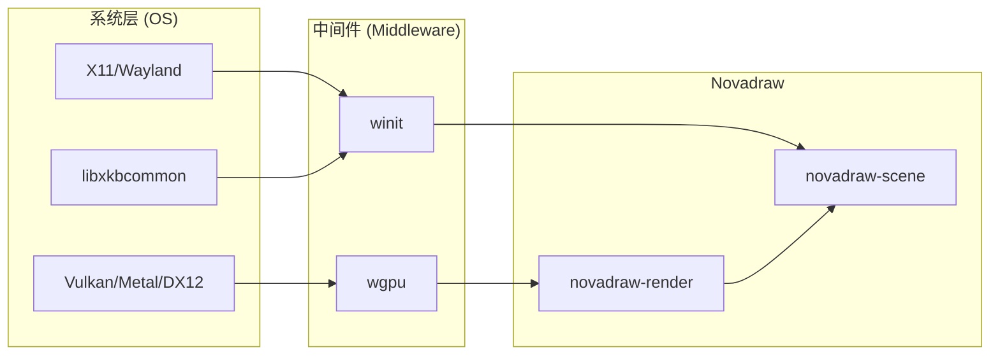
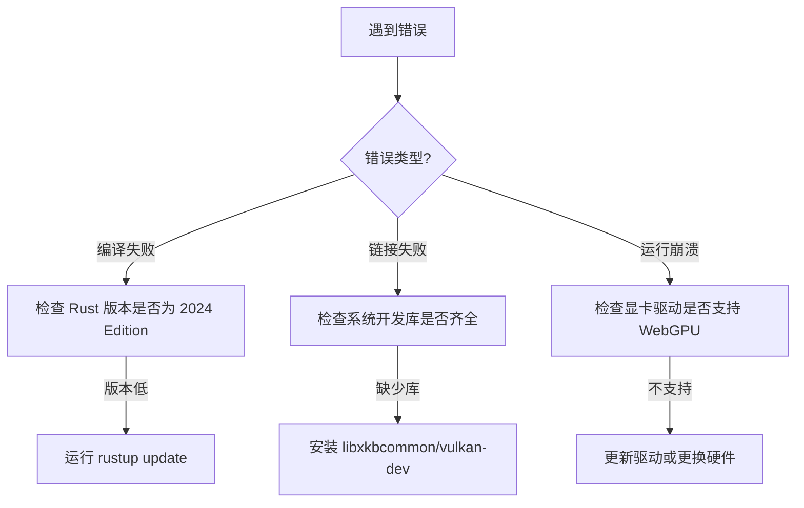

# 环境配置与依赖安装

## 目录
1. [模块概览](#模块概览)
2. [简介](#简介)
3. [Rust 工具链配置：迈向 2024 Edition](#rust-工具链配置迈向-2024-edition)
4. [系统级依赖安装：跨平台准备](#系统级依赖安装跨平台准备)
   - [Linux (Ubuntu/Debian) 深度配置](#linux-ubuntudebian-深度配置)
   - [macOS 开发环境](#macos-开发环境)
   - [Windows 开发环境](#windows-开发环境)
5. [WebGPU 驱动与硬件要求：渲染基石](#webgpu-驱动与硬件要求渲染基石)
6. [核心组件分析：Cargo.toml 与依赖链](#核心组件分析cargotoml-与依赖链)
7. [项目编译与运行指南](#项目编译与运行指南)
8. [常见编译错误与排除：疑难解答](#常见编译错误与排除疑难解答)
9. [验证安装：运行首个演示程序](#验证安装运行首个演示程序)
10. [文件参考](#文件参考)

## 模块概览

在深入探讨具体的安装步骤之前，首先对 Novadraw 项目的规模和结构进行宏观审视。这有助于开发者理解为何需要特定的环境配置。

- **文件规模与分布**：
  本项目是一个典型的 Rust Workspace 结构，包含约 150 个核心源代码文件。这些文件分布在不同的功能 crate 中，例如 `novadraw-core` 负责基础类型，`novadraw-render` 负责渲染抽象。
- **子模块结构**：
  - **核心引擎层**：包括 `novadraw-math`、`novadraw-geometry`、`novadraw-scene` 等，构成了绘图引擎的主体。
  - **应用验证层**：位于 `apps/` 目录下，包含 `shape-app`、`editor` 等多个独立应用，用于验证引擎在不同场景下的表现。
  - **文档与决策层**：`doc/` 目录存储了大量的架构设计文档和 ADR（架构决策记录），是理解项目设计哲学的关键。
- **配置重点**：
  本指南将重点关注如何配置支持 **Rust 2024 Edition** 的开发环境，以及如何满足 **WebGPU** 渲染后端的系统级依赖。我们将覆盖 Linux、macOS 和 Windows 三大主流平台，确保开发者能够无障碍地参与到项目中。

## 简介

Novadraw 是一个旨在重新定义高性能 2D 图形开发的工具包。它不仅是一个简单的绘图库，更是一个参考了 Eclipse Draw2D/GEF 架构精髓的现代图形框架。通过结合 Rust 的内存安全性与 WebGPU 的硬件加速能力，Novadraw 能够在保持高性能的同时，提供极佳的跨平台一致性。

在开发环境中，Novadraw 对硬件和软件都有一定的要求。由于其渲染引擎底层基于 `wgpu` 和 `vello`，这要求开发者的机器必须具备现代显卡驱动支持。此外，项目积极拥抱 Rust 社区的最新成果，采用了 Rust 2024 Edition，这为开发者带来了更强大的语言特性，但也对编译器版本提出了硬性要求。

## Rust 工具链配置：迈向 2024 Edition

Novadraw 选择了 **Rust 2024 Edition** 作为其构建基础。这是 Rust 语言的一个重要里程碑，引入了许多改进的语言特性和更严格的编译器检查。

### 为什么选择 2024 Edition？
选择最新的 Edition 能够确保项目利用 Rust 语言的最前沿优化，例如更好的异步支持、更清晰的模块路径解析以及改进的借用检查器。这对于像 Novadraw 这样复杂的图形引擎来说至关重要，因为我们需要在高性能渲染和复杂的场景图管理之间取得平衡。

### 安装与更新流程
如果你是一个 Rust 新手，或者你的编译器版本还停留在过去，你需要执行以下步骤：

1. **安装 rustup**：
   这是管理 Rust 版本的官方工具。在 Unix 系统上，只需运行：
   ```bash
   curl --proto '=https' --tlsv1.2 -sSf https://sh.rustup.rs | sh
   ```
2. **切换到最新版本**：
   由于 2024 Edition 非常新，你可能需要确保你的 `stable` 通道版本至少在 1.85 以上。运行以下命令进行更新：
   ```bash
   rustup update stable
   ```
3. **验证配置**：
   你可以通过查看编译器版本来确认：
   ```bash
   rustc --version
   ```

> 💡 **注意**：如果你的开发环境受到网络限制，可以考虑配置 Rust 镜像源（如清华源或字节跳动源）来加速下载。

## 系统级依赖安装：跨平台准备

Novadraw 依赖于一些系统级的底层库来处理窗口创建、输入事件和图形上下文。不同平台的安装方式各有侧重。

### Linux (Ubuntu/Debian) 深度配置
在 Linux 环境下，图形库的依赖最为复杂。你需要确保 X11 或 Wayland 的开发头文件已经安装，同时还需要 Vulkan 的加载器。

```bash
# 更新包列表
sudo apt-get update

# 安装核心开发依赖
sudo apt-get install -y \
    libxkbcommon-dev \
    libvulkan-dev \
    vulkan-loader \
    libwayland-dev \
    libx11-dev \
    pkg-config \
    build-essential
```

**为什么需要这些库？**
- `libxkbcommon`：用于处理键盘映射，是 `winit` 处理输入事件的基础。
- `vulkan-loader`：`wgpu` 在 Linux 上默认优先使用 Vulkan 后端，该库负责加载显卡驱动提供的 Vulkan 实现。
- `pkg-config`：Cargo 在编译依赖（如 `shaderc`）时需要它来定位系统库。

### macOS 开发环境
macOS 的配置相对简单。Apple 的 Metal 框架是系统内置的，且 `wgpu` 对其有极好的支持。

1. **安装 Xcode 命令行工具**：
   ```bash
   xcode-select --install
   ```
2. **推荐工具**：虽然不是强制的，但安装 `brew` 可以方便后续安装其他调试工具。

### Windows 开发环境
在 Windows 上，Novadraw 推荐使用 MSVC 工具链。

1. **Visual Studio 2022**：安装时务必勾选 "C++ 桌面开发"。
2. **图形驱动**：确保你的 NVIDIA、AMD 或 Intel 驱动程序是最新的，以支持 DirectX 12 或 Vulkan。

下图展示了系统依赖与 Novadraw 模块之间的交互关系：



该图清晰地展示了系统级依赖是如何通过中间件层传递到 Novadraw 引擎的。`winit` 负责吸收系统窗口和输入差异，而 `wgpu` 负责屏蔽底层图形 API 的复杂性。Novadraw 的渲染和场景模块则建立在这些抽象之上。

## WebGPU 驱动与硬件要求：渲染基石

Novadraw 的核心设计决策之一是全面拥抱 WebGPU。在 [ADR-001](doc/adr/adr-001-webgpu-rust-stack.md) 中，团队详细记录了这一决策的初衷：为了利用 `vello` 带来的高性能 GPU 矢量渲染能力。

### 硬件兼容性
WebGPU 虽然名为 "Web"，但它是一个非常强大的原生图形 API。它要求硬件至少支持：
- **Vulkan 1.2+**：适用于绝大多数现代 Linux 和 Windows 机器。
- **Metal**：适用于近十年的所有 Mac 设备。
- **DirectX 12**：适用于 Windows 10/11 上的主流显卡。

### 如何检查你的硬件是否达标？
如果你不确定自己的机器是否支持，可以尝试以下方法：
1. **Linux**: 运行 `vulkaninfo | grep apiVersion`，确保版本号 >= 1.2。
2. **Windows**: 运行 `dxdiag` 检查 DirectX 版本。
3. **跨平台**: 尝试运行 `cargo run -p vello-app`。如果该应用能正常显示窗口并渲染出图形，说明你的硬件和驱动完全符合要求。

## 核心组件分析：Cargo.toml 与依赖链

Novadraw 的依赖管理非常严谨。通过分析根目录的 `Cargo.toml`，我们可以看到项目的技术选型。

```toml
[workspace.dependencies]
vello = "0.7.0"           # 核心矢量渲染引擎
wgpu = { version = "26.0.1", features = ["std", "wgsl"] } # 图形 API 抽象层
winit = "0.30.12"         # 跨平台窗口管理
glam = "0.30.9"           # 高性能数学库
```

**设计考量**：
- **Vello**：作为渲染后端，它利用了计算着色器（Compute Shaders）来实现极速的矢量图形绘制。
- **WGPU**：作为 Rust 生态中最成熟的图形库，它保证了 Novadraw 可以在不修改代码的情况下运行在不同的 GPU 后端上。
- **Glam**：选择 `glam` 是因为它针对 SIMD 进行了优化，非常适合图形运算。

**Section sources**:
- [Cargo.toml](Cargo.toml)

## 项目编译与运行指南

配置好环境后，接下来就是编译项目。由于 Novadraw 是一个多 crate 的 workspace，建议使用以下命令：

### 全局检查
在进行任何实质性改动前，先运行检查以确保依赖已正确下载并编译：
```bash
cargo check --workspace
```

### 运行特定应用
Novadraw 提供了大量的演示应用，最常用的是 `shape-app`，它展示了引擎支持的所有基本图形。
```bash
# 运行图形演示
cargo run -p shape-app

# 运行编辑器原型
cargo run -p editor
```

### 编译优化
在开发阶段，默认使用 `debug` 模式。如果你想体验极致的渲染性能，请使用 `release` 模式：
```bash
cargo run -p shape-app --release
```

## 常见编译错误与排除：疑难解答

即使环境配置看似完美，有时也会遇到一些棘手的问题。

### 1. 链接器错误 (Linker Errors)
**现象**：提示 `cc` 或 `linker` 找不到。
**根因**：系统缺少 C 编译环境。
**解决**：安装 `build-essential` (Linux) 或 Visual Studio Build Tools (Windows)。

### 2. 缺少着色器编译器 (Shader Compilation Failed)
**现象**：运行应用时崩溃，提示无法编译 WGSL 着色器。
**根因**：通常是由于显卡驱动版本过低，不支持某些 WebGPU 特性。
**解决**：更新显卡驱动至最新稳定版。

### 3. Wayland 协议错误
**现象**：在某些 Linux 发行版上，应用启动后立即退出。
**根因**：`winit` 在某些 Wayland 环境下的兼容性问题。
**解决**：尝试设置环境变量强制使用 X11 模式：`WINIT_UNIX_BACKEND=x11 cargo run -p shape-app`。

下图描述了遇到编译/运行错误时的排查决策路径：



这个决策树为开发者提供了一个清晰的排查思路。大多数编译问题可以通过更新工具链或安装缺失的系统库解决，而运行时的崩溃则通常指向底层的图形驱动支持。

## 验证安装：运行首个演示程序

最后一步是验证。我们推荐运行 `shape-app`，因为它覆盖了引擎的大部分核心路径。

1. **执行命令**：`cargo run -p shape-app`
2. **预期结果**：
   - 弹出一个标题为 "shape-app" 的窗口。
   - 窗口内显示矩形、圆角矩形、椭圆、三角形等图形。
   - 背景色为浅灰色 (`RGB 238, 238, 238`)。
3. **交互验证**：
   - 使用方向键或鼠标滚轮切换不同的测试场景。
   - 按 `I` 键观察渲染模式（迭代 vs 递归）的切换是否平滑。

如果以上步骤均正常，恭喜你！你已经成功配置好了 Novadraw 的开发环境，可以开始你的图形开发之旅了。

## 文件参考

为了进一步深入了解，建议阅读以下参考文件：

- [Cargo.toml](Cargo.toml) - 项目依赖与 Workspace 配置。
- [CLAUDE.md](CLAUDE.md) - 包含项目开发规范与常用命令。
- [doc/adr/adr-001-webgpu-rust-stack.md](doc/adr/adr-001-webgpu-rust-stack.md) - 技术栈选型的深度解析。
- [apps/README.md](apps/README.md) - 演示应用的功能说明与运行指南。
- [doc/00-index.md](doc/00-index.md) - 完整的文档索引，指引你前往架构设计的更深处。

**Section sources**:
- [Cargo.toml](Cargo.toml)
- [CLAUDE.md](CLAUDE.md)
- [doc/adr/adr-001-webgpu-rust-stack.md](doc/adr/adr-001-webgpu-rust-stack.md)
- [apps/README.md](apps/README.md)
