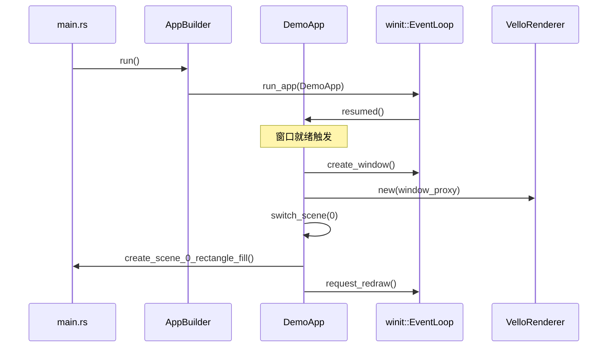
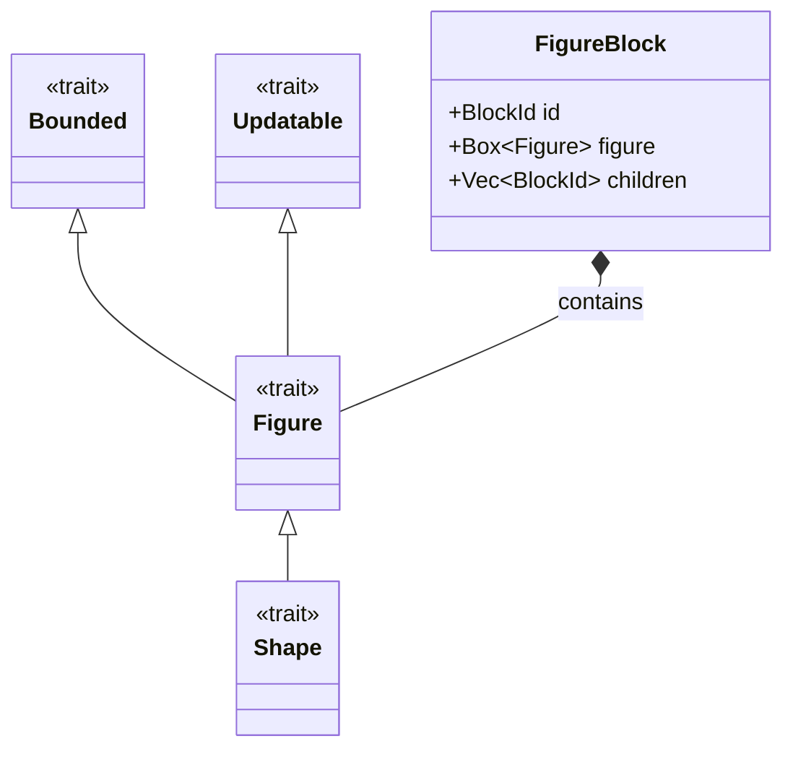
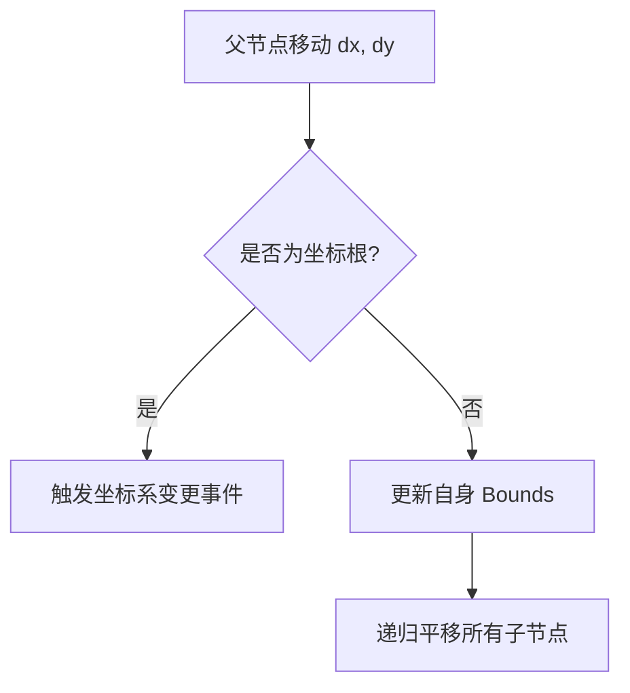
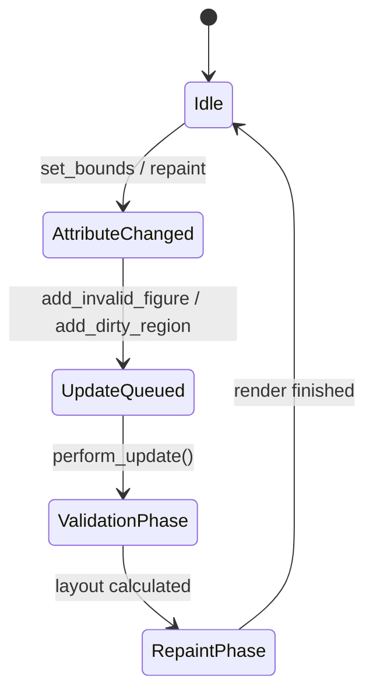
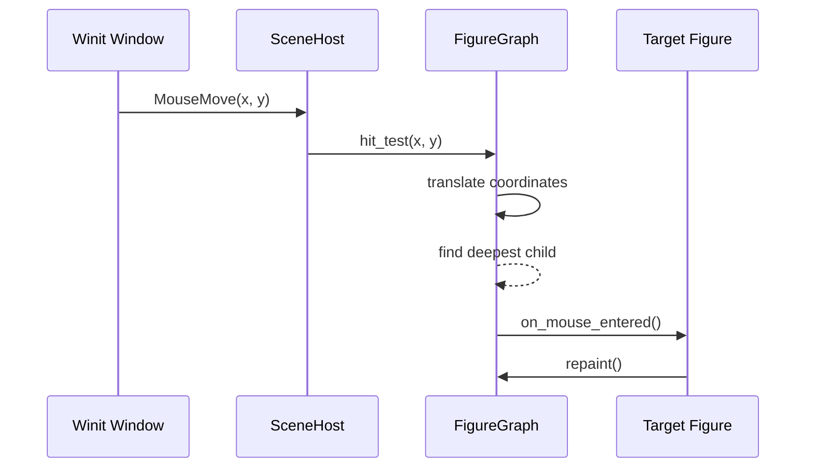
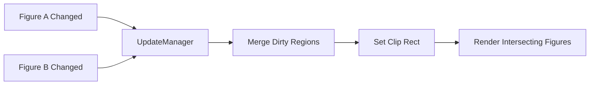

# 编写首个 Figure 应用

## 目录
1. [模块概览](#模块概览)
2. [引言](#引言)
3. [系统初始化：从 main 到窗口](#系统初始化从-main-到窗口)
4. [核心架构：Figure 体系](#核心架构figure-体系)
5. [场景构建实战：FigureGraph](#场景构建实战figuregraph)
6. [布局与坐标系统](#布局与坐标系统)
7. [更新机制：两阶段更新与 UpdateManager](#更新机制两阶段更新与-updatemanager)
8. [渲染流程：从 Figure 到 GPU](#渲染流程从-figure-到-gpu)
9. [事件处理与交互](#事件处理与交互)
10. [进阶：自定义 Figure 实现](#进阶自定义-figure-实现)
11. [性能优化：脏区域与合并](#性能优化脏区域与合并)
12. [调试与诊断工具](#调试与诊断工具)
13. [完整代码解析](#完整代码解析)
14. [文件引用](#文件引用)

## 模块概览

在本章节中，我们将深入剖析如何编写第一个 Novadraw 应用。Novadraw 是一个现代化的、高性能的 Rust 2D 图形引擎，其设计哲学深度借鉴了经典图形库 Eclipse Draw2D。

### 涉及模块与规模
本次探索涵盖了 Novadraw 生态系统中的多个核心子模块，总计涉及约 40 个关键源文件：

- **`apps/shape-app`**: 演示应用的主入口。它是一个典型的“Hello World”级别应用，展示了如何使用 Novadraw 渲染各种基础形状（矩形、椭圆、圆角矩形、折线等）。
- **`novadraw`**: 核心聚合库。它作为所有子模块（core, geometry, render, scene）的统一导出点，为开发者提供简洁的 API。
- **`novadraw-scene`**: 场景管理核心。这是引擎的“大脑”，负责 Figure 树的维护、布局计算、事件分发以及场景主机（SceneHost）的协调。包含约 34 个文件，是本次分析的重点。
- **`novadraw-apps`**: 应用框架封装。它隐藏了底层窗口管理（winit）和渲染后端（vello）的复杂性，提供了一个开箱即用的 `DemoApp` 框架。
- **`novadraw-render`**: 渲染抽象层。定义了 `NdCanvas` 和渲染指令集，支持多种后端。

我们将通过分析 `shape-app` 的实现，带你走通从系统初始化到图形显示的完整链路。

## 引言

在图形开发领域，通常有两种主要的模式：**立即模式（Immediate Mode）**和**保留模式（Retained Mode）**。立即模式（如 Dear ImGui）要求开发者在每一帧都重新提交所有的绘图指令；而保留模式则允许开发者构建一个持久的对象模型，由引擎负责维护状态、处理更新和优化渲染。

Novadraw 选择了**保留模式**。在 Novadraw 中，一切皆为 **Figure**。Figure 不仅仅是一个绘图指令的集合，它是一个拥有边界（Bounds）、层级关系（Parent/Children）、生命周期（Validation）和交互能力的有状态对象。

编写第一个 Novadraw 应用的目标，就是理解如何构建这棵 Figure 树，并让它在高性能的渲染后端（如基于 GPU 的 Vello）上流动起来。本教程将带你从零开始，理解 Novadraw 的每一个核心齿轮是如何咬合的。

## 系统初始化：从 main 到窗口

Novadraw 应用的生命周期始于 `main` 函数。为了简化开发，我们提供了一个强大的 `AppBuilder`。

### 1. 应用构建器 (AppBuilder)
`AppBuilder` 采用了典型的构建器模式，允许开发者声明式地配置应用。它负责协调 `winit` 的事件循环和 `vello` 的渲染上下文。

```rust
// apps/shape-app/src/main.rs

fn main() {
    let title = "Shape App";
    let app_name = "shape-app";
    
    // 定义场景列表
    let scenes = vec![
        ("Rectangle Fill", Box::new(|| create_scene_0_rectangle_fill())),
        // ...
    ];

    // 使用 AppBuilder 启动
    AppBuilder::new(title)
        .with_size(800.0, 600.0)
        .with_app_name(app_name)
        .with_scenes_boxed(scenes)
        .run()
        .expect("Failed to run app");
}
```

### 2. 内部初始化流程
当调用 `.run()` 时，`AppBuilder` 会初始化 `winit` 事件循环，并创建一个 `DemoApp` 实例。`DemoApp` 实现了 `winit` 的 `ApplicationHandler` 接口，负责处理窗口的生命周期。



在 `resumed` 阶段，系统会完成最关键的两个动作：
1. **窗口创建**：通过 `winit` 创建原生窗口，并设置初始尺寸和标题。
2. **渲染后端绑定**：将窗口句柄传递给 `VelloRenderer`，初始化 GPU 渲染上下文。这包括创建 `RenderSurface` 和配置 `RenderDevice`。

**Section sources**:
- [apps/shape-app/src/main.rs](apps/shape-app/src/main.rs)
- [novadraw-apps/src/app.rs](novadraw-apps/src/app.rs)

## 核心架构：Figure 体系

Novadraw 的核心架构基于 Trait 组合而非传统的类继承。这种设计既保留了面向对象的直观性，又符合 Rust 的类型安全哲学。

### 1. Trait 层级结构
Figure 的能力被拆分为多个层级的 Trait，每个 Trait 负责一个特定的功能维度：

- **`Bounded`**: 基础几何能力。定义了 `bounds()`（获取边界矩形）、`set_bounds()` 以及 `contains_point()`（点击检测）。它是所有 Figure 的几何基础。
- **`Updatable`**: 生命周期管理。核心方法是 `validate()`，用于在布局计算完成后执行图形内部的预计算。例如，三角形图形会在此阶段根据最新的 bounds 计算其三个顶点的坐标。
- **`Figure`**: 核心渲染接口。继承自 `Bounded` 和 `Updatable`。它是所有图形对象的基类，定义了 `paint_figure()` 和 `paint_border()`。
- **`Shape`**: 装饰性图形。为具有填充（Fill）和描边（Stroke）属性的图形提供了一套模板方法（Template Method），如 `fill_shape()` 和 `outline_shape()`。

### 2. FigureBlock：数据与行为的分离
在 `FigureGraph` 内部，Figure 并不直接相互持有。相反，引擎使用 `FigureBlock` 作为容器，这种模式被称为“组件-容器”模式：

```rust
// novadraw-scene/src/scene/mod.rs

pub struct FigureBlock {
    pub(crate) id: BlockId,            // 唯一 ID
    pub(crate) children: Vec<BlockId>, // 子节点 ID 列表
    pub(crate) parent: Option<BlockId>,// 父节点 ID
    pub(crate) figure: Box<dyn Figure>,// 具体的图形实现
    pub(crate) is_valid: bool,         // 布局有效性标记
    // ... 其他状态（选中、悬停、可见性等）
}
```

这种设计通过 `SlotMap` 管理内存，避免了 Rust 中常见的循环引用问题（例如父子互持引用），并提高了缓存友好性。



**Section sources**:
- [novadraw-scene/src/figure/mod.rs](novadraw-scene/src/figure/mod.rs)
- [novadraw-scene/src/scene/mod.rs](novadraw-scene/src/scene/mod.rs)

## 场景构建实战：FigureGraph

`FigureGraph` 是 Novadraw 的场景容器。它不仅管理 Figure 的层级，还负责协调布局和更新。

### 1. 构建场景的步骤
构建一个场景通常遵循以下模式：

1. **初始化场景**：调用 `FigureGraph::new()`。这将创建一个包含隐藏 `RootFigure` 的初始图结构。
2. **设置内容根 (Contents)**：调用 `set_contents()`。这相当于 Draw2D 中的 `LightweightSystem.setContents()`，它定义了用户可见部分的起始节点。
3. **添加子节点**：使用 `add_child_to(parent_id, child_figure)`。

```rust
fn create_demo_scene() -> FigureGraph {
    let mut scene = FigureGraph::new();

    // 创建根容器
    let root = RectangleFigure::new(0.0, 0.0, 800.0, 600.0);
    let root_id = scene.set_contents(Box::new(root));

    // 添加一个蓝色的矩形
    let blue_rect = RectangleFigure::new_with_color(
        100.0, 100.0, 200.0, 150.0, 
        Color::hex("#3498db")
    );
    scene.add_child_to(root_id, Box::new(blue_rect));

    scene
}
```

### 2. 批量构建 vs 交互式修改
- **`add_child_to`**: 用于初始化场景。它建立层级关系但不触发即时重绘，适合批量构建。
- **`add_child`**: 用于交互式修改（如用户拖拽添加）。它会自动调用 `UpdateManager` 标记脏区域并请求重绘，确保 UI 能够实时响应。

**Section sources**:
- [novadraw-scene/src/scene/mod.rs](novadraw-scene/src/scene/mod.rs)

## 布局与坐标系统

Novadraw 提供了一套灵活的坐标系统，支持绝对坐标和本地坐标两种模式。

### 1. 坐标模式 (Coordinate Systems)
- **绝对坐标模式 (Default)**：Figure 的 `bounds` 是相对于最近的“坐标根”的。如果父链上没有任何节点开启本地坐标，那么所有 Figure 都共享同一个全局坐标系。
- **本地坐标模式 (Local Coordinates)**：通过 `with_local_coordinates(true)` 开启。此时，该 Figure 成为其子树的坐标根。子节点的 `bounds` 将相对于该节点的 `client_area`（即扣除边框后的内部区域）进行定位。

### 2. 坐标传播机制
当一个父节点移动时，Novadraw 使用 `prim_translate` 方法来传播位置变更。



这种机制确保了在保留模式下，父节点的移动能自动带动整个子树，而无需开发者手动更新每个子节点的位置。这在实现复杂的 UI 容器（如滚动面板或对话框）时尤为重要。

**Section sources**:
- [novadraw-scene/src/scene/mod.rs](novadraw-scene/src/scene/mod.rs)
- [novadraw-scene/src/figure/mod.rs](novadraw-scene/src/figure/mod.rs)

## 更新机制：两阶段更新与 UpdateManager

为了实现高性能渲染，Novadraw 采用了**两阶段更新（Two-phase Update）**策略，这深受 Eclipse Draw2D `DeferredUpdateManager` 的启发。

### 1. 第一阶段：布局验证 (Validation Phase)
当 Figure 的属性（如尺寸）发生变化时，它会被标记为“无效”（Invalid）。在渲染帧开始时，`UpdateManager` 会遍历所有无效节点：
- 调用 `revalidate()` 重新计算布局。如果父节点有布局管理器（LayoutManager），则由管理器决定子节点的位置。
- 调用 Figure 内部的 `validate()` 预计算几何数据。

### 2. 第二阶段：重绘 (Repaint Phase)
Novadraw 维护一个“脏区域”集合（Damage Set）。
- 只有与脏区域相交的 Figure 才会执行 `paint()` 操作。
- 引擎会将多个小的脏矩形合并为一个大的更新区域，以减少 GPU 提交次数。



**Section sources**:
- [novadraw-scene/src/update/mod.rs](novadraw-scene/src/update/mod.rs)
- [novadraw-scene/src/scene_host.rs](novadraw-scene/src/scene_host.rs)

## 渲染流程：从 Figure 到 GPU

Novadraw 的渲染流程是高度解耦的。`FigureGraph` 负责生成平台无关的渲染指令，而 `RenderBackend` 负责将这些指令转换为像素。

### 1. 渲染遍历
Novadraw 支持两种渲染遍历方式：
- **递归渲染 (`render_recursive`)**：直觉、简单，适合小型场景。
- **迭代渲染 (`render_iterative`)**：使用显式栈管理遍历，避免在极深树结构下发生栈溢出。这是生产环境中的推荐方式。

### 2. 指令生成
每个 Figure 在 `paint_figure` 中向 `NdCanvas` 提交指令。`NdCanvas` 充当了一个“指令收集器”的角色：

```rust
// novadraw-scene/src/figure/rectangle.rs

fn fill_shape(&self, gc: &mut NdCanvas) {
    gc.fill_rect(
        self.bounds.x, self.bounds.y,
        self.bounds.width, self.bounds.height,
        self.fill_color,
    );
}
```

这些指令最终被打包成 `RenderSubmission` 提交给 Vello 后端。Vello 利用 GPU 的计算着色器（Compute Shaders）实现极速的矢量渲染，能够处理复杂的路径、渐变和混合模式。

**Section sources**:
- [novadraw-scene/src/scene/render_recursive.rs](novadraw-scene/src/scene/render_recursive.rs)
- [novadraw-scene/src/scene/render_iterative.rs](novadraw-scene/src/scene/render_iterative.rs)

## 事件处理与交互

Novadraw 拥有一套完整的事件分发系统，能够精准地识别用户的交互意图。

### 1. 命中测试 (Hit Testing)
当鼠标点击发生时，`FigureGraph` 执行深度优先遍历：
- 从根节点开始，逆序检查子节点（确保最上层的图形先被检测到，即 Z-order 最高的节点）。
- 考虑坐标变换：如果遇到坐标根，会自动应用 `translateFromParent` 变换坐标，将屏幕坐标转换为局部坐标。

### 2. 交互状态管理
`FigureBlock` 内部维护了 `is_hovered`、`is_pressed` 和 `is_selected` 等状态。引擎会自动处理鼠标进入/离开事件，并根据状态变化请求重绘。



**Section sources**:
- [novadraw-scene/src/scene/mod.rs](novadraw-scene/src/scene/mod.rs)
- [novadraw-scene/src/event/mod.rs](novadraw-scene/src/event/mod.rs)

## 进阶：自定义 Figure 实现

除了引擎自带的 `RectangleFigure` 和 `EllipseFigure`，开发者可以轻松实现自定义图形。

### 实现步骤
1. **定义结构体**：包含必要的几何和样式属性。
2. **实现 `Bounded`**：管理边界。
3. **实现 `Updatable`**：处理验证逻辑。
4. **实现 `Shape` 或 `Figure`**：编写具体的渲染逻辑。

```rust
pub struct MyCustomFigure {
    bounds: Rectangle,
}

impl Bounded for MyCustomFigure {
    fn bounds(&self) -> Rectangle { self.bounds }
    fn set_bounds(&mut self, x: f64, y: f64, w: f64, h: f64) {
        self.bounds = Rectangle::new(x, y, w, h);
    }
    fn name(&self) -> &'static str { "MyCustomFigure" }
}

impl Updatable for MyCustomFigure {
    fn validate(&mut self) { /* 预计算逻辑 */ }
}

impl Figure for MyCustomFigure {
    fn paint_figure(&self, gc: &mut NdCanvas) {
        // 使用 gc 提供的绘图 API 绘制自定义内容
        gc.fill_ellipse(self.bounds.x, self.bounds.y, self.bounds.width, self.bounds.height, Color::BLUE);
    }
}
```

通过这种方式，Novadraw 的渲染能力可以无限扩展。

**Section sources**:
- [novadraw-scene/src/figure/mod.rs](novadraw-scene/src/figure/mod.rs)

## 性能优化：脏区域与合并

Novadraw 的高性能不仅仅来自于 GPU 渲染，更来自于精细的更新管理。

### 1. 脏矩形合并
如果一个场景中有多个 Figure 发生了变化，`UpdateManager` 不会为每个 Figure 都触发一次完整的屏幕刷新。相反，它会计算这些 Figure 边界的并集（Union），或者维护一个不相交的矩形集合（Damage Set）。

### 2. 裁剪（Clipping）
在渲染阶段，引擎会设置裁剪区域。任何完全处于脏区域之外的 Figure 都会被渲染器直接跳过，这极大地降低了 CPU 端的开销和 GPU 的指令提交量。



**Section sources**:
- [novadraw-scene/src/update/repair.rs](novadraw-scene/src/update/repair.rs)
- [novadraw-scene/src/update/deferred.rs](novadraw-scene/src/update/deferred.rs)

## 调试与诊断工具

Novadraw 内置了一些调试工具，帮助开发者理解复杂的 Figure 树结构。

### 1. 树结构打印
通过开启 `debug_render` 特性，你可以调用 `scene.print_tree()` 来在控制台输出当前场景的完整层级结构，包括每个节点的 Bounds 和可见性。

### 2. 渲染顺序验证
`print_render_order()` 方法可以输出引擎当前的渲染序列，这对于调试 Z-order 遮挡问题非常有用。

> **注意**：这些工具通常只在开发环境下使用，生产环境下应当关闭。

**Section sources**:
- [novadraw-scene/src/scene/mod.rs](novadraw-scene/src/scene/mod.rs)

## 完整代码解析

让我们回到 `shape-app`，逐行解析这个“Hello World”应用的精髓。

```rust
// apps/shape-app/src/main.rs

/// 创建一个展示矩形填充的场景
fn create_scene_0_rectangle_fill() -> novadraw::FigureGraph {
    // 初始化场景图
    let mut scene = novadraw::FigureGraph::new();

    // 1. 创建根容器
    // 所有的 Figure 最终都必须挂载到这棵树上。
    // 这里使用 WINDOW_WIDTH/HEIGHT 确保容器覆盖整个窗口。
    let container = novadraw::RectangleFigure::new(0.0, 0.0, WINDOW_WIDTH, WINDOW_HEIGHT);
    let container_id = scene.set_contents(Box::new(container));

    // 2. 创建一个带颜色的矩形
    // new_with_color 是一个便捷构造函数，它内部初始化了填充颜色。
    let rect_1 = novadraw::RectangleFigure::new_with_color(
        50.0, 50.0, 150.0, 100.0,
        novadraw::Color::rgba(0.8, 0.2, 0.2, 1.0), // 红色
    );

    // 3. 链式调用设置描边
    // Novadraw 倾向于使用 Builder 风格的 API，使代码更具可读性。
    let rect_with_stroke = novadraw::RectangleFigure::new_with_color(
        250.0, 50.0, 100.0, 100.0,
        novadraw::Color::rgba(0.2, 0.8, 0.2, 1.0),
    )
    .with_stroke(novadraw::Color::WHITE, 2.0);

    // 4. 将 Figure 添加到容器
    // add_child_to 返回一个 BlockId，这是一个轻量级的句柄。
    scene.add_child_to(container_id, Box::new(rect_1));
    scene.add_child_to(container_id, Box::new(rect_with_stroke));

    // 返回构建好的场景图对象
    scene
}
```

### 关键点总结：
- **`FigureGraph`**：是所有操作的上下文，负责管理内存和生命周期。
- **`BlockId`**：是引用 Figure 的唯一句柄，比直接持有 `&Figure` 更安全且易于在异步环境中使用。
- **`Box<dyn Figure>`**：利用 Rust 的 Trait Object 实现了多态渲染，使得不同类型的图形可以共存于同一棵树中。
- **`Color`**：支持多种初始化方式，内部使用线性空间（Linear Space）进行计算，确保颜色还原的准确性。

**Section sources**:
- [apps/shape-app/src/main.rs](apps/shape-app/src/main.rs)

## 文件引用

以下是构建首个 Novadraw 应用涉及的关键源文件，建议开发者深入阅读：

- **应用框架层**:
    - [apps/shape-app/src/main.rs](apps/shape-app/src/main.rs): 形状展示应用主入口。
    - [novadraw-apps/src/app.rs](novadraw-apps/src/app.rs): `DemoApp` 框架实现，处理 winit 事件。
    - [novadraw-apps/src/lib.rs](novadraw-apps/src/lib.rs): 应用框架聚合入口。

- **场景与图形层**:
    - [novadraw-scene/src/scene/mod.rs](novadraw-scene/src/scene/mod.rs): `FigureGraph` 和 `FigureBlock` 的核心实现。
    - [novadraw-scene/src/figure/mod.rs](novadraw-scene/src/figure/mod.rs): Figure Trait 体系定义。
    - [novadraw-scene/src/figure/rectangle.rs](novadraw-scene/src/figure/rectangle.rs): 矩形图形的具体实现。
    - [novadraw-scene/src/scene_host.rs](novadraw-scene/src/scene_host.rs): 场景与平台交互的桥梁。

- **更新与渲染层**:
    - [novadraw-scene/src/update/mod.rs](novadraw-scene/src/update/mod.rs): 两阶段更新管理器定义。
    - [novadraw-scene/src/scene/render_recursive.rs](novadraw-scene/src/scene/render_recursive.rs): 递归渲染实现。
    - [novadraw-scene/src/scene/render_iterative.rs](novadraw-scene/src/scene/render_iterative.rs): 迭代渲染实现。
    - [novadraw-scene/src/update/repair.rs](novadraw-scene/src/update/repair.rs): 脏区域修复逻辑。
