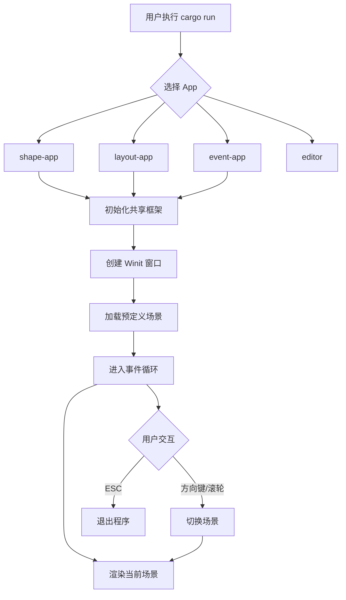
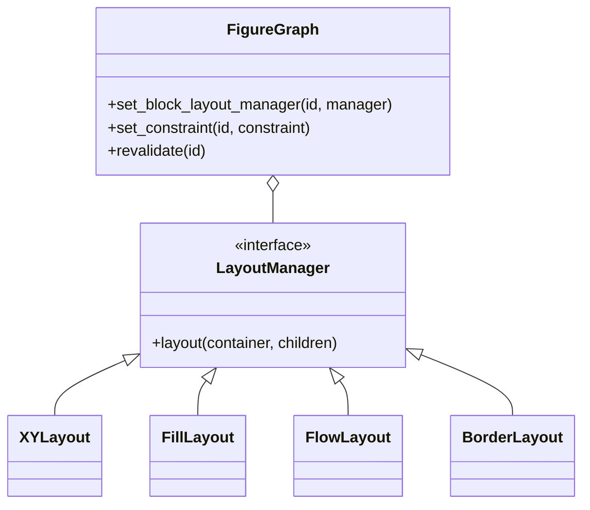
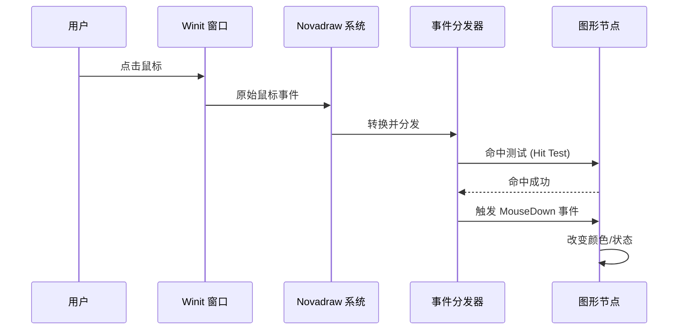
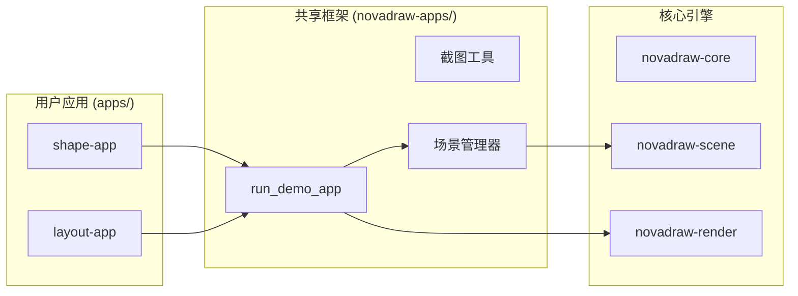

# 运行演示程序

## 目录
1. [模块概览](#模块概览)
2. [快速开始](#快速开始)
3. [演示应用详解](#演示应用详解)
   - [shape-app: 基础形状渲染](#shape-app-基础形状渲染)
   - [layout-app: 布局管理器展示](#layout-app-布局管理器展示)
   - [event-app: 交互与事件分发](#event-app-交互与事件分发)
   - [editor: 交互式编辑器原型](#editor-交互式编辑器原型)
   - [style-app: 视觉属性验证](#style-app-视觉属性验证)
   - [transform-app: 坐标空间变换](#transform-app-坐标空间变换)
4. [通用交互指南](#通用交互指南)
5. [架构设计与共享框架](#架构设计与共享框架)
6. [参考文件](#参考文件)

## 模块概览

Novadraw 仓库中的 `apps/` 目录是一个专门用于功能验证和展示的集合。它包含了多个独立的 Rust 项目，每个项目都专注于验证引擎的一个特定核心功能模块。通过这些演示应用，开发者可以直观地感受 Novadraw 的渲染能力、布局逻辑和事件处理机制。

**模块统计信息**：
- **总项目数**：11 个子应用
- **核心源文件数**：16 个 `.rs` 文件（不含测试和辅助文件）
- **覆盖范围**：涵盖了从底层渲染 API 到高层布局管理器的完整技术栈

这些应用不仅是用户的学习示例，也是引擎开发过程中的集成测试工具。每个应用都遵循 MECE（相互独立，完全穷尽）原则设计场景，确保功能覆盖无死角。例如，`shape-app` 专注于几何形状，而 `style-app` 则专注于这些形状的颜色和描边属性，两者互不重叠，共同构成了对引擎渲染能力的全面测试。

| 子模块 | 核心职责 | 验证重点 |
| :--- | :--- | :--- |
| `shape-app` | 基础几何体 | 矩形、椭圆、圆角矩形、折线、三角形、Z-Order |
| `layout-app` | 布局引擎 | XY、Fill、Flow、Border 布局及其嵌套 |
| `event-app` | 交互系统 | 鼠标/键盘事件、焦点管理、事件冒泡 |
| `editor` | 综合应用 | 复杂的交互式图形编辑器原型 |
| `style-app` | 视觉属性 | 填充、描边、透明度、线帽/连接样式 |
| `transform-app` | 坐标空间 | 平移、缩放、旋转、变换传播 |
| `clip-app` | 裁剪机制 | 基础裁剪、嵌套裁剪、路径裁剪 |
| `update-app` | 生命周期 | 脏区重绘、生命周期通知 |

**Section sources**:
- [apps/README.md](apps/README.md)

## 快速开始

运行演示程序非常简单，只需在仓库根目录下使用 Cargo 命令即可。由于这是一个工作区（Workspace）结构，你需要通过 `-p`（或 `--package`）参数指定要运行的特定应用。

### 启动命令

```bash
# 运行形状演示
cargo run -p shape-app

# 运行布局演示
cargo run -p layout-app

# 运行事件演示
cargo run -p event-app

# 运行集成编辑器
cargo run -p editor
```

### 截图模式

大多数演示应用支持截图模式，这在自动化测试和文档生成中非常有用。通过命令行参数，你可以一次性生成所有场景的预览图，或者只针对特定场景进行截图。这对于视觉回归测试（Visual Regression Testing）至关重要，确保引擎的任何改动都不会破坏已有的渲染效果。

```bash
# 截图所有场景
cargo run -p shape-app -- --screenshot-all

# 截图指定场景（例如第 0 个场景）
cargo run -p shape-app -- --screenshot=0
```

下面的图表展示了用户启动演示程序时的典型操作流程。从命令输入到窗口呈现，整个过程由 `novadraw_apps` 框架自动化处理。



在启动过程中，`novadraw_apps` 框架会接管窗口创建和渲染循环。用户只需关注如何定义 `FigureGraph` 场景。框架会自动处理窗口大小调整、DPI 适配以及基础的输入事件转发。这种设计极大地降低了编写新演示程序的门槛，让开发者能专注于功能逻辑本身。

**Section sources**:
- [apps/README.md](apps/README.md)
- [apps/shape-app/src/main.rs](apps/shape-app/src/main.rs)

## 演示应用详解

### shape-app: 基础形状渲染

`shape-app` 是最基础的验证程序，它展示了 Novadraw 支持的所有内置几何图形。通过 8 个精心设计的场景，它验证了图形的几何生成和渲染正确性。

**核心验证点与场景详情**：
- **场景 0-2 (矩形/椭圆/圆角矩形)**：验证基础封闭图形的填充和描边。特别是在圆角矩形场景中，测试了不同半径下的圆角生成逻辑。
- **场景 3 (折线 Polyline)**：这是最复杂的几何验证之一，涵盖了多点折线、自相交折线以及不同线宽下的表现。
- **场景 5 (Z-Order)**：验证渲染引擎的深度排序。通过重叠不同颜色的图形，确保后加入场景的节点能够正确遮挡先加入的节点，这对于复杂的 UI 界面至关重要。
- **场景 7 (父子嵌套)**：验证图形在嵌套结构下的相对定位。当父节点移动时，子节点应保持相对位置不变，这是场景图（Scene Graph）的核心能力。

```rust
// 示例：创建一个包含多个矩形的场景
fn create_scene_0_rectangle_fill() -> novadraw::FigureGraph {
    let mut scene = novadraw::FigureGraph::new();
    let container = novadraw::RectangleFigure::new(0.0, 0.0, 800.0, 600.0);
    let container_id = scene.set_contents(Box::new(container));

    // 添加不同颜色和位置的矩形
    let rect_1 = novadraw::RectangleFigure::new_with_color(
        50.0, 50.0, 150.0, 100.0,
        novadraw::Color::rgba(0.8, 0.2, 0.2, 1.0),
    );
    scene.add_child_to(container_id, Box::new(rect_1));
    
    scene
}
```

### layout-app: 布局管理器展示

`layout-app` 展示了 Novadraw 强大的布局系统。它不仅验证了单一布局器的表现，还展示了复杂的嵌套布局场景，模拟了真实 UI 开发中的复杂需求。

**展示的布局器及其特性**：
- **XYLayout**：最灵活的布局器，允许通过 `Rectangle` 约束指定每个子元素的精确位置和大小。适用于需要像素级控制的画布场景。
- **FillLayout**：一种极简布局，通常用于让单个子元素（如背景图或主内容区）完全填满容器。
- **FlowLayout**：类似于 HTML 的流式布局。它支持 `with_spacing` 和 `with_row_spacing` 设置间距，并能根据容器宽度自动换行。
- **BorderLayout**：经典的五区域布局。通过设置特定的约束值（如高度为负表示北区，宽度为正表示东区），开发者可以轻松构建出带有侧边栏和状态栏的标准应用界面。

下面的类图展示了布局应用中常见的组件关系。布局管理器是独立于图形节点的策略对象。



`layout-app` 通过 `revalidate` 方法触发布局计算。在演示程序中，你可以看到当容器尺寸发生变化时，布局管理器是如何重新计算子节点位置的。这种解耦设计使得 Novadraw 能够轻松扩展新的布局策略，而无需修改核心渲染代码。

### event-app: 交互与事件分发

`event-app` 专注于验证 Novadraw 的事件系统。交互是图形引擎的灵魂，该应用通过 10 个交互式场景，确保每一个输入都能得到准确响应。

**关键交互验证场景**：
- **鼠标进入/离开 (MouseEnter/Exit)**：当鼠标滑过特定区域时，图形会改变颜色，验证了命中测试（Hit Testing）的实时性。
- **拖拽操作 (MouseDrag)**：演示了如何结合 `MouseDown`、`MouseMove` 和 `MouseUp` 实现平滑的图形拖动。
- **事件传播 (Event Propagation)**：这是该应用的核心场景。它构建了一个三层嵌套的矩形结构，验证点击最内层图形时，事件是如何逐层向上传播（冒泡）的。
- **焦点管理 (Focus)**：展示了多个可获取焦点的图形。用户可以通过点击或 Tab 键切换焦点，被选中的图形会呈现出高亮边框。



事件分发流程如上图所示。Novadraw 的事件系统采用了逻辑坐标系，这意味着无论窗口如何缩放或在不同 DPI 的屏幕间移动，开发者处理的坐标始终是一致的。

### editor: 交互式编辑器原型

`editor` 是一个更高级的示例，它不使用标准的 `novadraw_apps` 框架，而是直接集成 `winit` 和 `vello`。它模拟了一个真实的图形编辑器环境，是目前仓库中最复杂的演示程序。

**编辑器核心功能**：
- **场景切换系统**：支持通过快捷键 0-9 在 10 个不同的测试场景间无缝切换，包括基础锚点测试、嵌套可见性测试等。
- **DPI 适配验证**：内置了 DPI 探测逻辑，确保在 4K 屏幕或开启缩放的系统上，图形依然清晰且坐标对齐。
- **渲染模式实时切换**：按下 `I` 键可以在“递归渲染”和“迭代渲染”模式间切换。这主要用于引擎开发者的性能调优和算法验证。
- **自动化交互脚本**：支持运行预定义的脚本（如按下 `H` 键触发悬停脚本），这为自动化 UI 测试奠定了基础。

这个应用是开发新功能时的首要验证场所，因为它暴露了引擎在真实应用环境下的性能表现和易用性问题。

### style-app: 视觉属性验证

`style-app` 专注于图形的视觉呈现效果，它详细展示了 Novadraw 如何处理各种样式属性。

**验证内容**：
- **颜色与透明度**：展示了 RGBA 颜色的渲染，以及 Alpha 通道如何影响图形的重叠效果。
- **描边 (Stroke) 详解**：这是该 App 的重头戏。它展示了从 1px 到 20px 的不同线宽效果，以及三种线帽样式（Butt, Round, Square）和三种连接样式（Miter, Round, Bevel）的细微差别。
- **描边 vs 边框 (Stroke vs Border)**：这是一个重要的概念区分。描边是沿着几何路径绘制的，而边框（Border）是作为装饰器附加在图形上的。该场景展示了两者在视觉上的不同表现，特别是当设置了内边距（Insets）时。

### transform-app: 坐标空间变换

`transform-app` 深入验证了坐标变换的数学正确性。在复杂的场景图中，坐标变换的叠加和传播是最容易出错的地方。

**变换验证维度**：
- **基础变换**：平移 (Translate)、缩放 (Scale) 和旋转 (Rotate)。
- **变换传播**：当一个父容器被旋转 45 度并缩小 50% 时，其内部的所有子图形是否能正确地随之变换？该应用通过嵌套的矩形阵列给出了肯定的答案。
- **局部坐标系 (Local Coordinates)**：展示了开启局部坐标系后，子图形的坐标是如何相对于父图形左上角进行定义的。这极大地简化了复杂组件的开发逻辑。

**Section sources**:
- [apps/shape-app/src/main.rs](apps/shape-app/src/main.rs)
- [apps/layout-app/src/main.rs](apps/layout-app/src/main.rs)
- [apps/event-app/src/main.rs](apps/event-app/src/main.rs)
- [apps/editor/src/app_window.rs](apps/editor/src/app_window.rs)
- [apps/style-app/src/main.rs](apps/style-app/src/main.rs)
- [apps/transform-app/src/main.rs](apps/transform-app/src/main.rs)

## 通用交互指南

为了方便用户在不同演示应用之间切换和操作，所有基于 `novadraw_apps` 框架的应用都共享一套标准的快捷键。这些快捷键被硬编码在框架底层，确保了用户体验的一致性。

| 按键 | 功能描述 | 备注 |
| :--- | :--- | :--- |
| **方向键左/右** | 切换到上一个/下一个场景 | 最常用的导航方式 |
| **鼠标滚轮** | 快速切换场景 | 适合快速浏览所有功能 |
| **数字键 0-9** | 直接跳转到指定索引的场景 | 快速定位特定验证点 |
| **I 键** | 切换渲染模式 | 递归渲染（默认） vs 迭代渲染 |
| **U 键** | 开启/关闭 `UpdateManager` | 用于观察脏区更新和性能 |
| **ESC 键** | 立即退出当前应用程序 | 安全退出 |

> 💡 **提示**：在 `editor` 应用中，由于其特殊的架构，部分快捷键可能有所不同（如 `T` 键用于测试平移，`C` 键用于模拟点击），建议在启动时仔细阅读控制台输出的帮助信息。

**Section sources**:
- [apps/README.md](apps/README.md)
- [apps/editor/src/app_window.rs](apps/editor/src/app_window.rs)

## 架构设计与共享框架

为了减少代码重复，Novadraw 引入了 `novadraw_apps` 库，作为所有演示程序的脚手架。它封装了窗口管理、渲染后端初始化和场景切换逻辑，使得编写一个新的 App 只需要关注业务逻辑。

### 共享框架架构

下面的架构图展示了演示应用、共享框架与核心引擎之间的依赖关系。



这种分层设计允许开发者只需编写场景定义函数（返回 `FigureGraph`），而无需关心底层的渲染循环、窗口事件监听或复杂的 Vello 渲染器初始化过程。这种“插件式”的开发体验极大地提高了功能验证的效率。

### 场景切换状态机

当用户按下方向键切换场景时，框架内部会经历一个严谨的状态转换过程，以确保资源的正确释放和新场景的平滑加载。

```mermaid
state_diagram-v2
    [*] --> Idle: 运行当前场景
    Idle --> Switching: 用户触发切换 (Key/Scroll)
    Switching --> Cleanup: 销毁旧场景 FigureGraph
    Cleanup --> Loading: 调用场景工厂函数
    Loading --> Revalidate: 执行初始布局 (Revalidate)
    Revalidate --> Rendering: 更新渲染缓冲区
    Rendering --> Idle: 显示新场景
```

这个流程确保了每个场景在显示前都经过了完整的布局计算（Revalidate）。如果没有这一步，使用布局管理器的场景可能会在第一帧显示错误的坐标。状态机还负责处理场景切换过程中的异常，确保一个场景的崩溃不会导致整个演示程序退出。

**Section sources**:
- [apps/README.md](apps/README.md)
- [apps/shape-app/src/main.rs](apps/shape-app/src/main.rs)

## 参考文件

以下是本章节涉及的关键源代码文件，建议在深入了解实现细节时参考：

- [apps/README.md](apps/README.md)：演示应用目录的总览与运行指南。
- [apps/shape-app/src/main.rs](apps/shape-app/src/main.rs)：形状验证应用的入口。
- [apps/layout-app/src/main.rs](apps/layout-app/src/main.rs)：布局验证应用的入口。
- [apps/event-app/src/main.rs](apps/event-app/src/main.rs)：事件验证应用的入口。
- [apps/editor/src/main.rs](apps/editor/src/main.rs)：集成编辑器的主入口。
- [apps/editor/src/app_window.rs](apps/editor/src/app_window.rs)：编辑器窗口与事件处理逻辑。
- [apps/style-app/src/main.rs](apps/style-app/src/main.rs)：样式验证应用的入口。
- [apps/transform-app/src/main.rs](apps/transform-app/src/main.rs)：坐标变换验证应用的入口。
- [apps/clip-app/src/main.rs](apps/clip-app/src/main.rs)：裁剪验证应用的入口。
- [apps/update-app/src/main.rs](apps/update-app/src/main.rs)：生命周期验证应用的入口。
