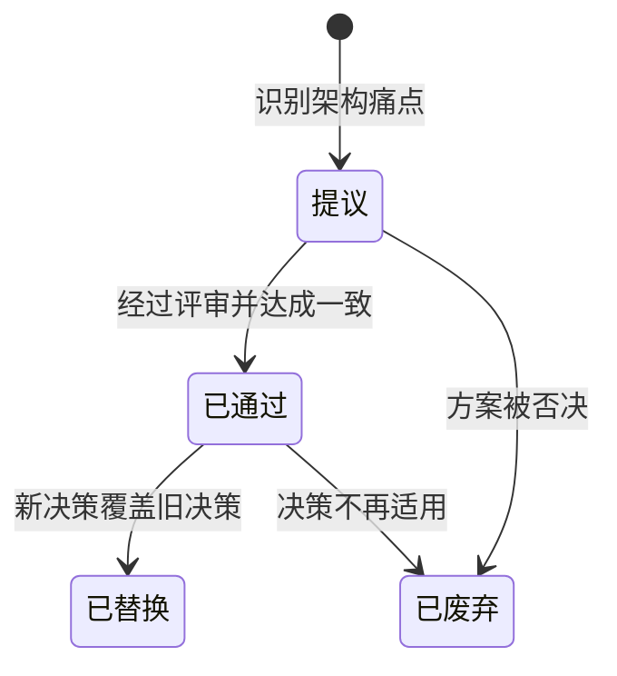
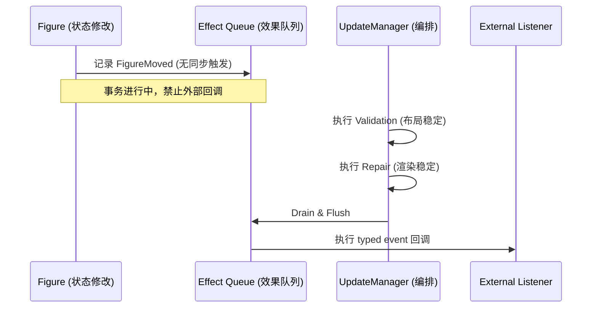
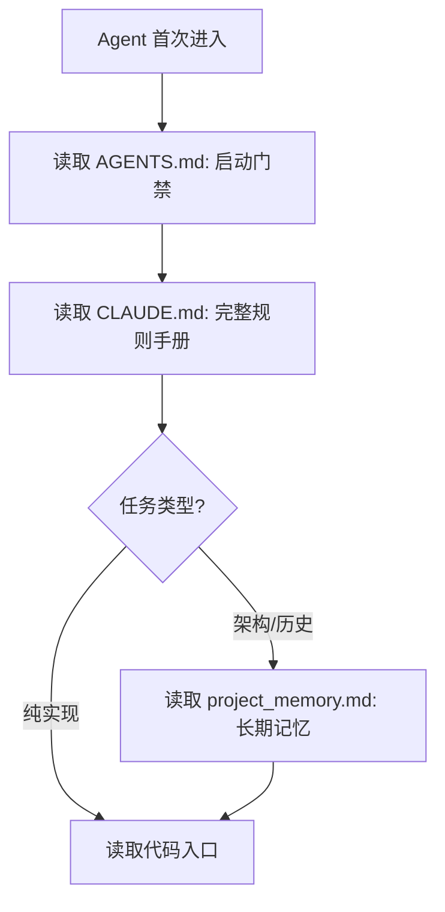
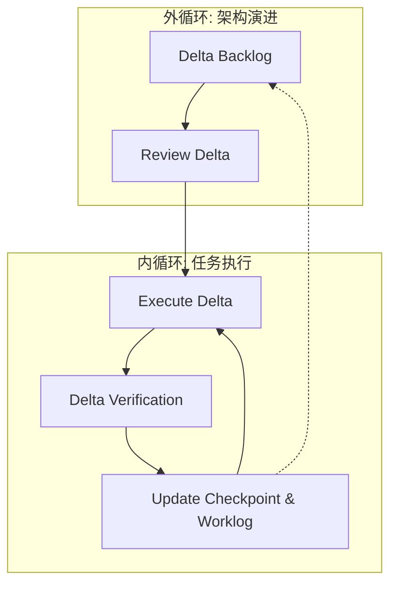
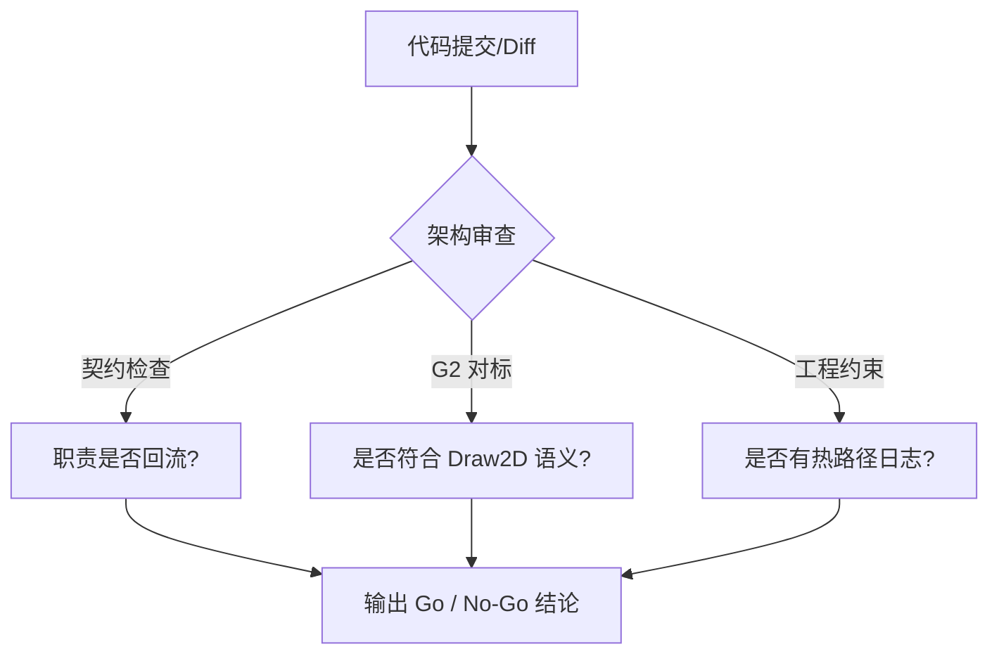

# 架构决策与开发流程

## 目录
1. [模块概览](#模块概览)
2. [架构决策记录 (ADR)](#架构决策记录-adr)
   - [ADR 系统设计与生命周期](#adr-系统设计与生命周期)
   - [关键决策：WebGPU 与 Rust 技术栈 (ADR-001)](#关键决策webgpu-与-rust-技术栈-adr-001)
   - [关键决策：通知机制与事务边界 (ADR-002)](#关键决策通知机制与事务边界-adr-002)
3. [Agent 治理模型](#agent-治理模型)
   - [启动协议与信息分层](#启动协议与信息分层)
   - [核心禁止事项与开发准则](#核心禁止事项与开发准则)
4. [架构契约与组件边界](#架构契约与组件边界)
   - [核心角色职责定义](#核心角色职责定义)
   - [变更规则与工程约束](#变更规则与工程约束)
5. [开发工作流：内外双循环](#开发工作流内外双循环)
   - [工作流可视化模型](#工作流可视化模型)
   - [Delta 状态机与中断恢复](#delta-状态机与中断恢复)
6. [质量保障与测试策略](#质量保障与测试策略)
   - [契约驱动的测试层级 (L1-L4)](#契约驱动的测试层级-l1-l4)
   - [契约映射与失败模式分析](#契约映射与失败模式分析)
7. [架构审查机制 (Architecture Review)](#架构审查机制-architecture-review)
8. [核心组件总结](#核心组件总结)
9. [文件引用](#文件引用)

## 模块概览

本模块是 Novadraw 项目的“治理中枢”，记录了项目从技术选型到日常开发的所有规范性文档。通过标准化的架构决策记录 (ADR) 和严格的 Agent 协作协议，项目确保了在高度自动化开发环境下的可追溯性与架构一致性。

- **总文件数**: 24 个治理与决策文件。
- **核心目录**:
  - `doc/adr/`: 架构决策记录，定义了项目的技术底座。
  - `agent/`: 包含治理契约、测试策略、工作流可视化及审查 Agent 定义。
  - **根目录**: `AGENTS.md` (启动宪法) 与 `CLAUDE.md` (规则手册)。

本章节将详细解析这些治理文档如何协同工作，指导开发者（及 AI Agent）在不破坏理想架构的前提下进行功能迭代。

## 架构决策记录 (ADR)

ADR 是 Novadraw 记录重要架构决策的官方方式。它不仅是历史记录，更是项目演进的“法律依据”。

### ADR 系统设计与生命周期

项目在 `doc/adr/README.md` 中定义了严谨的 ADR 流程。每项决策都必须经历从提议到通过的完整阶段，并使用统一的 Markdown 模板进行记录。

上图展示了决策的状态流转。这种模式确保了每一行核心代码的背后都有明确的设计动机（Motivation）和后果分析（Consequences）。

### 关键决策：WebGPU 与 Rust 技术栈 (ADR-001)

在项目启动初期，**ADR-001** 确立了技术栈的基础。

- **决策内容**: 选用 Rust 语言，配合 `vello` (WebGPU) 作为渲染后端，`cosmic-text` 处理文本，`winit` 管理窗口。
- **动机**: 追求内存安全与 GPU 加速的极致性能。
- **后果分析**: 
  - **正面**: 跨平台能力强，利用 Rust 的所有权模型保证了复杂的图形树操作不出现悬空指针。
  - **负面**: 增加了对 WebGPU 驱动和 Rust 编译环境的依赖，初期开发门槛较高。

### 关键决策：通知机制与事务边界 (ADR-002)

**ADR-002** 是针对图形引擎中“通知风暴”和“重入修改”问题的核心对策。

该流程的核心思想是：**Draw2D 定义“通知是什么”，Zed 定义“通知什么时候安全执行”**。通过将通知延迟到事务边界（Validation -> Repair 之后），Novadraw 彻底杜绝了在修改布局过程中又被回调修改布局的重入风险。

**Section sources**:
- [doc/adr/README.md](doc/adr/README.md)
- [doc/adr/adr-001-webgpu-rust-stack.md](doc/adr/adr-001-webgpu-rust-stack.md)
- [doc/adr/adr-002-notification-effect-queue.md](doc/adr/adr-002-notification-effect-queue.md)

## Agent 治理模型

由于本项目深度集成 AI Agent，建立一套防止 Agent “失控”或“失忆”的治理模型至关重要。

### 启动协议与信息分层

`AGENTS.md` 被定义为“启动宪法”。任何 Agent 首次进入仓库必须按特定顺序读取文档，以建立正确的认知基线。

这种分层机制将“跨 Agent 最小约束”（AGENTS.md）与“详细开发细则”（CLAUDE.md）分离，确保 Agent 在执行任务前已掌握“核心禁止事项”。

### 核心禁止事项与开发准则

在 `CLAUDE.md` 和 `AGENTS.md` 中，项目明确了以下硬性约束：
- **禁止全局状态**: 严禁使用 Singleton 模式，所有状态必须显式传递或挂载在 `FigureGraph` 中。
- **渲染热路径禁止日志**: 在 `render_iterative.rs` 等高频循环中不得使用 `println!` 或 `log!`，以免拖慢帧率。
- **递归深度限制**: 树遍历允许递归，但硬上限为 10,000 层。若场景树过深，必须切换为迭代方案。
- **禁止临时方案**: 任何 Bug 必须先分析根因（Root Cause Analysis），拒绝“先糊一个补丁”的做法。

**Section sources**:
- [AGENTS.md](AGENTS.md)
- [CLAUDE.md](CLAUDE.md)

## 架构契约与组件边界

架构契约（Architecture Contracts）是 `agent/governance-architecture-contracts.md` 中定义的硬性角色边界。

### 核心角色职责定义

为了防止“上帝类”的出现，项目对核心组件进行了严格的职责划分：

| 角色 | 核心职责 | 契约约束 |
| :--- | :--- | :--- |
| `Figure` | 定义形状渲染逻辑、命中测试、首选大小 | **严禁**持有 parent/children 或任何外部 manager 引用 |
| `FigureBlock` | 存放节点运行时状态（如 bounds、dirty 标记） | 仅作为容器，不包含复杂的业务逻辑 |
| `FigureGraph` | 维护树结构（SlotMap）、UUID 映射、交互状态 | 是图级信息的唯一真源 (SSOT) |
| `UpdateManager` | 编排 Validation 和 Repair 两个阶段的执行顺序 | **严禁**持有具体的业务图状态或平台调度逻辑 |
| `EventDispatcher` | 负责事件的路由与分发 | 仅负责传输，不应持有长期的交互状态（如 Selection） |

### 变更规则与工程约束

- **延迟应用 (Pending Mutation)**: 所有的结构性变更（如 `add_child`）必须先进入 `PendingMutation` 队列。在事件分发的回调栈中，禁止直接修改 `FigureGraph` 的树结构，以防破坏迭代器一致性。
- **职责下沉**: 所有的通用机制（如坐标转换、事件适配）必须位于引擎层（`novadraw-scene`），应用层（`apps/editor`）仅负责平台输入适配。

**Section sources**:
- [agent/governance-architecture-contracts.md](agent/governance-architecture-contracts.md)

## 开发工作流：内外双循环

Novadraw 采用一种称为“内外双循环”的开发模型，旨在将宏观的架构演进与微观的代码实现解耦。

### 工作流可视化模型

- **外循环 (Outer Loop)**: 负责管理 `Architecture Delta`。每个 Delta 代表一个最小的架构改进目标（如“解耦 Figure 与 Layout”）。
- **内循环 (Inner Loop)**: 负责 Delta 的具体落地。Agent 通过 `inner-loop-checkpoint.md` 记录当前进度，通过 `inner-loop-worklog.md` 记录每一轮的修改动机。

### Delta 状态机与中断恢复

每个架构增量（Delta）都有明确的状态流转。若开发过程中被紧急任务打断，Agent 会调用 `capture-interruption` 技能，将当前上下文（Context）写入 `interruptions-inbox.md`，并在 `checkpoint` 中标记“下次恢复的最小动作”，确保架构工作的连续性。

**Section sources**:
- [agent/workflow-map.md](agent/workflow-map.md)
- [agent/README.md](agent/README.md)

## 质量保障与测试策略

项目的测试策略遵循“契约驱动”原则，重点在于验证边界而非实现细节。

### 契约驱动的测试层级 (L1-L4)

在 `agent/quality-testing-strategy.md` 中，测试被划分为四个层级：

1. **L1 (Contract Unit Test)**: 验证纯算法逻辑（如 `novadraw-math` 中的矩阵运算）。
2. **L2 (Module Integration Test)**: 验证模块间的职责边界。例如，断言 `UpdateManager` 是否在正确的时间点调用了 `FigureGraph` 的清理方法。
3. **L3 (Scenario Integration Test)**: 验证复杂交互闭环。例如，从鼠标点击到 `PendingMutation` 产生，再到布局刷新的全链路。
4. **L4 (System Test)**: 验证平台相关性。例如，在不同 DPI 缩放下的坐标转换一致性。

### 契约映射与失败模式分析

下表展示了核心契约与其推荐的验证方式：

| 契约 (Contract) | 失败模式 (Failure Mode) | 推荐验证层级 | 建议测试位置 |
| :--- | :--- | :--- | :--- |
| `FigureGraph 持有图级信息` | 图状态回流到 Manager | L2 模块集成测试 | `novadraw-scene/src/scene/*_test.rs` |
| `PendingMutation 延迟应用` | 分发期间直接改树导致崩溃 | L3 场景集成测试 | `novadraw-scene/src/scene/mutation_test.rs` |
| `坐标空间一致性` | 物理/逻辑/场景坐标错位 | L4 系统测试 | `apps/editor` 系统测试 |

**Section sources**:
- [agent/quality-testing-strategy.md](agent/quality-testing-strategy.md)

## 架构审查机制 (Architecture Review)

为了确保每一行代码都符合“理想架构”，项目定义了 `Architecture Review Agent` (`agent/architecture-review-agent.md`)。

该机制要求审查者直接比对代码与 `agent/governance-architecture-contracts.md`。

审查者不仅看代码能否运行，更看重它是否削弱了架构边界。如果代码为了实现便利而让 `Figure` 直接访问了 `UpdateManager`，审查者将给出 `No-Go` 结论，并建议新的 `Architecture Delta` 进行解耦。

**Section sources**:
- [agent/architecture-review-agent.md](agent/architecture-review-agent.md)

## 核心组件总结

| 组件 | 作用 | 核心文件 |
| :--- | :--- | :--- |
| **ADR 系统** | 记录重大技术决策的上下文 | `doc/adr/README.md` |
| **启动协议** | 规范 Agent 进入项目的行为 | `AGENTS.md` |
| **架构契约** | 定义组件间的硬性职责边界 | `agent/governance-architecture-contracts.md` |
| **测试策略** | 确保契约被自动验证 | `agent/quality-testing-strategy.md` |
| **工作流图谱** | 可视化内外循环的协作逻辑 | `agent/workflow-map.md` |

## 文件引用

**Section sources**:
- [AGENTS.md](AGENTS.md)
- [CLAUDE.md](CLAUDE.md)
- [doc/adr/README.md](doc/adr/README.md)
- [doc/adr/adr-001-webgpu-rust-stack.md](doc/adr/adr-001-webgpu-rust-stack.md)
- [doc/adr/adr-002-notification-effect-queue.md](doc/adr/adr-002-notification-effect-queue.md)
- [agent/governance-architecture-contracts.md](agent/governance-architecture-contracts.md)
- [agent/quality-testing-strategy.md](agent/quality-testing-strategy.md)
- [agent/workflow-map.md](agent/workflow-map.md)
- [agent/architecture-review-agent.md](agent/architecture-review-agent.md)
- [agent/README.md](agent/README.md)
