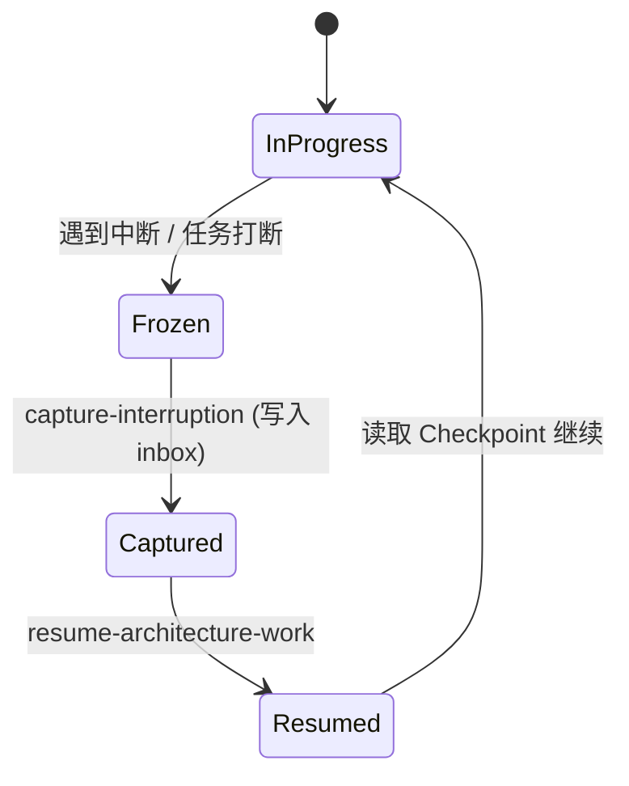

# Agent 治理与开发工作流

## 目录
1. [模块概览](#模块概览)
2. [引言：Agentic Workflow 开发模式](#引言agentic-workflow-开发模式)
3. [Agent 角色定义与治理宪法](#agent-角色定义与治理宪法)
   - [治理宪法：AGENTS.md 与 CLAUDE.md](#治理宪法agentsmd-与-claudemd)
   - [架构审查 Agent (Architecture Review Agent)](#架构审查-agent-architecture-review-agent)
4. [架构契约 (Architecture Contracts)](#架构契约-architecture-contracts)
5. [开发双环：内环与外环协作](#开发双环内环与外环协作)
   - [外环 (Outer Loop)：积压工作与增量定义](#外环-outer-loop积压工作与增量定义)
   - [内环 (Inner Loop)：开发、检查点与验证](#内环-inner-loop开发检查点与验证)
   - [中断与恢复机制](#中断与恢复机制)
6. [技能系统 (Skill System)](#技能系统-skill-system)
7. [常用开发指令示例](#常用开发指令示例)
8. [核心组件与文件参考](#核心组件与文件参考)

## 模块概览

在 Novadraw 项目中，Agent 治理与工作流不仅是一套文档，更是指导 AI Agent（如 Claude Code, Cursor, OpenCode 等）深度参与代码编写、架构设计和任务管理的“操作系统”。

- **文件总数**：`agent/` 目录下约 19 个治理与工作流相关文件。
- **核心子模块**：
  - **治理策略**：定义架构契约、角色边界和禁止事项。
  - **工作流管理**：定义内环（Inner Loop）与外环（Outer Loop）的协作逻辑。
  - **质量保障**：定义测试策略、冒烟测试与集成计划。
  - **技能定义**：位于 `.claude/skills/`，为 Agent 提供执行特定任务的原子能力。

本章节将深入探讨这些组件如何共同协作，确保在 AI 辅助开发的过程中，代码质量不退化，架构设计不漂移。

## 引言：Agentic Workflow 开发模式

Novadraw 采用了一种独特的 **“Agentic Workflow”** 开发模式。与传统的“人类编写代码，AI 提供建议”模式不同，这里的 AI Agent 被视为项目的一等公民，拥有明确的角色、职责和需要遵守的“法律”（治理文件）。

这种模式的核心在于**自动化治理**。通过将架构原则转化为 Agent 可理解的“契约”（Contracts），并将复杂的开发任务拆解为细粒度的“增量”（Deltas），项目实现了高频、高质量的代码迭代。Agent 不仅负责写代码，还负责自审、更新工作日志、维护检查点，并在发现架构偏差时主动提出修正。

## Agent 角色定义与治理宪法

为了确保不同厂商、不同能力的 Agent 在进入仓库后能保持一致的行为，项目定义了清晰的治理层级。

### 治理宪法：AGENTS.md 与 CLAUDE.md

项目遵循“三层信息分工”原则，确保 Agent 在启动时立即对齐：

1. **`AGENTS.md` (启动宪法)**：所有 Agent 进入仓库的第一个入口。它定义了“启动门禁”，要求 Agent 必须按顺序读取特定文件，并镜像了核心禁止事项（如禁止全局状态、禁止热路径日志）。
2. **`CLAUDE.md` (规则全集)**：项目级的唯一真源（SSOT）。包含完整的开发规范、架构原则、提交准则和技能说明。
3. **`project_memory.md` (长期记忆)**：保存跨会话的高价值事实，防止 Agent 在新会话中丢失关键背景。

### 架构审查 Agent (Architecture Review Agent)

这是一个专门的逻辑角色，其职责是充当“架构守门人”。

- **核心目标**：发现架构漂移、职责边界回流和对标偏差（如偏离 draw2d/GEF 语义）。
- **审查依据**：直接比对 `doc/理想架构设计.md` 和 `agent/governance-architecture-contracts.md` 与当前代码实现。
- **输出**：输出 `Architecture Fit` 结论（Fit/Drift）和 `Go/No-Go` 建议。

**Section sources**:
- [AGENTS.md](AGENTS.md)
- [CLAUDE.md](CLAUDE.md)
- [agent/architecture-review-agent.md](agent/architecture-review-agent.md)

## 架构契约 (Architecture Contracts)

架构契约是将宏大的架构愿景转化为 Agent 可执行的硬约束。在 `agent/governance-architecture-contracts.md` 中，定义了核心组件的职责边界：

- **Figure**：只负责内在能力（如绘制、度量），不持有父子关系或平台对象。
- **FigureBlock**：作为状态容器，承载生命周期绑定的运行时状态。
- **FigureGraph**：持有树关系、交互状态和全局不变量。
- **UpdateManager**：仅负责两阶段（Validation/Repair）更新编排。

这些契约确保了 Agent 在生成代码时，不会因为“方便”而破坏职责分离原则。例如，如果 Agent 试图在 `Figure` 中直接修改 `FigureGraph`，架构审查 Agent 会根据契约判定为 `No-Go`。

**Section sources**:
- [agent/governance-architecture-contracts.md](agent/governance-architecture-contracts.md)

## 开发双环：内环与外环协作

Novadraw 的开发过程被组织为两个嵌套的循环：外环负责战略与积压工作，内环负责执行与验证。

### 外环 (Outer Loop)：积压工作与增量定义

外环管理项目的长期目标。所有的架构改进和功能开发都被拆分为 **Architecture Deltas (AD)**。

- **Backlog**：记录在 `agent/outer-loop-delta-backlog.yaml` 中，每个 Delta 都有明确的 `done_when`（完成标准）和优先级。
- **状态迁移**：Delta 从 `candidate` 到 `pending`，再到 `in_progress` 和 `verified`。

### 内环 (Inner Loop)：开发、检查点与验证

内环是 Agent 执行具体任务的场所。

- **Checkpoint**：在 `agent/inner-loop-checkpoint.md` 中记录当前正在处理的 Delta、已完成的工作、根因分析和最小修复方案。
- **Worklog**：在 `agent/inner-loop-worklog.md` 中记录每一步的决策、反思和验证结果。

以下流程图展示了 Agent 如何在双环中切换：

```mermaid
flowchart TD
    subgraph "外环 (Outer Loop)"
        A[读取 Backlog] --> B{选择 Delta}
        B --> C[开始执行]
        D[更新 Backlog 状态] --> A
    end
    subgraph "内环 (Inner Loop)"
        C --> E[根因分析]
        E --> F[代码实现]
        F --> G[验证 (cargo test)]
        G --> H{验证通过?}
        H -- 否 --> F
        H -- 是 --> I[记录 Checkpoint/Worklog]
        I --> D
    end
```

该流程确保了 Agent 始终专注于一个微小的、可验证的目标（Atomic Delta），从而降低了大规模重构出错的风险。

### 中断与恢复机制

由于 Agent 会话可能中断（如 Token 限制或环境重启），工作流定义了明确的冻结与恢复协议。



当 Agent 被打断时，它会使用 `capture-interruption` 技能将当前状态、未完成的动作和下一步计划写入 `agent/interruptions-inbox.md`。下次进入时，通过读取该文件即可无缝恢复。

**Section sources**:
- [agent/workflow-map.md](agent/workflow-map.md)
- [agent/inner-loop-checkpoint.md](agent/inner-loop-checkpoint.md)
- [agent/outer-loop-delta-backlog.yaml](agent/outer-loop-delta-backlog.yaml)

## 技能系统 (Skill System)

为了增强 Agent 的能力，项目在 `.claude/skills/` 下定义了一系列自定义技能。这些技能通过 JSON 定义接口，并通过 Markdown 提供详细的执行指南。

| 技能名称 | 职责 |
| :--- | :--- |
| `analyzing-gef-code` | 分析 draw2d/GEF 源码，确保 Novadraw 语义对标。 |
| `discover-architecture-deltas` | 扫描代码与架构的差距，发现新的改进点。 |
| `execute-architecture-delta` | 按照规范执行一个具体的架构增量。 |
| `capture-interruption` | 在会话结束前冻结当前上下文。 |
| `code-review` | 执行代码质量与简化审查。 |

这些技能的存在，使得 Agent 不仅仅是在写代码，而是在执行一套标准化的工程动作。

**Section sources**:
- [.claude/skills/](.claude/skills/)

## 常用开发指令示例

在 `CLAUDE.md` 和各治理文档中，定义了 Agent 必须掌握的常用指令。这些指令通常作为任务的起点或验证手段。

1. **启动检查**：
   > "请先读取 AGENTS.md 和 CLAUDE.md，确认启动门禁已通过。"

2. **架构审查请求**：
   > "请作为 Novadraw Architecture Review Agent 审查当前代码。范围：novadraw-scene/src/event/mod.rs。要求比对架构契约并给出 Go/No-Go 结论。"

3. **执行增量任务**：
   > "请执行 AD-017：在 apply_reparent_mutation 之前增加防环校验。请先更新 inner-loop-checkpoint.md 进行根因分析。"

4. **提交前验证**：
   ```bash
   cargo fmt --check && cargo check && cargo clippy -- -D warnings && cargo test
   ```

5. **中断冻结**：
   > "当前会话即将结束，请执行 capture-interruption，将进度保存至 interruptions-inbox.md。"

## 核心组件与文件参考

以下是参与 Agent 治理与工作流的关键文件列表，建议在处理相关任务时参考：

| 文件路径 | 职责描述 |
| :--- | :--- |
| `AGENTS.md` | 启动宪法、关键事实镜像、跨 Agent 最小约束。 |
| `CLAUDE.md` | 完整规则手册、项目唯一真源（SSOT）。 |
| `agent/workflow-map.md` | 工作流可视化导航图。 |
| `agent/governance-architecture-contracts.md` | 核心架构契约与硬约束。 |
| `agent/architecture-review-agent.md` | 架构审查 Agent 的角色定义与操作手册。 |
| `agent/outer-loop-delta-backlog.yaml` | 架构增量积压工作表（外环真源）。 |
| `agent/inner-loop-checkpoint.md` | 当前会话执行状态与根因分析（内环真源）。 |
| `agent/inner-loop-worklog.md` | 详细的开发决策与反思日志。 |
| `agent/interruptions-inbox.md` | 任务中断后的上下文冻结区。 |
| `agent/quality-workflow-readiness.md` | 工作流自动化能力的就绪等级评估。 |

**Section sources**:
- [agent/README.md](agent/README.md)
- [agent/workflow-continuous.md](agent/workflow-continuous.md)
- [agent/quality-testing-strategy.md](agent/quality-testing-strategy.md)
