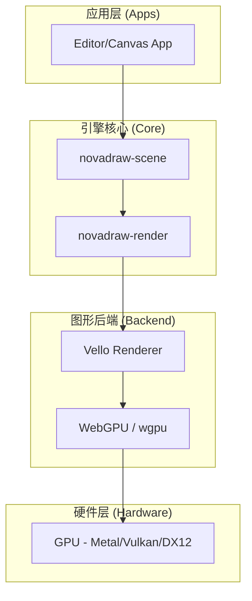
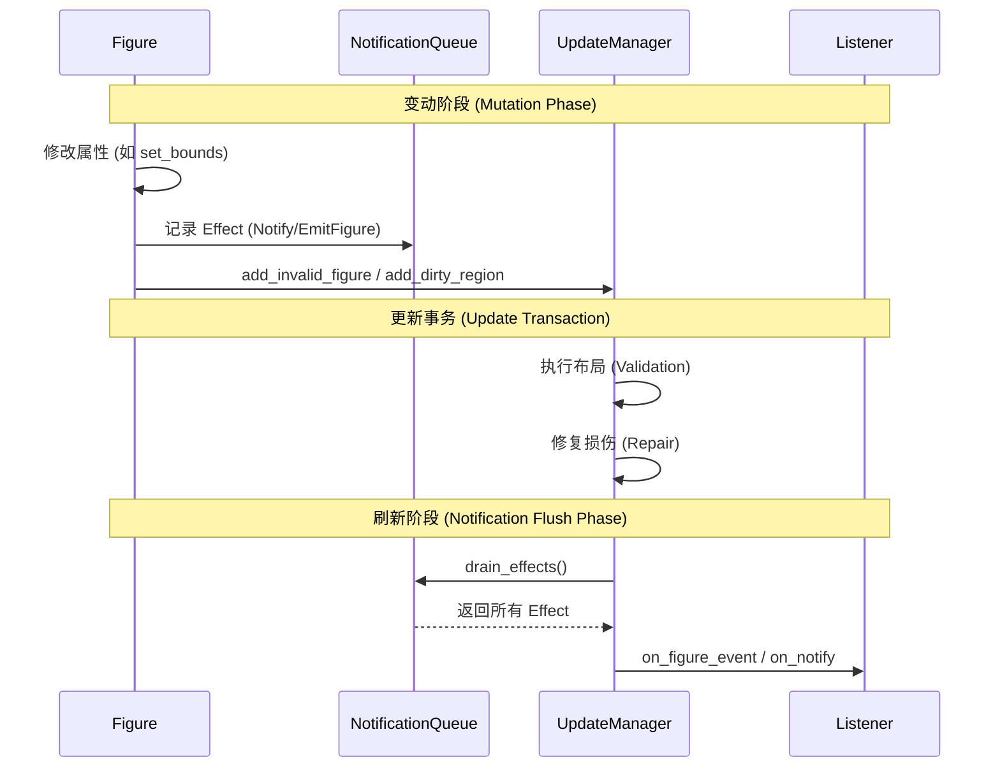
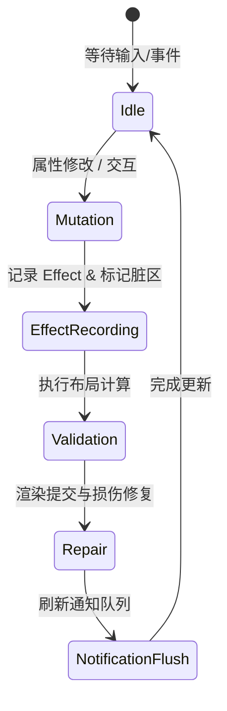

# 架构决策记录

## Table of Contents
1. [引言](#引言)
2. [模块概览](#模块概览)
3. [ADR 001 - WebGPU 与 Rust 技术栈](#adr-001---webgpu-与-rust-技术栈)
   - [背景与动机](#背景与动机)
   - [决策方案](#决策方案)
   - [后果与影响](#后果与影响)
4. [ADR 002 - 通知与效应队列设计](#adr-002---通知与效应队列设计)
   - [背景与动机](#背景与动机-1)
   - [设计公理](#设计公理)
   - [决策方案](#决策方案-1)
   - [后果与影响](#后果与影响-1)
5. [架构演进与事务边界](#架构演进与事务边界)
6. [核心组件实现](#核心组件实现)
7. [文件参考](#文件参考)

## 引言

架构决策记录（Architecture Decision Records, ADR）是 Novadraw 项目中最重要的文档之一。它不仅记录了项目在关键技术选型上的“最终结果”，更重要的是记录了做出这些决策时的“背景”、“动机”以及“方案权衡”。

在复杂的图形引擎开发过程中，许多设计决策往往需要在性能、可维护性、跨平台能力和开发效率之间寻找平衡点。通过 ADR，团队成员可以追溯每一个核心设计的来龙去脉，避免在后续迭代中重复探讨已经解决的问题，同时也为新加入的开发者提供了宝贵的上下文信息。

## 模块概览

目前 Novadraw 的架构决策记录主要集中在 `doc/adr/` 目录下。该模块虽然文件数量不多，但其定义的设计规范和技术栈直接决定了整个引擎的底层基因。

**模块统计：**
- **总文件数**：3 个（包含 README.md）
- **核心决策项**：2 项
- **覆盖范围**：渲染后端、编程语言、窗口管理、响应式更新机制、事件分发模型。

**ADR 列表：**

| 编号 | 标题 | 状态 | 核心内容 |
| :--- | :--- | :--- | :--- |
| **001** | [使用 Rust + WebGPU 实现图形框架](#adr-001---webgpu-与-rust-技术栈) | 已通过 | 确定以 Rust 为核心语言，WebGPU (Vello) 为渲染后端的底层栈。 |
| **002** | [采用 Draw2D 语义分层与 Zed 式 effect queue 的通知机制](#adr-002---通知与效应队列设计) | 已通过 | 融合传统图形框架语义与现代响应式系统，解决 Rust 下的重入与状态一致性问题。 |

## ADR 001 - WebGPU 与 Rust 技术栈

ADR 001 奠定了 Novadraw 的物理基础。在项目初期，我们需要决定如何构建一个能够支撑高性能 2D 矢量图形渲染，且具备跨平台潜力的引擎。

### 背景与动机

传统的 2D 图形框架（如 Eclipse Draw2D）大多基于 CPU 渲染或老旧的图形 API（如 GDI+、SWT GC）。随着硬件的发展，利用 GPU 加速矢量渲染已成为主流。我们需要一种既能提供极致性能，又能保证内存安全，且能无缝运行在现代浏览器（通过 WASM）和原生桌面环境的技术方案。

### 决策方案

经过对多种图形 API（Vulkan, Metal, DirectX, WebGL）和语言（C++, TypeScript, Rust）的对比，项目最终选择了 **Rust + WebGPU (Vello)** 的组合。

下图展示了 Novadraw 的底层渲染技术栈结构：



**Diagram sources**: 
- [adr-001-webgpu-rust-stack.md](doc/adr/adr-001-webgpu-rust-stack.md)
- [novadraw-render/src/backend/vello/mod.rs](novadraw-render/src/backend/vello/mod.rs)

**决策详情：**
1.  **编程语言**：选择 Rust。利用其所有权模型解决图形开发中复杂的资源生命周期管理问题，同时通过零成本抽象获得接近 C++ 的性能。
2.  **渲染后端**：选择 `vello`。这是一个基于 WebGPU 的高性能矢量渲染库，能够高效处理路径填充、描边和复杂的混合模式。
3.  **文本渲染**：选择 `cosmic-text`。它提供了跨平台的文本排版和渲染能力，与 Vello 配合良好。
4.  **窗口/事件**：初步使用 `winit` 进行技术验证，确保跨平台窗口创建和事件处理能力。

### 后果与影响

**正面后果：**
- **高性能**：WebGPU 允许我们将大量的渲染计算卸载到 GPU，支持数万个图形元素的实时交互。
- **内存安全**：Rust 彻底消除了 C++ 中常见的悬挂指针和竞争条件，这对于高度并发的图形引擎至关重要。
- **跨平台一致性**：WebGPU 作为下一代标准，在不同操作系统和浏览器上提供了高度一致的 API 表现。

**负面后果：**
- **兼容性挑战**：WebGPU 目前在部分旧版本浏览器和移动端设备上的支持尚不完善。
- **学习曲线**：Rust 和现代图形编程（GPU 驱动）对开发者的技术要求较高。

**Section sources**:
- [adr-001-webgpu-rust-stack.md](doc/adr/adr-001-webgpu-rust-stack.md)
- [novadraw-render/src/backend/vello/mod.rs](novadraw-render/src/backend/vello/mod.rs)

---

## ADR 002 - 通知与效应队列设计

ADR 002 解决了 Novadraw 中最复杂的逻辑挑战之一：如何在保持响应式更新的同时，确保状态的一致性并避免 Rust 下的重入风险。

### 背景与动机

在图形引擎中，一个 Figure（图形元素）的改变（如位置移动）往往会触发一系列连锁反应：父元素需要重新布局、场景需要标记脏区、关联的监听器需要执行业务逻辑。

传统的实现方案（如 Draw2D）通常采用同步的 Listener 模式。然而，在 Rust 中，这种模式会遇到严重的挑战：
- **借用检查限制**：在修改 Figure A 的过程中触发 Listener 修改 Figure B，可能会导致对 Figure 树的重复借用。
- **状态不一致**：同步触发的通知可能发生在布局计算的中间状态，导致 Listener 读取到错误的几何数据。
- **重入风险**：Listener 的逻辑可能反过来再次触发修改，导致无限递归或死锁。

### 设计公理

为了解决这些问题，ADR 002 提出了五大设计公理，作为通知系统的指导原则：

1.  **语义必须分层**：区分 `figureMoved`（几何变化）、`coordinateSystemChanged`（坐标映射变化）和 `propertyChange`（属性变化）。
2.  **坐标变化是一等公民**：明确区分 Bounds 移动和坐标系根节点的平移。
3.  **核心状态修改期间禁止外部执行**：在 Figure 树处于不稳定状态时，不执行任何外部回调。
4.  **明确的事务边界**：所有的通知必须在明确的事务点（如布局和渲染完成之后）统一分发。
5.  **Listener API 晚于 Effect 模型**：先稳定内部的事件记录机制，再暴露外部接口。

### 决策方案

Novadraw 采用了一种“混合路线”：
- **Draw2D 决定“是什么”**：保留了经过验证的图形领域语义。
- **Zed 决定“什么时候执行”**：借鉴了 Zed 编辑器中的 `effect queue` 机制。
- **Novadraw 决定“事务边界”**：定义了 `Validation -> Repair -> Notification Flush` 的三阶段更新周期。

下面的序列图展示了一个属性修改如何通过 Effect Queue 最终分发给监听器：



**Diagram sources**: 
- [adr-002-notification-effect-queue.md](doc/adr/adr-002-notification-effect-queue.md)
- [novadraw-scene/src/update/deferred.rs](novadraw-scene/src/update/deferred.rs)

### 后果与影响

**正面后果：**
- **彻底消除重入**：通过延迟执行，确保了在执行 Listener 时，Figure 树已经完成了布局和渲染，处于稳定状态。
- **状态安全**：Listener 总是能读取到最新的、一致的几何数据。
- **性能优化**：可以将多个细微的变动合并为一个通知，减少不必要的回调执行。

**负面后果：**
- **非同步性**：与 Draw2D 的同步行为不一致，可能需要开发者适应“变动不立即生效”的思维。
- **复杂性增加**：引入了 Effect 队列和显式的 Flush 阶段，增加了系统的理解成本。

**Section sources**:
- [adr-002-notification-effect-queue.md](doc/adr/adr-002-notification-effect-queue.md)
- [novadraw-scene/src/update/listener.rs](novadraw-scene/src/update/listener.rs)

---

## 架构演进与事务边界

这两项 ADR 的结合，定义了 Novadraw 核心更新循环的生命周期。整个引擎的运行可以看作是一个不断循环的事务处理过程。



在这个生命周期中，ADR 001 确保了 `Repair` 阶段的高效（通过 GPU 加速），而 ADR 002 确保了从 `Mutation` 到 `NotificationFlush` 的逻辑正确性和状态一致性。

**状态说明：**
- **Mutation**：用户代码修改 Figure 属性，这是事务的起点。
- **EffectRecording**：系统内部记录“发生了什么”，但不立即反应。
- **Validation**：处理 `revalidate()` 请求，稳定 Figure 树的几何结构。
- **Repair**：处理 `repaint()` 请求，生成渲染命令并提交给 GPU。
- **NotificationFlush**：这是 ADR 002 的核心，将积累的 Effect 分发给外部观察者。

**Section sources**:
- [novadraw-scene/src/update/deferred.rs](novadraw-scene/src/update/deferred.rs)
- [doc/adr/adr-002-notification-effect-queue.md](doc/adr/adr-002-notification-effect-queue.md)

---

## 核心组件实现

以下是根据上述 ADR 实现的关键代码组件。

### 1. 通知效应定义 (ADR 002)

在 `novadraw-scene/src/update/listener.rs` 中，我们定义了分层的通知模型：

```rust
/// 通知 effect
/// 
/// Notify 表达“对象状态已变化”，不携带业务 payload。
/// EmitFigure / EmitUpdate 表达 typed 语义事件。
#[derive(Debug, Clone, PartialEq)]
pub enum NotificationEffect {
    /// 无 payload 的状态失效通知
    Notify { block_id: BlockId },
    /// Figure 层语义事件 (如 FigureMoved)
    EmitFigure(FigureEvent),
    /// UpdateManager 层更新周期事件 (如 Validating/Painted)
    EmitUpdate(UpdateEvent),
}
```

### 2. 更新事务管理器 (ADR 002)

在 `novadraw-scene/src/update/deferred.rs` 中，`SceneUpdateManager` 负责协调整个事务流程：

```rust
impl SceneUpdateManager {
    /// 执行完整的更新事务
    pub fn perform_update(&mut self, graph: &mut FigureGraph, canvas: &mut NdCanvas) {
        self.updating = true;
        
        // 1. 验证阶段 (Validation)
        self.notification_effects.emit_update(UpdateEvent::Validating);
        self.perform_validation(graph);
        self.notification_effects.emit_update(UpdateEvent::Validated);
        
        // 2. 修复阶段 (Repair)
        let dirty_snapshot = self.take_dirty_snapshot();
        let damage = compute_damage_union(dirty_snapshot.values());
        self.notification_effects.emit_update(UpdateEvent::Painting { damage });
        execute_repair_phase(graph, canvas, dirty_snapshot.iter());
        self.notification_effects.emit_update(UpdateEvent::Painted { damage });

        // 3. 刷新通知 (Notification Flush)
        self.flush_notifications(graph);
        
        self.updating = false;
    }
}
```

### 3. Vello 渲染后端配置 (ADR 001)

在 `novadraw-render/src/backend/vello/mod.rs` 中，实现了基于 WebGPU 的渲染器初始化：

```rust
pub struct VelloRenderer {
    render_context: RenderContext,
    renderers: Vec<Option<Renderer>>,
    scene: vello::Scene,
    surface: RenderSurface<'static>,
    // ... 状态栈与纹理管理
}

impl VelloRenderer {
    pub fn new(window: Arc<WinitWindowProxy>, logical_width: f64, logical_height: f64) -> Self {
        let mut render_context = RenderContext::new();
        // 创建 WebGPU Surface
        let surface = pollster::block_on(render_context.create_surface(...))
            .expect("Failed to create surface");
        
        // 初始化 Vello 渲染器
        let mut renderers = vec![];
        renderers.resize_with(render_context.devices.len(), || None);
        // ...
    }
}
```

**Section sources**:
- [novadraw-scene/src/update/listener.rs](novadraw-scene/src/update/listener.rs)
- [novadraw-scene/src/update/deferred.rs](novadraw-scene/src/update/deferred.rs)
- [novadraw-render/src/backend/vello/mod.rs](novadraw-render/src/backend/vello/mod.rs)

---

## 文件参考

本页面内容主要基于以下架构决策记录和源代码实现：

- **架构决策记录 (ADR)**:
    - [doc/adr/README.md](doc/adr/README.md): ADR 索引与流程说明。
    - [doc/adr/adr-001-webgpu-rust-stack.md](doc/adr/adr-001-webgpu-rust-stack.md): 关于 Rust 和 WebGPU 技术栈的详细决策。
    - [doc/adr/adr-002-notification-effect-queue.md](doc/adr/adr-002-notification-effect-queue.md): 关于通知机制、效应队列和事务边界的详细设计。

- **核心实现代码**:
    - [novadraw-scene/src/update/listener.rs](novadraw-scene/src/update/listener.rs): 通知效应 (`NotificationEffect`) 和队列实现。
    - [novadraw-scene/src/update/deferred.rs](novadraw-scene/src/update/deferred.rs): 场景更新管理器 (`SceneUpdateManager`) 的事务逻辑。
    - [novadraw-render/src/backend/vello/mod.rs](novadraw-render/src/backend/vello/mod.rs): 基于 Vello/WebGPU 的渲染后端实现。
    - [novadraw-scene/src/scene/mod.rs](novadraw-scene/src/scene/mod.rs): 场景图及其对通知效应的集成。
