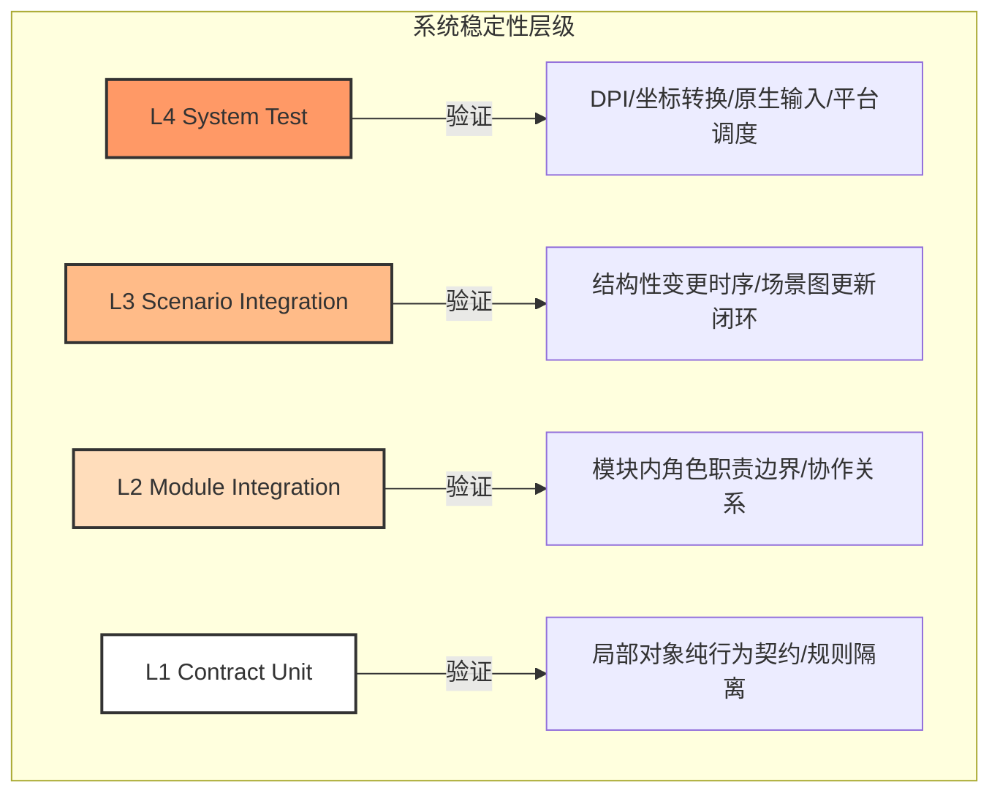
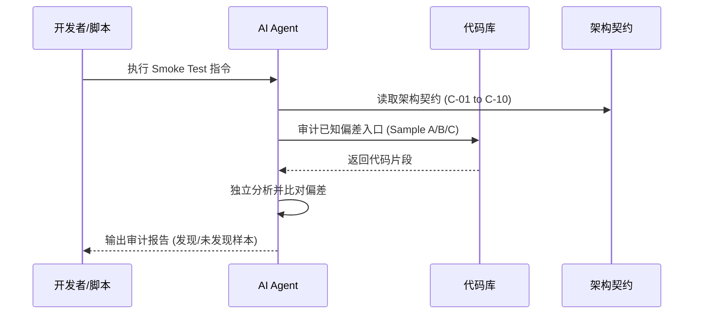
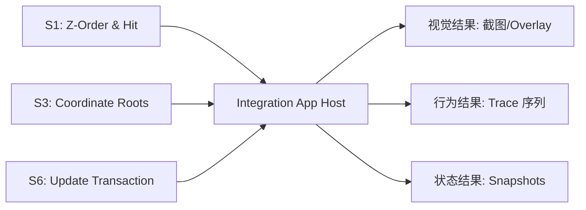
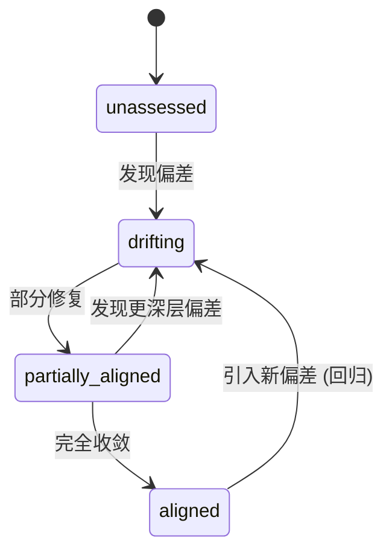
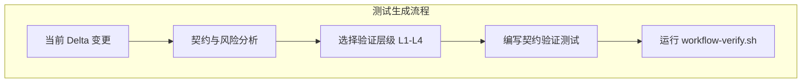

# 质量保障与测试策略

## 目录

1. [模块概览](#模块概览)
2. [引言](#引言)
3. [分层测试体系 (Layered Testing Strategy)](#分层测试体系-layered-testing-strategy)
   - [核心原则](#核心原则)
   - [测试层级定义](#测试层级定义)
4. [冒烟测试与工作流验证](#冒烟测试与工作流验证)
   - [验证目标与时机](#验证目标与时机)
   - [已知偏差样本审计](#已知偏差样本审计)
5. [集成测试计划 (Integration Test Plan)](#集成测试计划-integration-test-plan)
   - [设计公理与场景映射](#设计公理与场景映射)
   - [核心验证场景 (S1-S8)](#核心验证场景-s1-s8)
6. [契约覆盖率与架构治理](#契约覆盖率与架构治理)
   - [状态定义与迁移逻辑](#状态定义与迁移逻辑)
   - [契约映射表解析](#契约映射表解析)
7. [质量检查点与自动化流程](#质量检查点与自动化流程)
   - [Checkpoint Schema 规范](#checkpoint-schema-规范)
   - [自动化验证脚本 (workflow-verify.sh)](#自动化验证脚本-workflow-verifysh)
8. [核心组件与测试组织方式](#核心组件与测试组织方式)
   - [测试文件放置规则](#测试文件放置规则)
   - [测试生成与 Prompt 建议](#测试生成与-prompt-建议)
9. [关键文件参考](#关键文件参考)

## 模块概览

本模块文档主要涵盖了 Novadraw 项目中位于 `agent/` 目录下的质量保障与测试策略相关文件。这些文件共同构成了一个以“架构契约”为核心的质量控制体系，旨在确保图形引擎在持续迭代过程中能够稳定地逼近理想架构设计。

- **总文件数**：约 10 个核心文档与脚本。
- **涵盖范围**：
  - 测试分层策略 (`quality-testing-strategy.md`)
  - 集成测试规划 (`quality-integration-test-plan.md`)
  - 工作流冒烟测试 (`quality-discover-smoke-test.md`)
  - 契约覆盖率跟踪 (`governance-contract-coverage.md`)
  - 质量检查点规范 (`quality-checkpoint-schema.md`)
  - 自动化验证脚本 (`workflow-verify.sh`)
- **深度说明**：本页面将深入解析这些策略背后的设计哲学、执行细节以及它们如何与 Agent 工作流深度集成。

## 引言

在 Novadraw 这种复杂的图形引擎开发中，传统的以“覆盖率”为导向的测试往往会陷入“实现镜像”的陷阱——即测试代码只是对实现代码的机械复述，一旦实现细节发生重构，测试就会大面积失效，且无法真正验证架构约束。

为了解决这一问题，Novadraw 引入了一套**基于契约（Contract-based）**的质量保障体系。其核心目标不是追求测试数量的绝对增长，而是保证每一次变更（Delta）都能通过最合适的层级得到验证，并确保这些验证是针对“架构契约”而非“私有实现”的。这种体系将测试从单纯的质量门禁提升到了架构治理的高度。

## 分层测试体系 (Layered Testing Strategy)

Novadraw 的测试体系被划分为四个清晰的层级，每个层级都有其特定的验证目标和适用范围。这种分层确保了测试的粒度与风险等级相匹配。

### 核心原则

在执行任何层级的测试时，必须遵循以下五个核心原则：

1.  **测试契约，不测试实现镜像**：不要断言私有调用顺序、临时字段或内部 helper 细节。要验证的是职责边界、时序语义、输入输出行为和状态归属。
2.  **测试跟着 Delta 走，不跟着函数走**：每个变更只补本轮最小必要的测试，避免为了提升覆盖率而补低价值的测试。
3.  **优先验证最容易回归的架构语义**：如职责边界是否回流、状态归属是否清晰、坐标空间是否一致等。
4.  **验证层级必须与风险匹配**：局部风险用 L1/L2，跨模块风险用 L3，系统级风险用 L4。
5.  **允许不加测试，但必须说明理由**：如果变更不涉及逻辑风险（如纯文档或命名修改），可以不加测试，但必须在 Worklog 中记录决策过程。

### 测试层级定义

下面的图表展示了 Novadraw 分层测试体系的结构及其侧重点：



**分层详解**：

-   **L1 / Contract Unit Test**：适用于局部对象的纯行为契约。它关注输入到输出的规则，不依赖复杂的外部调度。例如，验证一个几何计算函数在特定输入下的返回值是否符合预期。
-   **L2 / Module Integration Test**：适用于一个模块内多个角色之间的职责边界。例如，验证 `UpdateManager`、`FigureGraph` 和 `EventDispatcher` 之间的协作关系，确保状态没有非法回流。
-   **L3 / Scenario Integration Test**：适用于结构性变更时序和多组件协作行为。它验证的是从输入到场景图更新的完整闭环，确保关键阶段按约定执行。
-   **L4 / System Test**：适用于平台相关的交互和物理坐标一致性。它模拟真实的输入链路，验证从物理坐标到逻辑坐标再到场景坐标的转换是否正确。

**Section sources**:
- [quality-testing-strategy.md](agent/quality-testing-strategy.md)

## 冒烟测试与工作流验证

与传统的业务冒烟测试不同，Novadraw 的 `Workflow Smoke Test` 旨在验证**工作流本身**（特别是 AI Agent 的发现能力）是否有效。

### 验证目标与时机

冒烟测试的目标是确保 Agent 能够基于同一份审计清单稳定地发现已知的架构偏差。如果 discover 输出“0 个 candidate”，测试会强制要求给出足够的审计覆盖说明，防止 Agent 因为过于乐观而漏掉潜在问题。

**使用时机**：
- 新增或重写 discover skill 之后。
- 工作流升级后，需要验证其有效性。
- 怀疑外循环（Outer Loop）发现能力下降时。

### 已知偏差样本审计

冒烟测试通过一组“已知问题样本”来检验 Agent。例如，`Sample A` 关注 `UpdateManager` 是否越界持有了图级语义。Agent 需要重新审计代码，并判断是否能发现这些预设的偏差。



通过这种方式，我们可以量化地评估 Agent 的“架构敏感度”。如果 Agent 无法重新发现这些明显的已知问题，说明工作流的审计深度或 Prompt 引导存在缺陷，需要进行调整。

**Section sources**:
- [quality-discover-smoke-test.md](agent/quality-discover-smoke-test.md)
- [quality-workflow-readiness.md](agent/quality-workflow-readiness.md)

## 集成测试计划 (Integration Test Plan)

集成测试是 Novadraw 验证 Draw2D 核心能力的关键手段。它不追求海量的截图对比，而是致力于建立一组可交互、可脚本回放的场景，验证系统的“闭包”特性。

### 设计公理与场景映射

集成测试的设计紧扣 `draw2d_design_axioms.md` 中的系统公理。每个测试场景都必须明确对应一个或多个公理，从而确保测试的权威性和覆盖面。

-   **几何闭包**：验证 `bounds`、`insets` 等属性在绘制和命中测试中的一致性。
-   **坐标闭包**：验证本地坐标系切换和父链坐标转换的正确性。
-   **更新闭包**：验证两阶段更新事务（Validation -> Repair）的完整性。
-   **交互闭包**：验证事件分发、捕获（Capture）和焦点（Focus）状态机。

### 核心验证场景 (S1-S8)

Novadraw 规划了 8 个核心场景（S1-S8），涵盖了从 Z-Order 到 Damage 传播的所有关键链路。目前优先落地的是 S1（命中一致性）、S3（坐标根切换）和 S6（更新事务）。



每个场景在执行后都会输出三类结果：
1.  **视觉结果**：人工观察或截图比对，必要时显示 `bounds` 或 `damage` 的 overlay。
2.  **行为结果**：收集 `interaction trace`、`update trace` 等，验证操作序列是否符合预期。
3.  **状态结果**：导出最终的 `target`、`focus owner` 等快照进行断言。

**Section sources**:
- [quality-integration-test-plan.md](agent/quality-integration-test-plan.md)

## 契约覆盖率与架构治理

契约覆盖率（Contract Coverage）是 Novadraw 衡量项目健康度的核心指标。它不看代码行覆盖率，而是看“架构契约”的实现状态。

### 状态定义与迁移逻辑

每个契约（如 C-01 到 C-10）都被赋予一个状态：
-   `unassessed`：尚未评估。
-   `drifting`：明显偏离理想架构。
-   `partially_aligned`：已局部收敛，但仍有残余问题。
-   `aligned`：当前已与理想架构对齐。

状态的迁移必须基于真实的证据（Evidence），通常是某个 Delta（AD-xxx）的完成和验证。



### 契约映射表解析

在 `governance-contract-coverage.md` 中，详细记录了每个契约的当前状态和证据。例如，C-04（UpdateManager 职责）目前标记为 `aligned`，证据是 `AD-001` 的完成，证明了 validation/repair/scheduling 的边界已收敛。而 C-08（PendingMutation）则标记为 `partially_aligned`，因为 reparent 逻辑仍缺少防环校验。

这种透明的覆盖率视图让开发者能够清晰地看到哪些架构堡垒已经攻克，哪些仍处于“漂移”状态，从而指导后续的开发重点。

**Section sources**:
- [governance-contract-coverage.md](agent/governance-contract-coverage.md)

## 质量检查点与自动化流程

为了确保开发过程中的每一步都是受控的，Novadraw 引入了质量检查点（Checkpoint）和自动化验证脚本。

### Checkpoint Schema 规范

`inner-loop-checkpoint.md` 记录了当前会话的状态。为了防止信息丢失或误读，项目定义了严格的 Schema 版本（当前为 v1）。

**必需章节包括**：
-   `Metadata`：版本、更新时间、类型。
-   `Current Delta`：当前正在处理的主线任务。
-   `Current Hypothesis`：对当前问题的假设。
-   `Verification State`：区分本轮变更的验证和基线验证。
-   `Resume Prompt`：下次恢复工作时可直接使用的提示词。

这种结构化的记录方式确保了即使在多次中断和恢复后，Agent 也能准确把握当前的上下文和风险点。

### 自动化验证脚本 (workflow-verify.sh)

`workflow-verify.sh` 是提交前的最后一道防线。它集成了 Rust 工具链的标准检查：

```bash
#!/usr/bin/env bash
set -euo pipefail

cargo fmt --check      # 检查代码格式
cargo check            # 检查编译错误
cargo clippy -- -D warnings  # 静态检查，禁止所有警告
cargo test             # 运行所有自动化测试
```

虽然简单，但它是所有质量保证工作的基石。任何 Delta 在标记为“完成”之前，都必须通过此脚本的验证。

**Section sources**:
- [quality-checkpoint-schema.md](agent/quality-checkpoint-schema.md)
- [workflow-verify.sh](agent/workflow-verify.sh)

## 核心组件与测试组织方式

Novadraw 的测试代码组织遵循“就近原则”与“职责分层”相结合的模式。

### 测试文件放置规则

-   **`novadraw-scene`**：存放图结构、更新、mutation、事件分发的模块级（L2）和场景级（L3）测试。
-   **`novadraw-render`**：存放提交协定、damage、渲染边界相关测试。
-   **`apps/editor`**：存放系统级交互（L4）、平台调度、DPI 与最小复现场景。

这种划分确保了测试代码与其验证的逻辑在物理位置上保持一致，便于开发者在修改代码时同步更新测试。

### 测试生成与 Prompt 建议

为了引导 Agent 生成高质量的测试，项目提供了专门的 Prompt 建议。例如，在为当前 Delta 制定测试策略时，要求 Agent 回答四个关键问题：
1.  当前契约是什么？
2.  最可能的 Failure Mode 是什么？
3.  应该用哪一层验证（L1/L2/L3/L4）？
4.  建议把测试放到哪个文件？

这种结构化的思考过程有效地防止了“为了写测试而写测试”的情况发生。



通过这种严谨的流程，Novadraw 确保了测试不仅是质量的守护者，更是架构演进的记录者。

**Section sources**:
- [quality-testing-strategy.md](agent/quality-testing-strategy.md)

## 关键文件参考

以下是本页面涉及的核心质量保障文件，建议开发者在进行架构改进或编写测试前仔细阅读：

-   `agent/quality-testing-strategy.md`：定义分层测试哲学与核心原则。
-   `agent/quality-integration-test-plan.md`：Draw2D 核心能力集成测试蓝图。
-   `agent/quality-discover-smoke-test.md`：工作流有效性验证方案。
-   `agent/governance-contract-coverage.md`：架构契约收敛状态跟踪表。
-   `agent/quality-checkpoint-schema.md`：会话检查点结构规范。
-   `agent/quality-workflow-readiness.md`：工作流稳定性评估标准。
-   `agent/workflow-verify.sh`：本地自动化验证入口脚本。
-   `agent/inner-loop-checkpoint.md`：当前开发会话的状态记录。
