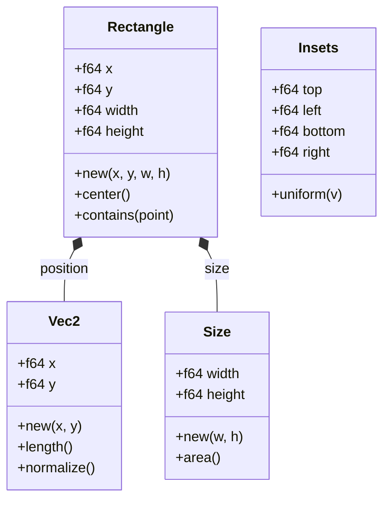
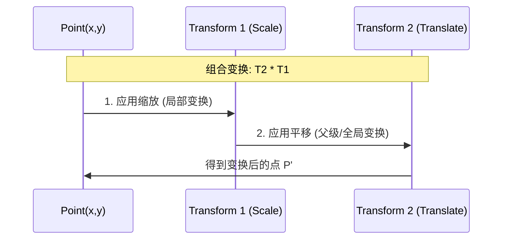
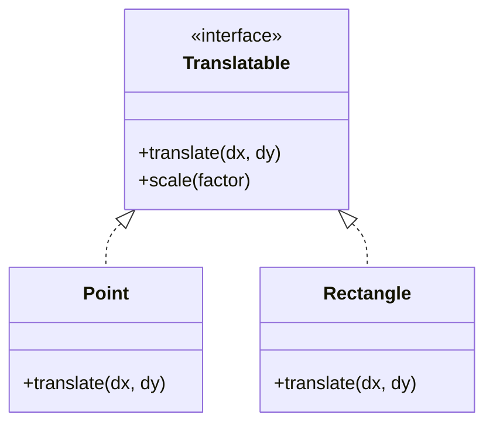

# 核心几何与数学基础

## 目录
1. [模块概览](#模块概览)
2. [引言](#引言)
3. [核心几何对象](#核心几何对象)
   - [Vec2 与 Point：位置与向量的语义区分](#vec2-与-point位置与向量的语义区分)
   - [Size 与 Rectangle：形状的数值定义](#size-与-rectangle形状的数值定义)
   - [Insets：内边距与布局辅助](#insets内边距与布局辅助)
4. [仿射变换与 Transform](#仿射变换与-transform)
   - [矩阵布局与数学基础](#矩阵布局与数学基础)
   - [变换组合顺序与“追加”语义](#变换组合顺序与追加语义)
   - [逆变换与点/向量变换](#逆变换与点向量变换)
5. [坐标系统与转换逻辑](#坐标系统与转换逻辑)
   - [多级坐标系架构解析](#多级坐标系架构解析)
   - [HiDPI 适配：从逻辑空间到物理像素](#hidpi-适配从逻辑空间到物理像素)
   - [命中测试中的坐标降域](#命中测试中的坐标降域)
6. [可变形接口：Translatable Trait](#可变形接口-translatable-trait)
   - [设计意图：统一几何变换接口](#设计意图统一几何变换接口)
   - [在布局系统中的应用](#在布局系统中的应用)
7. [数学工具库：novadraw-math](#数学工具库-novadraw-math)
   - [Mat3：底层的矩阵运算支撑](#mat3底层的矩阵运算支撑)
   - [Vec3：齐次坐标与未来扩展](#vec3齐次坐标与未来扩展)
8. [性能与精度考量](#性能与精度考量)
9. [文件参考](#文件参考)

## 模块概览

Novadraw 的底层数学与几何基础由两个核心 crate 组成：`novadraw-geometry` 和 `novadraw-math`。这两个模块为整个图形引擎提供了最基础的数据结构和运算逻辑。

- **文件总数**：共发现 8 个核心源文件。
- **子模块分布**：
  - `novadraw-geometry` (5 个文件): 包含 `Vec2`, `Rect`, `Transform`, `Translatable` 等高层几何抽象。
  - `novadraw-math` (3 个文件): 提供底层的 `Mat3` 和 `Vec3` 矩阵与向量运算。
- **覆盖深度**：本章节将深度解析 `novadraw-geometry` 中的所有核心几何类型及其变换逻辑，并详细介绍坐标系统的转换原理。

## 引言

在图形引擎的设计中，如何精确地描述位置、大小以及它们在空间中的变换是所有功能的基础。Novadraw 的几何库设计目标是提供一套高性能、高精度（基于 `f64`）且易于使用的 2D 图形运算接口。

该模块不仅承载了简单的点和矩形定义，还通过 `Transform` 类型实现了复杂的仿射变换（Affine Transformation）。此外，为了适配现代显示器的高像素密度（HiDPI），引擎内置了一套严谨的坐标转换逻辑，确保在不同设备上都能获得一致的视觉效果。Novadraw 选择了 `f64` 双精度浮点数作为基础数值类型，这在处理大规模画布或高精度 CAD 绘图时能有效避免累积误差。

## 核心几何对象

`novadraw-geometry` 定义了图形引擎中最常用的几种基础类型。这些类型大多是对底层数学库 `glam` 或 `kurbo` 的语义化包装。

### Vec2 与 Point：位置与向量的语义区分

`Vec2` 是所有几何运算的基石，表示一个二维向量。在 Novadraw 中，`Point` 被定义为 `Vec2` 的类型别名。虽然它们在底层是相同的结构，但在应用层中，我们倾向于用 `Point` 表示空间中的一个绝对位置，而用 `Vec2` 表示两个位置之间的位移或方向。

```rust
// novadraw-geometry/src/vec2.rs
#[derive(Clone, Copy, Debug, PartialEq, Serialize, Deserialize)]
pub struct Vec2(pub DVec2);

impl Vec2 {
    pub fn new(x: f64, y: f64) -> Self { Vec2(DVec2::new(x, y)) }
    pub fn length(self) -> f64 { self.0.length() }
    pub fn dot(self, other: Vec2) -> f64 { self.0.dot(other.0) }
    // 旋转向量（顺时针，Y轴向下坐标系）
    pub fn rotate(self, angle: f64) -> Self {
        let (s, c) = angle.sin_cos();
        Vec2(DVec2::new(self.0.x * c + self.0.y * s, -self.0.x * s + self.0.y * c))
    }
}
```

### Size 与 Rectangle：形状的数值定义

`Size` 表示物体的尺寸（宽高），而 `Rectangle` 则结合了位置（x, y）和尺寸。`Rectangle` 的实现参考了 Eclipse Draw2D 的设计，提供了丰富的几何判定方法。

```rust
// novadraw-geometry/src/rect.rs
pub struct Rectangle {
    pub x: f64,
    pub y: f64,
    pub width: f64,
    pub height: f64,
}

impl Rectangle {
    pub fn contains(self, point: Point) -> bool {
        point.x() >= self.x && point.x() <= self.x + self.width &&
        point.y() >= self.y && point.y() <= self.y + self.height
    }
    
    pub fn union(self, other: Rectangle) -> Rectangle {
        let left = self.x.min(other.x);
        let top = self.y.min(other.y);
        let right = (self.x + self.width).max(other.x + other.width);
        let bottom = (self.y + self.height).max(other.y + other.height);
        Rectangle::new(left, top, right - left, bottom - top)
    }
}
```

### Insets：内边距与布局辅助

`Insets` 用于表示矩形四个方向的缩进值，常用于 UI 布局中的 Padding 或 Margin 计算。



上图展示了基础几何对象之间的组合关系。`Rectangle` 内部通过坐标和宽高来定义，而其中心点或角点通常以 `Vec2` (Point) 的形式返回。`Insets` 作为一个独立的辅助类型，在计算 Figure 的内容区域（Client Area）时起着关键作用。

**Section sources**:
- [novadraw-geometry/src/vec2.rs](novadraw-geometry/src/vec2.rs)
- [novadraw-geometry/src/rect.rs](novadraw-geometry/src/rect.rs)
- [novadraw-geometry/src/translatable.rs](novadraw-geometry/src/translatable.rs)

## 仿射变换与 Transform

`Transform` 类型是 Novadraw 处理图形变换的核心。它封装了 2D 仿射变换矩阵，允许开发者通过单一的矩阵运算实现平移、缩放和旋转的组合。

### 矩阵布局与数学基础

Novadraw 使用 3x3 的仿射变换矩阵。内部实现基于 `kurbo::Affine`，采用行优先（Row-major）布局，这与 CSS 和 HTML5 Canvas 的标准保持一致。矩阵的系数顺序为 `[a, b, c, d, e, f]`，对应的数学矩阵如下：

| a | c | e |
|---|---|---|
| b | d | f |
| 0 | 0 | 1 |

其中 `(e, f)` 负责平移，`a, b, c, d` 负责缩放、旋转和错切。

### 变换组合顺序与“追加”语义

在 Novadraw 中，矩阵乘法 `A * B` 的语义是：**先应用 B，再应用 A**。这符合数学上的函数组合逻辑 `f(g(x))`。

为了提高开发效率，`Transform` 提供了 `then_` 系列方法（如 `then_translate`, `then_rotate`），这些方法采用追加模式。这意味着 `self.then_translate(...)` 实际上是将新的平移矩阵乘在当前矩阵的左侧，从而在逻辑上实现了“在当前变换的基础上再进行平移”。

### 逆变换与点/向量变换

`Transform` 提供了 `inverse()` 方法用于求逆矩阵，这在将全局坐标转换回局部坐标（如鼠标点击判定）时至关重要。同时，它区分了 `transform_point` 和 `transform_vector`：点变换包含平移分量，而向量变换仅受缩放和旋转影响。



上述序列图描述了点在经过组合变换时的处理流向。理解“先应用右侧/内部变换”是正确处理图形层级关系的关键。在 Novadraw 的场景树中，子节点的变换通常会与父节点的变换相乘，形成一个累积变换矩阵。

**Section sources**:
- [novadraw-geometry/src/transform.rs](novadraw-geometry/src/transform.rs)

## 坐标系统与转换逻辑

Novadraw 的坐标系统设计旨在屏蔽硬件差异，为应用层提供统一的逻辑空间。

### 多级坐标系架构解析

引擎内部涉及四个主要的坐标层级：

1.  **屏幕像素坐标 (Physical Pixels)**：操作系统（winit）返回的原始物理像素，受显示器分辨率影响。
2.  **入口域逻辑坐标 (Entry-domain Logical Coordinates)**：将物理像素除以 `scale_factor` 得到的设备无关坐标。
3.  **Figure 所属坐标域 (Target Figure Domain)**：Figure 内部的局部坐标系。
4.  **坐标根分段值 (Bounds relative to root)**：Figure 的 `bounds` 存储的通常是相对于最近坐标根（Coordinate Root）的偏移值。

### HiDPI 适配：从逻辑空间到物理像素

Novadraw 的处理原则是：**逻辑层全程使用 f64 逻辑坐标，仅在渲染后端（Vello）和输入入口处进行 DPI 转换**。这种设计使得开发者在编写布局算法或绘制逻辑时，无需关心当前屏幕的缩放倍率。

### 命中测试中的坐标降域

当用户点击屏幕时，引擎需要将入口域的逻辑坐标通过父链变换逐层“降域”，最终转换成目标 Figure 局部坐标系中的点。

```mermaid
graph TD
    subgraph "输入转换 (Input Conversion)"
        A[屏幕物理像素] -->|÷ scale_factor| B[入口域逻辑坐标]
        B -->|Transform.inverse()| C[父容器局部坐标]
        C -->|Transform.inverse()| D[子 Figure 局部坐标]
    end
    
    subgraph "输出转换 (Output Conversion)"
        E[Figure Bounds] -->|Transform.multiply()| F[渲染累积变换]
        F -->|× scale_factor| G[Vello 渲染器像素]
    end
```

该流程图展示了坐标在输入和输出两个方向上的完整转换路径。引擎通过矩阵及其逆矩阵的运算，实现了在复杂的嵌套变换环境下精确的命中测试。

**Section sources**:
- [doc/04-coordinates/coordinates.md](doc/04-coordinates/coordinates.md)

## 可变形接口：Translatable Trait

为了让不同的几何对象具有统一的变换能力，Novadraw 定义了 `Translatable` trait。

### 设计意图：统一几何变换接口

`Translatable` trait 允许以统一的方式对点、矩形、甚至自定义几何形状进行平移和缩放操作。

```rust
// novadraw-geometry/src/translatable.rs
pub trait Translatable {
    fn translate(&mut self, dx: f64, dy: f64);
    fn scale(&mut self, factor: f64);
    
    fn translate_by_point(&mut self, point: Point) {
        self.translate(point.x(), point.y());
    }
}
```

### 在布局系统中的应用

在实现拖拽功能或自动布局时，引擎会频繁调用 `translate`。由于 `Rectangle` 实现了该 trait，布局管理器可以直接修改 Figure 的边界而无需了解其内部实现细节。这种基于 Trait 的设计极大地增强了系统的可扩展性。



通过 `Translatable` 接口，引擎可以编写通用的布局算法。例如，一个简单的“居中”算法只需要操作实现了该接口的 `bounds` 对象即可。

**Section sources**:
- [novadraw-geometry/src/translatable.rs](novadraw-geometry/src/translatable.rs)

## 数学工具库：novadraw-math

`novadraw-math` 是一个轻量级的数学支撑库，主要为 `novadraw-geometry` 提供底层的矩阵和向量运算。

### Mat3：底层的矩阵运算支撑

`Mat3` 是一个 3x3 矩阵，主要用于内部的仿射变换计算。虽然 `Transform` 已经封装了大部分常用操作，但在某些复杂的自定义变换场景下，直接操作 `Mat3` 可以获得更高的灵活性。

```rust
// novadraw-math/src/mat3.rs
pub struct Mat3(pub DMat3);

impl Mat3 {
    pub const IDENTITY: Mat3 = Mat3(DMat3::IDENTITY);
    pub fn from_scale(sx: f64, sy: f64) -> Self {
        Self(DMat3::from_scale(glam::DVec2::new(sx, sy)))
    }
}
```

### Vec3：齐次坐标与未来扩展

`Vec3` 为未来可能的 3D 扩展预留了空间。在目前的 2D 引擎中，它主要用于齐次坐标运算，将 2D 点 `(x, y)` 扩展为 `(x, y, 1)` 以便与 3x3 矩阵相乘。

**Section sources**:
- [novadraw-math/src/lib.rs](novadraw-math/src/lib.rs)
- [novadraw-math/src/mat3.rs](novadraw-math/src/mat3.rs)

## 性能与精度考量

Novadraw 在设计数学库时做出了几个关键决策：

1.  **坚持使用 f64**：虽然 `f32` 在 GPU 渲染中更常用，但 `f64` 在 CPU 端的几何计算中能提供更高的精度，特别是在处理极小缩放倍率或极远坐标位置时，能显著减少图形闪烁或错位。
2.  **包装底层库**：通过包装 `glam` 和 `kurbo`，Novadraw 既获得了成熟数学库的性能优势，又保持了对未来底层实现替换的灵活性。
3.  **内联优化**：大部分几何运算函数都标记了 `#[inline]`，以减少函数调用开销，这在每秒处理数千次命中测试的交互场景下尤为重要。

## 文件参考

以下是本章节涉及的核心源文件，建议在深入研究代码时按顺序阅读：

- `novadraw-geometry/src/lib.rs`: 几何库入口，定义了模块结构和公共导出。
- `novadraw-geometry/src/vec2.rs`: 2D 向量与点类型实现，包含基础向量运算。
- `novadraw-geometry/src/rect.rs`: 矩形、尺寸及点别名定义，是 UI 布局的核心。
- `novadraw-geometry/src/transform.rs`: 仿射变换矩阵封装，处理复杂的空间变换。
- `novadraw-geometry/src/translatable.rs`: 可变形 Trait 及内边距定义，提供统一的变换接口。
- `novadraw-math/src/lib.rs`: 数学库入口。
- `novadraw-math/src/mat3.rs`: 3x3 矩阵运算实现，提供底层数学支持。
- `doc/04-coordinates/coordinates.md`: 坐标系统原理文档，详细描述了多级坐标转换逻辑。
