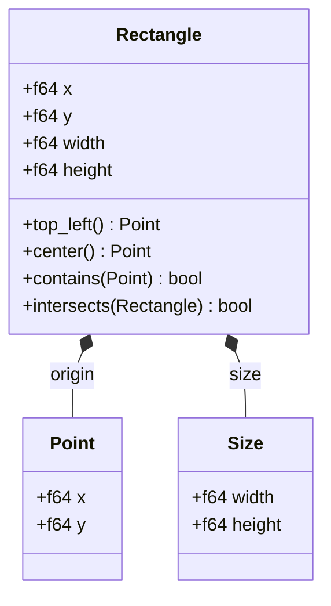
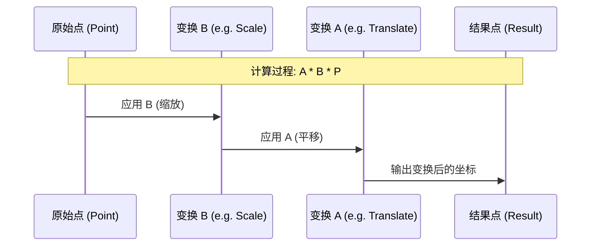
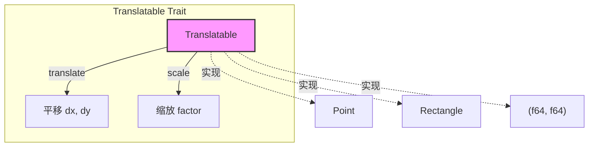
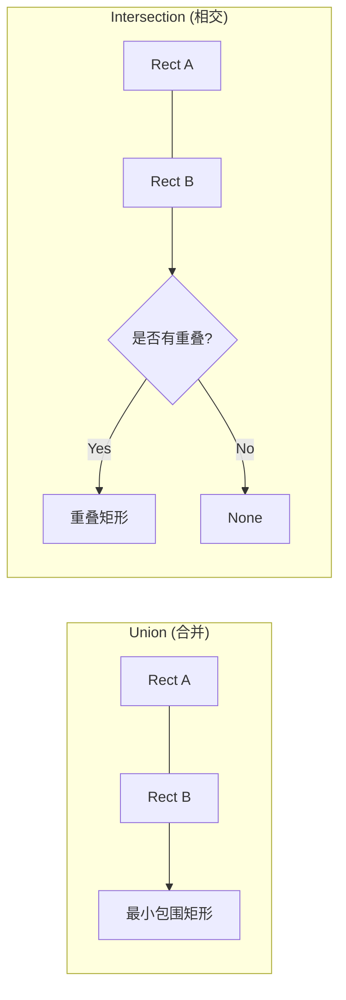

# 几何基元与变换

## 目录

1. [模块概览](#模块概览)
2. [引言](#引言)
3. [核心组件](#核心组件)
   - [向量与点 (Vec2 & Point)](#向量与点-vec2--point)
   - [矩形与尺寸 (Rectangle & Size)](#矩形与尺寸-rectangle--size)
   - [内边距 (Insets)](#内边距-insets)
4. [变换机制 (Transform)](#变换机制-transform)
   - [仿射变换矩阵布局](#仿射变换矩阵布局)
   - [变换组合与顺序](#变换组合与顺序)
   - [点与向量的变换差异](#点与向量的变换差异)
5. [可变形接口 (Translatable Trait)](#可变形接口-translatable-trait)
6. [常用几何运算示例](#常用几何运算示例)
7. [文件引用](#文件引用)

## 模块概览

`novadraw-geometry` 是 Novadraw 图形引擎的基础几何库，负责定义和处理二维空间中的基本形状、向量运算及仿射变换。

- **总文件数**: 5 个 Rust 源文件
- **核心模块**:
  - `vec2`: 提供 `Vec2` 向量类型，基于 `glam` 实现高性能数学运算。
  - `rect`: 提供 `Rectangle`、`Point` 和 `Size` 类型，用于表示区域和位置。
  - `transform`: 提供 `Transform` 类型，封装了基于 `kurbo` 的仿射变换逻辑。
  - `translatable`: 定义了 `Translatable` Trait 和 `Insets` 类型，提供统一的几何操作接口。

该模块不依赖于具体的渲染后端，是一个纯粹的数学与几何逻辑层，为上层的场景树（Scene Tree）和布局引擎（Layout Engine）提供支持。

## 引言

在图形引擎中，几何基元（Geometry Primitives）是所有视觉元素的物理基础。无论是简单的矩形，还是复杂的路径，最终都需要在坐标系中进行定位、测量和变换。

`novadraw-geometry` 的设计目标是提供一套高性能、易于使用的几何 API。它借鉴了 Eclipse Draw2d 的设计哲学（如 `Rectangle` 和 `Translatable` 的概念），同时利用 Rust 的类型系统和高性能库（如 `glam` 和 `kurbo`）来确保运算效率。

该模块的核心职责包括：
1. **坐标表示**：定义统一的 `f64` 精度坐标系统。
2. **空间计算**：处理碰撞检测（contains）、区域合并（union）和相交（intersection）。
3. **坐标转换**：支持复杂的仿射变换（平移、缩放、旋转），并处理不同坐标空间之间的映射。

## 核心组件

### 向量与点 (Vec2 & Point)

`Vec2` 是所有几何运算的基础。它封装了 `glam::DVec2`，提供了标准的向量代数运算。为了语义清晰，代码中定义了 `Point` 作为 `Vec2` 的别名。

```rust
// vec2.rs 中的核心定义
pub struct Vec2(pub DVec2);

// rect.rs 中的别名
pub type Point = Vec2;
```

`Vec2` 支持以下操作：
- **基础运算**：加减乘除、取反、点积、叉积。
- **几何属性**：长度（length）、归一化（normalize）、距离计算。
- **旋转**：支持绕原点的旋转（在 Y 轴向下的坐标系中，正角度表示顺时针旋转）。

### 矩形与尺寸 (Rectangle & Size)

`Rectangle` 是引擎中最常用的形状，用于表示组件的边界（Bounds）。它由左上角坐标 `(x, y)` 和 `(width, height)` 定义。

下图展示了 `Rectangle` 与 `Point`、`Size` 之间的组合关系：



**图表说明**：
`Rectangle` 逻辑上由一个起点（左上角 `Point`）和一个 `Size` 组成，但在实现上直接展开为四个 `f64` 字段以优化内存布局。它提供了丰富的辅助方法，如获取中心点、四个顶点，以及执行空间判断。

### 内边距 (Insets)

`Insets` 用于表示矩形区域向内的偏移量，常用于布局引擎中的 Padding 处理。

```rust
pub struct Insets {
    pub top: f64,
    pub left: f64,
    pub bottom: f64,
    pub right: f64,
}
```

**Section sources**:
- [vec2.rs](novadraw-geometry/src/vec2.rs)
- [rect.rs](novadraw-geometry/src/rect.rs)
- [translatable.rs](novadraw-geometry/src/translatable.rs)

## 变换机制 (Transform)

`Transform` 是 Novadraw 处理坐标空间转换的核心。它基于仿射变换（Affine Transformation），可以同时表示平移、缩放、旋转和错切（Shear）。

### 仿射变换矩阵布局

Novadraw 使用 3x3 的仿射变换矩阵，但由于最后一行固定为 `[0, 0, 1]`，因此只存储 6 个系数 `[a, b, c, d, e, f]`。

其矩阵布局如下：

```
| a c e |   (a: scale_x, c: shear_x, e: translate_x)
| b d f |   (b: shear_y, d: scale_y, f: translate_y)
| 0 0 1 |
```

这种布局遵循行优先（Row-major）原则，与 CSS `matrix()` 和 HTML5 Canvas 的变换矩阵完全一致。

### 变换组合与顺序

变换的组合通过矩阵乘法实现。在 Novadraw 中，`A * B` 的语义是：**先应用 B，再应用 A**。这符合数学上的函数组合顺序 $f(g(x))$。

为了提高代码的可读性，`Transform` 提供了 `then_...` 系列方法。

下表对比了两种组合方式：

| 方式 | 代码示例 | 语义说明 |
| :--- | :--- | :--- |
| **矩阵乘法** | `T_total = T_parent * T_child` | 先应用子变换，再应用父变换 |
| **链式调用** | `T.then_translate(x, y).then_scale(s)` | 先平移，然后在平移后的基础上缩放 |

下面的序列图展示了一个点如何经过组合变换：



**图表说明**：
在坐标变换流中，数据从右向左“流过”变换矩阵。如果我们要将一个物体先缩小 2 倍再移动到 (10, 10)，矩阵计算顺序是 `Translate(10, 10) * Scale(0.5)`。

### 点与向量的变换差异

`Transform` 区分了“点”和“向量”的变换：
- **transform_point**: 应用完整的仿射变换，包括平移。
- **transform_vector**: 仅应用线性部分（缩放、旋转、错切），忽略平移。这对于处理法向量或方向向量至关重要。

**Section sources**:
- [transform.rs](novadraw-geometry/src/transform.rs)

## 可变形接口 (Translatable Trait)

为了提供一致的操作体验，`novadraw-geometry` 定义了 `Translatable` 接口。任何实现了该接口的类型都可以直接进行平移和缩放，而无需关心其内部结构。



**图表说明**：
`Translatable` 抽象了最常用的两种几何操作。对于 `Rectangle` 来说，`translate` 只改变 `x, y`，而 `scale` 会同时缩放位置和尺寸（即矩形相对于原点进行缩放）。

**代码示例**:
```rust
let mut rect = Rectangle::new(10.0, 10.0, 100.0, 100.0);
rect.translate(5.0, 5.0); // 变为 (15.0, 15.0, 100.0, 100.0)
rect.scale(2.0);          // 变为 (30.0, 30.0, 200.0, 200.0)
```

**Section sources**:
- [translatable.rs](novadraw-geometry/src/translatable.rs)

## 常用几何运算示例

`Rectangle` 提供了丰富的空间运算方法，这在处理 UI 布局和重绘区域计算时非常有用。

### 区域合并 (Union) 与 求交 (Intersection)

- **Union**: 计算包含两个矩形的最小矩形（常用于计算脏矩形合并）。
- **Intersection**: 计算两个矩形的重叠部分（常用于裁剪计算）。



**图表说明**：
合并操作总是产生一个结果（除非输入为空），而相交操作可能返回 `None`（如果两个矩形完全不接触）。在 Novadraw 中，`union` 用于扩大更新区域以覆盖所有变化的组件，而 `intersection` 用于确定组件在视口内的可见部分。

### 常用操作代码片段

```rust
use novadraw_geometry::{Rectangle, Point};

let rect_a = Rectangle::new(0.0, 0.0, 100.0, 100.0);
let rect_b = Rectangle::new(50.0, 50.0, 100.0, 100.0);

// 1. 碰撞检测
let p = Point::new(75.0, 75.0);
assert!(rect_a.contains(p));

// 2. 合并区域
let combined = rect_a.union(rect_b); // (0.0, 0.0, 150.0, 150.0)

// 3. 计算相交
if let Some(overlap) = rect_a.intersection(rect_b) {
    println!("重叠区域: {}", overlap); // (50.0, 50.0, 50.0, 50.0)
}

// 4. 膨胀矩形 (向外扩大 5 像素)
let inflated = rect_a.inflate(5.0, 5.0); // (-5.0, -5.0, 110.0, 110.0)
```

**Section sources**:
- [rect.rs](novadraw-geometry/src/rect.rs)

## 文件引用

以下是本模块涉及的核心源文件：

- [novadraw-geometry/src/lib.rs](novadraw-geometry/src/lib.rs): 模块入口，导出公共 API。
- [novadraw-geometry/src/vec2.rs](novadraw-geometry/src/vec2.rs): 2D 向量与点运算实现。
- [novadraw-geometry/src/rect.rs](novadraw-geometry/src/rect.rs): 矩形、尺寸及其空间运算实现。
- [novadraw-geometry/src/transform.rs](novadraw-geometry/src/transform.rs): 仿射变换矩阵及其组合逻辑。
- [novadraw-geometry/src/translatable.rs](novadraw-geometry/src/translatable.rs): `Translatable` Trait 和 `Insets` 类型定义。
