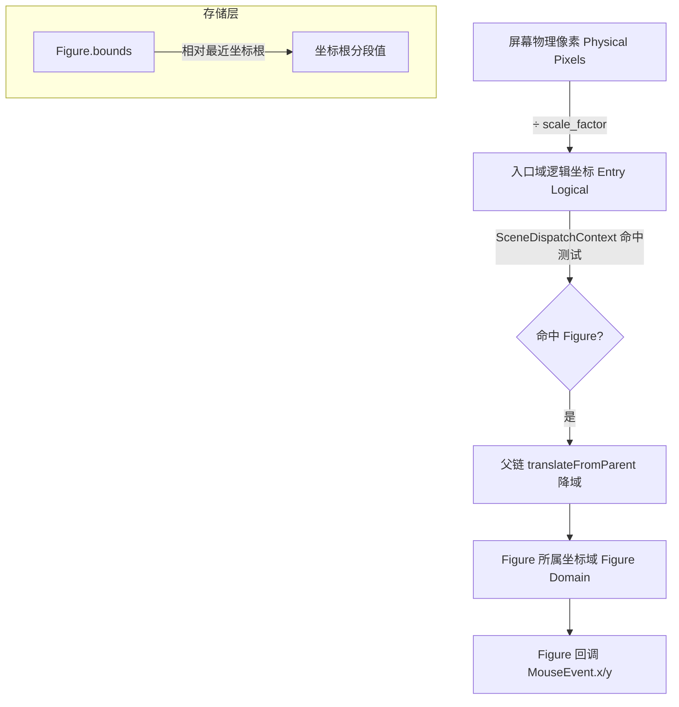
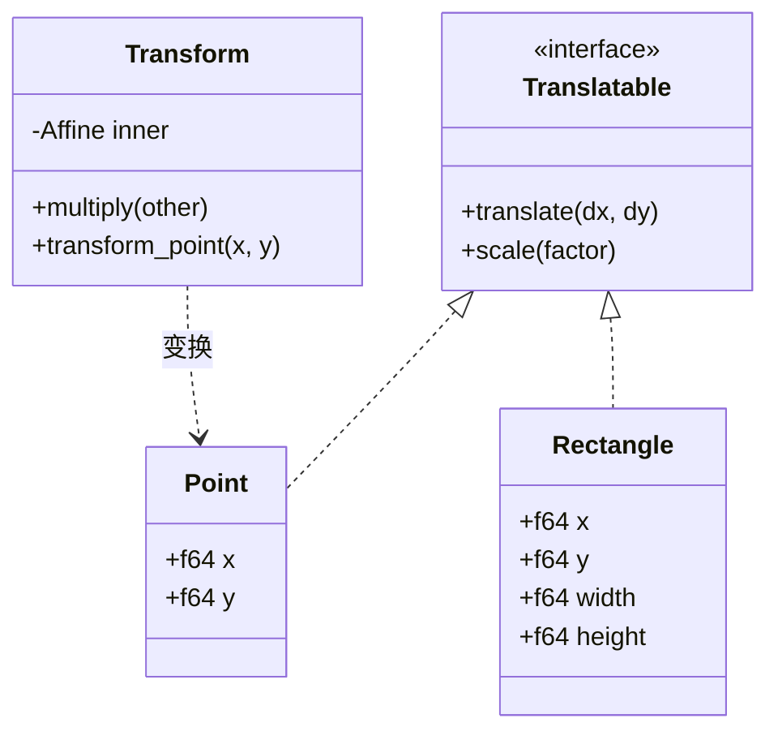
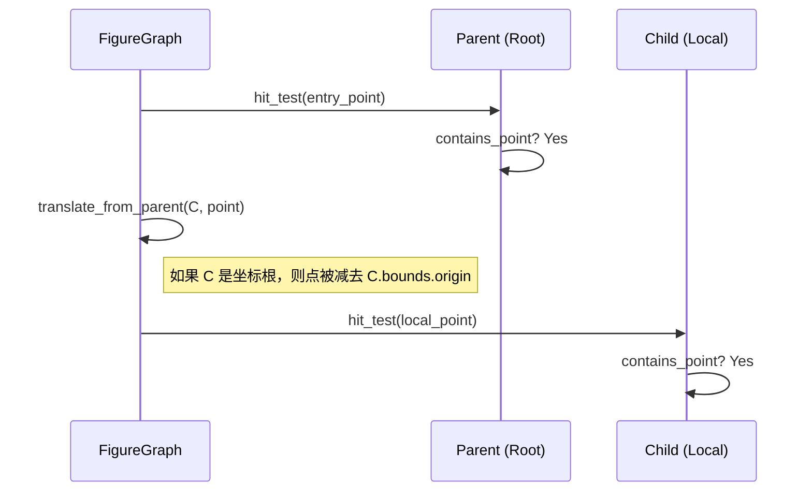
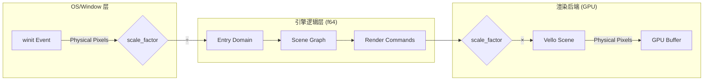
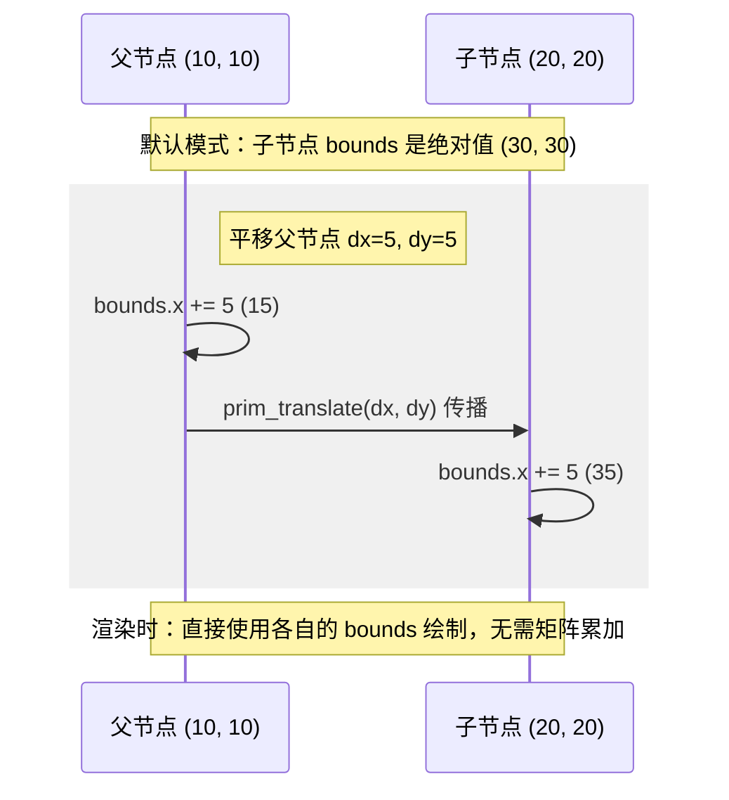
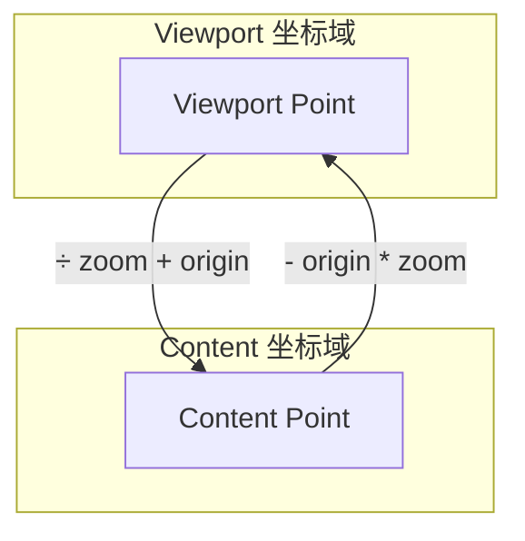

# 坐标系统与空间转换

## 目录
1. [模块概览](#模块概览)
2. [坐标层级架构](#坐标层级架构)
3. [坐标转换协议](#坐标转换协议)
4. [HiDPI 处理机制](#hidpi-处理机制)
5. [Figure Bounds 哲学](#figure-bounds-哲学)
6. [特殊坐标域转换](#特殊坐标域转换)
7. [核心组件与实现](#核心组件与实现)
8. [文件引用](#文件引用)

## 模块概览

Novadraw 的坐标系统是引擎处理交互、布局和渲染的核心基石。为了支持复杂的嵌套图形、缩放视口以及高清显示（HiDPI），Novadraw 设计了一套多层级的坐标转换机制。

在本模块中，我们探索了以下核心范围：
- **文件总数**：约 15 个核心源文件涉及坐标逻辑。
- **覆盖子模块**：
    - `novadraw-geometry`: 提供基础的 `Point`、`Rectangle`、`Transform` 和 `Translatable` 协议。
    - `novadraw-scene`: 实现场景图中的父子链转换逻辑（`FigureGraph`）。
    - `novadraw-render`: 负责渲染后端的物理像素缩放。
- **核心逻辑**：深入分析了从屏幕像素到 Figure 本地空间的完整流转路径，以及 HiDPI 环境下的精确缩放处理。

## 坐标层级架构

Novadraw 的坐标系统分为四个主要层级，每个层级承担不同的职责。理解这些层级是开发交互功能的前提。

### 坐标流转层级图

下面的流程图展示了一个鼠标事件从触发到被 Figure 回调接收的完整坐标转换路径。理解这一路径对于调试交互偏移问题至关重要。



该流程从硬件层的物理像素开始，首先通过 `scale_factor` 归一化为逻辑像素。在引擎内部，`SceneDispatchContext` 负责将这个逻辑点投递到场景图中。通过深度优先遍历和父链降域协议，原始的入口域点被逐层转换为目标 Figure 的本地坐标，最终作为 `MouseEvent` 的参数传递给开发者。

### 几何对象关系

下面的类图展示了 `novadraw-geometry` 中坐标转换相关的核心抽象。



`Translatable` trait 是坐标转换的通用协议，`Point` 和 `Rectangle` 都实现了该接口以支持平移和缩放。`Transform` 则封装了更复杂的仿射变换矩阵，它利用 `kurbo` 库提供的数学能力来处理旋转、缩放和平移的组合。

**Section sources**:
- [coordinates.md](doc/04-coordinates/coordinates.md)
- [scene/mod.rs](novadraw-scene/src/scene/mod.rs)
- [geometry/lib.rs](novadraw-geometry/src/lib.rs)

## 坐标转换协议

Novadraw 通过 `Translatable` trait 和 `FigureGraph` 中的转换方法实现了标准化的坐标流转协议。

### 核心转换方法

| 方法 | 语义 | 应用场景 |
| :--- | :--- | :--- |
| `translate_to_relative` | 绝对(入口域) -> 相对(Figure域) | 事件分发：将鼠标点转换为 Figure 本地点 |
| `translate_to_absolute_mut` | 相对(Figure域) -> 绝对(入口域) | 调试/录制：将 Figure 内部点还原为全局逻辑点 |
| `translate_from_parent` | 父域 -> 子域 | 命中测试：递归下降时的坐标切换 |
| `translate_to_parent` | 子域 -> 父域 | 布局计算：将子节点位置提升到父节点空间 |

### 命中测试中的转换流程

在执行命中测试时，坐标必须随着遍历深度的增加而不断“降域”。



在上述序列中，`FigureGraph` 在尝试检测子节点 `C` 之前，会先调用 `translate_from_parent`。如果 `C` 被配置为使用本地坐标系，那么输入的点将被转换到 `C` 的内部坐标空间。这种递归转换确保了无论嵌套多深，`contains_point` 始终在正确的局部空间内执行。

**Section sources**:
- [scene/mod.rs:L1345-L1353](novadraw-scene/src/scene/mod.rs#L1345-L1353)
- [translatable.rs](novadraw-geometry/src/translatable.rs)

## HiDPI 处理机制

为了在 Retinal 屏幕上获得清晰的渲染效果，Novadraw 在输入端和输出端都进行了 `scale_factor` 处理。

### 坐标流转公式

1.  **输入端 (Input)**：
    `logical_pos = physical_pos / scale_factor`
    *发生在 `winit` 事件捕获层。*

2.  **输出端 (Render)**：
    `render_pos = logical_pos * scale_factor`
    *发生在 `VelloRenderer` 后端执行渲染命令时。*

### HiDPI 缩放流程

下面的流程图详细说明了 `scale_factor` 如何在 winit 事件和 Vello 渲染后端之间进行传递和应用。



该流程确保了引擎核心逻辑完全运行在逻辑像素空间。当用户在 2x DPI 的屏幕上点击 (200, 200) 位置时，引擎收到的逻辑坐标是 (100, 100)。在渲染时，这个 (100, 100) 会再次被乘以 2，以确保在 GPU 缓冲区中占据 200x200 的物理像素区域。

**Section sources**:
- [vello_renderer.rs](novadraw/src/vello_renderer.rs)
- [coordinates.md:L239-L278](doc/04-coordinates/coordinates.md#L239-L278)

## Figure Bounds 哲学

Novadraw 采用了 Eclipse Draw2D 的 `bounds` 哲学，这与传统的 Web DOM 或 Flash 坐标系有显著区别。

### 本地坐标模式 vs. 默认绝对坐标模式

| 特性 | 默认模式 (`useLocalCoordinates = false`) | 本地模式 (`useLocalCoordinates = true`) |
| :--- | :--- | :--- |
| **Bounds 语义** | 相对于最近坐标根的绝对位置 | 相对于父节点的相对位置 |
| **平移传播** | 父节点移动时，自动更新所有子节点的 bounds | 父节点移动时，子节点 bounds 保持不变 |
| **适用场景** | 普通组合图形、简单的父子关系 | 滚动容器（Viewport）、缩放面板、独立坐标系 |

### 为什么 bounds 存储“绝对值”？

在默认模式下，Figure 存储的是绝对坐标。这意味着在渲染遍历时，可以直接使用 `bounds.x/y` 进行绘制，而无需每一层都累加父节点的偏移。



在父节点移动时，`prim_translate` 会递归地更新所有子节点的 `bounds`。虽然这在平移时增加了计算量，但它极大地优化了更频繁的渲染操作。在绘制每一帧时，渲染器只需读取 `bounds` 即可确定位置，避免了代价高昂的父链矩阵乘法。

**Section sources**:
- [figure_bounds.md](doc/02-figure/figure_bounds.md)
- [scene/mod.rs:L1134-L1222](novadraw-scene/src/scene/mod.rs#L1134-L1222)

## 特殊坐标域转换

在处理 `Viewport`（视口）和 `Scroll`（滚动）时，涉及到 `Viewport` 空间与 `Content` 空间的特殊转换。

### Viewport ↔ Content 转换流程

当一个节点作为坐标根（如 Viewport）时，它定义了一个新的坐标原点 `origin` 和缩放比 `zoom`。



- **内容到视口**：`viewport_point = (content_point - origin) * zoom`
- **视口到内容**：`content_point = viewport_point / zoom + origin`

在 `FigureGraph` 的 `translate_from_parent` 中，如果节点是一个 Viewport，它会应用上述逆变换。这使得 Viewport 内部的子节点可以像在普通容器中一样定义自己的坐标，而 Viewport 的滚动（修改 `origin`）和缩放（修改 `zoom`）会自动映射到这些子节点上。

**Section sources**:
- [coordinates.md:L94-L102](doc/04-coordinates/coordinates.md#L94-L102)
- [scene/mod.rs:L1321-L1336](novadraw-scene/src/scene/mod.rs#L1321-L1336)

## 核心组件与实现

### Transform (novadraw-geometry)
基于 `kurbo::Affine` 实现的 2D 仿射变换。支持矩阵乘法、点变换和逆变换。

```rust
pub struct Transform {
    inner: Affine,
}

impl Transform {
    /// 变换组合：先应用 other，再应用 self
    pub fn multiply(self, other: Transform) -> Transform {
        Transform { inner: self.inner * other.inner }
    }
}
```

### FigureGraph (novadraw-scene)
管理场景图及其坐标转换协议。

- `prim_translate`: 核心平移实现，负责 bounds 的绝对值传播。
- `hit_test`: 结合坐标转换的递归命中测试。
- `translate_to_relative`: 外部接入的主要转换入口。

### SceneDispatchContext (novadraw-scene)
在事件分发前，负责将入口域坐标转换为目标 Figure 的本地坐标。

```rust
// SceneDispatchContext::dispatch_to_target
let mut point = Point::new(mouse_event.x, mouse_event.y);
// 将入口域点转换为 target Figure 所在的坐标域
self.scene.translate_to_relative(target_id, &mut point);
let local_event = mouse_event.with_target_point(point.x(), point.y());
// 调用 Figure 回调
block.figure.on_mouse_pressed(&local_event, &mut ctx)
```

**Section sources**:
- [transform.rs](novadraw-geometry/src/transform.rs)
- [scene/mod.rs](novadraw-scene/src/scene/mod.rs)
- [context/mod.rs](novadraw-scene/src/context/mod.rs)

## 文件引用

以下是本章节涉及的关键源代码文件：

- `doc/04-coordinates/coordinates.md`: 坐标系统原理文档。
- `doc/02-figure/figure_bounds.md`: Figure Bounds 哲学分析。
- `novadraw-geometry/src/transform.rs`: 仿射变换实现。
- `novadraw-geometry/src/translatable.rs`: 可变形协议定义。
- `novadraw-scene/src/scene/mod.rs`: 场景图坐标转换核心实现。
- `novadraw-scene/src/context/mod.rs`: 事件分发中的坐标切换逻辑。
- `novadraw/src/vello_renderer.rs`: 渲染后端的 HiDPI 处理。
