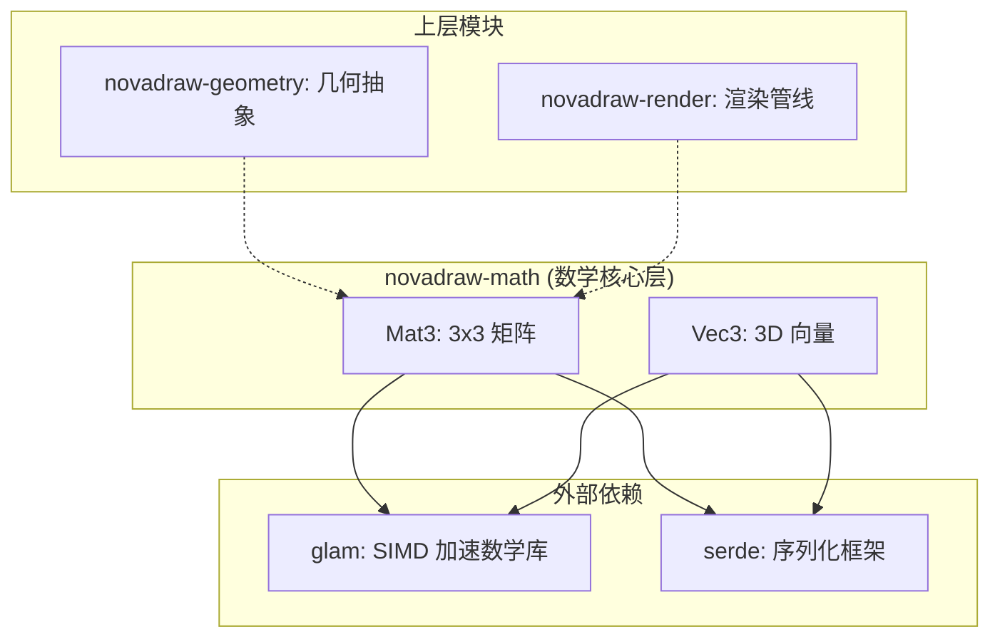
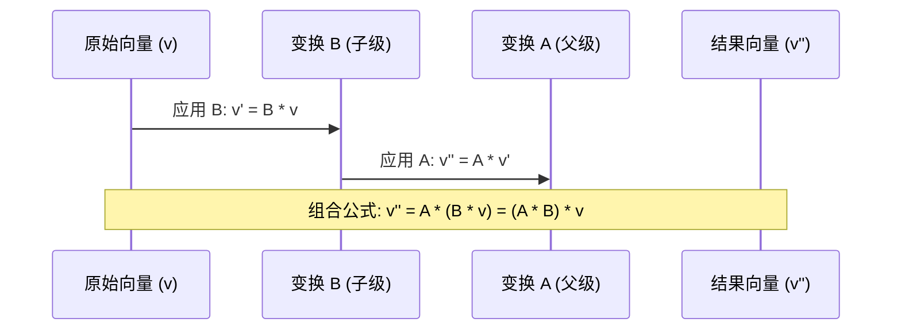
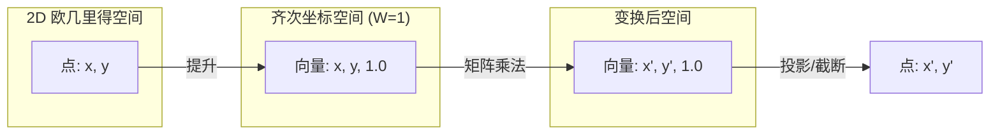
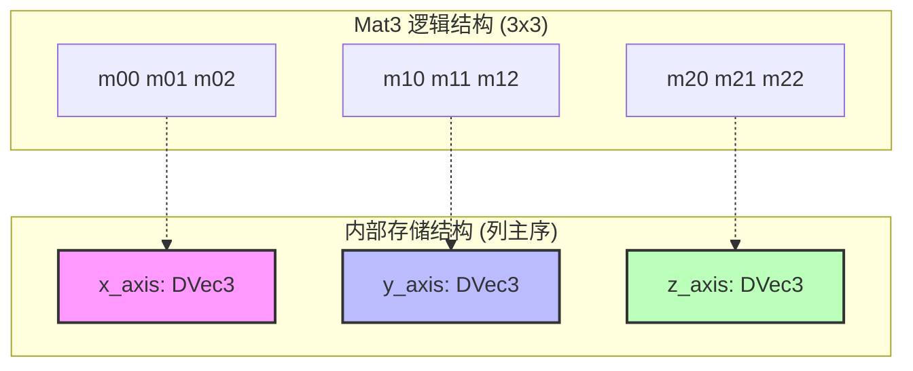

# 数学运算工具

## 目录
1. [模块概览](#模块概览)
2. [核心组件：Mat3 矩阵](#核心组件mat3-矩阵)
   - [数学定义与坐标约定](#数学定义与坐标约定)
   - [变换组合逻辑](#变换组合逻辑)
3. [核心组件：Vec3 向量](#核心组件vec3-向量)
   - [齐次坐标下的应用](#齐次坐标下的应用)
   - [基础向量运算](#基础向量运算)
4. [架构设计与实现原理](#架构设计与实现原理)
   - [底层依赖与封装策略](#底层依赖与封装策略)
   - [数据布局与内存模型](#数据布局与内存模型)
5. [数学变换的几何意义](#数学变换的几何意义)
   - [仿射变换分解](#仿射变换分解)
   - [逆变换与行列式](#逆变换与行列式)
6. [与 novadraw-geometry 的关系](#与-novadraw-geometry-的关系)
7. [文件参考](#文件参考)

## 模块概览

`novadraw-math` 是 Novadraw 引擎的底层数学核心库（Math Kernel）。它不包含任何业务逻辑或几何抽象，而是专注于提供高性能、高精度的线性代数运算工具。该模块是整个图形栈的基石，为上层的几何计算、场景图变换和渲染管线提供数学支撑。

### 范围与规模
该模块目前包含 3 个核心 Rust 文件，总代码量精简且高效。

- **总文件数**: 3
- **子模块**:
  - `mat3`: 3x3 矩阵实现，主要用于 2D 仿射变换。
  - `vec3`: 3D 向量实现，常用于齐次坐标运算或 3D 空间计算。

### 核心职责
1. **线性代数基础**: 实现矩阵乘法、向量点积、叉积等基础运算。
2. **坐标变换**: 提供平移、旋转、缩放等仿射变换的矩阵构造方法。
3. **高性能封装**: 包装底层 `glam` 库，提供符合引擎习惯的 API 接口，并确保类型安全。
4. **序列化支持**: 通过 `serde` 提供矩阵和向量的持久化能力。

下图展示了 `novadraw-math` 在系统中的位置及其与外部依赖的关系：



**图表说明**: `novadraw-math` 位于系统架构的最底层，它通过包装 `glam` 获取 SIMD 加速性能，同时为 `novadraw-geometry` 和 `novadraw-render` 提供基础数据类型。

---

## 核心组件：Mat3 矩阵

`Mat3` 是一个 3x3 的双精度浮点数（`f64`）矩阵。在 2D 图形引擎中，使用 3x3 矩阵而不是 2x2 矩阵的主要原因是**齐次坐标（Homogeneous Coordinates）**。3x3 矩阵能够以统一的矩阵乘法形式表示平移（Translation），这在 2x2 空间中是无法实现的。

### 数学定义与坐标约定

Novadraw 采用**列向量约定（Column-Vector Convention）**。这意味着一个点（向量）被视为一列，变换公式表示为：

$$v' = M \times v$$

其中 $v$ 是原始坐标，$M$ 是变换矩阵，$v'$ 是变换后的坐标。

**矩阵布局（行优先 API）**:
虽然底层存储可能采用列优先，但 `Mat3::new` 提供的 API 遵循直观的行优先布局：

```text
| m00 m01 m02 |  <- 第一行 (通常包含缩放、旋转和平移 X)
| m10 m11 m12 |  <- 第二行 (通常包含缩放、旋转和平移 Y)
| m20 m21 m22 |  <- 第三行 (齐次坐标层，通常为 0 0 1)
```

### 变换组合逻辑

由于采用列向量约定，矩阵乘法的顺序与变换应用的物理顺序是**相反**的。如果我们要先应用变换 $B$，再应用变换 $A$，则组合矩阵为 $C = A \times B$。



**图表说明**: 变换的组合遵循“从右向左”的应用顺序。在代码中，`combined = parent * child` 意味着先应用 `child` 的变换，再应用 `parent` 的变换。

#### 代码示例：矩阵创建与组合

```rust
use novadraw_math::Mat3;

// 1. 创建基础变换
let scale = Mat3::from_scale(2.0, 2.0);          // 缩放 2 倍
let translate = Mat3::from_translation(10.0, 5.0); // 平移 (10, 5)

// 2. 组合变换：先缩放，后平移
// 数学语义：v' = T * (S * v) = (T * S) * v
let combined = translate * scale;

// 3. 验证平移分量
let (tx, ty) = combined.translation();
assert_eq!(tx, 10.0);
assert_eq!(ty, 5.0);

// 4. 验证缩放分量
let (sx, sy) = combined.scale();
assert_eq!(sx, 2.0);
assert_eq!(sy, 2.0);
```

**Section sources**:
- [mat3.rs](novadraw-math/src/mat3.rs)

---

## 核心组件：Vec3 向量

`Vec3` 是一个三维双精度向量类型，包装了 `glam::DVec3`。虽然 Novadraw 主要处理 2D 图形，但 `Vec3` 在处理 3x3 矩阵运算时至关重要，因为它代表了齐次坐标系中的点或向量。

### 齐次坐标下的应用

在 2D 变换中，一个点 $(x, y)$ 会被提升为齐次坐标 $(x, y, 1.0)$。这种提升使得平移操作可以表示为线性矩阵乘法。



**图表说明**: 齐次坐标通过增加一个维度（$W$ 分量），将 2D 的仿射变换（平移+线性变换）转化为 3D 空间的纯线性变换。

### 基础向量运算

`Vec3` 提供了完整的向量代数支持，包括加减乘除、点积（Dot Product）和叉积（Cross Product）。

- **点积 (`dot`)**: 用于计算两个向量的投影或夹角余弦。
- **叉积 (`cross`)**: 在 2D 引擎中，两个 2D 向量（$Z=0$）的叉积结果仅在 $Z$ 轴上有分量，其大小等于这两个向量组成的平行四边形的面积。

#### 代码示例：向量运算

```rust
use novadraw_math::Vec3;

// 创建向量
let v1 = Vec3::new(1.0, 0.0, 0.0);
let v2 = Vec3::new(0.0, 1.0, 0.0);

// 1. 叉积：计算法向量
let v3 = v1.cross(v2); // 结果应为 (0, 0, 1)
assert_eq!(v3, Vec3::new(0.0, 0.0, 1.0));

// 2. 点积：计算夹角
let dot_product = v1.dot(v2);
assert_eq!(dot_product, 0.0); // 正交向量点积为 0

// 3. 归一化
let v_long = Vec3::new(5.0, 0.0, 0.0);
let v_unit = v_long.normalize();
assert_eq!(v_unit.length(), 1.0);
```

**Section sources**:
- [vec3.rs](novadraw-math/src/vec3.rs)

---

## 架构设计与实现原理

### 底层依赖与封装策略

`novadraw-math` 并没有从零实现矩阵算法，而是选择了成熟的 `glam` 库作为后端。

> **为什么选择 glam?**
> 1. **性能**: `glam` 针对不同架构（如 x86 的 SSE2/AVX, ARM 的 NEON）进行了 SIMD 优化。
> 2. **简洁**: 它的设计目标是作为游戏引擎的数学库，API 极简。
> 3. **稳定性**: 被广泛用于 Rust 图形生态系统（如 wgpu, bevy）。

Novadraw 对其进行了**Newtype 封装**（例如 `struct Mat3(pub DMat3)`）。这种做法的优势在于：
- **解耦**: 如果未来需要更换数学库（如 `nalgebra` 或自定义实现），只需修改 `novadraw-math` 内部，而不影响上层业务。
- **扩展**: 可以在包装类型上直接实现 `serde` 序列化，而无需处理第三方 crate 的孤儿规则（Orphan Rules）。
- **专业化 API**: 隐藏 `glam` 中不必要的 3D 功能，仅暴露 2D 引擎所需的接口。

### 数据布局与内存模型

`Mat3` 在内存中实际上是由三个 `Vec3`（即 `DVec3`）组成的。



**图表说明**: 虽然 API 层面支持行优先创建，但 `glam` 内部采用列主序（Column-Major）存储。这意味着矩阵的每一列在内存中是连续的，这有利于 GPU 交互和特定的向量化运算。

---

## 数学变换的几何意义

### 仿射变换分解

一个标准的 2D 仿射变换矩阵可以表示为：

$$
\begin{bmatrix}
sx \cdot \cos(\theta) & -sy \cdot \sin(\theta) & tx \\
sx \cdot \sin(\theta) & sy \cdot \cos(\theta) & ty \\
0 & 0 & 1
\end{bmatrix}
$$

- **$(tx, ty)$**: 平移分量。
- **$sx, sy$**: 缩放分量。
- **$\theta$**: 旋转弧度。

`Mat3` 提供了专门的提取方法：
- `translation()`: 提取矩阵中的平移部分。
- `rotation()`: 通过 $atan2(m10, m00)$ 提取旋转角度。
- `scale()`: 通过计算基向量的长度来提取缩放比例。

### 逆变换与行列式

- **行列式 (`determinant`)**: 衡量变换后面积的变化比例。如果行列式为 0，说明矩阵不可逆（发生了塌陷，如缩放倍数为 0）。
- **逆矩阵 (`inverse`)**: 用于撤销变换。在交互系统中，逆矩阵常用于将屏幕坐标（Pointer 坐标）转换回局部图形坐标系。

```rust
// 示例：坐标反向转换
let transform = Mat3::from_translation(100.0, 100.0);
let inv_transform = transform.inverse().expect("矩阵应可逆");

let screen_pos = (120.0, 130.0);
// 使用逆矩阵将屏幕点转回局部坐标
// 逻辑：(120, 130) - (100, 100) = (20, 30)
```

---

## 与 novadraw-geometry 的关系

虽然 `novadraw-math` 提供了基础的矩阵运算，但在日常业务开发中，开发者更多地使用 `novadraw-geometry` 中的 `Transform` 类型。

| 特性 | `novadraw-math::Mat3` | `novadraw-geometry::Transform` |
| :--- | :--- | :--- |
| **定位** | 底层数学内核 | 高层几何抽象 |
| **内部实现** | `glam::DMat3` | `kurbo::Affine` |
| **API 风格** | 纯数学接口 (new, mul) | 几何描述接口 (then_translate, rotate_about) |
| **主要用途** | 渲染管线、IR 中间表示 | 场景图构建、图形变换 |

**设计哲学**:
`Mat3` 追求的是**数学完备性**和**运算效率**。它不关心“绕哪个点旋转”，只关心矩阵数值的乘法。
`Transform` 追求的是**易用性**。它提供了如 `then_rotate_about(radians, center)` 这样的高级方法，这些方法在内部会生成多个 `Mat3`（或等价的 `Affine`）并进行组合：
1. 平移到原点：`T(-cx, -cy)`
2. 旋转：`R(radians)`
3. 平移回原位：`T(cx, cy)`
4. 最终矩阵：`T_back * R * T_origin`

在渲染管线的末端，所有的 `Transform` 最终都会被转换为 `Mat3` 格式的数值，传递给渲染后端进行最终的顶点计算。

---

## 文件参考

本页面内容参考了以下核心源文件：

- [novadraw-math/src/lib.rs](novadraw-math/src/lib.rs): 模块入口与导出定义。
- [novadraw-math/src/mat3.rs](novadraw-math/src/mat3.rs): 3x3 矩阵的具体实现、变换构造函数及运算符重载。
- [novadraw-math/src/vec3.rs](novadraw-math/src/vec3.rs): 3D 向量实现及其代数运算逻辑。
- [novadraw-geometry/src/transform.rs](novadraw-geometry/src/transform.rs): 高层变换抽象及其与底层数学的关系。
- [doc/03-rendering/rendering_pipeline.md](doc/03-rendering/rendering_pipeline.md): 渲染管线中矩阵转换的说明。
