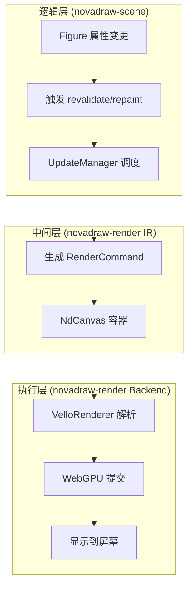
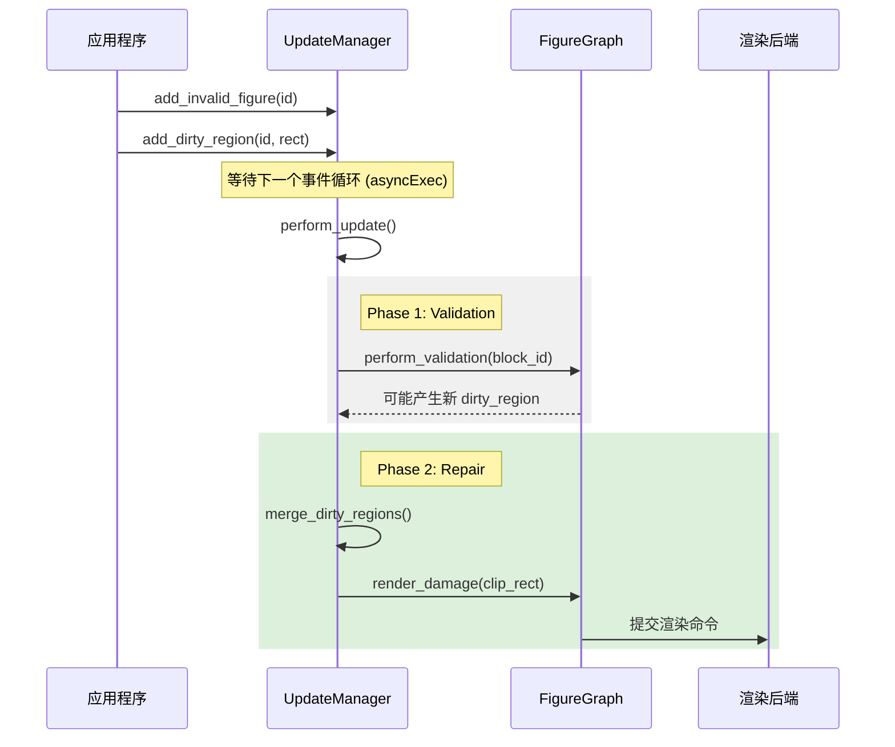
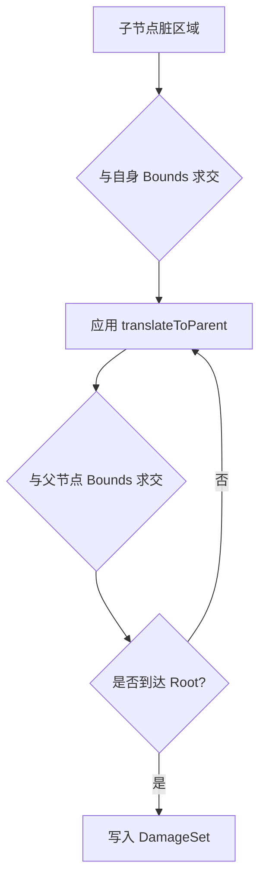
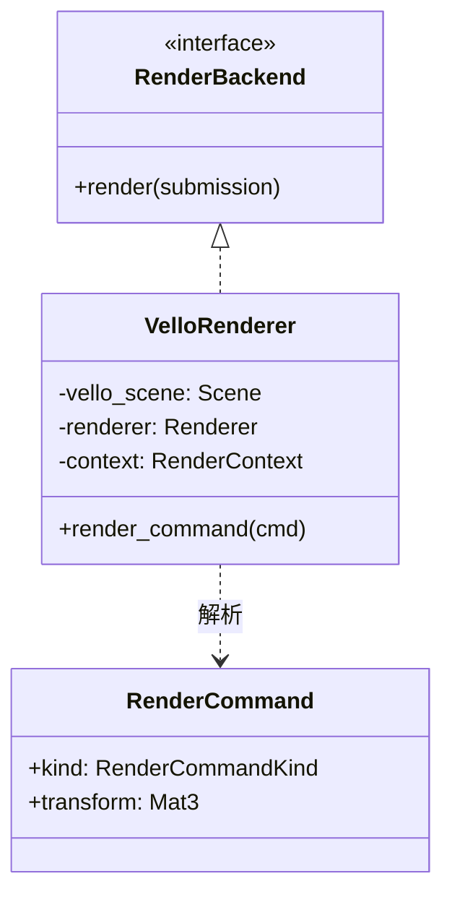

# 渲染管线与损伤修复

## 目录
1. [模块概览](#模块概览)
2. [渲染管线架构](#渲染管线架构)
3. [更新管理器 (UpdateManager)](#更新管理器-updatemanager)
4. [损伤修复机制 (Damage Repair)](#损伤修复机制-damage-repair)
5. [Vello 渲染后端](#vello-渲染后端)
6. [核心组件分析](#核心组件分析)
7. [性能优化策略](#性能优化策略)
8. [关键源文件引用](#关键源文件引用)

## 模块概览

Novadraw 的渲染系统是一个高性能、基于损伤追踪（Damage Tracking）的矢量渲染引擎。它旨在通过精确计算重绘区域和利用 GPU 加速来提供流畅的用户体验。该模块主要分布在 `novadraw-render`（渲染抽象与后端）和 `novadraw-scene/src/update`（更新逻辑与损伤修复）中。

**项目范围统计**：
- **总文件数**：约 12 个核心源文件。
- **子模块分布**：
    - `novadraw-render/src/backend`: 包含 Vello 后端实现。
    - `novadraw-render/src/command.rs` & `context.rs`: 定义渲染命令中间层（IR）。
    - `novadraw-scene/src/update`: 核心更新流水线与损伤修复算法。

本章节将深入探讨从场景图属性变更到最终屏幕像素显示的完整路径，重点解析损伤修复算法和 Vello 后端的集成细节。

## 渲染管线架构

Novadraw 采用了典型的三层渲染架构，将逻辑层、中间表示层和底层渲染后端解耦。这种设计不仅提高了代码的可维护性，还允许在不改变业务逻辑的情况下替换不同的渲染后端。

### 三层架构模型

1.  **场景图渲染（逻辑层）**：遍历 `FigureGraph`，根据 Figure 的属性生成渲染命令。此阶段处理父子变换累积、可见性过滤和裁剪逻辑。
2.  **渲染命令（IR 中间层）**：由 `RenderCommand` 组成的序列。它作为逻辑层与后端之间的契约，屏蔽了底层渲染 API 的复杂性。
3.  **渲染后端（执行层）**：目前主要由基于 Vello 的 WebGPU 后端实现。它负责将 `RenderCommand` 转换为 GPU 能够执行的指令。

下图展示了数据在渲染管线中的流动过程：

**图表说明**：
渲染流程始于 Figure 的属性变更（如位置、颜色修改）。`UpdateManager` 接收到变更通知后，会将其标记为“失效”或“脏区域”。在下一个渲染帧，`UpdateManager` 驱动场景图生成 `RenderCommand`，并最终由 Vello 后端提交给 GPU 完成绘制。

**Section sources**:
- [rendering_pipeline.md](doc/03-rendering/rendering_pipeline.md)
- [lib.rs](novadraw-render/src/lib.rs)

## 更新管理器 (UpdateManager)

`UpdateManager` 是渲染系统的“指挥官”，负责协调布局验证（Validation）和重绘（Repaint）两个阶段。它借鉴了 Eclipse Draw2D 的 `DeferredUpdateManager` 设计，采用异步批处理机制来优化性能。

### 两阶段更新流程

为了避免冗余计算，`UpdateManager` 将更新分为两个严格顺序的阶段：

1.  **Phase 1: Layout (Validation)**：
    - 遍历失效块队列（Invalid Blocks）。
    - 触发 Figure 的布局计算。
    - 布局过程中可能会产生新的失效块，这些块会被追加到队列尾部继续处理。
2.  **Phase 2: Repaint (Damage Repair)**：
    - 合并所有脏区域（Dirty Regions）。
    - 将脏区域从局部坐标系传播到根坐标系。
    - 仅对受损区域进行重绘。

**图表说明**：
时序图展示了 `UpdateManager` 如何延迟处理更新请求。通过将多个属性变更合并到同一个更新周期，系统极大地减少了布局计算和绘制调用的次数。Phase 1 确保了所有 Figure 在绘制前都处于正确的几何状态，而 Phase 2 则负责最小化重绘开销。

**Section sources**:
- [mod.rs](novadraw-scene/src/update/mod.rs)
- [deferred.rs](novadraw-scene/src/update/deferred.rs)

## 损伤修复机制 (Damage Repair)

损伤修复（Damage Repair）是 Novadraw 实现高性能渲染的核心算法。其目标是：**只绘制屏幕上发生变化的部分**。

### 损伤传播算法

当一个 Figure 请求重绘时，它提供的脏区域（Dirty Rect）是相对于其自身坐标系的。损伤修复机制必须将该区域沿父链向上传播，直到根节点。

**传播步骤**：
1.  **裁剪到自身边界**：脏区域首先与 Figure 的 `bounds` 求交，确保不会绘制到边界外。
2.  **坐标转换**：如果父节点使用了局部坐标系（`use_local_coordinates`），则需要应用平移。
3.  **父级裁剪**：在每一层父节点，脏区域都会与父节点的 `bounds` 再次求交。
4.  **合并到根区域**：最终传播到根节点的区域被合并到全局 `DamageSet` 中。

**图表说明**：
该流程图描述了损伤区域如何递归地向上传播并进行裁剪。这种“逐层裁剪”的策略保证了子节点永远不会在被其祖先遮挡或裁剪的区域之外进行无效绘制。

### 损伤区域规格化 (Normalization)

为了平衡“绘制次数”和“绘制面积”，系统会对收集到的多个脏区域进行规格化处理：
- **合并重叠区域**：重叠或相邻的矩形会被合并为一个。
- **合并碎片化区域**：如果小面积区域过多，会根据启发式算法将它们合并。
- **数量限制**：为了防止渲染后端处理过多的裁剪区域，系统将脏区域数量限制在 8 个以内，超过则合并为单一的并集矩形。

**Section sources**:
- [repair.rs](novadraw-scene/src/update/repair.rs)

## Vello 渲染后端

Novadraw 集成了 [Vello](https://github.com/linebender/vello)，这是一个基于 WebGPU 的高性能矢量渲染引擎。

### Vello 集成要点

-   **WebGPU 驱动**：利用 GPU 的并行计算能力处理矢量路径的填充和描边。
-   **命令映射**：`VelloRenderer` 遍历 `NdCanvas` 中的 `RenderCommand`，将其转换为 Vello 的 `Scene` 操作。
-   **坐标系转换**：处理逻辑像素（Logical Pixels）到设备像素（Physical Pixels）的缩放（Scale Factor）。
-   **状态同步**：将中间层的仿射变换矩阵（Mat3）转换为 Vello 使用的 `kurbo::Affine`。

**图表说明**：
类图展示了 `VelloRenderer` 如何实现 `RenderBackend` 接口，并利用 Vello 内部的 `Scene` 对象来累积渲染指令。

**Section sources**:
- [vello/mod.rs](novadraw-render/src/backend/vello/mod.rs)
- [traits.rs](novadraw-render/src/traits.rs)

## 核心组件分析

### NdCanvas & RenderContext
`NdCanvas` 是渲染数据的容器，它持有生成的 `RenderCommand` 序列和 `DamageSet`。`RenderContext` 则提供了流式 API（如 `fill_rect`, `draw_line`）来向 `NdCanvas` 写入命令。

### SceneUpdateManager
负责维护失效队列和脏区域映射表。它不直接执行渲染，而是作为数据中心供 `FigureGraph` 调用。

### DamageSet
存储经过规格化处理后的脏区域列表。它包含一个 `union` 矩形（所有脏区域的并集）和一个 `regions` 列表（独立的脏区域矩形）。

**Section sources**:
- [context.rs](novadraw-render/src/context.rs)
- [submission.rs](novadraw-render/src/submission.rs)

## 性能优化策略

Novadraw 的渲染性能得益于以下几个关键设计：

1.  **最小化重绘面积**：通过损伤追踪算法，仅更新屏幕上发生变化的部分，极大地减少了像素填充开销。
2.  **减少 Draw Call**：通过损伤区域规格化，将零散的脏区域合并，减少了 GPU 的状态切换和裁剪指令。
3.  **异步批处理**：`UpdateManager` 将同一帧内的多次属性修改合并处理，避免了重复的布局计算和渲染提交。
4.  **GPU 加速**：Vello 的 WebGPU 后端利用 GPU 的计算着色器（Compute Shaders）进行矢量栅格化，性能远超传统的 CPU 渲染器。

> 💡 **提示**：在开发自定义 Figure 时，确保正确实现 `use_local_coordinates`。如果 Figure 包含复杂的子节点，开启局部坐标系可以简化损伤区域的计算逻辑。

## 关键源文件引用

以下是本章节涉及的核心源文件：

- [novadraw-render/src/lib.rs](novadraw-render/src/lib.rs): 渲染库入口。
- [novadraw-render/src/context.rs](novadraw-render/src/context.rs): 渲染上下文实现。
- [novadraw-render/src/backend/vello/mod.rs](novadraw-render/src/backend/vello/mod.rs): Vello 渲染后端。
- [novadraw-scene/src/update/mod.rs](novadraw-scene/src/update/mod.rs): 更新管理器接口。
- [novadraw-scene/src/update/repair.rs](novadraw-scene/src/update/repair.rs): 损伤修复算法核心。
- [novadraw-scene/src/update/deferred.rs](novadraw-scene/src/update/deferred.rs): 延迟更新实现。
