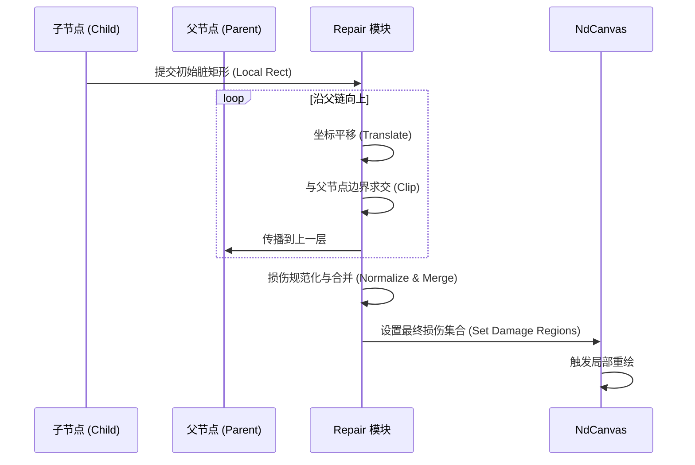
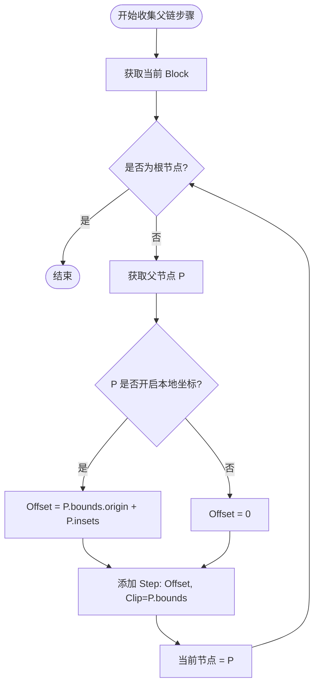
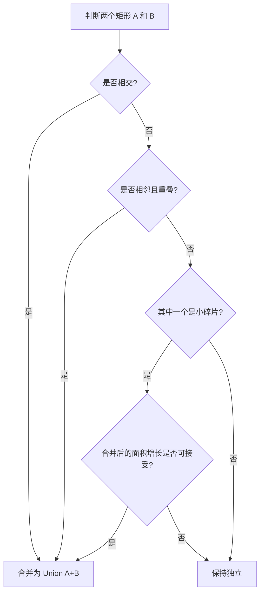
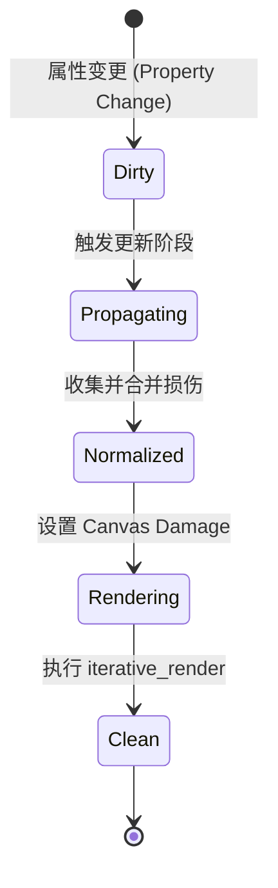

# 损伤修复机制：Damage Repair 的原理与优化

## 目录
1. [模块概览](#模块概览)
2. [引言：损伤修复的核心价值](#引言损伤修复的核心价值)
3. [损伤区域计算模型](#损伤区域计算模型)
4. [坐标空间转换与传播协议](#坐标空间转换与传播协议)
5. [裁剪优化机制：从全局到局部的精细控制](#裁剪优化机制从全局到局部的精细控制)
6. [损伤合并算法：性能与精度的平衡艺术](#损伤合并算法性能与精度的平衡艺术)
7. [核心组件与代码实现分析](#核心组件与代码实现分析)
8. [集成与数据流：从场景更新到后端渲染](#集成与数据流从场景更新到后端渲染)
9. [文件参考](#文件参考)

## 模块概览

损伤修复（Damage Repair）是 Novadraw 渲染引擎中实现增量更新和高性能局部重绘的核心模块。该模块主要位于 `novadraw-scene/src/update/repair.rs`，并与渲染管线和裁剪原则紧密结合。

在本次探索中，我们深入分析了以下范围：
- **核心文件**：`novadraw-scene/src/update/repair.rs`，包含了损伤传播、合并和规范化的核心逻辑。
- **关联文档**：`doc/03-rendering/rendering_pipeline.md` 和 `doc/03-rendering/clip_principle.md`，提供了宏观架构和裁剪设计的背景。
- **渲染集成**：`novadraw-render/src/submission.rs`（参考），了解损伤区域如何最终传递给渲染后端。

**规模统计**：
- 涉及子模块：1个（`update` 模块下的 `repair` 子模块）。
- 核心代码量：`repair.rs` 约 500 行，包含完整的算法实现与单元测试。
- 覆盖深度：本页面将深度解析损伤计算的数学逻辑、坐标转换的复杂路径以及合并算法的性能权衡。

## 引言：损伤修复的核心价值

在复杂的图形应用中，场景图（Scene Graph）可能包含数千个图形（Figure）。如果每次任何微小的属性变化（如颜色改变、位置移动）都触发整个画布的重新绘制，性能将迅速崩溃。

损伤修复机制的引入是为了解决“重绘成本”与“交互响应”之间的矛盾。其核心思想是：**只重绘真正发生改变的区域**。

当一个 Figure 的状态发生变化时，它会产生一个“损伤区域”（Damage Region），也称为“脏矩形”（Dirty Rect）。损伤修复模块负责将这些局部的、处于不同坐标系下的损伤区域，通过父链传播、裁剪、转换，最终合并成一组位于根坐标系下的高效渲染任务。

> 💡 **核心目标**：
> 1. **最小化重绘区域**：通过精确的裁剪和相交计算，排除不必要的绘制。
> 2. **优化渲染开销**：通过合并重叠或邻近的损伤区域，减少渲染命令的提交次数。
> 3. **坐标一致性**：确保在多层嵌套、不同坐标原点的 Figure 树中，损伤传播的数学逻辑始终正确。

## 损伤区域计算模型

损伤区域的计算始于 Figure 的属性变更。一个典型的变更（如位置移动）会产生两个损伤区域：
1. **旧边界（Old Bounds）**：图形移动前占据的区域，需要清除并修复背景。
2. **新边界（New Bounds）**：图形移动后占据的新区域，需要绘制新的内容。

在 Novadraw 中，这两个矩形会被合并（Union）成一个初始的脏矩形，然后开始向上传播。

### 损伤传播流程

损伤传播是一个自底向上的过程。每一个 Figure 产生的损伤都需要经过其父链，直到到达根节点（Root）。

下面的序列图展示了一个子节点发生变化后，损伤是如何传播并最终应用到画布上的：



**流程说明**：
损伤传播不仅是简单的坐标相加，它伴随着严格的裁剪逻辑。如果一个子节点的损伤区域超出了其父节点的可见范围（Bounds），那么超出部分在最终渲染中是不可见的，因此在传播过程中会被剪裁掉。这大大减少了最终需要处理的像素面积。

**Diagram sources**: 
- [repair.rs:L101-L113](novadraw-scene/src/update/repair.rs#L101-L113)
- [repair.rs:L67-L79](novadraw-scene/src/update/repair.rs#L67-L79)

## 坐标空间转换与传播协议

Novadraw 采用了“相对坐标系”与“坐标根”的概念。理解损伤修复的关键在于掌握 `DamagePropagationStep` 的处理逻辑。

### 坐标模型契约

根据 `repair.rs` 的文档注释，Novadraw 遵循以下契约：
- `bounds` 始终处于该 Figure 最近的**坐标根**（Coordinate Root）的坐标域内。
- 只有当父节点的 `use_local_coordinates() == true` 时，才会发生坐标提升。

### 传播步骤计算

在向上传播时，系统会收集一个 `DamagePropagationStep` 序列。每个步骤包含两个操作：
1. **平移（Offset）**：将当前坐标系的坐标转换到父坐标系。
2. **裁剪（Clip）**：将损伤区域限制在父节点的边界内。

```rust
pub(crate) struct DamagePropagationStep {
    pub offset_x: f64,
    pub offset_y: f64,
    pub clip: Option<Rectangle>,
}
```

**坐标转换算法逻辑**：
当遍历到父节点 `P` 时：
- 如果 `P` 开启了本地坐标系（`use_local_coordinates`），则偏移量为 `P.bounds.x + P.insets.left`。
- 否则，偏移量为 `0`（因为子节点与父节点共用同一个坐标根）。

下面的流程图详细说明了如何计算每一层的传播参数：



**逻辑分析**：
这种设计允许 Novadraw 处理极其复杂的嵌套结构。例如，一个在深层嵌套中的小图形移动了，它的损伤会逐层被父容器裁剪。如果它移动到了父容器的滚动窗口之外，损伤区域会变成空，从而完全避免了渲染开销。

**Diagram sources**: 
- [repair.rs:L115-L154](novadraw-scene/src/update/repair.rs#L115-L154)

## 裁剪优化机制：从全局到局部的精细控制

裁剪（Clipping）是损伤修复中最重要的性能优化手段。Novadraw 的裁剪原则借鉴了 Eclipse Draw2D 的设计，但在实现上更加轻量化。

### 默认裁剪原则

在 Novadraw 中，**子节点默认被限制在父节点的边界内**。这意味着在损伤传播的每一步，都会执行一次矩形求交操作：

```rust
// repair.rs:L73-L75
if let Some(clip) = step.clip {
    contribution = contribution.intersection(clip)?;
}
```

这里的 `?` 运算符非常关键：如果 `intersection` 返回 `None`（即两个矩形不相交），整个传播链会立即中断，该损伤区域被丢弃。

### 嵌套裁剪的数学逻辑

当存在多层嵌套裁剪时，最终的损伤区域 $D_{final}$ 可以表示为：
$D_{final} = (((D_{local} + T_1) \cap C_1) + T_2) \cap C_2 \dots$
其中 $T_n$ 是第 $n$ 层的平移向量，$C_n$ 是第 $n$ 层的裁剪矩形。

这种逐层求交的方式确保了损伤区域始终是精确的。相比于直接计算全局坐标，这种方式能更早地发现“不可见”的损伤。

## 损伤合并算法：性能与精度的平衡艺术

当多个 Figure 同时发生变化时，会产生多个损伤矩形。如果直接将这些矩形交给渲染器，可能会导致大量的渲染状态切换和重复绘制。

Novadraw 采用了一套复杂的规范化（Normalization）和合并（Merging）策略，旨在找到**重绘面积**与**矩形数量**之间的最优平衡。

### 合并策略决策树

系统在决定是否合并两个矩形 `A` 和 `B` 时，遵循以下逻辑：



**关键算法细节**：
1. **相交合并**：如果两个矩形有重叠，合并它们总是划算的，因为这减少了矩形数量且没有增加多余的重绘面积。
2. **相邻合并**：如果两个矩形在水平或垂直方向上“触摸”且在另一轴上有重叠，合并它们可以减少边缘处理的开销。
3. **小碎片合并（Small Region Merging）**：
   - Novadraw 定义了一个阈值 `DAMAGE_REGION_MERGE_AREA_THRESHOLD = 9.0`。
   - 面积小于该值的矩形被视为“碎片”。系统会尝试将碎片合并到最近的邻居中，即使它们不相交。
   - 这里的权衡是：**增加一点点重绘面积，换取更少的渲染批次**。

### 数量限制与兜底方案

为了防止损伤集合过于复杂，Novadraw 设置了硬上限 `DAMAGE_REGION_MAX_COUNT = 8`。
- 如果经过合并后，矩形数量仍然超过 8 个，系统会放弃局部性，直接将所有矩形合并为一个巨大的 `Union` 矩形。
- 这种“退化”策略保证了在极端混乱的场景下（如全屏动画），系统不会因为计算过多的脏矩形而卡死。

**Diagram sources**: 
- [repair.rs:L156-L211](novadraw-scene/src/update/repair.rs#L156-L211)
- [repair.rs:L220-L255](novadraw-scene/src/update/repair.rs#L220-L255)

## 核心组件与代码实现分析

### `repair.rs` 核心函数解析

#### 1. `propagate_damage_to_root`
这是损伤传播的入口。它负责将一个处于局部坐标系的脏矩形转换到根坐标系。

```rust
pub(crate) fn propagate_damage_to_root(
    graph: &FigureGraph,
    block_id: BlockId,
    contribution: Rectangle,
) -> Option<Rectangle> {
    let steps = collect_parent_chain_steps(graph, block_id)?;
    propagate_damage_through_parent_chain(contribution, &steps)
}
```

#### 2. `normalize_damage_regions`
这是合并算法的核心实现。它采用了多轮迭代的方式：
- **第一轮**：排序。按 `x, y` 坐标排序，使得相邻的矩形在数组中靠近，提高合并效率。
- **第二轮**：贪婪合并。遍历数组，尝试将每个矩形与已有的规范化矩形合并。
- **第三轮**：碎片清理。调用 `merge_small_regions` 处理微小矩形。

### 损伤修复状态机

损伤修复过程可以看作是一个从“脏状态”到“修复状态”的转换：



在 `execute_repair_phase` 函数中，这一流程被严格执行：
1. 遍历所有脏区域。
2. 调用 `propagate_damage_to_root`。
3. 调用 `write_damage_set` 进行规范化并写入画布。
4. 调用 `graph.render_to_iterative(canvas)` 进行实际的增量渲染。

**Diagram sources**: 
- [repair.rs:L101-L113](novadraw-scene/src/update/repair.rs#L101-L113)

## 集成与数据流：从场景更新到后端渲染

损伤修复模块产生的最终结果是一组 `Rectangle`，存储在 `NdCanvas` 的 `damage` 字段中。

### 数据流向

1. **Scene 层**：检测到 Figure 变化，记录 `BlockId` 和 `DirtyRect`。
2. **Update 层**：调用 `repair.rs`，将所有 `DirtyRect` 转换为根坐标系下的 `DamageRegions`。
3. **Render 层**：渲染后端（如 Vello）在开始绘制前读取 `DamageRegions`。
4. **GPU 层**：利用裁剪平面（Scissor Rect / Stencil）限制绘制范围，只更新损伤区域对应的显存。

### 性能分析

通过损伤修复，Novadraw 实现了以下性能提升：
- **CPU 节省**：减少了生成 `RenderCommand` 的数量。不需要遍历未受损伤影响的 Figure 分支。
- **GPU 节省**：大幅减少了着色器执行的像素数量。
- **带宽节省**：在 Web 环境下，减少了从 WASM 到 JS 传递的渲染命令数据量。

## 文件参考

本章节内容基于以下源文件分析得出：

**Section sources**:
- [novadraw-scene/src/update/repair.rs](novadraw-scene/src/update/repair.rs) - 损伤修复算法的核心实现。
- [doc/03-rendering/rendering_pipeline.md](doc/03-rendering/rendering_pipeline.md) - 渲染管线架构说明。
- [doc/03-rendering/clip_principle.md](doc/03-rendering/clip_principle.md) - 裁剪设计原则。
- [novadraw-render/src/submission.rs](novadraw-render/src/submission.rs) - 损伤区域在渲染提交中的应用。
