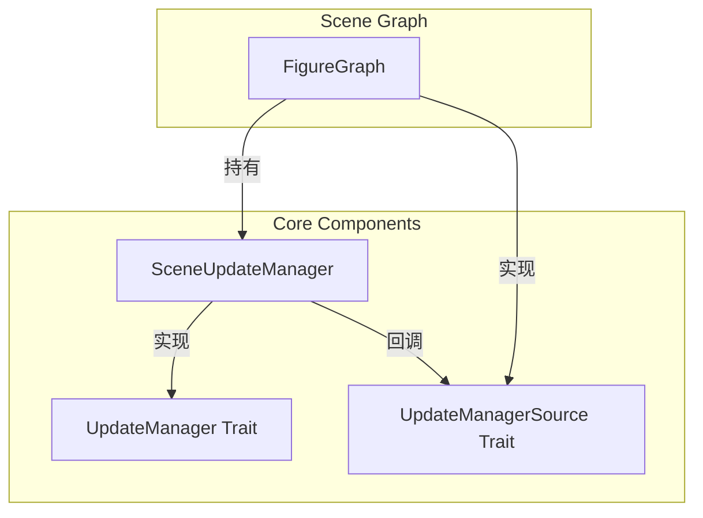
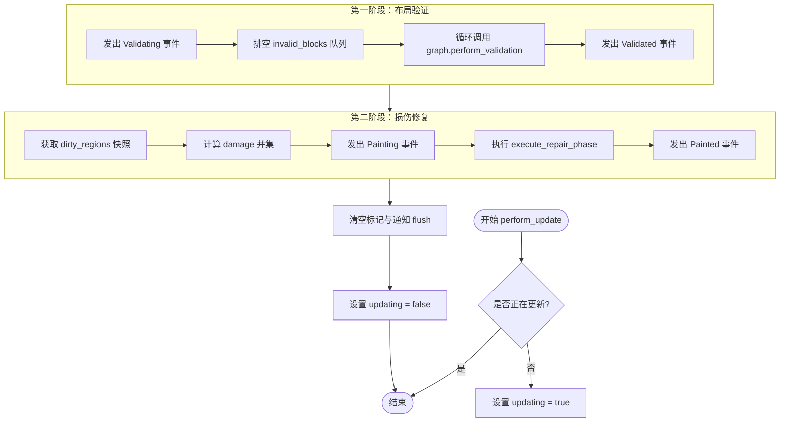
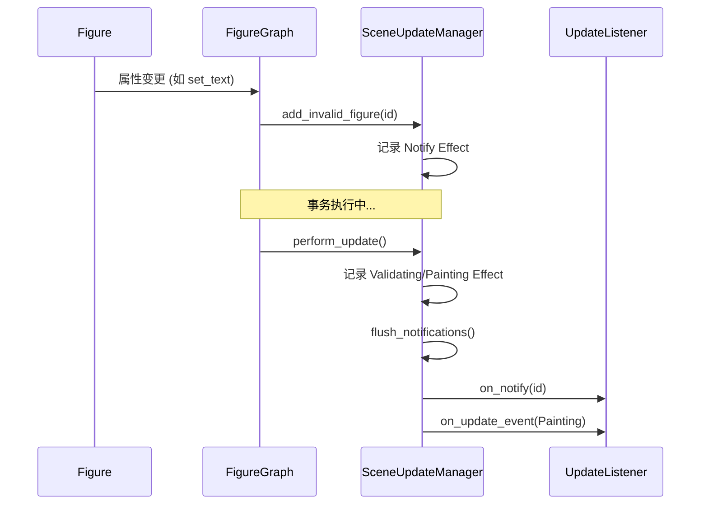
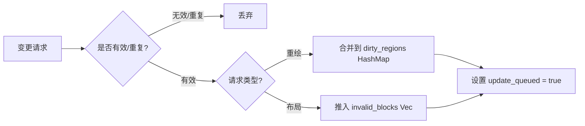
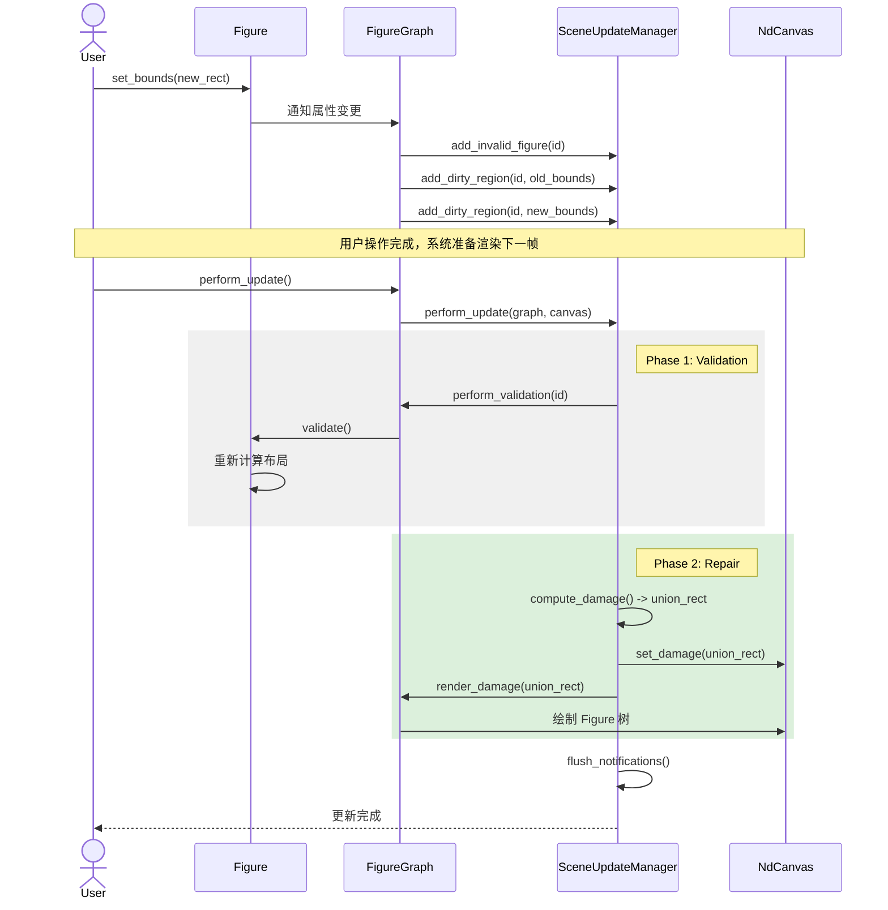

# 更新管理器：UpdateManager 的设计与流水线

## 目录
1. [模块概览](#模块概览)
2. [简介](#简介)
3. [核心组件](#核心组件)
   - [UpdateManager 接口](#updatemanager-接口)
   - [SceneUpdateManager 实现](#sceneupdatemanager-实现)
   - [UpdateManagerSource 桥接](#updatemanagersource-桥接)
4. [更新流水线：两阶段更新设计](#更新流水线两阶段更新设计)
   - [第一阶段：布局验证 (Validation)](#第一阶段布局验证-validation)
   - [第二阶段：损伤修复 (Repair)](#第二阶段损伤修复-repair)
5. [响应式通知机制](#响应式通知机制)
   - [通知 Effect 与队列](#通知-effect-与队列)
   - [监听器架构](#监听器架构)
6. [延迟更新与合并策略](#延迟更新与合并策略)
   - [脏区域合并逻辑](#脏区域合并逻辑)
   - [失效块去重机制](#失效块去重机制)
7. [完整更新流时序分析](#完整更新流时序分析)
8. [与 Draw2D 的设计差异](#与-draw2d-的设计差异)
9. [文件参考](#文件参考)

## 模块概览

`UpdateManager` 模块是 `novadraw-scene` 引擎的核心调度中心，负责协调图形树（Figure Tree）的变更与渲染管线（Rendering Pipeline）之间的同步。该模块位于 `novadraw-scene/src/update/` 目录下，由以下核心文件组成：

- `mod.rs`: 定义了 `UpdateManager` 和 `UpdateManagerSource` 等核心 Trait，确立了更新管理器的契约。
- `deferred.rs`: 实现了 `SceneUpdateManager` 结构体，提供了基于延迟批处理（Deferred Batching）的更新策略。
- `listener.rs`: 定义了响应式通知机制，包括事件类型、通知队列以及监听器接口。
- `repair.rs`: 包含脏区域合并、损伤计算等底层算法逻辑（详见 6.3 章节）。

在整个 `novadraw` 架构中，`UpdateManager` 扮演着“指挥官”的角色。它不直接参与具体的布局计算或图形绘制，而是通过收集各个组件的变更请求，在合适的时机触发两阶段更新流程，确保场景状态的一致性并最大化渲染效率。

**涉及范围统计**：
- 总文件数：4 个 Rust 源文件。
- 深度覆盖：`mod.rs`, `deferred.rs`, `listener.rs`。
- 简要提及：`repair.rs`（其细节将在“损伤修复”章节深入讨论）。

## 简介

在复杂的图形交互系统中，场景的变更往往是高频且零散的。例如，当用户拖动一个图形时，其坐标会随着鼠标移动不断更新；或者当一个容器的尺寸改变时，其内部所有子节点的布局都需要重新计算。如果针对每一次微小的属性变更都立即触发完整的布局和渲染流程，将会导致严重的性能瓶颈和不必要的计算浪费。

`UpdateManager` 的引入正是为了解决这一问题。它作为 Figure 树变更与渲染管线之间的桥梁，实现了以下核心价值：

1. **状态缓冲与去重**：将瞬时的变更请求转化为持久的状态标记（脏区域或失效块），并自动合并重叠的请求。
2. **两阶段解耦**：将“布局计算”与“图形重绘”明确分离，确保在重绘发生前，所有的布局状态已经达到最终稳定态。
3. **延迟执行**：支持将多次变更合并到同一个更新周期（帧）中处理，从而实现真正的批处理优化。
4. **响应式反馈**：通过统一的通知机制，让外部组件（如动画引擎、调试工具、UI 框架）能够感知更新流水线的各个阶段。

通过这种设计，`novadraw` 能够处理包含数千个图形的复杂场景，同时保持平滑的交互响应速度。

## 核心组件

`UpdateManager` 的实现基于高度抽象的 Trait 体系，这使得数据管理逻辑与具体的场景图实现能够保持解耦。

### UpdateManager 接口

`UpdateManager` Trait 定义了更新管理器必须对外暴露的能力。它主要负责接收变更请求并驱动更新流水线。

```rust
// novadraw-scene/src/update/mod.rs

pub trait UpdateManager: Send + Sync {
    /// 添加脏区域（请求重绘）
    fn add_dirty_region(&mut self, block_id: BlockId, rect: Rectangle);
    
    /// 添加失效块（请求重新布局）
    fn add_invalid_figure(&mut self, block_id: BlockId);
    
    /// 执行完整的两阶段更新
    fn perform_update(&mut self, graph: &mut FigureGraph, canvas: &mut NdCanvas);
    
    /// 仅执行布局验证阶段
    fn perform_validation(&mut self, graph: &mut FigureGraph);
    
    /// 检查是否有更新正在排队
    fn is_update_queued(&self) -> bool;
    
    /// 检查是否正在执行更新
    fn is_updating(&self) -> bool;
}
```

该接口的设计遵循了“最小知识原则”，外部调用者只需要知道如何提交变更请求，而不需要关心这些请求是如何被存储、合并或最终执行的。

### SceneUpdateManager 实现

`SceneUpdateManager` 是 `UpdateManager` Trait 的默认实现。它内部维护了两个核心数据结构，用于存储待处理的变更：

- `dirty_regions`: 一个 `HashMap<BlockId, Rectangle>`，记录了每个块需要重绘的局部区域。使用 `HashMap` 的好处是能够自动按块 ID 进行归类。
- `invalid_blocks`: 一个 `Vec<BlockId>`，记录了需要重新进行布局计算的块。

此外，它还持有一个 `NotificationQueue` 和一组 `UpdateListener`，用于实现响应式通知。

### UpdateManagerSource 桥接

由于 `SceneUpdateManager` 作为一个纯数据管理器，不具备执行布局和渲染的具体逻辑，因此它需要通过 `UpdateManagerSource` Trait 回调 `FigureGraph`。

```rust
// novadraw-scene/src/update/mod.rs

pub trait UpdateManagerSource: Send + Sync {
    /// 执行单个块的布局验证
    fn perform_validation(&mut self, block_id: BlockId);

    /// 使用脏区域裁剪渲染场景
    fn render_damage(&mut self, clip: Rectangle) -> NdCanvas;
}
```

这种“反向依赖注入”的设计模式，使得 `UpdateManager` 可以独立于场景图的具体实现进行测试，同时也方便未来扩展不同的渲染后端。

下图展示了核心组件之间的交互关系：



在上述架构中，`FigureGraph` 作为整个系统的协调者，它持有一个 `SceneUpdateManager` 实例。当 `FigureGraph` 中的某个 Figure 发生变化时，它会向 `SUM` 提交请求。在执行更新时，`SUM` 会通过 `UMS` 接口回调 `FG` 来完成具体的计算和渲染工作。

**Section sources**:
- [mod.rs](novadraw-scene/src/update/mod.rs)
- [deferred.rs](novadraw-scene/src/update/deferred.rs)

## 更新流水线：两阶段更新设计

`UpdateManager` 的核心逻辑体现在 `perform_update` 方法中。它将更新过程严格划分为两个阶段：**布局验证 (Validation)** 和 **损伤修复 (Repair)**。这种分离设计是高性能图形引擎的基石，确保了渲染时所依据的布局数据是最新且一致的。

### 第一阶段：布局验证 (Validation)

布局验证阶段的目标是确保场景图中所有块的尺寸（Size）和位置（Location）都已正确计算。

当一个块的属性发生变化（如文本内容改变、子节点增删等）时，它会被标记为 `invalid`。在 `perform_validation` 过程中，`UpdateManager` 会排空 `invalid_blocks` 队列，并逐一调用它们的 `validate()` 方法。

> 💡 **关键细节**：布局验证是一个潜在的递归过程。一个块的验证可能会导致其父节点或子节点也变为失效状态。`SceneUpdateManager` 通过在循环中动态排空队列来处理这种连锁反应，直到整个场景达到稳定状态。

### 第二阶段：损伤修复 (Repair)

一旦布局稳定，系统进入损伤修复阶段。该阶段的任务是找出屏幕上受影响的区域，并仅对这些区域进行重绘。

1. **快照获取**：首先通过 `take_dirty_snapshot` 获取当前所有待处理的脏区域。
2. **区域合并**：计算所有脏区域的并集（Union），得到一个全局的 `damage` 矩形。
3. **渲染提交**：调用 `execute_repair_phase`。该方法会设置渲染裁剪区域为 `damage` 矩形，并驱动渲染引擎重绘受影响的 Figure。



通过将布局与重绘分离，`novadraw` 避免了在渲染过程中由于布局突变导致的画面闪烁或不一致问题。同时，通过合并脏区域，极大地减少了对渲染后端（如 Vello 或 WebGPU）的指令提交次数。

**Section sources**:
- [deferred.rs:L234-L259](novadraw-scene/src/update/deferred.rs#L234-L259)
- [mod.rs:L12-L23](novadraw-scene/src/update/mod.rs#L12-L23)

## 响应式通知机制

为了支持复杂的交互和外部集成，`UpdateManager` 实现了一套精简而高效的响应式通知机制。这套机制参考了 Zed 编辑器的 "Notify/Emit" 模型，并结合了 Draw2D 的事件语义。

### 通知 Effect 与队列

在 `novadraw` 中，状态变更不会直接触发回调。相反，所有的变更都会首先生成一个 `NotificationEffect` 并进入 `NotificationQueue`。

```rust
// novadraw-scene/src/update/listener.rs

pub enum NotificationEffect {
    /// 无负载的状态失效通知（仅表示“我变了”）
    Notify { block_id: BlockId },
    /// Figure 层语义事件（如 FigureMoved）
    EmitFigure(FigureEvent),
    /// 更新流水线层语义事件（如 Painting）
    EmitUpdate(UpdateEvent),
}
```

这种设计的好处在于：
- **避免通知风暴**：在一个事务（Transaction）中，即使某个块的状态改变了多次，我们也只需要在事务结束时发出一次通知。
- **确定的时序**：通知总是在更新周期的特定边界（如 `flush_notifications`）被统一分发，这使得监听器的行为更加可预测。

### 监听器架构

外部组件可以通过实现 `UpdateListener` Trait 来订阅这些事件。

```rust
pub trait UpdateListener: Send + Sync {
    /// 监听更新阶段变化
    fn on_update_event(&self, event: UpdateEvent);
    /// 监听图形语义变化
    fn on_figure_event(&self, event: FigureEvent);
    /// 监听基础状态通知
    fn on_notify(&self, block_id: BlockId);
}
```

典型的应用场景包括：
- **调试器**：实时可视化脏区域的合并过程和布局验证的频率。
- **动画系统**：根据 `FigureMoved` 事件同步更新关联的动画状态。
- **UI 绑定**：当底层场景数据变化时，自动更新上层 UI 组件的显示。

下图展示了通知从产生到分发的完整生命周期：



这种基于 Effect 队列的异步分发模式，确保了引擎核心逻辑的纯粹性，同时也为上层提供了强大的扩展能力。

**Section sources**:
- [listener.rs](novadraw-scene/src/update/listener.rs)
- [deferred.rs:L104-L110](novadraw-scene/src/update/deferred.rs#L104-L110)

## 延迟更新与合并策略

`UpdateManager` 的高性能很大程度上归功于其精妙的延迟更新与合并策略。它不是简单地记录变更，而是通过智能算法对变更请求进行“预处理”。

### 脏区域合并逻辑

当多次调用 `add_dirty_region` 时，`SceneUpdateManager` 会尝试合并这些区域。合并逻辑由 `repair.rs` 中的 `merge_dirty_region` 函数实现。

- **按块归类**：脏区域首先按 `BlockId` 进行存储。这意味着同一个块在同一帧内的多次重绘请求会被自动合并。
- **几何合并**：如果新添加的矩形与已有的脏区域重叠，它们会被合并为一个更大的包围盒。
- **无效过滤**：宽度或高度为 0 的无效矩形会被直接忽略，避免浪费计算资源。

```rust
// novadraw-scene/src/update/deferred.rs 中的逻辑简化
pub fn add_dirty_region(&mut self, block_id: BlockId, rect: Rectangle) {
    if rect.is_empty() { return; }
    
    self.dirty_regions.entry(block_id)
        .and_modify(|existing| *existing = existing.union(&rect))
        .or_insert(rect);
    
    self.update_queued = true;
}
```

### 失效块去重机制

对于布局失效请求（`add_invalid_figure`），策略更为简单直接：**去重**。

失效块队列 `invalid_blocks` 实际上是一个有序集合。如果一个块已经在队列中，后续的重复添加请求将被直接忽略。这保证了在布局验证阶段，每个失效块最少只被处理一次（除非在验证过程中它再次被标记为失效）。



这种策略极大地减轻了 `FigureGraph` 在复杂交互下的负担，使得开发者可以放心地在循环或高频回调中调用 `repaint()` 或 `revalidate()`。

**Section sources**:
- [deferred.rs:L120-L143](novadraw-scene/src/update/deferred.rs#L120-L143)
- [deferred.rs:L297-L315](novadraw-scene/src/update/deferred.rs#L297-L315)

## 完整更新流时序分析

为了更直观地理解 `UpdateManager` 的运作方式，我们以一个具体的场景为例：用户修改了一个图形的 `Bounds`（位置和尺寸）。

这个操作会触发一连串的连锁反应，最终通过 `UpdateManager` 转化为屏幕上的像素更新。



**关键步骤解析**：
1. **双重脏区域**：当图形移动时，我们需要重绘两个区域：它原来的位置（为了擦除旧像素）和它现在的位置（为了绘制新像素）。`UpdateManager` 会自动将这两个矩形合并。
2. **布局先行**：在重绘之前，必须先执行 `validate()`。如果 `new_rect` 导致了子节点的相对位置变化，这些变化会在 `validate()` 中完成计算。
3. **裁剪渲染**：`NdCanvas` 最终只会在 `union_rect` 范围内执行绘制指令，这显著提升了在大场景下的渲染性能。

## 与 Draw2D 的设计差异

虽然 `novadraw` 的 `UpdateManager` 深度借鉴了 Eclipse Draw2D (g2) 的设计，但在迁移到 Rust 过程中，根据语言特性和现代渲染需求做出了一些关键的决策调整。

| 特性 | Draw2D (Java) 实现 | Novadraw (Rust) 实现 | 决策原因 |
| :--- | :--- | :--- | :--- |
| **所有权模型** | `UpdateManager` 是独立对象，持有 root Figure 引用。 | `SceneUpdateManager` 是 `FigureGraph` 的内部状态。 | Rust 的所有权模型更适合将状态内聚，避免复杂的生命周期管理。 |
| **异步机制** | 使用 `Display.asyncExec()` 自动触发异步更新。 | 手动调用 `perform_update()` 或由宿主环境驱动。 | 现代渲染后端（如 Vello）通常需要确定的同步调用时机，且 Web 环境的异步模型不同。 |
| **脏区域传播** | 脏区域在 `repairDamage` 时自动向父节点传播并裁剪。 | 脏区域存储在块的局部坐标，由渲染器处理裁剪。 | 简化核心逻辑，利用现代 GPU 渲染器的裁剪能力。 |
| **解耦方式** | 通过类继承和接口。 | 通过 `UpdateManagerSource` Trait 回调。 | 保持数据管理器与场景图逻辑的严格解耦，便于单元测试。 |
| **通知模型** | 经典的 Observer 模式，立即同步回调。 | 基于 Effect 队列的延迟分发模式（参考 Zed）。 | 提高通知的可预测性，避免在更新流水线中间产生副作用。 |

这些差异体现了 `novadraw` 在保留经典设计精髓的同时，对现代系统编程语言和图形技术的适配。

## 文件参考

本章节所述内容主要基于以下源代码及设计文档：

- `novadraw-scene/src/update/mod.rs`: 定义核心 Trait 和流水线结构。
- `novadraw-scene/src/update/deferred.rs`: 实现延迟更新管理器。
- `novadraw-scene/src/update/listener.rs`: 实现响应式通知机制。
- `doc/03-rendering/update_manager_design.md`: 详细的设计决策记录。
- `doc/03-rendering/update_manager_pipeline.md`: 完整的渲染管线分析。

**Section sources**:
- [mod.rs](novadraw-scene/src/update/mod.rs)
- [deferred.rs](novadraw-scene/src/update/deferred.rs)
- [listener.rs](novadraw-scene/src/update/listener.rs)
- [update_manager_design.md](doc/03-rendering/update_manager_design.md)
- [update_manager_pipeline.md](doc/03-rendering/update_manager_pipeline.md)
