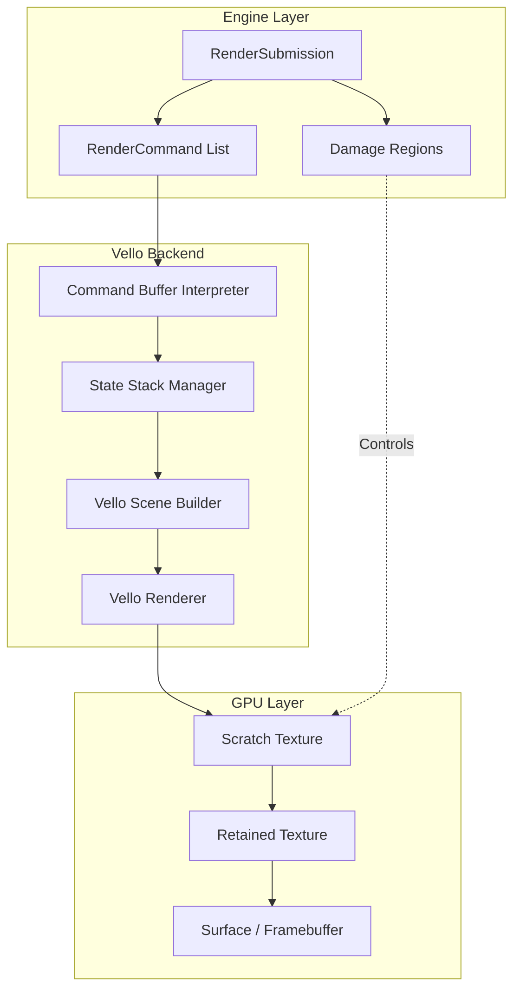
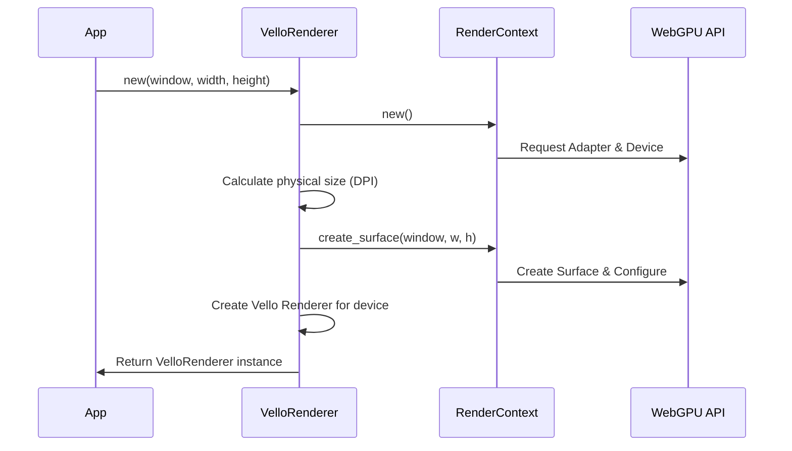
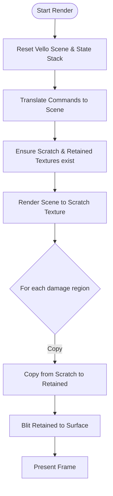

# 渲染后端：基于 Vello 的 WebGPU 渲染实现

## 目录
1. [模块概览](#模块概览)
2. [引言](#引言)
3. [架构设计与数据流](#架构设计与数据流)
4. [核心组件](#核心组件)
   - [VelloRenderer](#vellorenderer)
   - [WinitWindowProxy](#winitwindowproxy)
   - [RenderState](#renderstate)
5. [初始化流程](#初始化流程)
6. [渲染循环与增量更新](#渲染循环与增量更新)
7. [场景构建与命令转换](#场景构建与命令转换)
8. [资源管理与 DPI 处理](#资源管理与-dpi-处理)
9. [文件参考](#文件参考)

## 模块概览

`novadraw-render` 的后端模块负责将抽象的渲染命令（`RenderCommand`）转换为具体的图形库操作。目前主要实现了基于 **Vello** 的 WebGPU 渲染后端。

- **总文件数**: 8 个 Rust 源文件。
- **子目录**:
  - `backend/vello/`: Vello 后端的具体实现，包括初始化、命令解释和 winit 集成。
- **覆盖范围**: 本文档将深入探讨 `backend/vello/` 目录下的所有实现，包括 `mod.rs` 和 `winit.rs`。

## 引言

Novadraw 采用 **Vello** 作为其核心渲染引擎。Vello 是一个基于 WebGPU 的高性能矢量图形渲染库，能够充分利用 GPU 的并行计算能力来处理复杂的矢量路径和阴影。

本模块的主要职责是：
1. **环境初始化**: 配置 WebGPU 实例、适配器、设备和渲染表面（Surface）。
2. **命令解释**: 将 Novadraw 的 `RenderCommand` 序列转换为 Vello 的 `Scene` 对象。
3. **状态管理**: 维护渲染状态栈（变换、裁剪等），确保绘图上下文的正确性。
4. **性能优化**: 实现基于脏矩形（Damage Regions）的增量更新机制，减少不必要的重绘开销。
5. **窗口集成**: 通过 `WindowProxy` 接口与 `winit` 等窗口系统无缝对接。

## 架构设计与数据流

Novadraw 的渲染后端架构遵循“数据驱动”的原则。前端引擎生成 `RenderSubmission`，后端负责将其“消费”并输出到屏幕。

下图展示了从渲染命令到 GPU 呈现的完整数据流：



**数据流说明**：
1. `RenderSubmission` 包含了本帧所有的绘图命令和脏区信息。
2. `VelloRenderer` 遍历命令列表，根据当前 `RenderState`（变换和裁剪）将命令转换为 `Vello Scene` 的操作。
3. 渲染器首先将脏区内容绘制到临时纹理（Scratch Texture）。
4. 通过 GPU 拷贝操作，将脏区内容合并到保留纹理（Retained Texture），该纹理保存了完整的历史帧。
5. 最后，将合并后的结果 Blit 到 WebGPU 的 Surface 上进行显示。

**Diagram sources**: 
- [backend/vello/mod.rs:L689-L830](novadraw-render/src/backend/vello/mod.rs#L689-L830)

## 核心组件

### VelloRenderer

`VelloRenderer` 是后端的中心结构体，负责协调 WebGPU 资源和 Vello 渲染流程。

```rust
pub struct VelloRenderer {
    render_context: RenderContext,
    renderers: Vec<Option<Renderer>>,
    scene: vello::Scene,
    surface: RenderSurface<'static>,
    window: Arc<WinitWindowProxy>,
    scale_factor: f64,
    /// 状态栈
    state_stack: Vec<RenderState>,
    /// 保留上一帧完整结果的纹理
    retained_texture: Option<(vello::wgpu::Texture, vello::wgpu::TextureView, u32, u32)>,
    /// 本帧临时渲染纹理
    scratch_texture: Option<(vello::wgpu::Texture, vello::wgpu::TextureView, u32, u32)>,
}
```

### WinitWindowProxy

`WinitWindowProxy` 实现了 `WindowProxy` trait，为后端提供窗口尺寸、缩放因子等元数据，并支持请求重绘。

```rust
impl WindowProxy for WinitWindowProxy {
    fn request_redraw(&self) {
        self.window.request_redraw();
    }

    fn scale_factor(&self) -> f64 {
        self.window.scale_factor()
    }
    // ...
}
```

### RenderState

用于模拟 Canvas 的 `save()`/`restore()` 行为，管理当前的变换矩阵和裁剪区域。

```rust
#[derive(Clone, Debug, Default)]
struct RenderState {
    /// 当前变换矩阵
    transform: Transform,
    /// 当前裁剪区域
    clip: Option<[DVec2; 2]>,
}
```

**Section sources**:
- [backend/vello/mod.rs](novadraw-render/src/backend/vello/mod.rs)
- [backend/vello/winit.rs](novadraw-render/src/backend/vello/winit.rs)
- [traits.rs](novadraw-render/src/traits.rs)

## 初始化流程

Vello 后端的初始化涉及 WebGPU 环境的搭建。Novadraw 使用 `vello::util::RenderContext` 来简化这一过程。



初始化过程中，最重要的步骤是处理 **DPI (Dots Per Inch)**。Novadraw 通过 `window.scale_factor()` 获取缩放因子，并将逻辑尺寸转换为物理像素尺寸，以确保在高分辨率屏幕上（如 Retina 屏）输出清晰的图像。

**Diagram sources**: 
- [backend/vello/mod.rs:L52-L81](novadraw-render/src/backend/vello/mod.rs#L52-L81)

## 渲染循环与增量更新

为了实现高性能，Novadraw 并没有在每一帧都重绘整个屏幕。它使用了一种基于“脏矩形”的增量更新策略。



**增量更新逻辑详解**：
1. **Scene 构建**: 每帧都会重新构建 `vello::Scene`，但其内容仅限于脏区相关的操作。
2. **Scratch Texture**: Vello 首先将 `Scene` 渲染到一个临时的透明纹理上。
3. **合并**: 使用 `encoder.copy_texture_to_texture` 将临时纹理中属于脏区的像素块拷贝到 `retained_texture`。
4. **持久化**: `retained_texture` 充当了帧缓冲区的角色，保存了所有未变动区域的历史像素。
5. **显示**: 最终通过 Vello 的 `Blitter` 将完整的 `retained_texture` 呈现到窗口 Surface。

这种策略在处理复杂 UI 或长路径动画时，能显著降低 GPU 的填充率（Fill Rate）开销。

**Section sources**:
- [backend/vello/mod.rs:L689-L830](novadraw-render/src/backend/vello/mod.rs#L689-L830)

## 场景构建与命令转换

`VelloRenderer` 充当了 `RenderCommand` 的解释器。它遍历命令，并调用 `vello::Scene` 的相应方法。

**关键转换逻辑**：
- **变换 (Transform)**: Novadraw 的 `Transform` 被转换为 `vello::kurbo::Affine`。注意：平移分量（e, f）需要乘以 `scale_factor` 以适配物理像素。
- **路径 (Path)**: 遍历 `PathOp`（MoveTo, LineTo, CubicTo 等），构建 `vello::kurbo::BezPath`。
- **状态管理**: 
    - `PushState`: 克隆当前 `RenderState` 并压栈。如果存在裁剪，则调用 `scene.push_clip_layer`。
    - `PopState`: 弹栈并恢复状态。如果之前有裁剪，则调用 `scene.pop_layer`。

> 💡 **提示**: 状态管理逻辑参考了 Skia 和 Flutter 的 DisplayList 设计，确保了在复杂的嵌套组件中，变换和裁剪能够正确地应用和恢复。

**Section sources**:
- [backend/vello/mod.rs:L196-L680](novadraw-render/src/backend/vello/mod.rs#L196-L680)

## 资源管理与 DPI 处理

GPU 资源的生命周期管理对于稳定性至关重要。

1. **纹理重创**: 当窗口大小改变（Resize）时，旧的 `retained_texture` 和 `scratch_texture` 会立即失效（设为 `None`），并在下一帧渲染时根据新的物理尺寸重新创建。
2. **截图支持**: `screenshot` 方法展示了如何从 GPU 异步读取数据。它将 `retained_texture` 拷贝到一个可映射的 Buffer 中，通过 `map_async` 读取像素数据，最后使用 `image` 库保存为 PNG。
3. **DPI 适配**: 所有的坐标和尺寸在传递给 Vello 之前，都会统一乘以 `scale_factor`。这包括线宽、半径、矩形坐标等。

```rust
fn transform_to_affine(transform: &Transform, scale_factor: f64) -> vello::kurbo::Affine {
    let coeffs = transform.coeffs();
    vello::kurbo::Affine::new([
        coeffs[0],
        coeffs[1],
        coeffs[2],
        coeffs[3],
        coeffs[4] * scale_factor, // 平移 X
        coeffs[5] * scale_factor, // 平移 Y
    ])
}
```

**Section sources**:
- [backend/vello/mod.rs:L832-L944](novadraw-render/src/backend/vello/mod.rs#L832-L944)

## 文件参考

以下是实现 Vello 渲染后端的关键源文件：

- [novadraw-render/src/backend/vello/mod.rs](novadraw-render/src/backend/vello/mod.rs): 后端核心实现，包含命令解释、增量更新和资源管理。
- [novadraw-render/src/backend/vello/winit.rs](novadraw-render/src/backend/vello/winit.rs): winit 窗口系统的适配层。
- [novadraw-render/src/backend/mod.rs](novadraw-render/src/backend/mod.rs): 后端模块入口。
- [novadraw-render/src/traits.rs](novadraw-render/src/traits.rs): 定义了 `RenderBackend` 和 `WindowProxy` 接口。
- [novadraw-render/src/command.rs](novadraw-render/src/command.rs): 定义了可被后端执行的渲染命令集。
