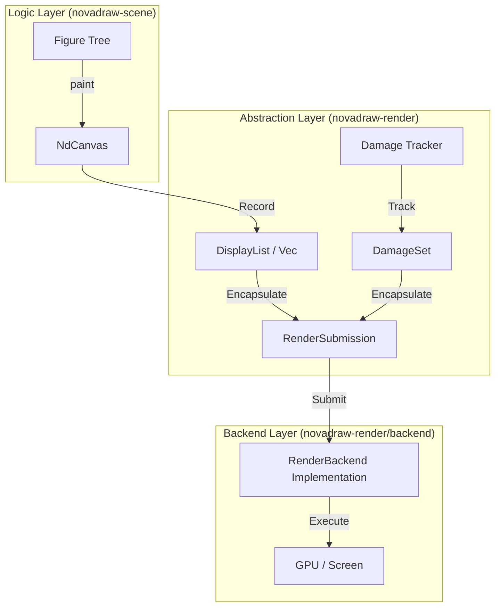
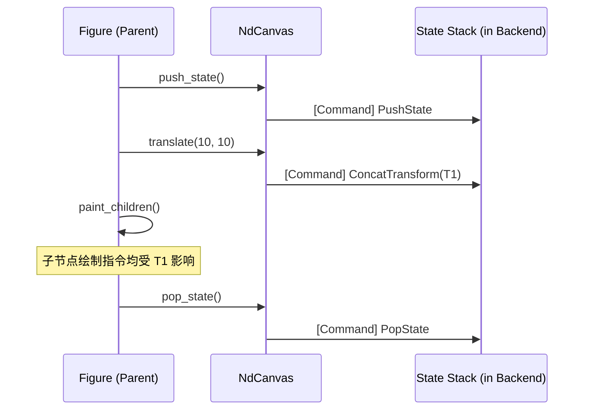

# 渲染命令与上下文：RenderContext 与 DisplayList

## 目录
1. [模块概览](#模块概览)
2. [架构设计与数据流](#架构设计与数据流)
3. [核心绘图接口：NdCanvas](#核心绘图接口ndcanvas)
4. [渲染中间表示：RenderCommand 与 DisplayList](#渲染中间表示rendercommand-与-displaylist)
5. [渲染状态管理：状态栈与变换](#渲染状态管理状态栈与变换)
6. [渲染提交与损伤跟踪](#渲染提交与损伤跟踪)
7. [核心组件参考](#核心组件参考)
8. [文件参考](#文件参考)

## 模块概览

`novadraw-render` 模块是 Novadraw 引擎的渲染抽象层。它的核心任务是为上层（如 `novadraw-scene` 中的 Figure 树）提供一套统一的、类似于 HTML5 Canvas 的绘图接口，并将这些绘图操作转化为一种中间表示（Intermediate Representation, IR），即 **DisplayList**。

### 范围与规模
该模块目前处于标准开发阶段，核心逻辑集中在 `novadraw-render/src/` 目录下（不含 `backend` 目录）。

- **文件总数**：5 个核心 Rust 文件。
- **子模块**：
  - `command.rs`: 定义渲染原子指令。
  - `context.rs`: 提供面向开发者的绘图上下文 `NdCanvas`。
  - `submission.rs`: 封装渲染提交协议与损伤区域。
  - `traits.rs`: 定义后端抽象接口。
  - `lib.rs`: 模块导出与入口。

### 核心职责
1. **API 抽象**：提供 `NdCanvas` 接口，屏蔽底层渲染后端的差异。
2. **命令生成**：将复杂的绘图逻辑（如路径构建、样式设置）解析为简单的 `RenderCommand` 序列。
3. **状态管理**：通过命令流维护渲染状态（变换矩阵、裁剪区、样式栈）。
4. **增量更新支持**：通过 `DamageSet` 记录需要重绘的区域，优化渲染性能。

**Section sources**:
- [lib.rs](novadraw-render/src/lib.rs)
- [context.rs](novadraw-render/src/context.rs)

---

## 架构设计与数据流

Novadraw 的渲染流程遵循“录制-提交-分发”的模型。这种架构将 UI 逻辑与具体的图形 API（如 Vello, Wgpu, Skia）解耦。

### 渲染流水线
下图展示了从 Figure 节点到最终屏幕显示的完整数据流向：



**数据流说明**：
1. **录制阶段**：`Figure` 节点的 `paint` 方法调用 `NdCanvas` 的 API。`NdCanvas` 内部并不立即执行绘图，而是生成对应的 `RenderCommand` 并存入 `commands` 向量中。
2. **封装阶段**：当整棵 Figure 树遍历完成后，`NdCanvas` 将收集到的命令序列和损伤区域（DamageSet）封装进 `RenderSubmission` 结构体。
3. **提交阶段**：`RenderSubmission` 被传递给实现了 `RenderBackend` trait 的具体后端。
4. **执行阶段**：后端（如 `VelloRenderer`）遍历 `RenderCommand` 序列，调用底层图形库进行真正的绘制。

这种设计允许 Novadraw 在不修改 UI 逻辑的情况下，轻松切换渲染后端，甚至支持远程流渲染（将 `RenderSubmission` 序列化后发送到客户端）。

**Diagram sources**: 
- [context.rs:L382-L387](novadraw-render/src/context.rs#L382-L387)
- [traits.rs:L24-L32](novadraw-render/src/traits.rs#L24-L32)

---

## 核心绘图接口：NdCanvas

`NdCanvas`（也称为 `RenderContext`）是开发者最直接接触的组件。它的设计目标是提供一套直观、声明式的绘图 API。

### API 设计原则
`NdCanvas` 的 API 风格高度参考了 HTML5 Canvas 和 Java Graphics2D。它支持两种绘图模式：
- **即时绘图**：如 `fill_rect`, `stroke_rect`，直接传入参数并生成绘图指令。
- **路径绘图**：通过 `begin_path`, `move_to`, `line_to` 等方法构建复杂形状，最后调用 `fill` 或 `stroke` 进行渲染。

### 核心代码示例
以下展示了 `NdCanvas` 如何管理当前路径和生成命令：

```rust
// novadraw-render/src/context.rs

pub struct NdCanvas {
    pub damage: DamageSet,
    commands: Vec<RenderCommand>,
    /// 当前正在构建的路径
    current_path: Option<Path>,
    /// 当前样式状态
    fill_color: Option<Color>,
    stroke_color: Option<Color>,
    stroke_width: f64,
    // ...
}

impl NdCanvas {
    /// 填充矩形的即时接口
    pub fn fill_rect(&mut self, x: f64, y: f64, width: f64, height: f64, color: Color) {
        let rect = [DVec2::new(x, y), DVec2::new(x + width, y + height)];
        self.create_command(RenderCommandKind::FillRect { rect, color });
    }

    /// 路径绘图示例：开始构建
    pub fn begin_path(&mut self) {
        self.current_path = Some(Path::new());
    }

    /// 提交路径绘制
    pub fn fill(&mut self) {
        if let Some(path) = self.current_path.take() {
            if let Some(color) = self.fill_color {
                self.create_command(RenderCommandKind::FillPath { path, color });
            }
        }
    }
}
```

> 💡 **提示**：`NdCanvas` 内部维护了 `fill_color` 等样式字段，这些字段作为“当前状态”在调用 `fill()` 或 `stroke()` 时被捕获并封装进命令中。

**Section sources**:
- [context.rs:L13-L28](novadraw-render/src/context.rs#L13-L28)
- [context.rs:L123-L126](novadraw-render/src/context.rs#L123-L126)
- [context.rs:L303-L314](novadraw-render/src/context.rs#L303-L314)

---

## 渲染中间表示：RenderCommand 与 DisplayList

`RenderCommand` 是渲染抽象层的原子单位，而 `DisplayList` 则是这些命令的有序集合（在代码中表现为 `Vec<RenderCommand>`）。

### 命令分类
`RenderCommandKind` 枚举涵盖了所有支持的操作，主要分为以下几类：

| 分类 | 命令示例 | 功能说明 |
|------|----------|----------|
| **状态管理** | `PushState`, `PopState`, `RestoreState` | 管理变换矩阵和裁剪区的压栈/出栈 |
| **变换控制** | `ConcatTransform` | 叠加仿射变换矩阵（平移、旋转、缩放） |
| **裁剪操作** | `Clip` | 设置矩形或路径裁剪区域 |
| **基本几何体** | `FillRect`, `StrokeRect`, `Ellipse`, `Line` | 快速绘制标准几何形状 |
| **复杂路径** | `FillPath`, `StrokePath` | 绘制由多个 `PathOp` 组成的矢量路径 |
| **富文本** | `Text`, `FillText`, `StrokeText` | 处理字体、字号、颜色及背景填充 |
| **图像** | `Image` | 绘制位图，支持源矩形和目标矩形映射 |
| **清理** | `Clear`, `ClearRect` | 用特定颜色填充背景或局部区域 |

### 路径定义 (Path)
对于复杂的矢量图形，`Path` 结构体记录了一系列 `PathOp` 操作：
- `MoveTo(Point)`: 移动起点。
- `LineTo(Point)`: 直线连接。
- `CubicTo(CP1, CP2, End)`: 三次贝塞尔曲线。
- `Arc(Radii, Rotation, ...)`: 圆弧。
- `Close`: 闭合当前路径。

这种表示方式兼容 SVG 和 Canvas 规范，能够精确描述任何复杂的矢量形状。

**Section sources**:
- [command.rs:L21-L203](novadraw-render/src/command.rs#L21-L203)
- [command.rs:L381-L405](novadraw-render/src/command.rs#L381-L405)

---

## 渲染状态管理：状态栈与变换

在层级化的 UI 系统（如 Figure 树）中，子节点通常需要继承父节点的变换（Transform）和裁剪（Clip）。Novadraw 通过“状态指令”来实现这种继承关系。

### 状态栈逻辑
`NdCanvas` 并不在录制阶段维护一个实际的变换矩阵栈。相反，它通过发送 `PushState` 和 `PopState` 指令，将状态管理的压力交给后端执行器。



**关键机制说明**：
1. **PushState**：通知后端将当前的变换矩阵和裁剪区压入栈中。
2. **ConcatTransform**：在当前矩阵的基础上叠加一个新的变换。这是一个乘法操作，确保了层级变换的正确叠加。
3. **RestoreState vs PopState**：
   - `RestoreState`：恢复到栈顶状态，但不弹出。常用于在绘制完当前节点后、绘制子节点前，重置某些临时修改的状态。
   - `PopState`：弹出栈顶，彻底恢复到上一层级的状态。

这种“延迟执行”的状态管理模式极大地简化了录制端的逻辑，并允许后端利用硬件加速（如 GPU 矩阵栈）来优化性能。

**Diagram sources**: 
- [context.rs:L59-L77](novadraw-render/src/context.rs#L59-L77)
- [context.rs:L82-L116](novadraw-render/src/context.rs#L82-L116)

---

## 渲染提交与损伤跟踪

为了实现高效的增量渲染，Novadraw 引入了 `DamageSet` 机制。

### 损伤区域 (DamageSet)
`DamageSet` 记录了屏幕上哪些区域发生了变化，需要被重新绘制。它包含：
- `union`: 所有损伤区域的并集（最小外接矩形），用于快速剔除完全不在重绘范围内的节点。
- `regions`: 具体的损伤矩形列表，支持更精细的局部重绘。

### 渲染提交 (RenderSubmission)
当一帧录制结束时，`NdCanvas` 会调用 `to_submission()`。

```rust
// novadraw-render/src/submission.rs

pub struct RenderSubmission {
    /// 所有的渲染命令序列 (DisplayList)
    pub commands: Vec<RenderCommand>,
    /// 损伤区域信息
    pub damage: DamageSet,
}
```

### 损伤跟踪流程
1. **失效标记**：当 Figure 的属性（如位置、颜色）改变时，它会将自己的旧区域和新区域标记为“损伤”。
2. **收集**：在渲染开始前，系统汇总所有失效区域到 `DamageSet`。
3. **裁剪优化**：后端可以根据 `DamageSet` 忽略那些完全不相交的 `RenderCommand`，从而节省计算资源。

**Section sources**:
- [submission.rs:L5-L9](novadraw-render/src/submission.rs#L5-L9)
- [submission.rs:L54-L58](novadraw-render/src/submission.rs#L54-L58)

---

## 核心组件参考

### NdCanvas (渲染上下文)
`NdCanvas` 是录制渲染指令的核心结构。

| 方法 | 说明 | 对应指令 |
|------|------|----------|
| `new()` | 创建一个新的上下文，初始化命令缓冲区。 | - |
| `push_state()` | 保存当前变换和裁剪状态。 | `PushState` |
| `translate(x, y)` | 平移当前坐标系。 | `ConcatTransform` |
| `fill_rect(rect, color)` | 立即填充一个矩形。 | `FillRect` |
| `begin_path()` | 开始构建一个新的矢量路径。 | - |
| `to_submission()` | 将当前录制的所有内容转换为提交包。 | - |

### RenderBackend (后端接口)
任何希望接入 Novadraw 的渲染引擎都必须实现此 trait。

```rust
// novadraw-render/src/traits.rs

pub trait RenderBackend {
    type Window: WindowProxy;
    
    /// 获取关联的窗口代理（用于获取窗口大小、缩放因子等）
    fn window(&self) -> &Self::Window;

    /// 执行渲染：这是后端的入口点
    /// 它接收 Submission，解析其中的命令流并驱动底层 API
    fn render(&mut self, submission: &RenderSubmission);

    /// 处理窗口缩放和大小调整
    fn resize(&mut self, pixel_width: u32, pixel_height: u32, scale_factor: f64);
}
```

**Section sources**:
- [context.rs:L13-L48](novadraw-render/src/context.rs#L13-L48)
- [traits.rs:L24-L41](novadraw-render/src/traits.rs#L24-L41)

---

## 文件参考

以下是本章节涉及的核心源文件：

- `novadraw-render/src/lib.rs`: 模块入口与公共类型导出。
- `novadraw-render/src/context.rs`: `NdCanvas` 的具体实现，包含绘图 API 逻辑。
- `novadraw-render/src/command.rs`: `RenderCommand` 及其相关枚举（如 `LineCap`, `LineJoin`）的定义。
- `novadraw-render/src/submission.rs`: `RenderSubmission` 和 `DamageSet` 的数据结构定义。
- `novadraw-render/src/traits.rs`: `RenderBackend` 和 `WindowProxy` 抽象接口。
- `doc/03-rendering/displaylist_detailed.md`: 关于 DisplayList 协议架构的详细设计文档。
