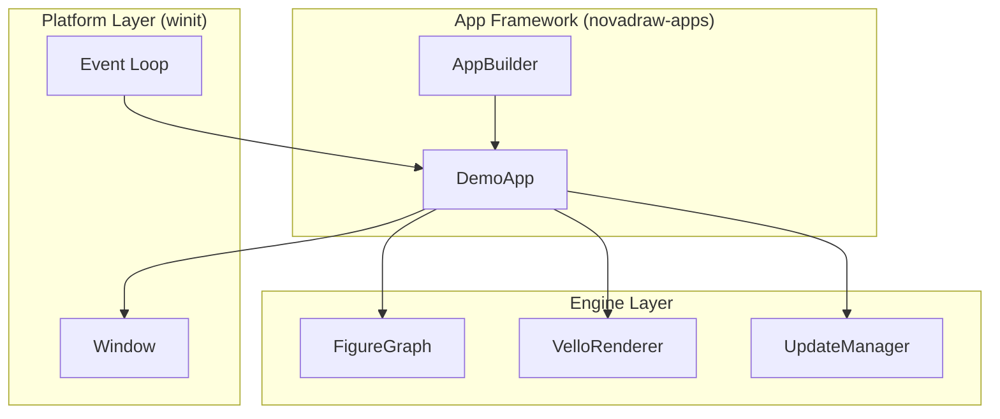
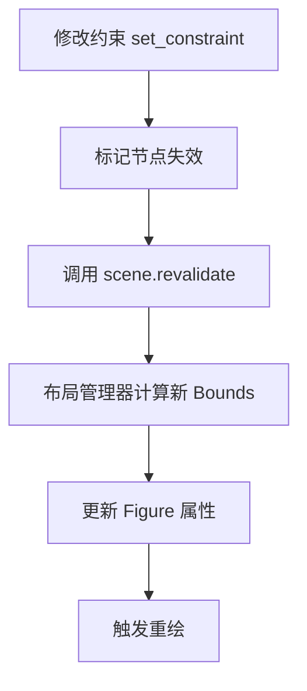
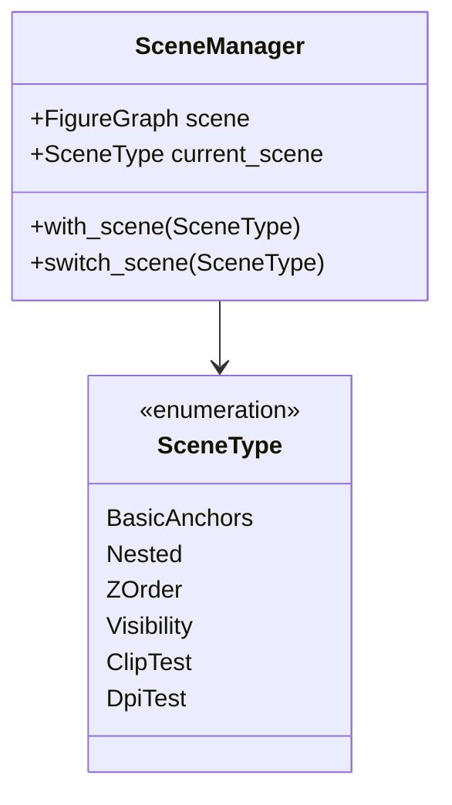
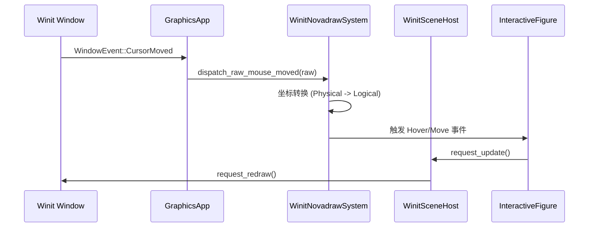

# 演示应用案例分析

## 目录
1. [模块概览](#模块概览)
2. [应用框架：novadraw-apps](#应用框架novadraw-apps)
   - [DemoApp 核心架构](#demoapp-核心架构)
   - [快速创建演示应用](#快速创建演示应用)
3. [基础图形演示：shape-app](#基础图形演示shape-app)
   - [MECE 场景设计原则](#mece-场景设计原则)
   - [图形类型与属性验证](#图形类型与属性验证)
4. [布局管理器演示：layout-app](#布局管理器演示layout-app)
   - [常用布局模式](#常用布局模式)
   - [布局重算机制](#布局重算机制)
5. [复杂应用案例：交互式编辑器](#复杂应用案例交互式编辑器)
   - [场景管理与切换](#场景管理与切换)
   - [交互事件流转](#交互事件流转)
6. [其他功能演示应用](#其他功能演示应用)
7. [核心组件](#核心组件)
8. [文件引用](#文件引用)

## 模块概览

`apps/` 目录是 Novadraw 引擎的功能展示与验证中心。它不仅包含了用于向用户展示引擎能力的 Demo 应用，还作为开发过程中的集成测试环境，验证引擎在真实场景下的表现。

通过对 `apps/` 目录的扫描，我们发现了 11 个独立的子项目，以及一个支撑这些应用的公共框架库 `novadraw-apps`。

**统计信息**：
- **总文件数**：19 个 Rust 源文件。
- **子模块分布**：
  - `novadraw-apps`：核心框架库，提供通用的应用生命周期管理。
  - `shape-app`：基础图形渲染演示。
  - `layout-app`：布局管理器功能演示。
  - `editor`：复杂的交互式编辑器案例，展示事件分发与场景管理。
  - 其他专项演示：`border-app`、`clip-app`、`event-app`、`transform-app`、`update-app` 等。

本章节将重点分析 `novadraw-apps` 框架的实现，并深入探讨 `shape-app`、`layout-app` 和 `editor` 这三个具有代表性的应用案例。

## 应用框架：novadraw-apps

为了简化演示应用的开发，Novadraw 提供了一个名为 `novadraw-apps` 的公共库。它封装了 `winit` 窗口管理、`vello` 渲染后端初始化以及场景切换等繁琐的样板代码。

### DemoApp 核心架构

`DemoApp` 是该框架的核心组件，它实现了 `winit` 的 `ApplicationHandler` 接口，负责协调窗口事件与引擎渲染。



`DemoApp` 的主要职责包括：
1. **渲染循环**：在 `RedrawRequested` 事件触发时，调用 `FigureGraph::perform_update` 进行场景更新，并将结果提交给 `VelloRenderer`。
2. **场景切换**：支持通过键盘（数字键、方向键）或鼠标滚轮在预定义的多个场景之间切换。
3. **自动化截图**：提供 `--screenshot-all` 命令行参数，能够自动遍历所有场景并保存渲染结果，这对于视觉回归测试非常有用。

### 快速创建演示应用

开发者只需提供一组场景创建函数（`SceneCreator`），即可通过 `AppBuilder` 快速构建一个功能完备的演示程序。

```rust
// novadraw-apps/src/app.rs

pub fn run_demo_app(
    title: &str,
    app_name: &str,
    scenes: Vec<(&'static str, Box<dyn FnMut() -> FigureGraph>)>,
) -> Result<(), Box<dyn std::error::Error>> {
    let mut builder = AppBuilder::new(title)
        .with_size(800.0, 600.0)
        .with_app_name(app_name)
        .with_scenes_boxed(scenes);
    builder.run()
}
```

在上面的代码中，`scenes` 是一个包含场景名称和创建闭包的向量。`DemoApp` 会在切换场景时调用这些闭包来重建 `FigureGraph`。

**Section sources**:
- [novadraw-apps/src/app.rs](novadraw-apps/src/app.rs)
- [novadraw-apps/src/lib.rs](novadraw-apps/src/lib.rs)

## 基础图形演示：shape-app

`shape-app` 是 Novadraw 最基础的演示应用，其核心目标是验证各种 `Figure` 类型的渲染正确性。

### MECE 场景设计原则

`shape-app` 遵循 **MECE (Mutually Exclusive, Collectively Exhaustive)** 原则设计场景，确保覆盖了所有核心功能点而不重复：
- **图形类型维度**：独立验证 `Rectangle`、`Ellipse`、`RoundedRectangle`、`Polyline`、`Triangle`。
- **属性维度**：验证填充（Fill）、描边（Stroke）、线帽（LineCap）、连接样式（LineJoin）等。
- **组合维度**：验证图形嵌套、Z-order 遮挡关系等。

### 图形类型与属性验证

以折线图（`PolylineFigure`）为例，演示了如何配置复杂的线段样式：

```rust
// apps/shape-app/src/main.rs

fn create_scene_3_polyline() -> novadraw::FigureGraph {
    let mut scene = novadraw::FigureGraph::new();
    // ...
    let cap_round = novadraw::PolylineFigure::new_with_color(
        200.0, 200.0, 300.0, 200.0, novadraw::Color::rgba(0.3, 1.0, 0.3, 1.0),
    )
    .with_width(8.0)
    .with_cap(novadraw::render::command::LineCap::Round); // 设置圆角线帽
    
    let join_miter = novadraw::PolylineFigure::from_points(vec![
        novadraw_geometry::Vec2::new(50.0, 260.0),
        novadraw_geometry::Vec2::new(100.0, 220.0),
        novadraw_geometry::Vec2::new(150.0, 300.0),
    ])
    .with_width(8.0)
    .with_join(novadraw::render::command::LineJoin::Miter); // 设置尖角连接
    // ...
}
```

该应用还展示了 **Z-order** 的处理逻辑：在 `FigureGraph` 中，后添加的节点默认会遮挡先添加的节点。通过 `create_scene_9_zorder` 场景，用户可以直观地观察到不同图形层叠时的视觉效果。

**Section sources**:
- [apps/shape-app/src/main.rs](apps/shape-app/src/main.rs)

## 布局管理器演示：layout-app

`layout-app` 专注于展示 Novadraw 的动态布局能力。它演示了如何通过给容器设置不同的 `LayoutManager` 来自动排列子元素。

### 常用布局模式

应用中涵盖了多种经典的布局模式：
1. **XYLayout**：基于约束（Constraint）的绝对定位，子元素的位置由其关联的 `Rectangle` 约束决定。
2. **FillLayout**：一种简单的布局，使第一个子元素完全填充父容器的可用空间。
3. **FlowLayout**：流式布局，子元素按顺序排列，当一行空间不足时自动换行。
4. **BorderLayout**：将容器划分为东、西、南、北、中五个区域，通过约束中的特定值进行区域映射。

### 布局重算机制

`layout-app` 展示了如何触发布局更新。当子元素被添加或约束发生变化时，需要调用 `revalidate` 方法：



```rust
// apps/layout-app/src/main.rs

fn create_scene_flow_layout() -> novadraw::FigureGraph {
    let mut scene = novadraw::FigureGraph::new();
    // ... 设置 FlowLayout ...
    for color in colors {
        let rect = RectangleFigure::new_with_color(0.0, 0.0, 100.0, 60.0, Color::hex(color));
        scene.add_child_to(container_id, Box::new(rect));
    }

    // 执行布局计算
    if let Some(contents) = scene.get_contents() {
        scene.revalidate(contents);
    }
    scene
}
```

通过 `revalidate`，引擎会递归地遍历受影响的子树，调用布局管理器的 `layout` 方法重新计算每个节点的 `bounds`。

**Section sources**:
- [apps/layout-app/src/main.rs](apps/layout-app/src/main.rs)

## 复杂应用案例：交互式编辑器

`editor` 应用是 `apps/` 目录下最复杂的案例，它模拟了一个简易图形编辑器的核心逻辑，包括场景管理、交互反馈和 DPI 适配。

### 场景管理与切换

`editor` 使用 `SceneManager` 来集中管理测试场景。与 `DemoApp` 不同，`editor` 的场景管理更加细粒度，支持实时平移内容、切换渲染模式（递归 vs 迭代）以及运行预定义的交互脚本。



### 交互事件流转

`editor` 演示了如何将操作系统（winit）的原始事件转换为引擎可理解的交互动作。



在 `editor` 中，`WinitSceneHost` 扮演了调度员的角色。它利用 `winit` 的 `request_redraw` 机制实现帧合并，确保在同一事件循环周期内的多次更新请求只触发一次实际渲染。

此外，`editor` 还包含了一个 `DpiTest` 场景，专门用于验证在不同缩放倍率（Scale Factor）下，鼠标点击位置与图形逻辑坐标的映射是否准确。

**Section sources**:
- [apps/editor/src/main.rs](apps/editor/src/main.rs)
- [apps/editor/src/app_window.rs](apps/editor/src/app_window.rs)
- [apps/editor/src/scene_manager/mod.rs](apps/editor/src/scene_manager/mod.rs)
- [apps/editor/src/scene_manager/scene_host.rs](apps/editor/src/scene_manager/scene_host.rs)

## 其他功能演示应用

除了上述重点应用外，`apps/` 目录还包含了一些针对特定技术点的微型应用：

| 应用名称 | 演示重点 | 关键点 |
| :--- | :--- | :--- |
| `event-app` | 事件冒泡与捕获 | 验证点击事件在父子节点间的传递路径。 |
| `transform-app` | 矩阵变换 | 演示 `translate`、`rotate`、`scale` 对图形渲染的影响。 |
| `update-app` | 更新周期 | 验证两阶段更新（Update -> Paint）的正确性。 |
| `clip-app` | 裁剪区域 | 演示子元素超出父容器边界时的裁剪效果。 |
| `style-app` | 样式属性 | 验证颜色透明度、渐变（如果支持）等样式表现。 |

这些应用通常只有一个 `main.rs` 文件，结构简单，非常适合作为学习 Novadraw 某个特定特性的起点。

## 核心组件

在分析演示应用的过程中，以下组件被频繁使用，是理解 Novadraw 应用开发的关键：

- **`DemoApp`**: 演示框架的主入口，处理窗口和渲染器的生命周期。
- **`AppBuilder`**: 用于链式配置演示应用的参数，如窗口尺寸、场景列表等。
- **`SceneManager`**: 在复杂应用中用于管理多个测试场景的切换与状态。
- **`WinitSceneHost`**: 协调平台（winit）重绘请求与引擎更新周期的桥梁。
- **`InteractiveFigure`**: 能够响应鼠标事件的图形基类，是实现交互逻辑的基础。

## 文件引用

以下是本章节分析涉及的关键源代码文件：

- **公共框架**:
  - [novadraw-apps/src/lib.rs](novadraw-apps/src/lib.rs)
  - [novadraw-apps/src/app.rs](novadraw-apps/src/app.rs)
- **演示应用**:
  - [apps/shape-app/src/main.rs](apps/shape-app/src/main.rs)
  - [apps/layout-app/src/main.rs](apps/layout-app/src/main.rs)
  - [apps/editor/src/main.rs](apps/editor/src/main.rs)
  - [apps/editor/src/app_window.rs](apps/editor/src/app_window.rs)
  - [apps/editor/src/scene_manager/mod.rs](apps/editor/src/scene_manager/mod.rs)
  - [apps/editor/src/scene_manager/scene_host.rs](apps/editor/src/scene_manager/scene_host.rs)
- **其他演示**:
  - [apps/update-app/src/main.rs](apps/update-app/src/main.rs)
  - [apps/transform-app/src/main.rs](apps/transform-app/src/main.rs)
  - [apps/event-app/src/main.rs](apps/event-app/src/main.rs)
