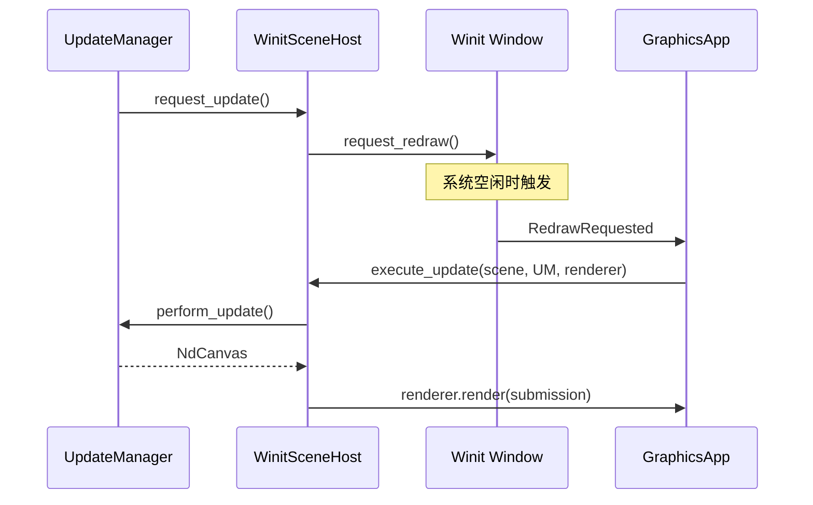
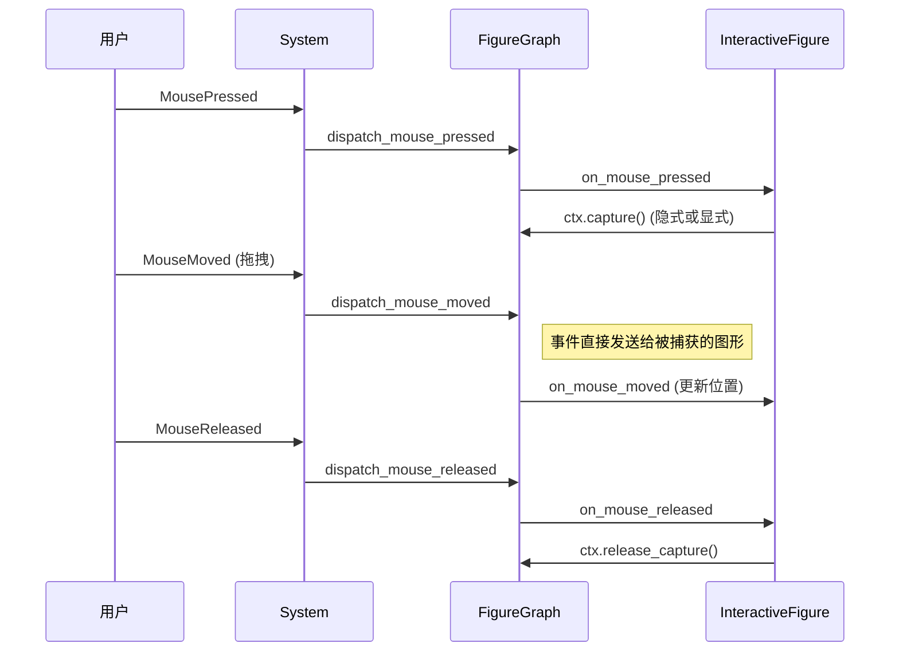
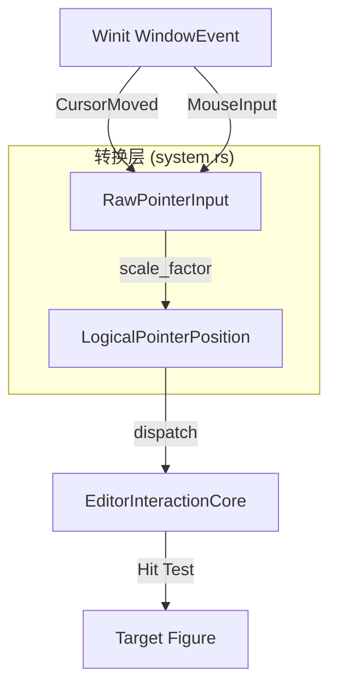
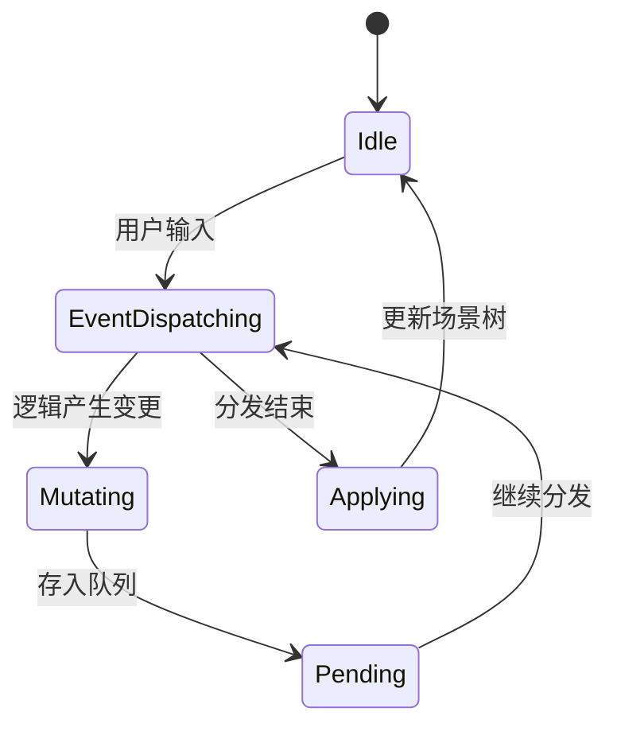

# 交互式编辑器实现分析

## 目录
1. [模块概览](#模块概览)
2. [场景宿主架构 (Scene Hosting)](#场景宿主架构-scene-hosting)
3. [交互逻辑实现 (Interactive Logic)](#交互逻辑实现-interactive-logic)
4. [系统集成与事件转换](#系统集成与事件转换)
5. [坐标映射机制 (Coordinate Mapping)](#坐标映射机制-coordinate-mapping)
6. [核心组件分析](#核心组件分析)
7. [关键算法与设计模式](#关键算法与设计模式)
8. [文件参考](#文件参考)

## 模块概览

`apps/editor` 是 Novadraw 框架中功能最完备的示例应用，它不仅展示了如何集成 Vello 渲染后端，还深入演示了框架的交互系统、场景管理以及跨平台事件适配。该模块作为一个“组合根”（Composition Root），将 Novadraw 的各个解耦组件（如 `FigureGraph`、`UpdateManager`、`EventDispatcher`）有机地结合在一起。

### 核心指标
- **文件总数**: 6 个核心源文件。
- **涵盖范围**: 
    - 窗口生命周期管理 (`app_window.rs`)
    - 平台事件转换与分发 (`system.rs`)
    - 场景状态与测试用例管理 (`scene_manager/mod.rs`)
    - 交互式图形定义 (`scene_manager/interactive_figure.rs`)
    - 渲染调度与重绘机制 (`scene_manager/scene_host.rs`)

### 模块职责
本模块的主要职责是实现一个可交互的图形编辑器原型。它负责将操作系统的原始输入（如 `winit` 提供的物理坐标点击）转换为框架内部的逻辑事件，并根据图形的层级结构和坐标系进行精确的分发。同时，它还实现了一套高效的重绘调度算法，确保只有在状态发生变化时才触发昂贵的渲染操作。

---

## 场景宿主架构 (Scene Hosting)

场景宿主（Scene Host）是连接 Novadraw 逻辑世界与操作系统窗口系统的桥梁。在 `apps/editor` 中，`WinitSceneHost` 实现了这一职责。

### 渲染调度策略
`WinitSceneHost` 并不直接控制渲染循环，而是采用“按需驱动”（Request-driven）的模式。它利用 `winit` 的 `request_redraw` 机制来实现帧合并，避免不必要的 CPU/GPU 开销。

```rust
impl SceneHost for WinitSceneHost {
    fn request_update(&self) {
        // 使用原子操作确保 request_redraw 不会被重复调用
        if !self.update_queued.swap(true, Ordering::Relaxed) {
            self.window.request_redraw();
        }
    }

    fn execute_update(
        &self,
        scene: &mut FigureGraph,
        update_manager: &mut dyn UpdateManager,
        renderer: &mut impl RenderBackend,
    ) -> NdCanvas {
        // 如果没有待处理的更新，则直接返回空画布
        if !self.update_queued.load(Ordering::Relaxed) && !update_manager.is_update_queued() {
            return NdCanvas::new();
        }

        // 执行场景更新并生成渲染命令
        let canvas = scene.perform_update(update_manager);
        let submission = canvas.to_submission();
        renderer.render(&submission);

        // 如果更新后仍有待办事项（如动画），则继续请求重绘
        let still_queued = update_manager.is_update_queued();
        self.update_queued.store(still_queued, Ordering::Relaxed);
        if still_queued {
            self.window.request_redraw();
        }
        canvas
    }
}
```

下图展示了从状态变更到最终渲染的调度流程：



**图表说明**：
该序列图描述了典型的重绘生命周期。当 `UpdateManager` 检测到图形属性变化时，会通知 `SceneHost` 请求更新。`SceneHost` 通过窗口代理调用 `request_redraw`，这在 `winit` 中是幂等的。当操作系统准备好绘制新帧时，会回传 `RedrawRequested` 事件，此时 `SceneHost` 才真正执行场景树的更新并生成渲染命令。

**Section sources**:
- [scene_manager/scene_host.rs](apps/editor/src/scene_manager/scene_host.rs)

---

## 交互逻辑实现 (Interactive Logic)

编辑器最核心的能力是“交互”。Novadraw 通过 `BasicEventDispatcher` 和 `FigureGraph` 的协作，实现了一套支持命中测试（Hit Testing）、状态追踪和事件冒泡的交互系统。

### 交互式图形 (InteractiveFigure)
与静态图形不同，`InteractiveRectFigure` 显式地订阅了鼠标事件。它通过实现 `Shape` trait 中的交互回调来响应用户操作。

```rust
impl Shape for InteractiveRectFigure {
    fn wants_mouse_events(&self) -> bool {
        true // 声明该图形对鼠标事件感兴趣
    }

    fn on_mouse_pressed(&self, event: &MouseEvent, ctx: &mut dyn NovadrawContext) -> bool {
        if event.button == MouseButton::Left {
            ctx.select_target(); // 将当前图形标记为选中状态
        }
        ctx.repaint(None); // 触发重绘以显示选中高亮
        true
    }

    fn on_mouse_entered(&self, _event: &MouseEvent, ctx: &mut dyn NovadrawContext) -> bool {
        ctx.repaint(None); // 鼠标进入时触发重绘（通常用于显示悬停效果）
        true
    }
}
```

### “点击并拖拽”流程分析
编辑器通过“捕获”（Capture）机制处理拖拽。当鼠标按下时，目标图形可以捕获后续的所有移动事件，直到鼠标释放。



**图表说明**：
此图展示了拖拽交互的底层逻辑。关键点在于 `MousePressed` 阶段建立的“捕获”关系。一旦图形被捕获，即使鼠标移动到了图形边界之外，后续的 `MouseMoved` 事件依然会分发给该图形，这确保了拖拽操作的连贯性。

**InteractiveFigure 与普通 Figure 的区别**：
- **事件订阅**: 普通 Figure 的 `wants_mouse_events` 默认为 `false`，在命中测试阶段会被忽略。
- **状态反馈**: `InteractiveFigure` 通常会在回调中调用 `ctx.repaint()` 或 `ctx.select_target()`，主动触发场景状态的变更。
- **视觉反馈**: 在渲染时，`InteractiveFigure` 可能会根据 `is_hovered` 或 `is_selected` 状态绘制不同的边框或填充色。

**Section sources**:
- [scene_manager/interactive_figure.rs](apps/editor/src/scene_manager/interactive_figure.rs)

---

## 系统集成与事件转换

`system.rs` 定义了 `WinitNovadrawSystem`，它是编辑器的大脑，负责协调 OS 层、渲染层和逻辑层。

### 事件转换流
操作系统（通过 `winit`）提供的事件是原始且平台相关的。`WinitNovadrawSystem` 的任务是将这些事件“纯净化”为框架通用的格式。

```rust
pub struct RawPointerInput {
    pub physical_x: f64,
    pub physical_y: f64,
    pub scale_factor: f64,
}

impl RawPointerInput {
    pub fn logical_position(self) -> LogicalPointerPosition {
        let scale_factor = if self.scale_factor > 0.0 { self.scale_factor } else { 1.0 };
        // Winit 输入是窗口物理像素；分发到场景前统一转换到逻辑坐标。
        LogicalPointerPosition {
            x: self.physical_x / scale_factor,
            y: self.physical_y / scale_factor,
        }
    }
}
```



**图表说明**：
该流程图描述了输入数据的转换路径。`winit` 提供的坐标通常是物理像素（Physical Pixels）。为了支持高 DPI 屏幕（如 Retina 显示器），系统必须利用 `scale_factor` 将其转换为逻辑坐标（Logical Coordinates）。只有经过转换后的坐标才能在 `FigureGraph` 中进行正确的命中测试。

### 事务化更新 (Update Transaction)
为了保证状态的一致性，`WinitNovadrawSystem` 采用了事务化的更新机制：

```rust
fn run_update_transaction<R>(&mut self, f: impl FnOnce(&mut EditorInteractionCore) -> R) -> R {
    let was_queued = self.core.update_manager.is_update_queued();
    let result = f(&mut self.core); // 执行具体的业务逻辑（如移动图形）
    
    // 如果逻辑执行导致了状态变更，自动触发重绘
    if !was_queued && self.core.update_manager.is_update_queued() {
        self.scene_host.request_update();
    }
    result
}
```

这种模式确保了开发者在编写交互逻辑时，不需要手动关心何时该刷新屏幕，框架会自动追踪 `UpdateManager` 的挂起状态。

**Section sources**:
- [system.rs](apps/editor/src/system.rs)

---

## 坐标映射机制 (Coordinate Mapping)

编辑器中存在三层坐标系，理解它们之间的转换是开发复杂交互功能的关键。

### 三层坐标系定义
1. **物理坐标 (Physical)**: 屏幕上的真实像素点，受显示器分辨率影响。
2. **逻辑坐标 (Logical)**: 框架统一使用的坐标系，`Physical = Logical * scale_factor`。
3. **局部坐标 (Local)**: 图形内部的坐标系。如果一个容器开启了 `local_coordinates`，其子图形的坐标将相对于容器的左上角。

### 映射流程
当用户点击屏幕时，坐标转换遵循以下路径：


**图表说明**：
物理到逻辑的转换由 `RawPointerInput` 在 `system.rs` 中完成。而逻辑到局部的转换则是在 `FigureGraph` 遍历树结构时动态计算的。每进入一个开启了局部坐标系的容器，当前的变换矩阵（Transform Matrix）就会叠加，从而实现嵌套坐标系的自动处理。

**Section sources**:
- [system.rs](apps/editor/src/system.rs)
- [scene_manager/mod.rs](apps/editor/src/scene_manager/mod.rs)

---

## 核心组件分析

### GraphicsApp (组合根)
`GraphicsApp` 是整个应用的入口点，它持有 `VelloRenderer` 和 `WinitNovadrawSystem` 的所有权。它负责处理 `winit` 的生命周期事件（如 `resumed`、`suspended`），并在窗口调整大小时重新配置渲染表面。

### EditorInteractionCore (交互核心)
这是编辑器的逻辑中心，封装了：
- `SceneManager`: 负责场景切换（0-9 键切换不同的测试用例）。
- `UpdateManager`: 追踪哪些图形需要重新验证或重绘。
- `BasicEventDispatcher`: 执行标准的事件分发算法。
- `PendingMutations`: 暂存交互过程中产生的结构变更（如删除节点），并在安全的时间点批量应用。

### SceneManager (场景管理器)
它预定义了 10 个不同的测试场景（`SceneType`），涵盖了从基础定位点到复杂的 Z-order 叠加和裁剪测试。

```rust
pub fn switch_scene(&mut self, scene_type: SceneType) {
    self.scene = FigureGraph::new();
    match scene_type {
        SceneType::BasicAnchors => Self::create_basic_anchors_scene(&mut self.scene),
        SceneType::Nested => Self::create_nested_scene(&mut self.scene),
        // ... 其他场景初始化 ...
        SceneType::DpiTest => Self::create_dpi_test_scene(&mut self.scene),
    }
    self.current_scene = scene_type;
}
```

**Section sources**:
- [app_window.rs](apps/editor/src/app_window.rs)
- [scene_manager/mod.rs](apps/editor/src/scene_manager/mod.rs)

---

## 关键算法与设计模式

### 命中测试 (Hit Testing)
编辑器使用递归的深度优先搜索（DFS）来寻找鼠标下的图形。
- **Z-Order 敏感**: 遍历顺序与渲染顺序相反（从后往前），确保点击的是视觉上最上层的图形。
- **可见性过滤**: `is_visible = false` 的节点及其子树会被直接跳过。
- **局部坐标支持**: 在遍历过程中，坐标会根据容器的变换进行实时转换。

### 状态同步模式 (Pending Mutations)
在事件处理过程中直接修改场景树结构是非常危险的。编辑器采用了 **Pending Mutations** 模式：

```rust
fn apply_pending_mutations(&mut self) -> bool {
    // 从队列中提取所有待处理的变更
    let mutations = self.pending_mutations.drain();
    // 批量应用到场景树，并通知 UpdateManager 进行增量验证
    self.scene_manager
        .scene
        .apply_pending_mutations(&mut self.update_manager, mutations)
}
```



**图表说明**：
该状态图描述了变更请求的生命周期。通过将“产生变更”与“应用变更”解耦，框架能够安全地处理复杂的交互场景，如多级冒泡过程中的节点操作。

**Section sources**:
- [system.rs](apps/editor/src/system.rs)

---

## 文件参考

以下是本模块涉及的核心源文件：

- [apps/editor/src/main.rs](apps/editor/src/main.rs): 应用启动入口，配置日志系统。
- [apps/editor/src/app_window.rs](apps/editor/src/app_window.rs): Winit 应用程序处理器，管理渲染器和窗口事件。
- [apps/editor/src/system.rs](apps/editor/src/system.rs): 系统集成层，实现坐标转换和事务化更新逻辑。
- [apps/editor/src/scene_manager/mod.rs](apps/editor/src/scene_manager/mod.rs): 场景管理器，定义了多种渲染和交互测试场景。
- [apps/editor/src/scene_manager/scene_host.rs](apps/editor/src/scene_manager/scene_host.rs): Winit 平台的重绘调度器。
- [apps/editor/src/scene_manager/interactive_figure.rs](apps/editor/src/scene_manager/interactive_figure.rs): 交互式图形的参考实现。
