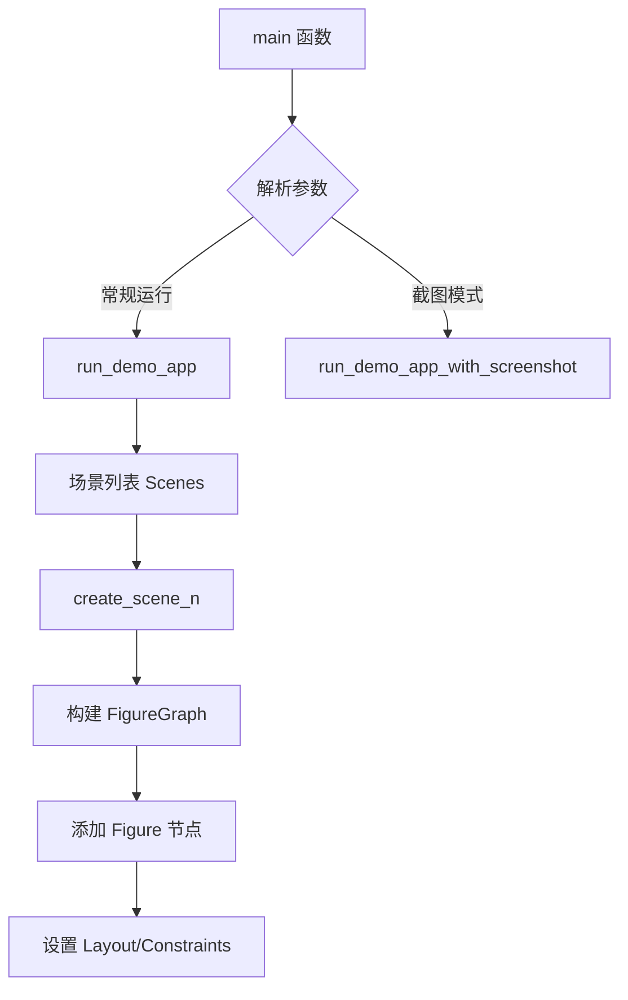
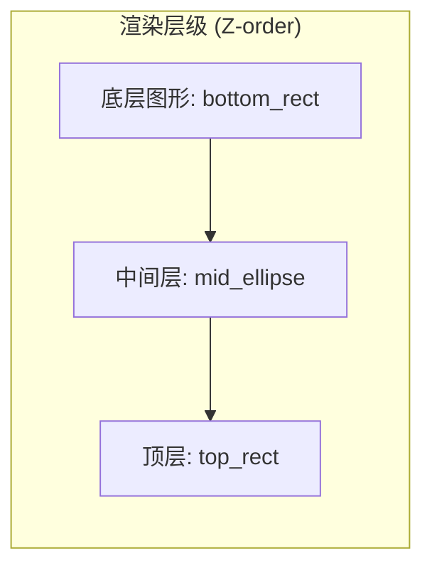
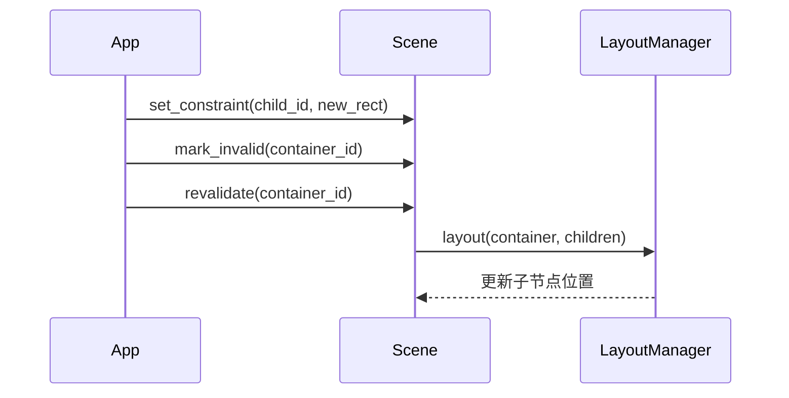
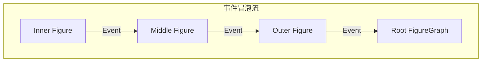
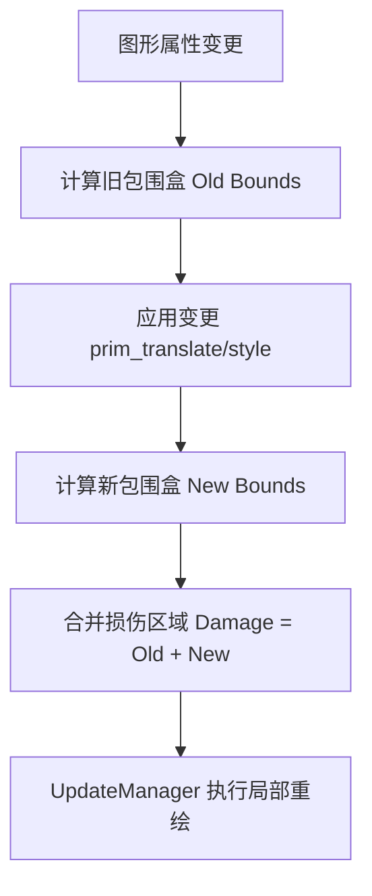
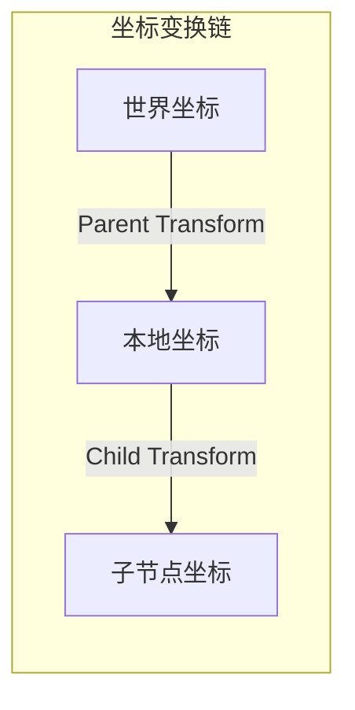

# 基础功能演示应用分析

## 目录
1. [模块概览](#模块概览)
2. [引言](#引言)
3. [核心组件与模式](#核心组件与模式)
4. [图形渲染演示 (shape-app)](#图形渲染演示-shape-app)
5. [布局系统演示 (layout-app & border-app)](#布局系统演示-layout-app--border-app)
6. [交互事件演示 (event-app)](#交互事件演示-event-app)
7. [更新机制演示 (update-app)](#更新机制演示-update-app)
8. [样式与变换演示 (style-app & transform-app)](#样式与变换演示-style-app--transform-app)
9. [运行指南](#运行指南)
10. [文件引用](#文件引用)

## 模块概览
`apps/` 目录是 Novadraw 引擎的功能验证与演示中心。除了核心编辑器 (`editor`) 外，该目录下包含了一系列专注于特定功能领域的专项演示程序。

- **总文件数**: 约 15 个核心 Rust 源文件（主要为各应用的 `main.rs`）。
- **子模块分类**:
    - **基础绘图**: `shape-app`, `style-app`
    - **空间布局**: `layout-app`, `border-app`
    - **交互系统**: `event-app`
    - **引擎核心机制**: `update-app`, `transform-app`, `clip-app`
    - **渲染后端验证**: `vello-app`, `ndcanvas-app`

本页面将重点分析这些演示程序的实现逻辑，展示如何利用 Novadraw API 构建复杂的图形界面。

## 引言
Novadraw 的演示程序不仅是功能测试的工具，更是开发者学习框架用法的最佳参考。每个应用都遵循“最小化实现”原则，通过独立的场景（Scene）展示特定 API 的组合方式。

这些演示程序共同构建了一个功能验证矩阵，涵盖了从底层的坐标变换、裁剪，到中层的形状渲染、样式配置，再到高层的布局管理和事件分发的全链路流程。

## 核心组件与模式
在所有的演示应用中，存在一种通用的初始化和运行模式。理解这一模式是掌握 Novadraw 的关键。

### 演示应用通用结构
大多数演示应用都使用 `novadraw_apps` 提供的辅助函数（如 `run_demo_app`）来快速启动。



在 `main` 函数中，通常会定义一个场景列表，每个场景都是一个返回 `FigureGraph` 的闭包。

**代码示例：通用场景构建模式**
```rust
fn create_scene() -> novadraw::FigureGraph {
    let mut scene = novadraw::FigureGraph::new();
    
    // 1. 设置根容器
    let container = novadraw::RectangleFigure::new(0.0, 0.0, 800.0, 600.0);
    let container_id = scene.set_contents(Box::new(container));
    
    // 2. 添加子图形
    let rect = novadraw::RectangleFigure::new_with_color(100.0, 100.0, 200.0, 150.0, Color::RED);
    scene.add_child_to(container_id, Box::new(rect));
    
    scene
}
```

**Section sources**:
- [apps/shape-app/src/main.rs](apps/shape-app/src/main.rs)
- [apps/layout-app/src/main.rs](apps/layout-app/src/main.rs)

## 图形渲染演示 (shape-app)
`shape-app` 集中展示了 Novadraw 支持的基础几何图形及其组合能力。

### 支持的图形类型
- **RectangleFigure**: 基础矩形。
- **EllipseFigure**: 椭圆与圆形。
- **RoundedRectangleFigure**: 带圆角的矩形。
- **PolylineFigure**: 多段线，支持自定义 `LineCap`（线帽）和 `LineJoin`（连接样式）。
- **TriangleFigure**: 三角形，支持方向控制（North, South, East, West）。

### 渲染层级 (Z-order)
演示程序通过 `add_child_to` 的调用顺序验证了 Z-order 遮挡关系：后添加的图形会渲染在先添加的图形之上。



在 `create_scene_9_zorder` 中，通过重叠不同颜色的图形，直观地验证了层级系统的正确性。

**Section sources**:
- [apps/shape-app/src/main.rs](apps/shape-app/src/main.rs)

## 布局系统演示 (layout-app & border-app)
布局系统是 Novadraw 处理节点自动化排列的核心。`layout-app` 展示了多种布局管理器的行为。

### 布局管理器分类
1. **XYLayout**: 基于绝对坐标或约束的定位，最灵活。
2. **FillLayout**: 第一个子元素自动充满容器。
3. **FlowLayout**: 流式布局，支持自动换行和间距设置。
4. **BorderLayout**: 经典的五区域布局（North, South, East, West, Center）。

### 布局重算流程
当容器或子元素的约束发生变化时，需要触发布局重算（Revalidation）。



在 `create_scene_nested_layout` 中，演示了嵌套布局的复杂场景：外层使用 `XYLayout` 划分区域，内层区域各自使用独立的布局管理器处理子节点。

**Section sources**:
- [apps/layout-app/src/main.rs](apps/layout-app/src/main.rs)
- [apps/border-app/src/main.rs](apps/border-app/src/main.rs)

## 交互事件演示 (event-app)
`event-app` 演示了如何捕获和分发用户交互事件。

### 事件类型与分发
演示程序涵盖了以下交互场景：
- **鼠标进入/离开 (MouseEnter/Exit)**: 验证悬停状态。
- **鼠标拖拽 (MouseDrag)**: 结合 `MouseMove` 实现图形移动。
- **键盘输入 (KeyDown/Up)**: 捕获按键序列。
- **焦点切换 (Focus)**: 多个可聚焦组件之间的切换逻辑。

### 事件传播机制
Novadraw 遵循从子节点向父节点冒泡的事件传播模式。



在 `create_scene_8_event_propagation` 中，通过三层嵌套矩形展示了事件如何逐级传递，以及如何在某一层拦截事件。

**Section sources**:
- [apps/event-app/src/main.rs](apps/event-app/src/main.rs)

## 更新机制演示 (update-app)
`update-app` 是深入理解 Novadraw 性能优化机制的关键，重点展示了“损伤修复”（Damage Repair）技术。

### 损伤修复流程
Novadraw 不会盲目重绘整个画布，而是计算“损伤区域”（Dirty Region），仅重绘受影响的部分。



在 `create_scene_6_damage_repair` 中，通过 `CaptureListener` 捕获并打印了 `UpdateEvent::Painting { damage }`，展示了精确的损伤矩形计算过程。

**Section sources**:
- [apps/update-app/src/main.rs](apps/update-app/src/main.rs)

## 样式与变换演示 (style-app & transform-app)
这两个应用分别处理图形的视觉属性和空间属性。

### 样式属性 (Style)
- **填充与描边**: `style-app` 展示了 `with_stroke` 和 `with_fill_color` 的用法。
- **边框 (Border)**: 区别于描边，边框（`RectangleBorder`）支持内边距（Insets），可以实现更复杂的视觉效果。

### 坐标变换 (Transform)
`transform-app` 验证了仿射变换的正确性。
- **变换传播**: 父节点的平移、旋转、缩放会自动应用到所有子节点。
- **本地坐标系**: 通过 `with_local_coordinates(true)`，子节点可以相对于父节点的左上角（0,0）进行定位，简化了布局逻辑。



**Section sources**:
- [apps/style-app/src/main.rs](apps/style-app/src/main.rs)
- [apps/transform-app/src/main.rs](apps/transform-app/src/main.rs)
- [apps/clip-app/src/main.rs](apps/clip-app/src/main.rs)

## 运行指南
开发者可以使用 Cargo 命令运行特定的演示程序。

### 基础运行命令
```bash
# 运行形状演示
cargo run --package shape-app

# 运行布局演示
cargo run --package layout-app

# 运行事件演示
cargo run --package event-app
```

### 快捷键交互
在演示程序运行期间，通常支持以下交互：
- **数字键 0-9**: 快速切换不同的演示场景（Scenes）。
- **方向键/鼠标滚轮**: 在部分应用中用于循环切换场景。

### 截图模式
为了便于生成文档或进行视觉回归测试，大多数演示程序支持截图模式：
```bash
# 为所有场景生成截图
cargo run --package shape-app -- --screenshot-all

# 为指定场景生成截图
cargo run --package shape-app -- --screenshot=2
```

## 文件引用
以下是本页面分析的核心演示程序源文件：

- `apps/shape-app/src/main.rs`: 基础形状与路径渲染实现。
- `apps/layout-app/src/main.rs`: 各种布局管理器（XY, Flow, Fill）的动态演示。
- `apps/event-app/src/main.rs`: 鼠标与键盘事件的捕获与分发逻辑。
- `apps/border-app/src/main.rs`: 专门展示 `BorderLayout` 的用法。
- `apps/update-app/src/main.rs`: 深入展示引擎更新生命周期与损伤修复。
- `apps/style-app/src/main.rs`: 视觉样式属性（颜色、描边、边框）的综合测试。
- `apps/transform-app/src/main.rs`: 仿射变换与本地坐标系的验证。
- `apps/clip-app/src/main.rs`: 父子裁剪关系的实现参考。
