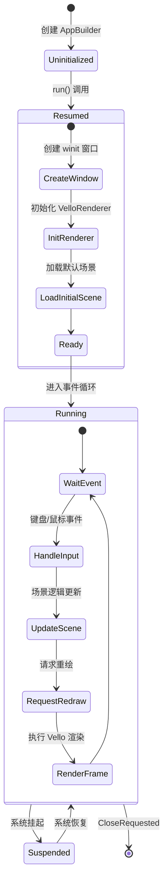
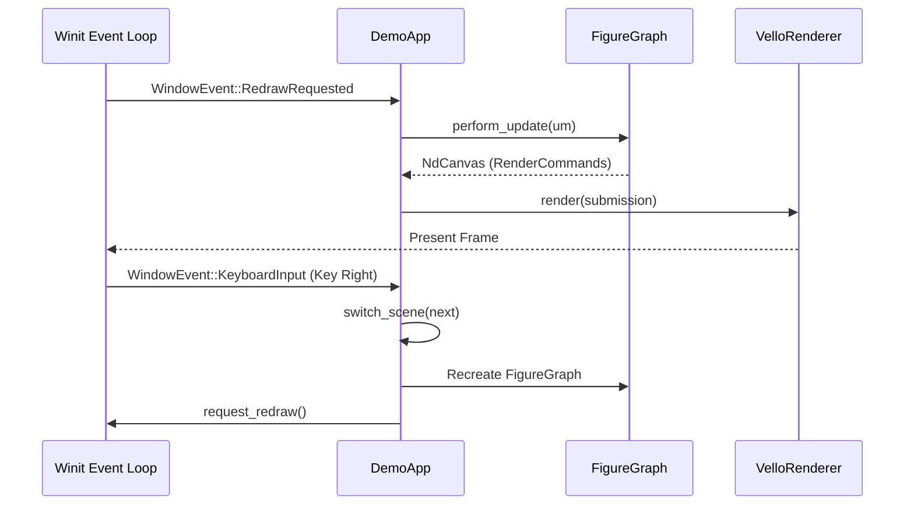

# 应用开发框架与工具集

## 目录
1. [模块概览](#模块概览)
2. [核心组件](#核心组件)
   - [DemoApp：应用核心](#demoapp应用核心)
   - [AppBuilder：流式构建器](#appbuilder流式构建器)
3. [架构设计与生命周期](#架构设计与生命周期)
   - [应用生命周期](#应用生命周期)
   - [事件循环与分发](#事件循环与分发)
4. [场景管理与切换](#场景管理与切换)
5. [资源管理与初始化](#资源管理与初始化)
6. [截图与调试工具](#截图与调试工具)
7. [快速上手：Hello World](#快速上手hello-world)
8. [API 参考](#api-参考)
9. [文件参考](#文件参考)

## 模块概览

`novadraw-apps` crate 是 Novadraw 引擎的演示应用框架。它通过抽象通用的样板代码（Boilerplate），极大简化了基于 `winit` 窗口系统和 `vello` 渲染后端的图形应用开发流程。

**核心统计信息：**
- **总文件数**：3 个核心 Rust 文件。
- **主要子模块**：
    - `app`: 包含应用主体实现及构建器。
    - `prelude`: 导出常用类型，方便开发者一键导入。
    - `lib`: 模块入口与公共接口。

该模块的主要职责是作为“粘合剂”，将 `novadraw` 的场景图系统、`novadraw-render` 的渲染能力以及 `winit` 的窗口事件循环整合在一起，提供一个开箱即用的开发环境。

## 核心组件

### DemoApp：应用核心

`DemoApp` 是整个框架的灵魂。它实现了 `winit::application::ApplicationHandler` trait，负责管理窗口生命周期、渲染器状态、场景图以及用户输入。

```rust
pub struct DemoApp {
    scenes: Vec<(&'static str, SceneCreator)>, // 场景列表
    current_scene_idx: usize,                  // 当前场景索引
    scene_graph: Option<FigureGraph>,          // 当前场景图实例
    update_manager: Option<SceneUpdateManager>, // 更新管理器
    renderer: Option<VelloRenderer>,           // Vello 渲染后端
    window: Option<Arc<winit::window::Window>>, // winit 窗口
    // ... 其他配置字段
}
```

`DemoApp` 不仅仅是一个简单的容器，它还内置了复杂的逻辑：
- **两阶段更新**：支持通过 `SceneUpdateManager` 进行高效的局部更新。
- **多模式渲染**：支持递归渲染和迭代渲染两种模式，方便性能对比。
- **自适应缩放**：自动处理高 DPI 屏幕的缩放因子（Scale Factor）。

### AppBuilder：流式构建器

为了降低配置复杂度，框架提供了 `AppBuilder`。它采用流式接口（Fluent Interface），允许开发者以声明式的方式配置应用参数。

```rust
let result = AppBuilder::new("Novadraw Demo")
    .with_size(1024.0, 768.0)
    .with_app_name("my_awesome_app")
    .add_scene("Main Scene", || create_main_scene())
    .run();
```

**Section sources**:
- [novadraw-apps/src/app.rs](novadraw-apps/src/app.rs)

## 架构设计与生命周期

`novadraw-apps` 采用典型的响应式架构。应用状态由场景图（`FigureGraph`）维护，而驱动力来自于系统事件。

### 应用生命周期

下图展示了 `DemoApp` 从启动到退出的完整生命周期。理解这一流程对于处理复杂的初始化逻辑至关重要。



在 `resumed` 阶段，框架会自动处理复杂的 WebGPU 设备请求、Surface 创建以及渲染上下文的绑定。开发者无需关心 `pollster::block_on` 等异步细节，框架会确保在场景加载前一切就绪。

### 事件循环与分发

`DemoApp` 充当了事件分发中心。它不仅处理窗口事件（如缩放、关闭），还负责将用户输入转化为场景切换或渲染模式调整等操作。



这种设计确保了渲染逻辑与输入逻辑的解耦。`DemoApp` 负责“何时”渲染，而 `FigureGraph` 负责“渲染什么”。

**Section sources**:
- [novadraw-apps/src/app.rs](novadraw-apps/src/app.rs)
- [novadraw-render/src/backend/vello/mod.rs](novadraw-render/src/backend/vello/mod.rs)

## 场景管理与切换

`novadraw-apps` 的一大特色是内置的多场景管理。这对于演示不同图形特性非常有用。

- **场景定义**：场景通过 `SceneCreator`（即 `Box<dyn FnMut() -> FigureGraph>`）延迟创建。这意味着只有在切换到该场景时，相关的内存和资源才会被分配。
- **导航快捷键**：
    - `0-9`：快速跳转到前 10 个场景。
    - `方向键左/右` 或 `PageUp/PageDown`：循环切换。
    - `鼠标滚轮`：快速浏览场景。
    - `Home/End`：跳转到首尾场景。

切换场景时，`DemoApp` 会自动更新窗口标题，并重置 `SceneUpdateManager`，确保新场景的事件监听器正确挂载。

## 资源管理与初始化

虽然 `novadraw-apps` 本身保持轻量，但它通过 `prelude` 和工具函数为资源管理奠定了基础。

1. **字体集成**：框架预留了 `cosmic-text` 的集成接口。在渲染后端，`VelloRenderer` 会处理字体的栅格化和缓存。
2. **静态资源处理**：通过 `CARGO_MANIFEST_DIR` 环境变量，框架能够准确定位应用根目录，从而实现截图等功能的路径自动管理。
3. **渲染上下文配置**：框架自动处理 `WinitWindowProxy`，它实现了 `WindowProxy` trait，使得渲染后端可以跨平台安全地访问底层窗口句柄。

> 💡 **提示**：在开发演示程序时，建议将资源加载逻辑放入 `SceneCreator` 闭包中，以实现按需加载。

## 截图与调试工具

为了方便开发者调试和生成文档，`DemoApp` 内置了强大的截图功能。

- **手动截图**：按下 `S` 键，应用会将当前帧捕获并保存为 PNG。
- **自动化截图模式**：通过 `AppBuilder::with_screenshot(true)`，应用启动后会自动遍历所有场景，每个场景渲染一帧并截图后自动退出。这对于 CI/CD 环境下的视觉回归测试非常有用。
- **渲染模式切换**：
    - `I` 键：在递归渲染和迭代渲染之间切换。
    - `U` 键：切换是否启用两阶段更新管理器。

**Diagram sources**:
- [novadraw-apps/src/app.rs:L156-L262](novadraw-apps/src/app.rs#L156-L262)

## 快速上手：Hello World

下面是一个使用 `novadraw-apps` 构建的最小化应用模板。

```rust
use novadraw_apps::prelude::*;

fn create_scene() -> FigureGraph {
    let mut scene = FigureGraph::new();
    
    // 创建一个红色的矩形
    let mut rect = RectangleFigure::new(50.0, 50.0, 200.0, 150.0);
    rect.set_fill_color(Color::rgb(1.0, 0.0, 0.0));
    
    scene.add_figure(Box::new(rect));
    scene
}

fn main() -> Result<(), Box<dyn std::error::Error>> {
    // 使用 AppBuilder 配置并运行
    AppBuilder::new("Novadraw Hello World")
        .with_size(800.0, 600.0)
        .add_scene("Red Rectangle", create_scene)
        .run()
}
```

这段代码展示了框架如何隐藏复杂的 `winit` 事件循环和 `vello` 初始化逻辑，让开发者专注于场景内容的构建。

## API 参考

| API | 描述 |
| :--- | :--- |
| `AppBuilder::new(title)` | 创建一个新的应用构建器。 |
| `AppBuilder::with_size(w, h)` | 设置窗口初始逻辑尺寸。 |
| `AppBuilder::add_scene(name, creator)` | 添加一个场景创建闭包。 |
| `AppBuilder::run()` | 启动应用并进入阻塞的事件循环。 |
| `run_demo_app(...)` | 快速运行应用的简便函数，适用于简单演示。 |
| `DemoApp::screenshot(name)` | 捕获当前帧并保存到 `screenshot/` 目录。 |
| `prelude` | 包含 `FigureGraph`, `Color`, `RectangleFigure` 等常用类型的模块。 |

## 文件参考

本章节涉及的核心文件如下：

- [novadraw-apps/src/app.rs](novadraw-apps/src/app.rs): 包含 `DemoApp` 和 `AppBuilder` 的实现，是框架的核心。
- [novadraw-apps/src/lib.rs](novadraw-apps/src/lib.rs): 库入口，定义了公共导出。
- [novadraw-apps/src/prelude.rs](novadraw-apps/src/prelude.rs): 常用类型预导入，简化用户代码。
- [novadraw-render/src/backend/vello/mod.rs](novadraw-render/src/backend/vello/mod.rs): 渲染后端实现，被 `DemoApp` 调用。
