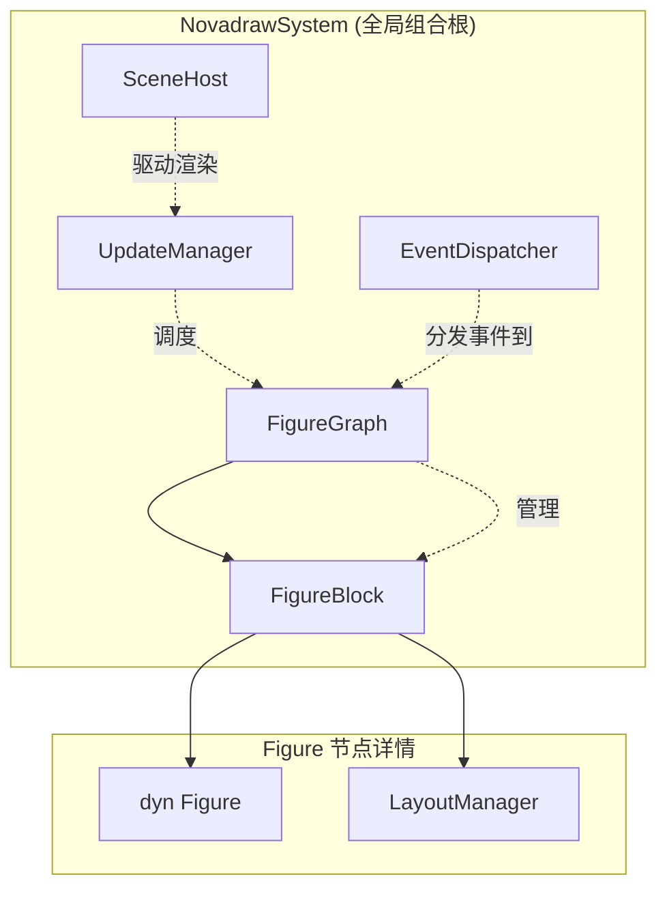
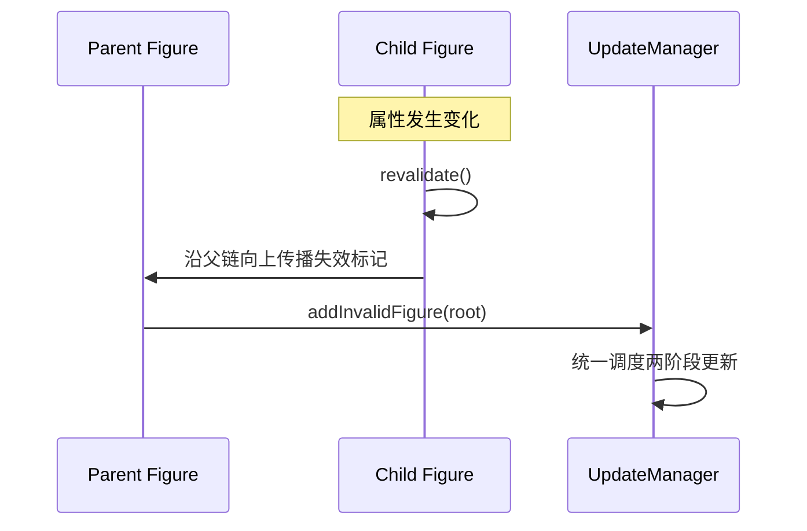
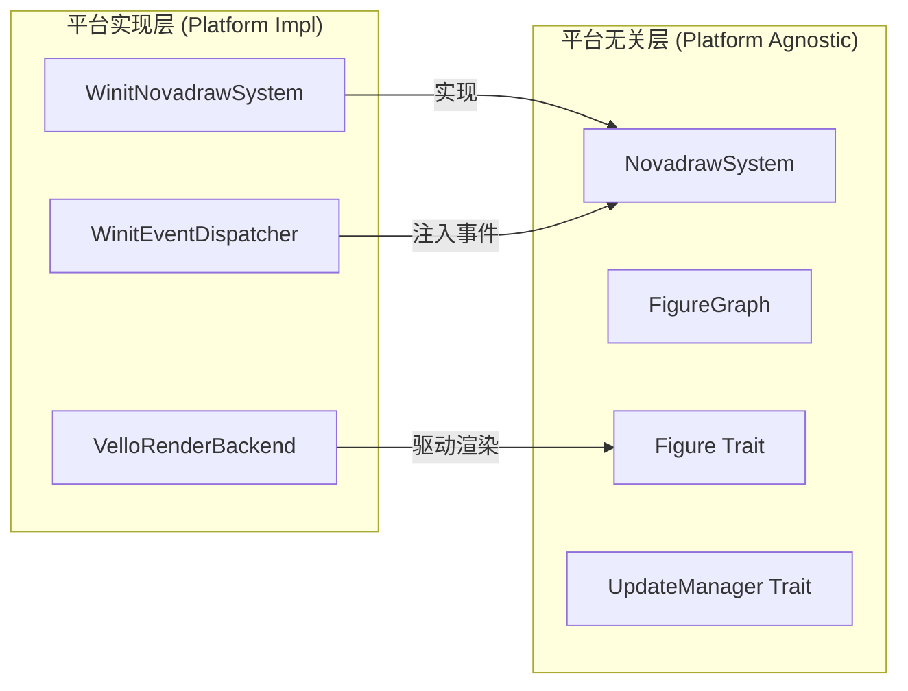
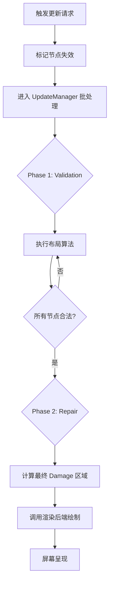

# 项目概览与设计哲学

## 目录
1. [模块概览](#模块概览)
2. [项目背景与起源](#项目背景与起源)
   - [从 Java 到 Rust 的传承](#从-java-到-rust-的传承)
   - [在 Rust 图形生态中的定位](#在-rust-图形生态中的定位)
3. [核心设计哲学](#核心设计哲学)
   - [轻量级 Figure 树架构](#轻量级-figure-树架构)
   - [统一几何真相：Bounds 闭包](#统一几何真相-bounds-闭包)
4. [设计公理深度解析](#设计公理深度解析)
   - [结构与传播公理 (A1-A2)](#结构与传播公理-a1-a2)
   - [几何与坐标公理 (A3-A5)](#几何与坐标公理-a3-a5)
   - [更新与交互公理 (A6-A9)](#更新与交互公理-a6-a9)
5. [理想架构蓝图](#理想架构蓝图)
   - [静态架构：组件解耦与 Trait 层级](#静态架构-组件解耦与-trait-层级)
   - [动态架构：两阶段更新事务](#动态架构-两阶段更新事务)
6. [核心组件定义](#核心组件定义)
7. [文件参考](#文件参考)

## 模块概览

Novadraw 是一个基于 Rust 开发的高性能 2D 图形引擎，其核心设计深受 Eclipse Draw2D 的启发。本项目旨在为复杂的图形编辑工具、可视化系统和高性能 UI 提供一套可扩展、类型安全且平台无关的底层架构。

在本次文档生成过程中，我们对整个代码库进行了深度扫描。目前项目包含约 **161** 个核心文件（包括 Rust 源码、架构文档和配置文件），涵盖了从底层数学运算到高层场景管理的完整链路。

**子模块分布情况：**
- **核心架构层 (`doc/01-architecture/`)**: 包含本项目的设计公理、历史背景及理想架构蓝图。这是理解 Novadraw 设计灵魂的关键。
- **场景管理层 (`novadraw-scene/`)**: 实现了 Figure 树、布局管理器、事件分发和更新流转。
- **渲染后端层 (`novadraw-render/`)**: 基于 Vello 和 WebGPU 的高性能渲染实现。
- **基础数学与几何 (`novadraw-math/`, `novadraw-geometry/`)**: 提供 2D/3D 向量、矩阵及矩形运算支持。
- **应用示例与工具 (`apps/`, `examples/`)**: 包含编辑器 demo、各种图形特性演示应用。

本章节将重点覆盖架构文档目录，阐述 Novadraw 的设计公理及其如何指导代码实现。

## 项目背景与起源

### 从 Java 到 Rust 的传承

Novadraw 的灵魂源自 2000 年由 IBM 创建的 **Eclipse Draw2D**。在 Java 时代，Draw2D 凭借其“轻量级组件模型”彻底改变了可视化编辑器的开发模式。它不依赖操作系统原生控件，而是通过一套纯 Java 实现的 Figure 树，在 SWT Canvas 上构建出了极其复杂的图形交互系统，这也是著名的 GEF (Graphical Editing Framework) 的基石。

Novadraw 并非简单的代码翻译，而是对 Draw2D 经典设计的**现代 Rust 重构**。我们继承了其经过二十年验证的“设计公理”，同时利用 Rust 的所有权模型、零成本抽象和现代 GPU 渲染技术（如 Vello），解决了原 Java 版本在内存安全、多线程性能和渲染效率上的局限性。

### 在 Rust 图形生态中的定位

在当前的 Rust 图形生态中，既有如 `iced` 或 `egui` 这样专注于 UI 的框架，也有如 `bevy_vello` 这样专注于高性能渲染的插件。Novadraw 的定位在于**高性能、可定制的 2D 图形编辑引擎**。

它不同于通用的 UI 框架，更强调：
- **深层嵌套的图形树**：支持数万个轻量级 Figure 的高效管理。
- **复杂的布局契约**：提供类似 CSS 但更适合图形编辑的布局管理器。
- **精确的交互控制**：基于事件分发状态机，支持复杂的拖拽、缩放和坐标转换。

**Section sources**:
- [doc/01-architecture/draw2d-history.md](doc/01-architecture/draw2d-history.md)
- [doc/01-architecture/draw2d_design_axioms.md](doc/01-architecture/draw2d_design_axioms.md)

## 核心设计哲学

Novadraw 的设计哲学可以概括为：**“树即骨架，几何即真相”**。

### 轻量级 Figure 树架构

在 Novadraw 中，基本运行单元是 `Figure`。与原生操作系统窗口或 DOM 节点不同，`Figure` 是极轻量的 Rust 对象。

下图展示了 Novadraw 的核心组织模型，它通过 `NovadrawSystem` 统一协调各个子系统：



该架构确保了：
1. **职责分离**：`Figure` 负责绘制，`LayoutManager` 负责位置计算，`UpdateManager` 负责更新频率控制。
2. **内存高效**：通过 `SlotMap` 管理 `FigureBlock`，避免了 Rust 中常见的循环引用问题。

### 统一几何真相：Bounds 闭包

Novadraw 坚持 `bounds` 是 Figure 的唯一几何真相。一个节点的 `bounds` 不仅决定了它画在哪，还决定了：
- **命中测试 (Hit Testing)**：点击是否落在该区域。
- **失效区域 (Damage Region)**：当节点改变时，哪些屏幕区域需要重绘。
- **布局输入**：父容器根据子节点的 `bounds` 进行排列。

这种高度统一的设计避免了“看得见点不着”或“重绘留残影”等图形系统常见 Bug。

**Section sources**:
- [doc/01-architecture/ideal-architecture-static.md](doc/01-architecture/ideal-architecture-static.md)
- [doc/01-architecture/draw2d_design_axioms.md](doc/01-architecture/draw2d_design_axioms.md)

## 设计公理深度解析

为了保证系统的长期稳定性，Novadraw 定义了 9 条不可逾越的“设计公理”。这些公理是跨模块成立的系统级不变量。

### 结构与传播公理 (A1-A2)

这两条公理定义了系统的基本存在形式。

- **A1. 轻量 Figure 树公理**：系统真正组织单位是轻量对象，而非平台控件。这保证了极低的创建和销毁成本。
- **A2. 树即运行时骨架公理**：Figure 树不仅表示包含关系，还承载了 Z-order、可见性、坐标和验证的传播。



如上图所示，任何局部的变化都会沿着“树骨架”向上传播，最终由 `UpdateManager` 统一收口，这体现了 A2 公理的威力。

### 几何与坐标公理 (A3-A5)

这组公理构成了 Novadraw 的空间感。

- **A3. Bounds 统一几何公理**：`bounds` 是唯一的几何基准。
- **A4. 局部坐标与坐标根公理**：支持递归坐标系统。某个节点一旦开启 `useLocalCoordinates`，它就成为新的坐标原点，其子树进入独立的坐标域。
- **A5. ClientArea 盒模型公理**：明确区分 `bounds`（外框）和 `clientArea`（内容区）。

> 💡 **核心提示**：
> Novadraw 的坐标转换不是简单的加减偏移，而是通过 `translateToParent` 和 `translateFromParent` 协议递归完成的。这使得复杂的嵌套缩放和视口滚动变得自然且一致。

### 更新与交互公理 (A6-A9)

这组公理决定了系统的动态行为。

- **A6. 几何变更协议公理**：禁止直接修改 `bounds` 字段，必须通过 `setBounds` 协议，以触发擦除、移动通知和重绘。
- **A7. 两阶段更新事务公理**：**必须先 Validation（布局合法化），再 Repair（重绘脏区）**。
- **A8. Parent-chain Damage 修复公理**：脏矩形在向上传播过程中必须逐层被父节点裁剪。
- **A9. 事件分发状态机公理**：由全局 `EventDispatcher` 维护 `capture`、`focus` 和 `hover` 状态。

**Section sources**:
- [doc/01-architecture/draw2d_design_axioms.md](doc/01-architecture/draw2d_design_axioms.md)

## 理想架构蓝图

Novadraw 的理想架构旨在实现完全的“平台解耦”。

### 静态架构：组件解耦与 Trait 层级

在理想架构中，所有的核心组件都通过 Trait 定义契约，具体的平台实现（如基于 winit 的窗口管理或基于 Vello 的渲染）被隔离在 `Platform_Impl` 层。



这种设计允许 Novadraw 轻松运行在 WebAssembly、原生桌面甚至嵌入式环境中。

### 动态架构：两阶段更新事务

Novadraw 严格遵守“先验证，后修复”的原则。这避免了在布局尚未稳定时就进行绘制导致的“闪烁”或“残影”问题。



在 Phase 1 中，系统会递归地让所有失效的布局重新合法化；只有当几何状态完全稳定后，Phase 2 才会计算受影响的屏幕矩形并触发 GPU 渲染。

**Section sources**:
- [doc/01-architecture/ideal-architecture-static.md](doc/01-architecture/ideal-architecture-static.md)
- [doc/01-architecture/ideal-architecture-dynamic.md](doc/01-architecture/ideal-architecture-dynamic.md)

## 核心组件定义

在 Rust 实现中，Novadraw 采用了以下关键数据结构来承载设计哲学：

```rust
// 核心 Figure Trait 定义了渲染和几何契约
pub trait Figure: Bounded + Send + Sync {
    fn paint_figure(&self, ctx: &mut PaintContext);
    fn validate(&self);
    // ... 事件处理接口
}

// FigureBlock 管理节点的运行时状态，解决了父子引用的所有权问题
pub struct FigureBlock {
    pub id: BlockId,
    pub parent: Option<BlockId>,
    pub children: Vec<BlockId>,
    pub is_valid: bool,
    pub layout_manager: Option<Arc<dyn LayoutManager>>,
    pub figure: Box<dyn Figure>,
}

// NovadrawSystem 是系统的全局组合根
pub struct NovadrawSystem {
    pub scene: FigureGraph,
    pub update_manager: Arc<dyn UpdateManager>,
    pub dispatcher: Arc<dyn EventDispatcher>,
    pub scene_host: Arc<dyn SceneHost>,
}
```

这些定义体现了对 **A1 (轻量化)** 和 **A2 (树骨架)** 公理的忠实执行。通过 `BlockId` 替代原始指针，我们利用 `SlotMap` 实现了高性能且内存安全的图形树遍历。

**Section sources**:
- [doc/01-architecture/ideal-architecture-static.md](doc/01-architecture/ideal-architecture-static.md)
- [novadraw-scene/src/lib.rs](novadraw-scene/src/lib.rs)

## 文件参考

以下是本章节涉及的关键架构文档及核心代码文件：

- **设计公理**: [doc/01-architecture/draw2d_design_axioms.md](doc/01-architecture/draw2d_design_axioms.md) - 定义了系统的 9 条不变量。
- **静态架构**: [doc/01-architecture/ideal-architecture-static.md](doc/01-architecture/ideal-architecture-static.md) - 描述了组件关系和 Trait 层级。
- **动态架构**: [doc/01-architecture/ideal-architecture-dynamic.md](doc/01-architecture/ideal-architecture-dynamic.md) - 详述了两阶段更新事务流。
- **演进历史**: [doc/01-architecture/draw2d-history.md](doc/01-architecture/draw2d-history.md) - 追溯了从 Eclipse Draw2D 到 Novadraw 的技术脉络。
- **核心定义**: [novadraw-scene/src/lib.rs](novadraw-scene/src/lib.rs) - 包含了 `Figure` 和 `FigureBlock` 的基础实现。
- **工作区配置**: [Cargo.toml](Cargo.toml) - 展示了项目的模块化组织结构。
