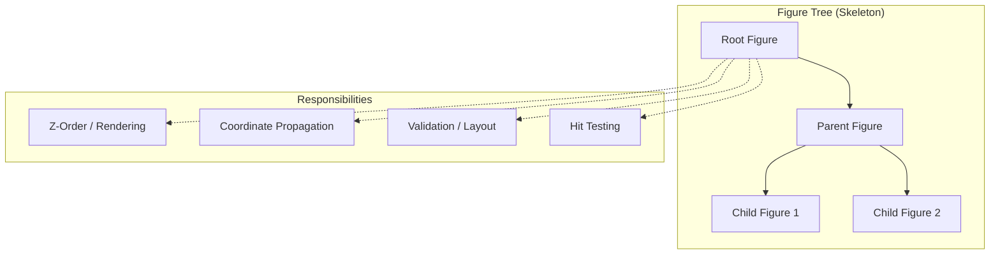
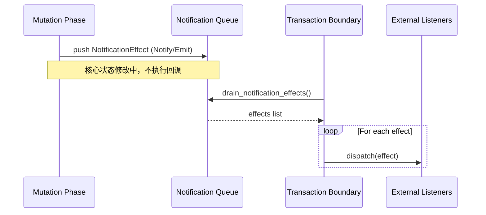
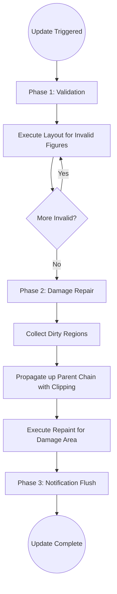

# 核心设计公理

## 目录
1. [模块概览](#模块概览)
2. [核心设计公理 (Design Axioms)](#核心设计公理-design-axioms)
   - [A1-A3：结构与几何基础](#a1-a3结构与几何基础)
   - [A4-A6：坐标与盒模型协议](#a4-a6坐标与盒模型协议)
   - [A7-A9：更新事务与事件体系](#a7-a9更新事务与事件体系)
3. [响应式架构与通知机制](#响应式架构与通知机制)
   - [Zed 启发式响应式模型](#zed-启发式响应式模型)
   - [通知语义分层 (Notify vs. Emit)](#通知语义分层-notify-vs-emit)
4. [两阶段更新事务流程](#两阶段更新事务流程)
5. [通知效应队列 (Effect Queue)](#通知效应队列-effect-queue)
6. [图形抽象策略](#图形抽象策略)
7. [核心组件](#核心组件)
8. [文件参考](#文件参考)

## 模块概览

Novadraw 的设计并非基于随机的编码决策，而是建立在一套严谨的“设计公理”之上。这些公理定义了系统在处理图形树、坐标转换、布局验证、重绘修复以及事件分发时的不变量。

本模块涵盖了 Novadraw 的底层哲学，主要包括：
- **设计公理**：源自 Eclipse Draw2D 的 9 条核心准则，确保了图形系统的自洽性。
- **响应式架构**：借鉴 Zed 编辑器的 Effect Queue 机制，解决了 Rust 所有权模型下的重入与状态同步问题。
- **通知系统**：语义分层的通知协议，区分了状态失效、几何变化与更新事务。
- **图形抽象**：基于对 SWT GC 的分析，确立了统一的路径（Path）绘图模式。

目前，这些设计原则已在 `novadraw-scene` 和 `novadraw-render` 模块中得到深度实现。

**模块统计**：
- 核心设计文档：10 份（位于 `doc/01-architecture/`）
- 关键 ADR：2 份（位于 `doc/adr/`）
- 涉及子模块：`novadraw-scene` (更新与通知), `novadraw-render` (图形抽象)

## 核心设计公理 (Design Axioms)

Novadraw 的核心公理是跨模块成立的系统级不变量。如果这些公理被破坏，系统通常会在命中测试、布局、重绘等多个点上同时出错。

### A1-A3：结构与几何基础

1.  **A1. 轻量 Figure 树公理**：图形节点（Figure）是轻量级的运行时对象，不直接对应操作系统原生控件。这确保了创建和销毁节点的极低成本。
2.  **A2. 树即运行时骨架公理**：Figure 树不仅表示包含关系，还承载了所有权、Z-order、可见性、坐标传播、验证传播和命中测试遍历。
3.  **A3. Bounds 统一几何公理**：`bounds` 是 Figure 的唯一几何真相。它同时决定了命中测试（`containsPoint`）、旧区域擦除和 dirty 区域修复。

下图展示了 Figure 树作为系统骨架的多重职责：



Figure 树是 Novadraw 的灵魂。它不仅定义了视觉上的层级（Z-Order），还作为坐标换算的路径（Coordinate Propagation）和布局失效的传播链（Validation）。当一个子节点发生变化时，它会沿着这棵树向上寻找验证根（Validation Root），确保更新事务的正确性。

### A4-A6：坐标与盒模型协议

4.  **A4. 局部坐标与坐标根公理**：系统采用父链递归坐标系。`useLocalCoordinates` 决定了子元素是否相对当前 Figure 左上角布局。一旦开启，该节点即成为“坐标根”。
5.  **A5. ClientArea 盒模型公理**：`clientArea` 等于 `bounds - insets`。子节点的布局和裁剪必须限定在 `clientArea` 内。
6.  **A6. 几何变更协议公理**：几何变化（移动、缩放）必须通过受控协议（如 `setBounds`）完成，以触发旧区域擦除、失效标记和重绘请求。

### A7-A9：更新事务与事件体系

7.  **A7. 两阶段更新事务公理**：更新必须分为 **Validation（验证/布局）** 和 **Damage Repair（重绘修复）** 两个阶段，且 Validation 必须先于 Repair。
8.  **A8. Parent-chain Damage 修复公理**：脏区域（Dirty Rect）必须沿父链传播，逐层进行坐标转换和 `bounds` 裁剪，直到根节点形成最终 Damage。
9.  **A9. 事件分发状态机公理**：事件由系统级 `EventDispatcher` 统一调度，依赖全局状态（如 `mouseTarget`、`capture`、`focusOwner`）。

**Section sources**:
- [draw2d_design_axioms.md](doc/01-architecture/draw2d_design_axioms.md)

## 响应式架构与通知机制

### Zed 启发式响应式模型

传统的观察者模式（Observer Pattern）在 Rust 中常因为所有权（Ownership）和借用检查（Borrow Checker）导致实现困难，且容易产生重入（Re-entrancy）风险。Novadraw 借鉴了 **Zed 编辑器** 的响应式设计：

1.  **状态与事件分离**：区分“状态已变化”（Notify）和“语义化事件”（Emit）。
2.  **延迟 Flush**：在核心状态修改期间不直接执行回调，而是记录到 Effect Queue，在事务边界（Transaction Boundary）统一处理。

### 通知语义分层 (Notify vs. Emit)

Novadraw 的通知体系并非单一总线，而是严格分层的协议：

| 层次 | 类型 | 语义 | 对应 Draw2D 概念 |
| :--- | :--- | :--- | :--- |
| **状态失效层** | `Notify` | 对象状态已变，不带 Payload | `propertyChange` (无值) |
| **几何语义层** | `EmitFigure` | 几何边界或坐标域变化 | `figureMoved`, `coordinateSystemChanged` |
| **更新事务层** | `EmitUpdate` | 更新阶段的开始与结束 | `UpdateListener` |



这种分层确保了通知系统既能满足图形引擎的精确需求（如坐标域变化），又能保持 Rust 代码的安全性。通过将副作用延迟到事务边界，我们避免了在布局计算中途触发外部代码可能导致的状态不一致。

**Section sources**:
- [zed_reactive_design.md](doc/01-architecture/zed_reactive_design.md)
- [adr-002-notification-effect-queue.md](doc/adr/adr-002-notification-effect-queue.md)

## 两阶段更新事务流程

Novadraw 严格遵守“先验证，后修复”的原则。这解决了布局副作用导致重绘区域计算错误的问题。

1.  **Validation Phase**：
    - 遍历 `invalid_blocks`。
    - 递归执行布局算法，稳定 Figure 的 `bounds`。
    - 此时可能产生新的几何变化效应。
2.  **Repair Phase**：
    - 汇总所有 `dirty_regions`。
    - 沿父链计算最终 Damage 区域。
    - 执行重绘（Repaint）。



在 Validation 阶段，系统会处理所有被标记为 `invalid` 的 Figure。布局计算可能会导致 Figure 移动，从而产生新的 `dirty_regions`。由于 Repair 阶段在 Validation 之后，这些新产生的脏区域能够被正确地纳入重绘计划中，避免了视觉上的撕裂或残留。

**Section sources**:
- [draw2d_design_axioms.md:L215-L243](doc/01-architecture/draw2d_design_axioms.md#L215-L243)
- [deferred.rs:L234-L258](novadraw-scene/src/update/deferred.rs#L234-L258)

## 通知效应队列 (Effect Queue)

为了实现 ADR-002 定义的机制，`NotificationQueue` 成为了 `SceneUpdateManager` 的核心组件。

```rust
pub enum NotificationEffect {
    /// 无 payload 的状态失效通知
    Notify { block_id: BlockId },
    /// Figure 层 typed event (FigureMoved, CoordinateSystemChanged)
    EmitFigure(FigureEvent),
    /// UpdateManager 层 typed event (Validating, Painted, etc.)
    EmitUpdate(UpdateEvent),
}
```

在 `SceneUpdateManager::perform_update` 中，通知的生命周期如下：
1.  **记录**：在更新开始、验证前后、重绘前后记录 `UpdateEvent`。
2.  **收集**：FigureGraph 在执行几何变更时记录 `FigureEvent`。
3.  **分发**：在所有更新逻辑完成后，调用 `flush_notifications`。

这种模式对比传统 OO 模式下的观察者模式，最大的差异在于**执行时机的受控性**。在 Java Draw2D 中，`fireFigureMoved` 通常是同步触发的；而在 Novadraw 中，它是异步/延迟触发的，这为 Rust 的借用检查提供了极大的便利。

**Section sources**:
- [listener.rs](novadraw-scene/src/update/listener.rs)
- [deferred.rs:L104-L110](novadraw-scene/src/update/deferred.rs#L104-L110)

## 图形抽象策略

基于对 SWT GC 的深度分析，Novadraw 确立了**统一路径（Path）绘图模式**。

- **核心理念**：所有的图形操作（矩形、椭圆、多边形、直线）在底层都统一抽象为路径。
- **状态管理**：采用“脏标记延迟更新”机制。只有在真正执行绘制命令（`checkGC`）时，才会同步颜色、线宽、变换等状态到渲染后端。
- **对象复用**：复用路径对象和变换矩阵，减少 Rust 堆分配压力。

这种策略与 Vello 等现代 GPU 渲染库的思路高度一致，能够极大地简化渲染管线的实现。

**Section sources**:
- [swt-gc-analysis.md](doc/01-architecture/swt-gc-analysis.md)

## 核心组件

以下是实现上述设计公理的关键 Rust 组件：

| 组件 | 职责 | 源代码路径 |
| :--- | :--- | :--- |
| `NotificationQueue` | 存储和管理通知效应的队列 | `novadraw-scene/src/update/listener.rs` |
| `SceneUpdateManager` | 协调两阶段更新与通知分发 | `novadraw-scene/src/update/deferred.rs` |
| `FigureEvent` | 定义几何与坐标域变化的语义事件 | `novadraw-scene/src/update/listener.rs` |
| `UpdateEvent` | 定义更新事务生命周期的事件 | `novadraw-scene/src/update/listener.rs` |
| `UpdateListener` | 外部订阅通知的 Trait 接口 | `novadraw-scene/src/update/listener.rs` |

## 文件参考

本页面内容基于以下核心设计文档及源代码：

- `doc/01-architecture/draw2d_design_axioms.md`: 核心设计公理定义。
- `doc/01-architecture/zed_reactive_design.md`: 响应式设计思想来源。
- `doc/01-architecture/draw2d_notification_design.md`: 通知系统语义分层。
- `doc/01-architecture/swt-gc-analysis.md`: 图形抽象策略分析。
- `doc/adr/adr-002-notification-effect-queue.md`: 通知效应队列决策文档。
- `novadraw-scene/src/update/listener.rs`: 通知效应与事件定义。
- `novadraw-scene/src/update/deferred.rs`: 更新管理器与事务实现。
- `novadraw-scene/src/update/mod.rs`: 更新模块入口与 Trait 定义。
