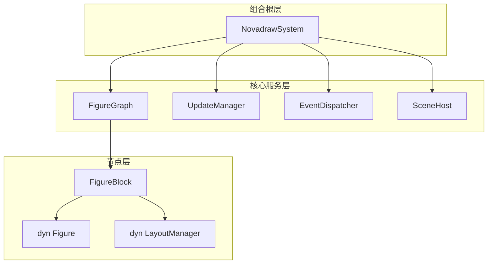
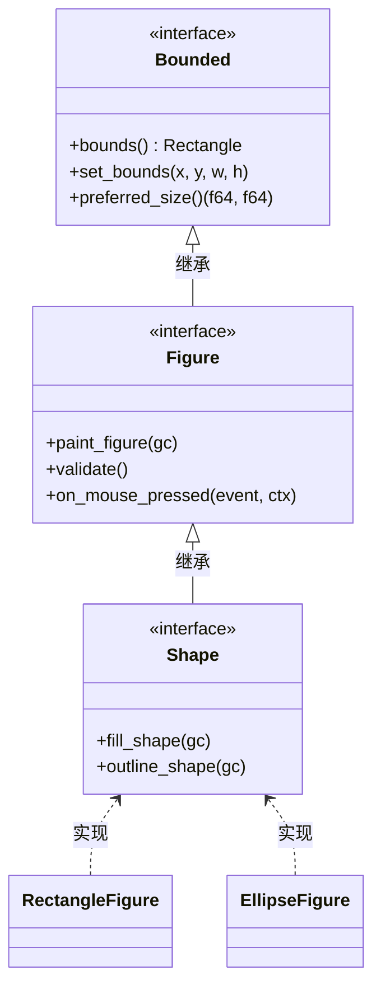
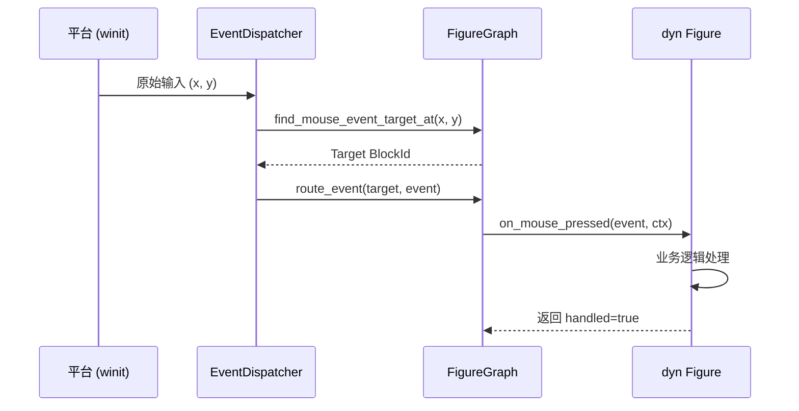
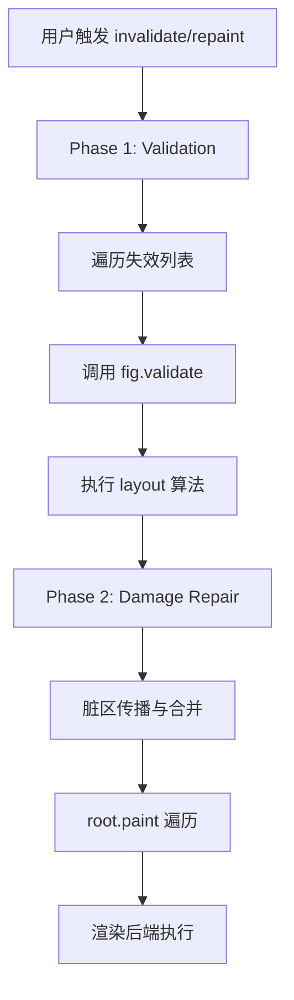
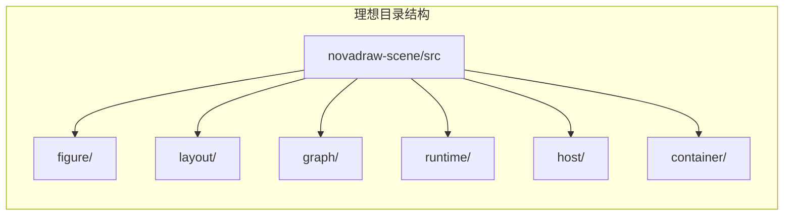
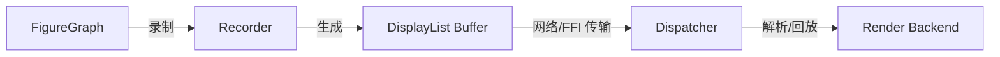
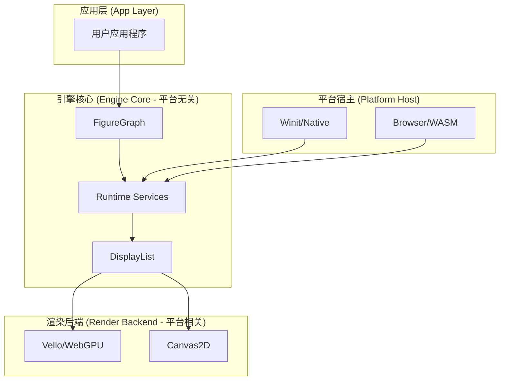

# 理想架构蓝图

## 目录
1. [模块概览](#模块概览)
2. [引言：理想架构的“北极星”](#引言理想架构的北极星)
3. [静态架构蓝图：核心组件与 Trait 层级](#静态架构蓝图核心组件与-trait-层级)
   - [3.1 核心组件关系](#31-核心组件关系)
   - [3.2 Trait 继承体系](#32-trait-继承体系)
   - [3.3 FigureBlock 数据结构](#33-figureblock-数据结构)
4. [动态交互模型：事件与更新生命周期](#动态交互模型事件与更新生命周期)
   - [4.1 事件分发链路](#41-事件分发链路)
   - [4.2 两阶段更新机制](#42-两阶段更新机制)
5. [目录结构规划：四层演进模型](#目录结构规划四层演进模型)
6. [显示列表 (DisplayList) 设计：高效渲染中介层](#显示列表-displaylist-设计高效渲染中介层)
7. [差距分析 (Gap Analysis)：当前实现与理想目标](#差距分析-gap-analysis当前实现与理想目标)
8. [跨平台扩展与引擎核心边界](#跨平台扩展与引擎核心边界)
9. [关键文件参考](#关键文件参考)

## 模块概览

本章节描述的“理想架构”涵盖了 Novadraw 项目的核心引擎部分。通过对现有代码库的分析，该架构涉及的范围和规模如下：

*   **涉及文件总数**：约 52 个源文件。
*   **核心子模块**：
    *   `novadraw-scene` (34 个文件)：包含图形、布局、边框、场景图、事件分发、更新管理、上下文、系统入口及变更管理。
    *   `novadraw-render` (8 个文件)：包含渲染后端实现（Vello/WebGPU）、命令定义及提交逻辑。
    *   `novadraw-geometry` (5 个文件)：提供矩形、变换、坐标转换等几何基础。
    *   `novadraw-core` (2 个文件)：定义颜色等基础类型。
    *   `novadraw-math` (3 个文件)：提供矩阵和向量运算。
*   **覆盖深度**：本章节将深入探讨 `novadraw-scene` 内部的职责划分，并简要提及 `novadraw-render` 与显示列表的集成方案。

## 引言：理想架构的“北极星”

Novadraw 的理想架构设计并非空中楼阁，它是基于对经典图形框架（如 Eclipse draw2d）的源码级分析，结合 Rust 语言的安全性与高性能特性演化而来的。其核心目标是建立一个**职责边界清晰、高度可扩展且平台无关**的 2D 图形引擎。

理想架构作为项目的“北极星”指标，指导着长期的技术演进。其核心设计哲学可以概括为：
> **Figure 是内在能力，FigureBlock 是节点状态，FigureGraph 是树关系与交互状态，Update/Event/Host 是系统服务，NovadrawSystem 是组合根。**

这一原则确保了系统在面对复杂业务需求时，能够保持低耦合和高内聚。

## 静态架构蓝图：核心组件与 Trait 层级

静态架构定义了 Novadraw 引擎的骨架，明确了各组件之间的持有关系和接口协定。

### 3.1 核心组件关系

在理想架构中，`NovadrawSystem` 作为全局组合根，协调四大核心服务：场景图（`FigureGraph`）、更新管理（`UpdateManager`）、事件分发（`EventDispatcher`）和宿主环境（`SceneHost`）。



该结构实现了严格的职责分离：`NovadrawSystem` 负责组装，`FigureGraph` 负责存储和关系，而具体的渲染和布局算法则通过 Trait 对象（`dyn Figure` 和 `dyn LayoutManager`）进行多态扩展。

### 3.2 Trait 继承体系

Novadraw 采用了分层的 Trait 体系，从基础几何到高级渲染能力层层递进。



*   **Bounded**: 定义了最基础的边界、坐标系统和布局属性。
*   **Figure**: 引入了渲染接口、验证机制和交互回调。
*   **Shape**: 针对矢量图形，增加了描边、填充等具体绘制语义。

### 3.3 FigureBlock 数据结构

`FigureBlock` 是场景图中的物理存储单元。与 `Figure` Trait 不同，它承载了节点在树中的运行时状态。

```rust
// 摘自 novadraw-scene/src/scene/mod.rs
pub struct FigureBlock {
    pub(crate) id: BlockId,
    pub(crate) children: Vec<BlockId>,
    pub(crate) parent: Option<BlockId>,
    pub(crate) figure: Box<dyn super::Figure>,
    pub(crate) layout_manager: Option<Arc<dyn super::layout::LayoutManager>>,
    pub(crate) is_valid: bool,
    pub(crate) is_visible: bool,
    pub(crate) preferred_size: Option<(f64, f64)>,
    // ... 其他交互状态
}
```

这种设计解决了 Rust 中典型的“父子引用”借用冲突问题：通过 `SlotMap` 管理节点，父子关系仅通过 `BlockId` 引用，从而允许在遍历树的同时安全地访问节点数据。

**Section sources**:
- [ideal-architecture-static.md](doc/01-architecture/ideal-architecture-static.md)
- [novadraw-scene/src/scene/mod.rs](novadraw-scene/src/scene/mod.rs)

## 动态交互模型：事件与更新生命周期

动态结构描述了数据如何在系统中流动，特别是在处理用户输入和触发界面更新时。

### 4.1 事件分发链路

Novadraw 采用了“平台适配 -> 引擎分发 -> 节点响应”的三层事件模型。



在这一过程中，`FigureGraph` 维护着关键的交互状态，如 `mouse_target`、`focus_owner` 和 `captured`（鼠标捕获）。事件支持向上冒泡，直到被某个节点处理或到达根节点。

### 4.2 两阶段更新机制

为了保证渲染性能和界面一致性，Novadraw 严格执行两阶段更新流程：

1.  **验证阶段 (Validation)**: 遍历所有失效节点，执行布局计算和几何预处理。
2.  **损伤修复阶段 (Damage Repair)**: 将脏区合并，并根据裁剪区域触发重绘。



**Section sources**:
- [ideal-architecture-dynamic.md](doc/01-architecture/ideal-architecture-dynamic.md)
- [novadraw-scene/src/update/mod.rs](novadraw-scene/src/update/mod.rs)

## 目录结构规划：四层演进模型

理想架构要求目录结构能够清晰地表达职责边界。目前项目正处于从“单体 crate”向“分层模块”演进的过程中。

| 层次 | 职责 | 对应目录/模块 |
| :--- | :--- | :--- |
| **图形能力层** | 定义 Figure、Border、LayoutManager 等基础 Trait | `figure/`, `layout/`, `border/` |
| **场景图核心层** | 维护树结构、执行命中测试、坐标转换 | `graph/` (原 `scene/`) |
| **运行时服务层** | 事件分发、更新调度、上下文管理 | `runtime/` (包含 `event/`, `update/`, `context/`) |
| **平台宿主层** | 窗口集成、渲染入口协调 | `host/` (原 `scene_host.rs`) |



这种分层方式确保了依赖方向始终是单向的：平台宿主依赖运行时服务，运行时服务依赖场景图核心，而核心层依赖底层的图形能力。

**Section sources**:
- [ideal-directory-structure.md](doc/01-architecture/ideal-directory-structure.md)

## 显示列表 (DisplayList) 设计：高效渲染中介层

为了支持跨平台（如 Web 端的 WASM 与原生端的 WebGPU）和跨语言回放，理想架构引入了 `DisplayList` 作为渲染中介层。

`DisplayList` 是一个扁平化的二进制协议缓冲区，存储了所有绘制指令（OpCodes）及其 Payload。



**关键设计特性**：
- **零拷贝解析**：利用 `bytemuck` 实现二进制数据的快速读取。
- **资源 ID 化**：图片和字体等大资源通过 `ResourceHandle` 引用，与指令流分离。
- **增量更新**：支持 Patch 协议，仅传输发生变化的指令块。

**Section sources**:
- [displaylist_design.md](doc/01-architecture/displaylist_design.md)

## 差距分析 (Gap Analysis)：当前实现与理想目标

虽然核心逻辑已经落地，但当前代码库与“理想架构”之间仍存在一定差距：

1.  **物理目录尚未完全对齐**：`novadraw-scene` 内部的模块仍平铺在 `src` 根目录下，尚未按“四层模型”进行归类（如 `runtime/` 目录尚未建立）。
2.  **显示列表尚未 crate 化**：`DisplayList` 目前更多处于设计和初步实现阶段，尚未作为一个独立的 `novadraw-displaylist` crate 发布。
3.  **坐标转换的统一性**：虽然已有坐标转换逻辑，但在某些复杂容器（如 `Viewport`）中的应用仍需进一步标准化，以消除旧式的全局空间特判。
4.  **事件捕获阶段支持**：目前的事件路由仅支持目标阶段和冒泡阶段，尚未实现类似 DOM 的捕获阶段（Capturing Phase）。

## 跨平台扩展与引擎核心边界

理想架构通过高度抽象的 `SceneHost` 和 `RenderBackend` 实现了跨平台能力。

*   **Web 平台 (WASM)**: 通过 `WebSceneHost` 对接浏览器事件，渲染后端可选择 Canvas2D 或 WebGPU。
*   **原生平台 (WebGPU)**: 通过 `WinitSceneHost` 对接窗口系统，利用 `Vello` 实现高性能的 GPU 矢量渲染。

**架构边界示意图**：



这种分层确保了开发者编写的 UI 逻辑（位于引擎核心层）在不同平台上具有完全一致的行为。

## 关键文件参考

以下是实现理想架构过程中最关键的参考文件：

| 文件路径 | 职责描述 |
| :--- | :--- |
| `doc/理想架构设计.md` | 总体架构蓝图与“北极星”原则。 |
| `doc/01-architecture/ideal-architecture-static.md` | 静态组件关系与 Trait 层级定义。 |
| `doc/01-architecture/ideal-architecture-dynamic.md` | 运行时交互、事件分发与更新流程。 |
| `doc/01-architecture/ideal-directory-structure.md` | 目录结构演进计划与命名规范。 |
| `doc/01-architecture/displaylist_design.md` | 二进制显示列表协议设计。 |
| `novadraw-scene/src/scene/mod.rs` | 当前场景图（FigureGraph）的核心实现。 |
| `novadraw-scene/src/update/mod.rs` | 当前更新管理器的实现逻辑。 |

**Section sources**:
- [理想架构设计.md](doc/理想架构设计.md)
- [ideal-architecture-static.md](doc/01-architecture/ideal-architecture-static.md)
- [ideal-architecture-dynamic.md](doc/01-architecture/ideal-architecture-dynamic.md)
- [ideal-directory-structure.md](doc/01-architecture/ideal-directory-structure.md)
- [displaylist_design.md](doc/01-architecture/displaylist_design.md)
