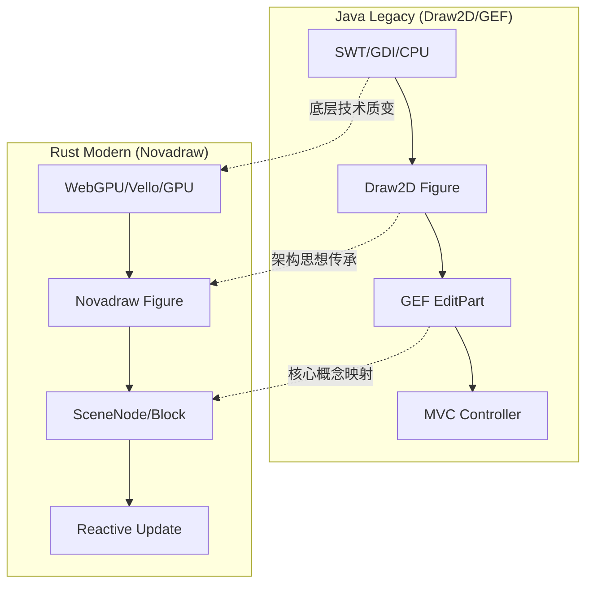
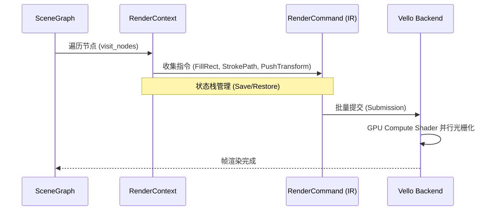
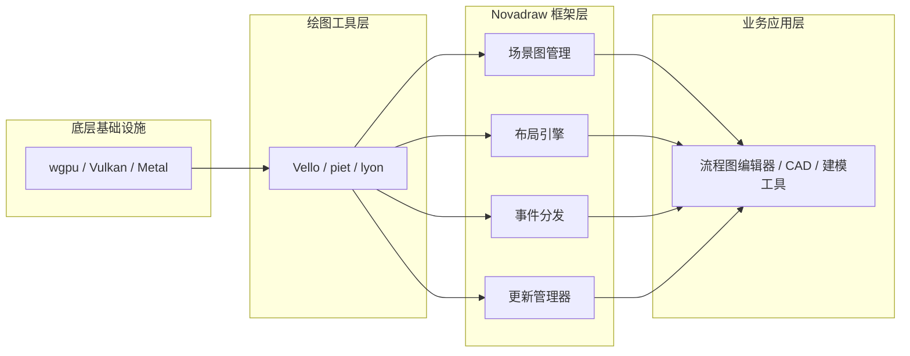

# 项目愿景与起源

## 目录
1. [模块概览](#模块概览)
2. [引言：从 Java 遗产到 Rust 新生](#引言从-java-遗产到-rust-新生)
3. [历史传承：Eclipse Draw2D 的设计精髓](#历史传承eclipse-draw2d-的设计精髓)
4. [核心映射：Java 与 Rust 的概念对标](#核心映射java-与-rust-的概念对标)
5. [技术选型动机：为什么是 Rust + WebGPU?](#技术选型动机为什么是-rust--webgpu)
6. [高性能实现：现代图形技术的深度集成](#高性能实现现代图形技术的深度集成)
7. [生态定位：作为“框架”而非“库”的独特价值](#生态定位作为框架而非库的独特价值)
8. [核心组件与实现深度解析](#核心组件与实现深度解析)
9. [文件参考](#文件参考)

## 模块概览

Novadraw 是一个受 Eclipse Draw2D/GEF 启发的、基于 Rust 开发的高性能 2D 图形框架。它不仅仅是一个绘图库，更是一个完整的场景图管理、布局引擎和交互系统。

在本次探索中，我们识别出以下核心模块：
- **核心文件总数**: 约 150+ 个文件（包含 `.rs`, `.md`, `.toml`）。
- **子模块结构**:
    - `novadraw-scene`: 场景图管理、Figure 体系、布局与更新机制。这是框架的“大脑”，负责逻辑组织。
    - `novadraw-render`: 渲染后端实现，支持 Vello 和 WebGPU。这是框架的“肌肉”，负责将逻辑转化为像素。
    - `novadraw-geometry` & `novadraw-math`: 基础几何与数学库，提供高性能的向量和矩阵运算。
    - `novadraw-apps`: 应用框架层，简化了窗口管理和事件循环的集成。
    - `apps/`: 包含多个演示应用，如 `editor`（交互式编辑器）, `vello-app`（原生 Vello 测试）等。

本页面将重点介绍项目的宏观愿景、历史背景以及技术选型的深度考量，帮助开发者理解 Novadraw 为什么选择当前的架构路径。

## 引言：从 Java 遗产到 Rust 新生

Novadraw 的诞生并非偶然，而是对经典图形框架设计理念在现代硬件环境下的重塑。其核心灵感源自 2000 年由 IBM 创建的 **Eclipse Draw2D** 和 **GEF (Graphical Editing Framework)**。这两个框架在 Java 生态中统治了复杂图形编辑领域（如 UML 建模、工作流设计、电路图绘制）长达二十年。

在 21 世纪初，Java 凭借其跨平台能力和强大的面向对象特性，成为了构建企业级工具的首选。然而，随着显示技术向 4K/8K 演进，用户对交互流畅度的要求日益提高，传统的基于 CPU 绘制（如 GDI, Quartz, SWT GC）的 Java 框架逐渐显露颓势。CPU 在处理数万个路径的抗锯齿、混合和裁剪时，往往会成为性能瓶颈，导致界面卡顿。

Novadraw 的目标是将 GEF 卓越的架构模式——**关注点分离、轻量级组件、可插拔布局、损伤修复机制**——带入 Rust 生态，并利用 WebGPU 提供的硬件加速能力，打造下一代高性能图形编辑引擎。它试图解决的核心问题是：如何在保持架构灵活性的同时，利用现代 GPU 的并行计算能力，实现极致流畅的图形交互体验。

**Section sources**:
- [doc/01-architecture/draw2d-history.md](doc/01-architecture/draw2d-history.md)
- [doc/01-architecture/gef_principle.md](doc/01-architecture/gef_principle.md)

## 历史传承：Eclipse Draw2D 的设计精髓

Novadraw 继承了 Draw2D 最核心的设计 Axioms（公理），这些设计在今天依然具有极高的工程指导意义。理解这些原则是理解 Novadraw 架构的关键。

### 1. 轻量级组件模型 (Lightweight Component Model)
在传统的 UI 框架中，每个按钮或面板通常对应一个操作系统原生的窗口句柄（Widget）。这种方式在处理成千上万个小图形时会导致严重的资源消耗和性能下降。Draw2D 引入了 `Figure` 的概念，它完全在内存中管理，不依赖原生窗口，所有的渲染都在一个大的 Canvas 上完成。这使得 Novadraw 能够轻松处理复杂的嵌套 UI 和海量图形对象。

### 2. 组合模式与场景图 (Composite Pattern)
图形对象通过树形结构组织。父图形负责管理子图形的生命周期、可见性和坐标变换。这种结构天然适合描述复杂的嵌套 UI。在 Novadraw 中，这种结构被进一步优化，通过 `Block` 和句柄系统（Handle System）来避免 Rust 中常见的借用检查问题。

### 3. 布局与表现分离 (Separation of Layout and Representation)
图形本身不决定自己的位置，而是由可插拔的 `LayoutManager` 决定。这种策略模式允许开发者在不修改图形代码的情况下，轻松切换布局逻辑（如从绝对定位切换到流式布局、网格布局或边框布局）。

下图展示了从 Java Draw2D 到 Rust Novadraw 的架构演进逻辑，体现了设计思想的延续与底层技术的革新：



**Diagram Narrative**:
该图展示了架构的传承关系。左侧是传统的 Java 技术栈，其性能受限于 CPU 绘图 API（SWT/GDI）；右侧是 Novadraw 的现代实现，底层切换到了基于 GPU 的 Vello/WebGPU。尽管底层技术发生了质变，但中间层的“轻量级图形（Figure）”和“控制器（EditPart/SceneNode）”的架构思想得到了跨语言的延续。这种传承确保了 Novadraw 能够站在巨人的肩膀上，同时享受 Rust 带来的极致性能。

**Section sources**:
- [doc/01-architecture/draw2d-history.md](doc/01-architecture/draw2d-history.md)

## 核心映射：Java 与 Rust 的概念对标

为了方便熟悉 GEF 的开发者快速上手，下表展示了两个框架在核心概念上的映射关系。Novadraw 在保留这些概念的同时，利用 Rust 的类型系统增强了 API 的健壮性。

| 维度 | Eclipse Draw2D / GEF (Java) | Novadraw (Rust) | 说明 |
| :--- | :--- | :--- | :--- |
| **基础图形** | `IFigure` / `Figure` | `Figure` Trait | 渲染和事件处理的基本单位，定义了“如何画” |
| **容器/块** | `Figure` (Composite) | `Block` / `SceneNode` | 场景图中的节点，管理布局和子元素，定义了“在哪画” |
| **更新管理** | `UpdateManager` | `SceneUpdateManager` | 处理脏区域（Damage）和重绘请求，实现按需刷新 |
| **布局引擎** | `LayoutManager` | `Layout` Trait | 负责计算子节点 Bounds 的策略对象，支持多种布局算法 |
| **渲染上下文** | `Graphics` (SWT GC) | `RenderContext` | 抽象的绘制指令收集器，将图形指令转化为 IR |
| **坐标变换** | `Translatable` | `Transform` / `Translatable` | 处理缩放、平移和旋转，支持复杂的嵌套变换 |
| **交互逻辑** | `EditPolicy` / `Command` | `Operation` / `Handler` | 将用户意图转换为模型修改，支持撤销/重做 |

这种一一对应的关系确保了 Novadraw 不仅继承了成熟的架构，还能规避 Java 时代的一些设计缺陷（如过度的继承层次和复杂的生命周期管理）。

**Section sources**:
- [doc/01-architecture/gef_principle.md](doc/01-architecture/gef_principle.md)
- [doc/05-java-rust/java_to_rust_migration.md](doc/05-java-rust/java_to_rust_migration.md)

## 技术选型动机：为什么是 Rust + WebGPU?

Novadraw 选择 Rust 和 WebGPU (通过 Vello 库) 作为技术栈，是基于对未来十年图形技术趋势的深刻洞察。

### 1. Rust 的内存安全与零成本抽象
在复杂的图形处理中，内存泄漏、野指针和并发冲突是开发者最头疼的问题。Rust 的所有权模型和借用检查器在编译期就消除了这些隐患。同时，Rust 的 Trait 系统允许我们以极低的运行时开销实现类似于 Java 接口的多态行为，这对于高性能场景图的遍历至关重要。

### 2. Vello 与 WebGPU 的高性能渲染
传统的 2D 绘图库（如 Skia, Cairo, CGContext）在处理大量路径、高频缩放和复杂裁剪时，CPU 负担极重。Vello 是一个革命性的渲染引擎，它完全基于 WebGPU 计算着色器（Compute Shader）实现。它将路径解析、光栅化和合成全部移交给 GPU，释放了 CPU 的计算压力，使得在 4K 屏幕上以 144Hz 刷新率流畅操作数万个图形成为可能。

> **关键依赖参考 (Cargo.toml)**:
> - `vello = "0.7.0"`: 核心渲染后端，提供高性能的 GPU 路径渲染。
> - `wgpu = "26.0.1"`: 跨平台 GPU 抽象层，支持 Vulkan, Metal, DX12 和 WebGPU。
> - `glam = "0.30.9"`: 针对游戏和图形优化的数学向量库，利用 SIMD 指令加速运算。
> - `slotmap = "1.0.7"`: 用于高效管理场景图节点的句柄系统，解决了 Rust 中树形结构的引用难题。

### 3. 跨平台与 Web 生态的融合
通过 `wgpu`，Novadraw 可以无缝运行在所有主流桌面平台。更重要的是，它天然支持 WebAssembly + WebGPU，这意味着开发者可以编写一套代码，同时部署为桌面应用和高性能的 Web 绘图工具。

**Section sources**:
- [Cargo.toml](Cargo.toml)
- [doc/adr/adr-001-webgpu-rust-stack.md](doc/adr/adr-001-webgpu-rust-stack.md)

## 高性能实现：现代图形技术的深度集成

Novadraw 的“高性能”目标并非口号，而是通过一系列精密的工程设计实现的。

### 1. 渲染命令队列与中间表示 (IR)
Novadraw 并不直接操作 GPU。它首先将场景图遍历转化为一组轻量级的 `RenderCommand`。这种中间表示（IR）允许我们进行指令合并、可见性剔除和多线程预处理。



**Diagram Narrative**:
这个序列图描述了从场景图到最终渲染的流水线。`SceneGraph` 通过迭代方式遍历节点，将绘图请求发送给 `RenderContext`。`RenderContext` 负责维护变换矩阵栈和裁剪栈，并生成中间表示 `RenderCommand`。最后由 `Vello Backend` 将这些命令批量提交给 GPU 执行。这种解耦设计确保了逻辑层可以快速运行，而渲染层可以充分利用 GPU 的并行性。

### 2. 两阶段更新机制 (Two-Phase Update)
为了避免每一帧都进行全量计算，Novadraw 采用了延迟更新策略：
- **Phase 1: Validation (布局校验)**：只有当节点的大小、约束或内容改变时，才重新计算受影响子树的布局。
- **Phase 2: Repair (损伤修复)**：利用“脏区域（Dirty Region）”算法，计算出屏幕上真正需要重绘的部分。Vello 的高效裁剪能力使得我们能够快速跳过未受影响的区域。

**Section sources**:
- [doc/03-rendering/rendering_pipeline.md](doc/03-rendering/rendering_pipeline.md)
- [doc/03-rendering/update_manager_design.md](doc/03-rendering/update_manager_design.md)

## 生态定位：作为“框架”而非“库”的独特价值

在 Rust 图形生态中，已经存在许多优秀的底层工具。Novadraw 与它们的定位截然不同，它关注的是**更高层的应用构建**。

- **绘图库 (e.g., piet, lyon)**：提供“如何画一个圆”或“如何计算路径交集”的 API。它们是 Novadraw 的基石。
- **UI 库 (e.g., iced, egui)**：提供标准的按钮、文本框等组件。它们适合构建常规管理后台，但在处理复杂的自定义图形交互（如连线路由、节点拖拽）时显得力不从心。
- **Novadraw 框架**：提供“如何管理一万个可交互图形、如何实现复杂的自动布局、如何高效处理局部更新”的完整方案。

Novadraw 填补了 Rust 在**复杂交互式图形应用**（如流程图编辑器、CAD 软件、可视化编程工具）领域的空白。它更像是 Rust 版的 Flutter 引擎或 Qt Graphics View。



**Diagram Narrative**:
该图清晰地展示了 Novadraw 在技术栈中的位置。它构建在底层 GPU API 和绘图库之上，为最终的业务应用提供了一套完整的“操作系统”。这种分层架构使得开发者可以专注于业务逻辑（如业务规则、数据模型），而无需关心复杂的渲染管线、坐标变换和布局算法。

**Section sources**:
- [doc/01-architecture/gef_principle.md](doc/01-architecture/gef_principle.md)

## 核心组件与实现深度解析

以下是 Novadraw 核心架构的代码体现。我们通过 Trait 定义行为，通过高性能的数据结构管理状态。

### 1. Figure Trait：行为定义的根基
`Figure` 是所有可视元素的基类，定义了“如何绘制”以及“如何响应布局”。

```rust
// novadraw-scene/src/lib.rs
pub trait Figure: Any + Send + Sync {
    /// 绘制图形到给定的上下文。这是图形的表现层实现。
    fn paint(&self, ctx: &mut RenderContext);

    /// 获取图形的首选尺寸。布局引擎会调用此方法来决定图形的大小。
    fn get_preferred_size(&self, w_hint: f64, h_hint: f64) -> DVec2;

    /// 处理布局变更。当父节点决定了当前图形的 Bounds 后，会调用此方法。
    fn layout(&self, bounds: Rectangle);
}
```

### 2. Layout Trait：布局策略的实现
布局引擎通过 `Layout` Trait 实现可插拔的布局算法。

```rust
// novadraw-scene/src/layout/mod.rs
pub trait Layout: Any + Send + Sync {
    /// 计算并应用子节点的布局。
    /// container_id: 容器节点的句柄
    /// scene: 场景图引用
    fn layout(&self, container_id: BlockId, scene: &mut FigureGraph);

    /// 计算容器的首选尺寸。
    fn get_preferred_size(&self, container_id: BlockId, scene: &FigureGraph, w_hint: f64, h_hint: f64) -> DVec2;
}
```

### 3. RenderContext：指令收集与变换
`RenderContext` 是图形与渲染后端之间的桥梁，它负责收集绘图指令并管理变换状态。

```rust
// novadraw-render/src/context.rs
pub struct RenderContext {
    /// 收集到的渲染命令队列
    pub commands: Vec<RenderCommand>,
    /// 变换矩阵栈，用于处理嵌套的坐标变换
    transform_stack: Vec<Mat3>,
    /// 当前生效的变换矩阵
    current_transform: Mat3,
}

impl RenderContext {
    /// 推入一个新的变换矩阵
    pub fn push_transform(&mut self, transform: Mat3) {
        self.transform_stack.push(self.current_transform);
        self.current_transform = self.current_transform * transform;
    }

    /// 绘制一个填充矩形
    pub fn fill_rect(&mut self, rect: Rectangle, color: Color) {
        self.commands.push(RenderCommand {
            kind: RenderCommandKind::FillRect { rect, color },
            transform: self.current_transform,
        });
    }
}
```

### 4. 损伤修复与延迟更新
`SceneUpdateManager` 负责收集所有“脏”请求，并在下一帧渲染前统一处理，确保了性能的最优化。

```rust
// novadraw-scene/src/update/deferred.rs
pub struct SceneUpdateManager {
    /// 脏区域映射：记录哪些块需要重绘以及重绘的具体范围
    pub(crate) dirty_regions: std::collections::HashMap<BlockId, Rectangle>,

    /// 失效块队列：记录哪些块需要重新计算布局
    pub(crate) invalid_blocks: Vec<BlockId>,

    /// 更新标志，防止重复提交
    pub(crate) update_queued: bool,
}

impl SceneUpdateManager {
    /// 执行两阶段更新：先布局，后重绘
    pub fn perform_update(&mut self, scene: &mut FigureGraph) {
        // 第一阶段：处理布局失效。从根部开始向下递归验证。
        for &block_id in &self.invalid_blocks {
            scene.validate_block(block_id);
        }
        
        // 第二阶段：清理脏区域状态，准备下一帧渲染
        self.dirty_regions.clear();
        self.invalid_blocks.clear();
        self.update_queued = false;
    }
}
```

**Section sources**:
- [novadraw-scene/src/lib.rs](novadraw-scene/src/lib.rs)
- [novadraw-scene/src/layout/mod.rs](novadraw-scene/src/layout/mod.rs)
- [novadraw-render/src/context.rs](novadraw-render/src/context.rs)
- [novadraw-scene/src/update/deferred.rs](novadraw-scene/src/update/deferred.rs)

## 文件参考

以下是本页面涉及的核心文件，建议深入阅读以了解更多细节：

- [doc/01-architecture/draw2d-history.md](doc/01-architecture/draw2d-history.md): 详尽的 Eclipse Draw2D 历史与设计分析，是理解项目起源的必读文档。
- [doc/01-architecture/gef_principle.md](doc/01-architecture/gef_principle.md): 深入探讨了 GEF 的 MVC 模式及其在 Novadraw 中的映射关系。
- [doc/adr/adr-001-webgpu-rust-stack.md](doc/adr/adr-001-webgpu-rust-stack.md): 关于 Rust + WebGPU 技术栈的架构决策记录。
- [doc/03-rendering/rendering_pipeline.md](doc/03-rendering/rendering_pipeline.md): 详细描述了渲染管线的三层架构设计。
- [doc/03-rendering/update_manager_design.md](doc/03-rendering/update_manager_design.md): 损伤修复与延迟更新的详细算法说明。
- [Cargo.toml](Cargo.toml): 项目依赖关系与工作空间配置，展示了技术栈的组成。
- [novadraw-scene/src/lib.rs](novadraw-scene/src/lib.rs): Figure 体系的核心定义。
- [novadraw-scene/src/update/deferred.rs](novadraw-scene/src/update/deferred.rs): 更新管理器的具体实现逻辑。
- [novadraw-render/src/context.rs](novadraw-render/src/context.rs): 渲染上下文与指令收集的实现。
- [novadraw-scene/src/layout/mod.rs](novadraw-scene/src/layout/mod.rs): 布局引擎的接口定义。
