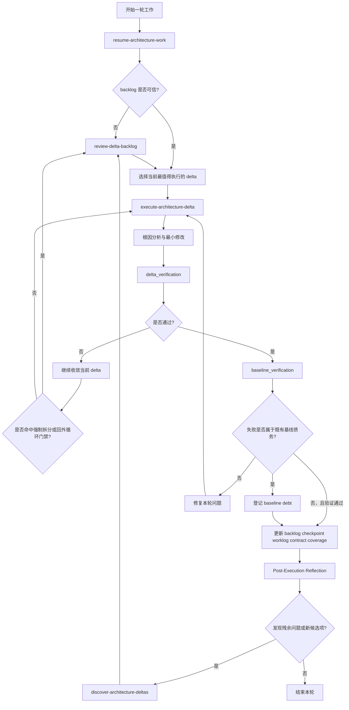
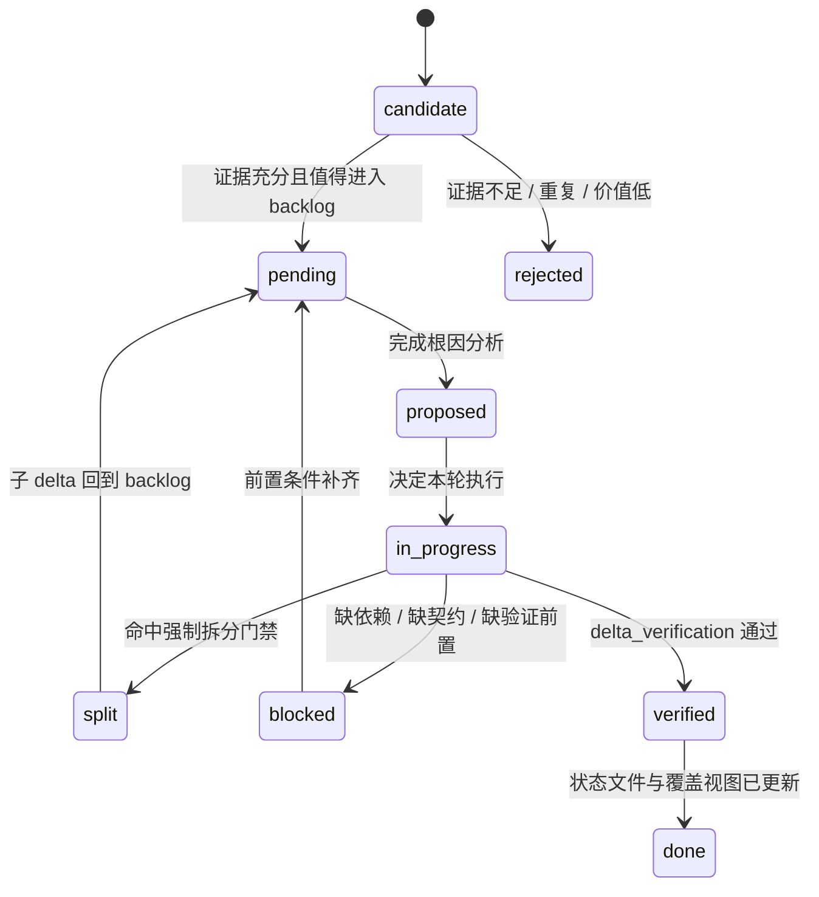
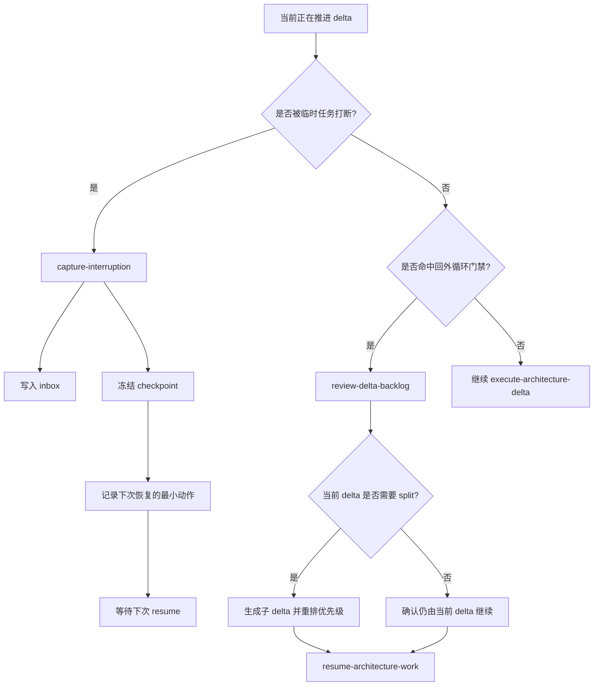
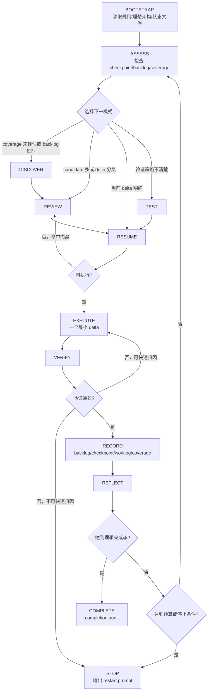

# Workflow Visualization

本文件用 `Mermaid` 将 `agent/README.md` 中的工作流规则可视化，帮助快速理解外循环、内循环、状态迁移与中断恢复。

## 1. 总览闭环

## 2. Delta 状态机

## 3. 中断与回外循环决策

## 4. 图与真源的对应关系

- 总体闭环、门禁与日常路径以 `agent/README.md` 为准。
- 持续运行控制层、终局判定和防失控预算以 `agent/workflow-continuous.md` 为准。
- 当前进行中的 delta、阻塞点和推荐下一步以 `agent/inner-loop-checkpoint.md` 为准。
- 状态定义、强制门禁和基线债务以 `agent/outer-loop-delta-backlog.yaml` 为准。
- 工作流可用等级以 `agent/quality-workflow-readiness.md` 为准。
- Milestone 编号（M1-M10）、契约与依赖以 `agent/draw2d-core-milestones.yaml` 为准；进度快照与三方文件同步规则以 `agent/goal-roadmap.md` 为准；产品视图与 demo 矩阵以 `doc/06-roadmap/` 为准。

## 5. 持续运行控制层

## 6. 维护建议

- 如果工作流规则变更，优先改真源文件，再同步本图。
- 这份图更适合作为导航图，不替代 `README` 中的完整规则文本。
- 若后续新增新的硬门禁，优先更新“总览闭环”和“中断与回外循环决策”两张图。
- 若持续运行的状态或停止条件变更，必须同步更新 `workflow-continuous.md` 和本文件第 5 节。
